# Postr — Feature Graph & Refactoring Checklist (v2)

**Revised 2026-07-29** (v2 second pass was 2026-07-28, superseding v1 from earlier that day; 2026-07-29 updates added §6.16 Manuscript → Slides and — documented from the `feat/presentation-checker` branch ahead of its launch gate — §6.17 Presentation Checker). Source of truth: `apps/web/src/` (React 19 + react-router 8 + Vite SPA) plus `apps/api/src/` for the external-services map. Every file:line reference and verbatim UI string below was extracted from the code as of **2026-07-28 ~16:00 local** (§6.16 and §6.17 extracted 2026-07-29; §6.17 from the feature branch). If the doc and the code disagree, **the code wins** — regenerate this doc.

All paths are relative to `apps/web/src/` unless noted otherwise. All quoted strings are verbatim user-visible copy.

### Changelog v1 → v2

What changed in the repo since v1 was generated:

- **Stripe billing shipped** — `apps/api/src/billing.ts` (checkout, webhook, consume-credit, mark-export, refund, portal), `pages/BillingResult.tsx` serving the new `/billing/success` + `/billing/cancel` routes, `talk_waitlist` table + `TalkWaitlistCallout` (inside `components/PricingSection.tsx`) on `/pricing`.
- **`/pricing` page shipped** — `pages/Pricing.tsx` + `components/PricingSection.tsx` with three tiers: Free, Term **CA$18.99 / 4 months**, Export pack **CA$9.99 / 3 credits**.
- **French legal page variants shipped** — `/privacy/fr`, `/cookies/fr`, `/terms/fr` (`pages/PrivacyFr.tsx`, `CookiesFr.tsx`, `TermsFr.tsx`), cross-linked from the EN pages.
- **Always-visible `ConsentNotice`** mounted in `App.tsx:24` — bottom-left, non-dismissible, on every route.
- **Persona-testing docs deleted** from `docs/`; **MCP / public-API plans ditched**; **business-model experiments archived** to `docs/archive/`.

What changed in the doc:

- Depth: v1 was a first-pass inventory; v2 is exhaustive — every interactive element, every copy string, every graphic, per file, as `- [ ]` checklist items (see "Coverage audit" for the counts).
- Added `Graphic` and `StorageKey` node types to the schema; added the storage-key sweep list (§8 in v1 was only inline).
- Master graph updated for `/pricing`, `/billing/*`, `/fr` variants, and the `ConsentNotice` global mount.
- Watchlist updated: new stale-comment entries (`billing.ts:4` ONE-TIME, `AuthBootstrap`/`lib/auth`/`apiClient`/`Share` comments, dangling `narrative/prompt.ts` doc ref), `.enw` accept-listed-but-no-parser, unpublish promised-but-missing, missing GC edge function, unused `presets` / `authors_lib` / `institutions_lib` / `references_lib` tables.

---

## 2. How to use this when removing a feature

1. **Find the feature's section** below (§6 feature sections are grouped by product area; each file has its own sub-heading).
2. **Every checkbox under it is a deletion/sweep target.** The checkbox convention:
   - `- [ ]` = one sweep target — a file, an element, a copy string, a graphic, a route, a store field/action, a storage key, or an external call.
   - When refactoring, you check items off (`- [x]`) as you remove or update them. A feature is fully removed when every box in its section is checked AND the cross-reference sweep (step 3) is done.
3. **Check the cross-reference index (§7)** for shared imports and reverse importers — orphaned shared components must be swept from their importers (e.g. a nav link in `PublicHeader`, a store opened from ten call sites). Use the **shared-component reverse lookup** to find every feature that renders a component you are deleting.
4. **Check the storage-key sweep list (§8)** — remove keys the feature owned, and update the "delete my data" sweep point at `pages/Profile.tsx:290-295` if you add/remove any key.
5. **Check the external services map (§9)** — tables, RPCs, buckets, API endpoints the feature triggers.
6. **Check the orphan / dead-UI watchlist (§10)** — leftovers from previous deactivations live there; a removal may add new entries.

---

## 3. Coverage audit

Counts as reported by each inventory slice ("Files covered / Elements / Copy / Graphics" lines), plus the 2026-07-28 gap-fill pass that added `poster/CommentsPanel.tsx`, `poster/VersionPanel.tsx`, `poster/ReadabilityPanel.tsx` to the sidebar slice (+3 files, +37 elements, +63 copy, +17 graphics), plus the 2026-07-29 pass that added the **Manuscript → Slides** feature (§6.16 — the `/paper-to-slides` pipeline: wizard, deck model, design pass, styled exports; it had shipped but was never inventoried), plus the 2026-07-29 `feat/presentation-checker` branch pass that added the **Presentation Checker** (§6.17 — the `/presentation-checker` standalone page, the editor `review` sidebar tab, and the review billing externals; pre-launch, route noindex + unlinked per D12). Cross-slice host files (`pages/PaperToPoster.tsx`, `poster/sidebar/EditableExportButtons.tsx`, `components/ConsentNotice.tsx`, `poster/Sidebar.tsx`) are counted in two slices each, so file totals double-count ~4 files.

| Slice / feature area | Files covered | Elements | Copy strings | Graphics |
|---|---|---|---|---|
| App shell + routing + pages + SEO | 30 | 118 | 486 | 27 |
| Poster editor core (excl. sidebar) | 14 (+18 logic-only noted) | 112 | ~175 | 34 |
| Poster sidebar (11 tabs) | 9 | 168 | 171 | 45 |
| Shared components + motion | 39 | 205 | 304 | 66 |
| Import + data + charts | 48 | 30 | 196 | 4 |
| Export + manuscript (poster) | 42 | 41 | ~190 | 9 |
| Manuscript → Slides (§6.16) | 23 (10 wizard/UI + 9 deck/model + 4 export/api) | see §6.16 | see §6.16 | icon-library set (§6.16) |
| Presentation Checker (§6.17) | 13 web (4 UI/client + 9 ingest logic) + 12 api | see §6.17 | see §6.17 | region overlay + chip set (§6.17) |
| Stores + hooks + lib + analytics + config | 17 | 0 (+1 browser-native beforeunload dialog) | 17 | 0 (18 storage keys + 1 BroadcastChannel) |
| **Totals** | **222** | **674+ (+1 native dialog; +§6.16, §6.17)** | **~1,539+ (+§6.16, §6.17)** | **185+ (+§6.16, §6.17)** |

All of `apps/web/src/` is covered (test files excluded by rule) — the earlier `CommentsPanel`/`VersionPanel`/`ReadabilityPanel` gap was closed by the gap-fill pass.

---

## 4. Graph schema (legend)

### Node types

| Type | Meaning |
|---|---|
| `Route` | A path declared in `routes.tsx` (incl. redirects/aliases) |
| `Screen` | A page component rendered by a route (`pages/*.tsx`) |
| `Feature` | A user-facing capability grouping screens, components, stores, and APIs |
| `Component` | A reusable UI component (`components/`, `poster/`, `charts/`, …) |
| `UIElement` | One interactive element: button, link, tab, input, toggle, menu, modal, toast |
| `Copy` | A user-visible string (heading, label, helper, error, empty state) |
| `Graphic` | A visual asset: inline SVG, emoji/glyph, CSS decoration/overlay, image render site |
| `Store` | A zustand store (`stores/*.ts`) |
| `StorageKey` | A localStorage / sessionStorage key (or BroadcastChannel) the app reads/writes |
| `External` | Anything outside the SPA: Supabase table/RPC/bucket, Express `/api/*` or `/billing/*` endpoint, Stripe, OpenAI/Anthropic model, Vercel Analytics |

### Edge types

| Edge | Meaning |
|---|---|
| `navigates_to` | Link or programmatic `navigate()` between routes |
| `redirects_to` | Declarative `<Navigate>` redirect or alias route |
| `renders` | Screen/component mounts another component |
| `opens` | Element opens a modal/panel/sheet |
| `triggers` | Element triggers a store action, API call, or download |
| `reads` / `writes` | Component reads from / writes to a Store or StorageKey |
| `belongs_to` | Node is owned by a Feature |
| `guarded_by` | Route is wrapped in `AuthGuard` (redirects to `/auth` when no session) |

---

## 5. Master graph

All routes from `routes.tsx`. Auth gating via `AuthGuard` (`components/AuthGuard.tsx`) on `/dashboard`, `/profile`, `/admin/gallery` — these require a real account and bounce a session-less visitor to `/auth`. The editor route `/p/:posterId` instead uses `EnsureSession` (`components/EnsureSession.tsx`): it silently creates an ANONYMOUS session (`ensureSession`) so a logged-out visitor edits immediately with no signup (the no-auth editor, 2026-07-29). On `SIGNED_OUT` it re-bootstraps a fresh anonymous session (`resetEnsureSession` + `ensureSession`) rather than dead-ending. Global mounts in `App.tsx`: `AppRoutes`, `FeedbackModal`, `PublishFlow`, `SessionExpiredModal`, `ConsentNotice`, `Analytics` beacon.

**No-auth editor (2026-07-29):** logged-out "Editor" nav link, the Landing "Try as guest" hero, and the Pricing free-tier CTA all point at `/p/new` → `EnsureSession` mints an anonymous session behind it → `Editor.tsx` load-or-creates a poster → edits autosave. An anonymous editor is prompted to secure their work to a permanent account only on EXPORT (`EditableExportButtons` gates `run()` on `plan.isGuest` → `SecureWorkModal reason="export"`) or on LEAVE (`useLeaveGuard` arms a `beforeunload` dialog when `isGuest && canUndo` — the live path, covering tab-close/refresh and the editor's `<a href>` exits; it also exposes a `requestLeave()` gate for a styled in-app-nav `SecureWorkModal reason="leave"`, but that has no caller yet — wiring it needs prop-drilling through the frozen `PosterEditor`, deferred). Conversion is in place via `lib/convertGuest.ts` (`convertGuestWithGoogle` → `linkIdentity`; `convertGuestWithEmail` → `updateUser`) — NEVER `signUp`, so the poster carries over. The same `PosterEditor` serves logged-in and anonymous users unchanged; a permanent user never sees either prompt.

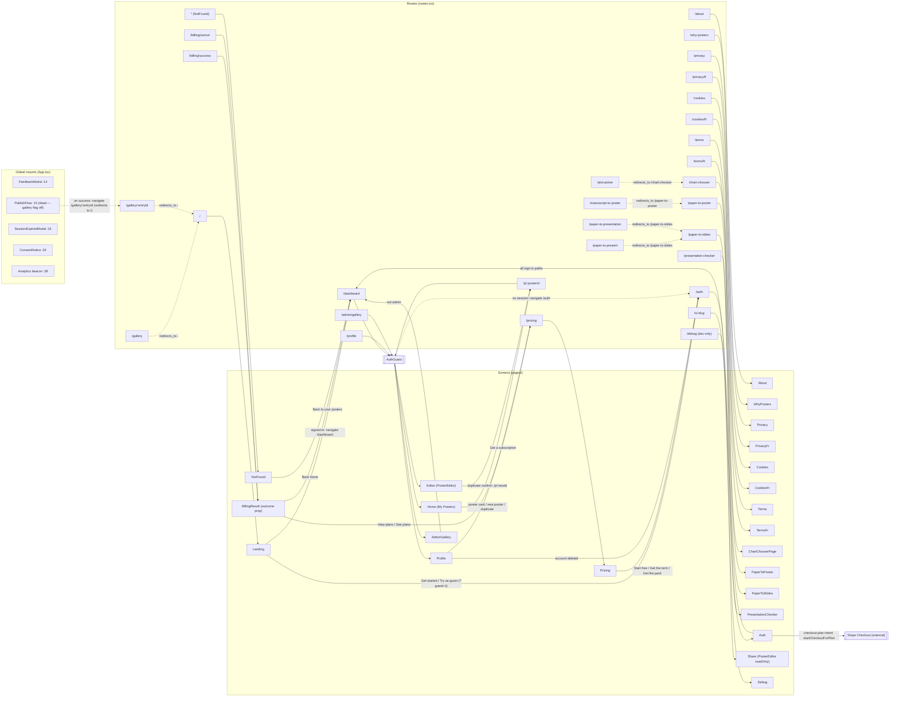

**Route table** (path → component · lazy · gate):

| Path | Component | Lazy | Gate |
|---|---|---|---|
| `/` | `pages/Landing.tsx` | no | signed-in users auto-redirect to `/dashboard` |
| `/about` | `pages/About.tsx` | no | — |
| `/why-posters` | `pages/WhyPosters.tsx` | no | — |
| `/pricing` | `pages/Pricing.tsx` | no | — |
| `/gallery` | `<Navigate to="/" replace>` | — | gallery deactivated (`GALLERY_PUBLIC_ENABLED=false`) |
| `/gallery/:entryId` | `<Navigate to="/" replace>` | — | gallery deactivated |
| `/privacy` | `pages/Privacy.tsx` | no | — |
| `/privacy/fr` | `pages/PrivacyFr.tsx` | no | — |
| `/cookies` | `pages/Cookies.tsx` | no | — |
| `/cookies/fr` | `pages/CookiesFr.tsx` | no | — |
| `/terms` | `pages/Terms.tsx` | no | — |
| `/terms/fr` | `pages/TermsFr.tsx` | no | — |
| `/chart-chooser` | `pages/ChartChooser.tsx` | yes | public, no session created |
| `/paper-to-poster` | `pages/PaperToPoster.tsx` | yes | — |
| `/paper-to-slides` | `pages/PaperToSlides.tsx` (lazy, code-split) | yes | public, no session created (§6.16) |
| `/plot-picker` | redirect → `/chart-chooser` | — | alias (vercel.json 308 is canonical layer) |
| `/manuscript-to-poster` | redirect → `/paper-to-poster` | — | alias |
| `/paper-to-present` | redirect → `/paper-to-slides` | — | alias (canonical is slides; changed from `/paper-to-poster`) |
| `/paper-to-presentation` | redirect → `/paper-to-slides` | — | alias |
| `/presentation-checker` | `pages/PresentationChecker.tsx` | yes | public but noindex (D12) — registered, unlinked pending the launch gate (§6.17) |
| `/debug` | `pages/Debug.tsx` | no | `import.meta.env.DEV` only, dropped from prod bundle |
| `/auth` | `pages/Auth.tsx` | no | — |
| `/billing/success` | `pages/BillingResult.tsx` (`outcome="success"`) | no | — |
| `/billing/cancel` | `pages/BillingResult.tsx` (`outcome="cancel"`) | no | — |
| `/s/:slug` | `pages/Share.tsx` | yes | public read-only |
| `/dashboard` | `pages/Home.tsx` | no | `AuthGuard` |
| `/p/:posterId` | `pages/Editor.tsx` | yes | `EnsureSession` + `EditorErrorBoundary` (anonymous-first — creates a guest session instead of bouncing) |
| `/profile` | `pages/Profile.tsx` | no | `AuthGuard` |
| `/admin/gallery` | `pages/AdminGallery.tsx` | yes | `AuthGuard` + in-page admin check |
| `*` | `pages/NotFound.tsx` | no | — |

---

## 6. Feature sections

One sub-section per feature area. Every file gets a sub-heading; under it the exhaustive `- [ ]` checklists (Elements / Copy / Graphics) with `file:line` refs and action/target notes, verbatim from the 2026-07-28 inventory.

---

### 6.1 App Shell & Routing & Consent

Root bootstrap, the route table, the always-on privacy notice, the dev-only debug page, and the 404 catch-all.

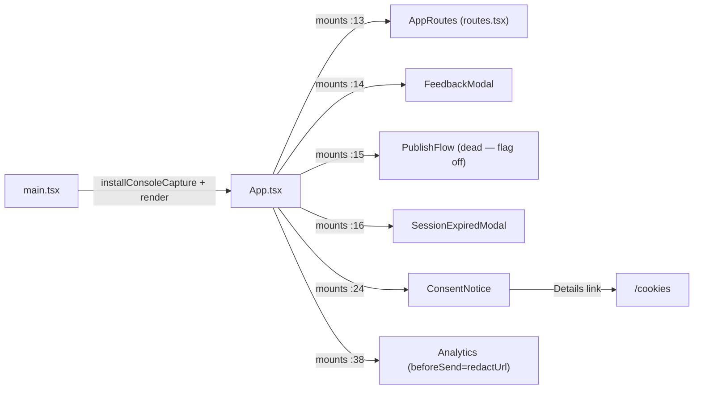

#### `App.tsx` — root shell: router + global modals + consent notice + analytics

No elements, copy, or graphics of its own. Mount sites only:
- [ ] `<AppRoutes />` — `App.tsx:13`
- [ ] `<FeedbackModal />` global modal — `App.tsx:14` (see §6.13)
- [ ] `<PublishFlow />` global modal — `App.tsx:15` (dead — `GALLERY_PUBLIC_ENABLED=false`, see §6.13, §10)
- [ ] `<SessionExpiredModal />` global modal — `App.tsx:16` (see §6.5)
- [ ] `<ConsentNotice />` — `App.tsx:24` (this section, below)
- [ ] `<Analytics beforeSend={…redactUrl}>` Vercel Web Analytics — `App.tsx:38` (see §6.15)

#### `components/ConsentNotice.tsx` — always-visible, non-dismissible privacy notice (bottom-left fixed, every route)

**Elements**
- [ ] `Details` — router link — `ConsentNotice.tsx:44` — navigates to `/cookies`

**Copy**
- [ ] "Privacy notice" — aria-label on `role="note"` container — `ConsentNotice.tsx:24`
- [ ] "Postr counts page visits and bounce rates — no cookies, no cross-site tracking." — body text — `ConsentNotice.tsx:42`
- [ ] Note: deliberately NO close button (header comment `ConsentNotice.tsx:1-17`); z-index 40 sits under modals/tour.

**Graphics** — none.

#### `main.tsx` — React root bootstrap

No UI — logic only.
- [ ] Installs `installConsoleCapture()` — `main.tsx:9`
- [ ] Renders `<App />` in StrictMode — `main.tsx:14-18`

#### `routes.tsx` — route table + lazy-load fallback

Route inventory: see §5 master graph + route table. All inside `<Suspense>`; lazy chunks: Editor, Share, AdminGallery, ChartChooser, PaperToPoster.

**Copy**
- [ ] "Loading…" — LazyFallback text — `routes.tsx:101`

**Elements/Graphics** — none.

#### `pages/Debug.tsx` — /debug session inspector (DEV-only route; dropped from prod bundle)

**Elements**
- [ ] `← Home` — router link — `Debug.tsx:68` — `/`
- [ ] `supabase.auth.signOut()` — button — `Debug.tsx:123-132` — signs out, clears local session state
- [ ] `localStorage.clear() + reload` — button — `Debug.tsx:133-143` — clears local+session storage, reloads page

**Copy**
- [ ] "Debug" — h1 — `Debug.tsx:67`
- [ ] "Session" — section title — `Debug.tsx:73`; row keys: "signed in" ("YES"/"no"), "user id", "is anonymous", "email", "access token (first 24)", "expires at", "now (live)" — `Debug.tsx:74-88`
- [ ] "Browser" — section — `Debug.tsx:91`; row keys "route", "viewport", "user-agent" — `Debug.tsx:92-94`
- [ ] "localStorage (sb-*)" — section — `Debug.tsx:97`; "(no keys)" empty state — `Debug.tsx:99`
- [ ] "Auth events (live)" — section — `Debug.tsx:105`; "(no events yet)" — `Debug.tsx:107`; row template "{time} {event}" / "{userId8}…{ anon}" — `Debug.tsx:112-113`
- [ ] "Manual ops:" — label — `Debug.tsx:121`
- [ ] "This page is unlinked — reach it by typing /debug in the URL bar." — footer note — `Debug.tsx:145-148`

**Graphics** — none.

#### `pages/NotFound.tsx` — catch-all 404

**Elements**
- [ ] `Back home` — router link — `NotFound.tsx:12-17` — `/dashboard`

**Copy**
- [ ] "404" — h1 — `NotFound.tsx:10`
- [ ] "Page not found." — para — `NotFound.tsx:11`

**Graphics** — none.

---

### 6.2 Landing & Marketing Pages

Public marketing surface: `/`, `/about`, `/why-posters`. Signed-in users hitting `/` auto-redirect to `/dashboard`.

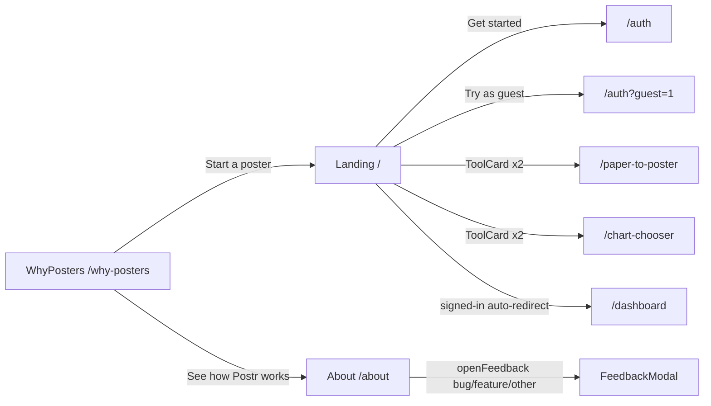

#### `pages/Landing.tsx` — / marketing home (public; signed-in users auto-redirect to /dashboard)

**Elements**
- [ ] `Get started` — router link — `Landing.tsx:154-159` — `/auth`
- [ ] `Try as guest` — router link — `Landing.tsx:160-165` — `/auth?guest=1` (auto-triggers guest login)
- [ ] `ToolCard` ×2 — router links — props at `Landing.tsx:276-289`, render `Landing.tsx:312-327` — `/paper-to-poster` and `/chart-chooser`

**Copy**
- [ ] "Built for researchers" — hero badge — `Landing.tsx:119`
- [ ] "Academic posters," + "without the hassle." — h1 — `Landing.tsx:126-127`
- [ ] "A poster editor that handles" + rotating slot + "so you can work on the science." — hero sentence — `Landing.tsx:146-151`; rotating phrases from HERO_FRICTIONS `Landing.tsx:62-69` (rendered by `RotatingWord`, §6.13): "the fiddly block nudging" · "the text reflowing on you" · "the BibTeX citation styles" · "the conference size specs" · "the authors and affiliations" · "the unreadable tiny figures"
- [ ] "Best on a laptop." + "The editor needs a bigger screen to drag blocks and see your poster at full size. The plot picker and figure checker work fine on a phone." — mobile notice (sm:hidden) — `Landing.tsx:176-183`
- [ ] Feature cards (6, each title+body) — `Landing.tsx:188-253`: "Smart templates" / "5 conference-ready layouts with discipline-specific palettes. APA, SfN, ECNP size presets built in." · "Figure readability" / "Paste your R or Python code. See if axis labels will be readable at print size. Get a copy-ready fix." · "Writing guide" / "Section-by-section tips, word count targets, and a checklist to follow from intro to conclusion." · "PowerPoint, both ways" / "Open an existing .pptx poster and keep editing it here, or export one back out with every block still editable." · "LaTeX source" / "Download a compilable poster.tex with your figures and a references.bib — keep working in Overleaf if you prefer." · "Copy a design" / "Upload a poster you admire and apply its colours and type to yours. Copies the look, never the content."
- [ ] "Tools you can use on their own" — h2 — `Landing.tsx:268`
- [ ] "Two parts of the poster workflow that work without an account, and without opening the editor." — lede — `Landing.tsx:270-273`
- [ ] ToolCard props — `Landing.tsx:276-289`: "Paper to poster" / "Paste your manuscript or upload a .docx, answer a few short questions about what to emphasise, and download a poster draft as a PDF." / cta "Start from a paper" · "Plot picker" / "Paste a table or answer three short questions, and get ranked chart suggestions drawn as journal-style panels. Download any panel as SVG or PNG." / cta "Find your figure"
- [ ] JSON-LD description: "A web app for making academic conference posters, built for researchers and students." — `Landing.tsx:41-42`

**Graphics**
- [ ] 📐 — emoji — `Landing.tsx:192` ("Smart templates") · [ ] 📊 — `Landing.tsx:203` ("Figure readability") · [ ] ✍️ — `Landing.tsx:214` ("Writing guide") · [ ] 🎞️ — `Landing.tsx:225` ("PowerPoint, both ways") · [ ] 📐 — `Landing.tsx:236` ("LaTeX source") · [ ] 🎨 — `Landing.tsx:247` ("Copy a design") · [ ] 📄 — `Landing.tsx:278` (ToolCard) · [ ] 📊 — `Landing.tsx:284` (ToolCard)
- [ ] "→" — text arrow appended to ToolCard cta — `Landing.tsx:325`

#### `pages/About.tsx` — /about feature tour as vertical timeline + feedback CTA

**Elements**
- [ ] `support@resila.ai` — mailto link — `About.tsx:130` — opens mail client to support@resila.ai
- [ ] `Report a bug` — button — `About.tsx:180` — `openFeedback('bug')` (feedbackStore)
- [ ] `Suggest a feature` — button — `About.tsx:186` — `openFeedback('feature')`
- [ ] `Just say hi` — button — `About.tsx:192` — `openFeedback('other')`

**Copy**
- [ ] "Postr by Resila" — eyebrow — `About.tsx:115`
- [ ] "Everything you need" + "to ship a great poster." — h1 (two parts) — `About.tsx:118-119`
- [ ] "Postr is an opinionated poster editor built around one idea: constraint is a feature. Every default is tuned to produce something print-ready — you just fill in the science." — hero para — `About.tsx:122`
- [ ] "Built and maintained by Resila Technologies Inc. in Quebec, Canada. Questions or bug reports land at support@resila.ai." — para — `About.tsx:126-137`
- [ ] MILESTONES constant — `About.tsx:33-82` — 8 entries, each `{title, body}` rendered by `Card` at `About.tsx:300-303`:
  - [ ] "Start anywhere, save nothing" / "Anonymous session on first click — no sign-up wall. Every keystroke autosaves from before you've even named the poster. When you sign up later, your drafts follow you across devices without a single "export and re-import"." — `About.tsx:36-38`
  - [ ] "Templates tuned for conferences" / "Five layouts — three-column classic, billboard, sidebar + focus, and more. Discipline-appropriate palettes instead of freeform color pickers. APA, SfN, and ECNP size presets ship built-in so your dimensions are never a guess." — `About.tsx:42-44`
  - [ ] "Writing guidance, not a blank page" / "Each section comes with concrete prompts, word-count targets, and a built-in checklist from intro to conclusion. Rich text for emphasis, Greek-symbol shortcuts for STEM, and a reference manager with citation-style support." — `About.tsx:48-50`
  - [ ] "Figures readable from three feet" / "Paste your R or Python plotting code and Postr checks whether axis labels will actually be legible at print size. Out-of-bounds warnings catch layout slips. No more discovering typography problems at the FedEx counter." — `About.tsx:54-56`
  - [ ] "Start from the work you already have" / "Paste a manuscript or drop a .docx and answer a few short questions about what to emphasise — you get a structured poster draft rather than a blank canvas. Already have a poster in PowerPoint? Open the .pptx here and keep editing it, blocks and all." — `About.tsx:60-62`
  - [ ] "The right figure, drawn for print" / "Paste a table or answer three questions and the plot picker ranks the chart forms that actually fit your data, drawn as journal-style panels with captions in methods voice. Pick several at once, insert them, or download SVG and PNG." — `About.tsx:66-68`
  - [ ] "Borrow a look you like" / "Upload a poster you admire and Postr lifts its colours and type onto yours — the look, never the content. Print-safe clamping keeps the result legible on paper rather than only on screen." — `About.tsx:72-74`
  - [ ] "Share, iterate, print" / "Read-only share links for advisors and co-authors, readable on a phone. Undo and redo through the entire session. Export to PDF, to PowerPoint with every block still editable, or to LaTeX with a compilable poster.tex and references.bib for Overleaf." — `About.tsx:78-80`
- [ ] "Shape what ships next" — eyebrow — `About.tsx:169`
- [ ] "Tell us what's missing." — h2 — `About.tsx:172`
- [ ] "Every bug report and feature request lands in the developer's queue. The loudest feedback wins the most attention — so if something's broken, missing, or could be better, say so." — para — `About.tsx:174-178`
- [ ] "{01}…{08}" — dynamic waypoint numbers `String(index + 1).padStart(2, '0')` — `About.tsx:257`

**Graphics**
- [ ] Dotted vertical road — CSS repeating-linear-gradient decoration, aria-hidden — `About.tsx:143-151` — behind timeline
- [ ] Waypoint marker — inline SVG, double circle + number text, aria-hidden — `About.tsx:237-259` — one per milestone
- [ ] Renders `PublicHeader`/`PublicFooter` (`About.tsx:110,203`) — §6.13. Note: old decorative line drawings (sun/mountain/squiggle) were removed per header comment — do not restore.

#### `pages/WhyPosters.tsx` — /why-posters editorial page

**Elements**
- [ ] `Start a poster` — router link — `WhyPosters.tsx:206-211` — `/`
- [ ] `See how Postr works` — router link — `WhyPosters.tsx:212-217` — `/about`

**Copy**
- [ ] "Why poster sessions matter" — eyebrow — `WhyPosters.tsx:90`
- [ ] "A poster is a deadline" + "that teaches you to explain." — h1 — `WhyPosters.tsx:93-95`
- [ ] "Poster sessions have a reputation as the consolation prize of conference formats — what you get when your abstract does not make the talk list. That reading misses what the format is unusually good at. Standing next to your own work for two hours, explaining it over and over to people who did not choose it, builds a set of skills that outlast the conference." — lede — `WhyPosters.tsx:97-104`
- [ ] SKILLS constant — `WhyPosters.tsx:29-78` — 6 entries × (title / atTheSession / laterOn), rendered `:110-144`; numbers "{01}–{06}" — `:117`; repeated label "Where it shows up again" — `:137`:
  1. "Explaining your work at three lengths" (:31) 2. "Making an argument visually" (:40) 3. "Handling questions in real time" (:48) 4. "Reading an audience you did not choose" (:57) 5. "Deciding what the work is actually about" (:66) 6. "Starting conversations without an introduction" (:75) — bodies verbatim at `WhyPosters.tsx:33-77`
- [ ] "Getting the most out of one" — h2 — `WhyPosters.tsx:152`; list items (bold lead + body): "Write the one-line version first. If you cannot say what the poster claims in a sentence, the layout will not fix it." · "Rehearse out loud, standing up. Reading your own poster silently hides every sentence you cannot actually say." · "Plan for the question you are dreading. Someone will ask it. Having a real answer turns your weakest moment into a credible one." · "Leave room to point at things. A poster you can gesture across is easier to explain than one packed edge to edge." · "Bring a way to stay in touch. The conversation is the durable part, not the board." — `:155-188`
- [ ] "When you are ready to build one" — h2 — `WhyPosters.tsx:197`; "The skills above come from presenting, not from formatting. Postr exists so the formatting is not the hard part — real print sizes, authors and affiliations that stay in sync, and figures checked for legibility before you get to the print shop." — `:199-204`

**Graphics** — none.

---

### 6.3 Pricing & Billing

`/pricing` page, the Stripe checkout result landings, the 3-tier `PricingSection` + talk waitlist callout, the entitlement hook, and the client billing wrappers. Server side (`apps/api/src/billing.ts` + webhook) is mapped in §9.

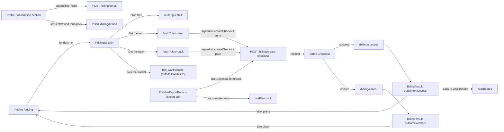

#### `pages/Pricing.tsx` — /pricing standalone page

**Elements** — none of its own; renders `PublicHeader` (:26), `PricingSection` (:44 — tier cards/CTAs live there, below), `PublicFooter` (:46).

**Copy**
- [ ] "Pricing" — eyebrow — `Pricing.tsx:30`
- [ ] "Free to build." + "Pay only to take it further." — h1 — `Pricing.tsx:33-35`
- [ ] "A finished, print-ready poster costs nothing. You pay when you want to keep editing in PowerPoint or LaTeX, or turn a paper into a talk — the parts that go beyond the free workflow." — lede — `Pricing.tsx:37-41`

**Graphics** — none.

#### `pages/BillingResult.tsx` — /billing/success + /billing/cancel Stripe landings (one file, `outcome` prop)

**Elements**
- [ ] `Back to your posters` — button — `BillingResult.tsx:86-92` — `navigate('/dashboard')` (success)
- [ ] `View plans` — router link — `BillingResult.tsx:94-99` — `/pricing` (success)
- [ ] `Back to editing` — button — `BillingResult.tsx:114-120` — `window.history.back()` (cancel)
- [ ] `See plans` — router link — `BillingResult.tsx:121-126` — `/pricing` (cancel)

**Copy**
- [ ] "You're all set" — success h1 — `BillingResult.tsx:73`
- [ ] "Your term is active. Editable PowerPoint and LaTeX exports are unlocked — no watermark." — status para — `BillingResult.tsx:78`
- [ ] "Your export pack is ready — {credits} export{s} to use whenever. Credits never expire." — status para — `BillingResult.tsx:80`
- [ ] "Payment received — finalizing your account. This takes just a moment." — status para (≤6s grace) — `BillingResult.tsx:82`
- [ ] "Payment received. Your access will appear shortly — head back in and it'll be ready." — status para — `BillingResult.tsx:83`
- [ ] "Checkout cancelled" — cancel h1 — `BillingResult.tsx:109`
- [ ] "No charge was made. Your poster is exactly as you left it — you can keep editing for free, or pick up checkout again anytime." — cancel para — `BillingResult.tsx:110-113`

**Graphics**
- [ ] Green checkmark — inline-svg in tinted circle, aria-hidden — `BillingResult.tsx:62-70` — success only

#### `components/PricingSection.tsx` — 3-tier pricing comparison + talk-waitlist callout (on /pricing)

(`TalkWaitlistCallout` is not its own file — it's an internal component of `PricingSection.tsx`.)

**Elements**
- [ ] `Start free` — Link (rendered `:193`) — `/auth?guest=1` (constant `:72`)
- [ ] `Get the term` — Link — `/auth?plan=term` (constant `:90`)
- [ ] `Get the pack` — Link — `/auth?plan=pack` (constant `:110`)
- [ ] `Join the waitlist` / `Sign in to join the waitlist` / `Joining…` — button — `PricingSection.tsx:299` — `joinTalkWaitlist()` (`@/data/talkWaitlist`) or navigate `/auth?next=/pricing` when signed out

**Copy**
- [ ] "Simple pricing, no surprises" — H2 — `PricingSection.tsx:130`
- [ ] "Editing and PDF export are always free — with a small “made with postr.sh” mark. You only pay to export to PowerPoint or LaTeX." — sub — `PricingSection.tsx:132-135`
- [ ] "Free" / "$0" / "always" — tier 1 name/price/cadence (constant `TIERS :66-69`)
- [ ] "Everything you need to build and print a poster." — tier 1 tagline — `:70`
- [ ] "Making a poster and printing or presenting it." — tier 1 forWho — `:73`
- [ ] "Unlimited editing, every tool" / "PDF export — print-ready" / "Paper to poster" / "Plot picker & figure checker" / "A small “made with postr.sh” mark on the PDF" — tier 1 features — `:74-80`
- [ ] "Term" / "$18.99 CAD" / "every 4 months" — tier 2 — `:84-86`
- [ ] "The full workflow, all term. About CA$4.75 a month, cancel anytime." — tier 2 tagline — `:87`
- [ ] "Presenting through the term, or making several posters." — tier 2 forWho — `:91`
- [ ] "Everything in Free — no watermark" / "Export to PowerPoint & LaTeX" / "Keep editing your poster anywhere" / "Renews every 4 months — cancel anytime" — tier 2 features — `:96-101`
- [ ] "Export pack" / "$9.99 CAD" / "one-time · 3 exports" — tier 3 — `:104-107`
- [ ] "Just need a couple of clean exports? Pay only for those — credits never expire." — tier 3 tagline — `:108`
- [ ] "A one-off export, without committing to a term." — tier 3 forWho — `:111`
- [ ] "Export 3 posters to PowerPoint or LaTeX" / "No watermark on those exports" / "Credits never expire — use them whenever" / "No subscription, no term" / "Talk export counts too, when it lands" — tier 3 features — `:112-118`
- [ ] "Recommended" — featured badge — `PricingSection.tsx:177`
- [ ] "Coming soon" — badge — `PricingSection.tsx:182` (**dead**: no tier currently sets `comingSoon`; clock-icon variant at `:223-227` equally unreachable)
- [ ] "**Which should I pick?** Just printing a poster? Free covers it. Need one or two clean exports? Grab the pack. Exporting through the term, or making several? The term pays for itself after two." — helper line — `PricingSection.tsx:149-153`
- [ ] "Coming soon" — waitlist eyebrow — `PricingSection.tsx:285`
- [ ] "Turn a paper into a conference talk" — waitlist heading — `PricingSection.tsx:288`
- [ ] "We're building paper-to-talk generation next. Want to know the moment it lands?" — waitlist body — `PricingSection.tsx:290-293`
- [ ] "✓ You're on the list — we'll email you when talks are ready." — joined state — `PricingSection.tsx:295-297`

**Graphics**
- [ ] check polyline SVG — inline-svg — `PricingSection.tsx:211-231` — feature bullets (clock-circle variant for `comingSoon`, currently dead)

#### `hooks/usePlan.ts` — billing entitlement reader (term / credits / canExport / isGuest / subscriptionStatus)

No UI itself. Consumers: `poster/sidebar/EditableExportButtons.tsx` (export-button unlock + paywall), `pages/Profile.tsx`, `pages/BillingResult.tsx`. Drives watermark removal + paywall routing (guests → account creation, not Stripe — `:36-40`).
**Elements** — none. **Copy** — none. **Graphics** — none.

#### `data/billing.ts` — billing API wrappers — no UI, logic only

**Copy**
- [ ] "checkout session returned no url" — thrown error — `billing.ts:21`
- [ ] "https://link.com" — `LINK_MANAGE_URL`, subscription-management fallback navigated to by callers — `billing.ts:67`

Calls (`postJson`, §6.14 `lib/apiClient.ts`): `/billing/create-checkout` (:17), `/billing/consume-credit` (:33), `/billing/mark-export` (:46), `/billing/refund` (:59), `/billing/portal` — see §9.

#### `data/checkoutIntent.ts` — checkout-plan stash across auth detour — no UI, logic only

Storage: sessionStorage `postr.checkoutIntent` (const `:23`; write `:40`, read `:49`, remove `:58`) — see §8.

#### `data/talkWaitlist.ts` — talk waitlist join/check — no UI, logic only

Writes to Supabase table `talk_waitlist` (§9). Called from `PricingSection.tsx:299`.

---

### 6.4 Legal Pages EN/FR

Six legal pages: Privacy, Cookies, Terms, each in EN + FR variants. EN pages link to their FR variant (`Français`); FR pages link back (`English`). Note: FR cross-links to other legal pages target the EN URLs (e.g. `CookiesFr` → `/privacy`, not `/privacy/fr`). Shared presentational components `SectionHeading/Body/List/Table/CalloutBox` are duplicated per legal page (defined e.g. `Cookies.tsx:274-338`).

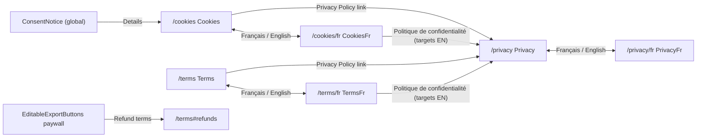

#### `pages/Privacy.tsx` — /privacy policy (EN)

**Elements**
- [ ] `Français` — router link — `Privacy.tsx:31` — `/privacy/fr`
- [ ] `{support@resila.ai}` — mailto ×5 — `Privacy.tsx:46,272,279,331,348`
- [ ] `Terms of Service` — router link — `Privacy.tsx:190` — `/terms`
- [ ] `Profile page` — router link — `Privacy.tsx:284` — `/profile`

**Copy** (`LAST_UPDATED = 'April 10, 2026'` `Privacy.tsx:16`)
- [ ] "Legal" eyebrow — `Privacy.tsx:29` · [ ] "Privacy Policy" h1 — `Privacy.tsx:35` · [ ] "Last updated: {LAST_UPDATED}" — `Privacy.tsx:36`
- [ ] §1 "Who we are" + bodies: "Postr ("we", "us") is an academic poster editor operated by Resila Technologies Inc., a corporation registered in the Province of Quebec, Canada. If you have any question about how we handle your personal data — or want to exercise any of the rights described in Section 7 — contact us at {email}." (`:40-50`) · "We act as the data controller (the "enterprise" under Quebec law). Under Quebec's Act respecting the protection of personal information in the private sector (the "Law 25" reform), the person responsible for the protection of personal information within Resila Technologies Inc. is reachable at the same address above. We will name a dedicated Data Protection Officer if and when legal thresholds require it." (`:51-58`)
- [ ] §2 "What data we collect" + intro body (`:61-64`) + Table "When / What / Required?" 7 rows (`:65-104`): rows for "Anonymous first visit", "When you sign up", "Profile details (optional)", "When you edit a poster", "When you use the figure-readability feature", "When you send feedback", "Technical logs" — each with What + Required cells verbatim at those lines
- [ ] body "We do not intentionally collect any special-category data (health, biometric, political, religious, sexual orientation, ethnic origin, trade-union membership, genetic data). If you type such information into a poster block yourself, it is stored as the poster content you wrote — we do not process it further." — `:105-111`
- [ ] §3 "Why we process your data (and our legal basis)" + Table "Purpose / Legal basis / Data categories" 6 rows (`:114-148`) + body "We do not sell personal data, we do not run profiling or automated decision-making that produces legal or similarly significant effects, and we do not use your poster content to train any AI model. We only email you about product research if you have explicitly opted in, and you can withdraw that consent at any time in your account settings — it never affects your access to Postr." — `:149-156`
- [ ] §4 "Who receives your data" + body (`:159-163`) + Table "Provider / What it does / Location" 5 rows (`:164-173`): Supabase / Vercel / Render / Anthropic / Google rows verbatim + body "We do not share your personal data with advertisers, data brokers, or social networks. If a legal authority issues a valid request compelling disclosure, we will comply, and will tell you unless we are legally prohibited from doing so." (`:174-179`)
- [ ] Callout "Public gallery." + "If you choose to publish a poster to the public gallery, or create a read-only share link, the poster content and any name you put on it becomes visible to anyone on the internet — including visitors who don't have a Postr account. It may be indexed by search engines and cached by third parties. Retracting the poster removes it from Postr but cannot recall copies that others may have already made. Think before publishing. See Section 5.3 of the Terms of Service for the full rules." — `:180-194`
- [ ] §5 "International transfers" + body "Some of the processors above are based in the United States. When your data is transferred outside the European Economic Area, we rely on appropriate safeguards: Standard Contractual Clauses approved by the European Commission, and, where applicable, the EU–US Data Privacy Framework certification of the recipient. You can request a copy of the specific safeguards we rely on by emailing us." — `:196-204`
- [ ] §6 "How long we keep your data" + Table "Data / Retention" 5 rows (`:207-231`): "Poster drafts and assets", "Anonymous guest accounts", "Feedback submissions", "Server/error logs", "Legal/tax records" rows verbatim
- [ ] §7 "Your rights" + body "Several privacy laws may apply to you depending on where you live. Postr is operated from Quebec, Canada, so the federal Personal Information Protection and Electronic Documents Act (PIPEDA) and Quebec's Act respecting the protection of personal information in the private sector ("Law 25") apply. If you are in the European Economic Area or the United Kingdom, the EU/UK GDPR applies. If you are in California, the California Consumer Privacy Act (CCPA) applies. Across these regimes you have the following rights over your personal data:" (`:234-243`)
- [ ] List 9 items (`:244-256`): "Access — ask for a copy of the personal information we hold about you and the categories of people it has been shared with." · "Rectification — ask us to correct inaccurate or incomplete information." · "Erasure / de-indexing — ask us to delete your data or stop disseminating it, subject to legal exceptions." · "Restriction — ask us to pause processing while a dispute is resolved." · "Portability — ask for your data in a structured, commonly used, machine-readable format (GDPR and, since September 2024, Quebec Law 25)." · "Objection — object to processing based on our legitimate interest." · "Withdraw consent — where processing is based on consent, withdraw it at any time without affecting processing already carried out." · "Non-discrimination (CCPA) — we will not treat you differently for exercising your CCPA rights." · "Lodge a complaint — with the appropriate regulator (see below)."
- [ ] body "You can file a complaint with the Commission d'accès à l'information du Québec (CAI) if you are a Quebec resident, the Office of the Privacy Commissioner of Canada (OPC) for matters under PIPEDA, your local EU data-protection authority under GDPR, the UK Information Commissioner's Office (ICO) under UK GDPR, or the California Privacy Protection Agency (CPPA) under CCPA." — `:257-265`
- [ ] Callout "Right to object (Art. 21 GDPR)." + "You have the right to object at any time — on grounds relating to your particular situation — to processing of your personal data based on our legitimate interest, including any profiling. Send an email to {email}." — `:266-276`
- [ ] body "To exercise any of these rights, email us at {email}. We will respond within one month, as required by the GDPR. For most actions you can also use the buttons in your Profile page — deleting your account there erases everything associated with it." — `:277-288`
- [ ] §8 "Cookies and similar technologies" + bodies "We only set cookies and local-storage items that are strictly necessary to run the app — authenticating your session, remembering the poster you last opened, and preventing cross-site request forgery. These do not require consent under the ePrivacy Directive." (`:291-296`) · "We currently do not run third-party analytics or advertising trackers. If we add optional analytics in the future, we will update this notice and ask for your explicit consent before any non-essential cookies are set." (`:297-301`) — note: second para is stale vs. Cookies §4/§8 (Vercel Analytics exists) — drift to flag (§10)
- [ ] §9 "AI features and automated processing" + bodies (`:303-314`)
- [ ] §10 "Security" + body "We use encryption in transit (HTTPS everywhere), encryption at rest for database and storage, scoped service-role credentials, row-level security policies on every table, and least-privilege access for everyone who operates the service. No system is perfectly secure, but we take reasonable steps appropriate to the size of the service and the sensitivity of the data." — `:316-324`
- [ ] §11 "Children's data" + body — `:326-335`
- [ ] §12 "Changes to this notice" + body — `:337-343`
- [ ] §13 "Contact" + body — `:345-352`

**Graphics** — none.

#### `pages/PrivacyFr.tsx` — /privacy/fr policy (FR)

**Elements**
- [ ] `English` — router link — `PrivacyFr.tsx:29` — `/privacy`
- [ ] `{support@resila.ai}` — mailto ×5 — `PrivacyFr.tsx:46,284,291,349,368`
- [ ] `Conditions d'utilisation` — router link — `PrivacyFr.tsx:196` — `/terms` (targets EN)
- [ ] `page de profil` — router link — `PrivacyFr.tsx:296` — `/profile`

**Copy** (`LAST_UPDATED = '10 avril 2026'` `PrivacyFr.tsx:14`) — full FR mirror of Privacy: "Légal" (:27), "Politique de confidentialité" h1 (:34), "Dernière mise à jour : {…}" (:36); §1 "Qui nous sommes" + 2 bodies (:38-59); §2 "Quelles données nous recueillons" + intro + Table "Quand / Quoi / Obligatoire ?" 7 rows (:61-106) + special-category body (:107-114); §3 "Pourquoi nous traitons vos données (et notre base juridique)" + Table "Finalité / Base juridique / Catégories de données" 6 rows (:116-151) + no-sale body (:152-161); §4 "Qui reçoit vos données" + body + Table "Fournisseur / Rôle / Emplacement" 5 rows (:163-179) + no-sharing body (:180-185) + "Galerie publique." callout (:186-200); §5 "Transferts internationaux" + body (:202-211); §6 "Combien de temps nous conservons vos données" + Table "Données / Conservation" 5 rows (:213-238); §7 "Vos droits" + intro body (:240-252) + List 9 items (:253-265) + complaint body naming CAI/CPVP/ICO/CPPA (:266-276) + "Droit d'opposition (art. 21 RGPD)." callout (:277-288) + exercise-rights body (:289-300); §8 "Témoins et technologies semblables" + 2 bodies (:302-316, same stale "aucun outil d'analyse" drift); §9 "Fonctions d'IA et traitement automatisé" + 2 bodies (:318-330); §10 "Sécurité" + body (:332-341); §11 "Données des enfants" + body (:343-353); §12 "Modifications du présent avis" + body (:355-362); §13 "Nous joindre" + body (:364-372). All strings verbatim at the cited line ranges; every FR string enumerated structurally identical to EN list above (counted individually in totals).

**Graphics** — none.

#### `pages/Cookies.tsx` — /cookies policy (EN)

**Elements**
- [ ] `Français` — router link — `Cookies.tsx:47` — `/cookies/fr`
- [ ] `postr.sh` — external link — `Cookies.tsx:59` — https://postr.sh
- [ ] `Privacy Policy` — router link — `Cookies.tsx:61` — `/privacy`
- [ ] `{support@resila.ai}` — mailto link — `Cookies.tsx:260` — mail client

**Copy** (constants: `LAST_UPDATED = 'July 28, 2026'` `Cookies.tsx:32`)
- [ ] "Legal" — eyebrow — `Cookies.tsx:45` · [ ] "Cookies Policy" — h1 — `Cookies.tsx:51` · [ ] "Last updated: {LAST_UPDATED}" — `Cookies.tsx:52`
- [ ] §1 "Scope" — heading — `Cookies.tsx:55`; body "This Cookies Policy explains how Resila Technologies Inc. (the company behind Postr) uses cookies and similar client-side storage technologies on postr.sh. It supplements our Privacy Policy." — `Cookies.tsx:56-65`
- [ ] §2 "What cookies (and similar technologies) are" — `Cookies.tsx:67`; body "A cookie is a small text file a website asks your browser to store so that it can recognise you on a later page load. Modern web apps also use related browser features — localStorage and sessionStorage — which serve the same purpose (remembering state between visits) but live in a different part of the browser. Wherever this policy says "cookies", we mean cookies, localStorage, and sessionStorage collectively." — `Cookies.tsx:68-76`
- [ ] body "Regulators (CAI, CNIL, ICO, OPC) treat these technologies the same way: strictly necessary storage can be used without asking, but anything optional — analytics, advertising, third-party embeds — requires your prior, informed, freely-given consent." — `Cookies.tsx:77-82`
- [ ] §3 "What Postr uses today" — `Cookies.tsx:84`; callout "Postr uses only strictly-necessary storage." + "We do not run Google Analytics, Facebook Pixel, advertising trackers, social-media share buttons with tracking, or any other technology that stores something on your device. We do count page views, using Vercel Web Analytics — it sets no cookie, writes nothing to your browser, and cannot recognise you on a second visit or on any other site. No consent banner is shown because none of the entries below require consent under GDPR, the ePrivacy Directive, PIPEDA, or Quebec Law 25 — that duty attaches to storing or reading data on your device, and page counting does neither. The small notice at the bottom-left of every page repeats this and links here; it is not a consent banner — there is nothing to accept or refuse." — `Cookies.tsx:85-99`
- [ ] Table headers "Entry / Stored where / What it does / Lifetime" + 5 rows — `Cookies.tsx:101-135`: ("sb-<project-ref>-auth-token", "localStorage", "Holds your Supabase authentication session (JWT + refresh token). Without it, the app cannot tell who you are and your drafts cannot be loaded.", "Until you sign out or the session expires") · ("postr-onboarding-*", "localStorage", "Remembers whether you have seen the onboarding tour so we do not show it again on every visit.", "Until you clear browser data") · ("postr-templates", "localStorage", "Holds custom poster templates you save from the editor's Scratch Pad so they are available on your next visit.", "Until you delete the template or clear browser data") · ("Supabase refresh/session timers", "sessionStorage", "Short-lived technical flags used by the Supabase client to coordinate token refresh between tabs.", "Until you close the browser tab") · ("Aggregate usage measurement", "No device storage", "Counts page visits and bounce rates with Vercel Web Analytics, so we can tell which pages people find useful. Sets no cookie and writes nothing to your browser; visits are never linked to your account or to activity on other sites.", "The per-visit identifier is discarded within 24 hours; only aggregates are kept")
- [ ] body "The storage entries above fall under the "strictly necessary to provide the service the user explicitly requested" exemption in Article 5(3) of the ePrivacy Directive and the equivalent provisions of PIPEDA and Quebec Law 25. The measurement row needs no exemption: it stores nothing on your device, and the consent duty attaches only to storing or reading data on the device. None of these track you across other sites." — `Cookies.tsx:136-144`
- [ ] §4 "Page counting, and what Postr still does not use" — `Cookies.tsx:146`; body "Postr counts page views with Vercel Web Analytics, so we can see which pages people find useful. It is worth being precise about what that does and does not involve. It sets no cookie and writes nothing to your browser. There is no identifier that persists: a visit is counted using a value derived from the request itself and discarded within 24 hours, so a second visit tomorrow is a stranger. Every figure is an aggregate — a count of views on a page, never a record of what you did." — `Cookies.tsx:147-157`
- [ ] body "We also strip the address before it is counted. Poster URLs, share links and admin pages are recorded only as their shape — `/s/[redacted]` rather than the slug you were sent. A share link is a link to unpublished work, and the slug is what opens it, so it never leaves the app. Query strings are discarded entirely." — `Cookies.tsx:158-165`
- [ ] List, 6 items — `Cookies.tsx:166-175`: "Advertising cookies — there are no ads on Postr." · "Google Analytics, Matomo, PostHog, Plausible — none of these." · "Cross-site tracking or fingerprinting — we do not profile you between visits or across other websites." · "Social-media widgets — no Facebook, Twitter, or LinkedIn buttons that phone home." · "Persistent identifiers beyond what your authentication session requires." · "Recording of your poster contents, share-link slugs, or query strings in analytics."
- [ ] body "If we ever add something that does store or read data on your device for optional purposes, we will update this policy, display a consent banner with equally-visible "Accept" and "Reject" choices, and refrain from setting any non-essential storage until you click "Accept"." — `Cookies.tsx:176-182`
- [ ] §5 "How to control cookies" — `Cookies.tsx:184`; body "Because Postr currently only stores what is strictly necessary for sign-in and editing, deleting these entries will sign you out and discard your locally-saved templates and onboarding state. Your server-side data (posters, profile, feedback) is unaffected." — `Cookies.tsx:185-190`; body "You can clear Postr's storage in the usual ways for your browser:" — `Cookies.tsx:191-193`
- [ ] List, 4 items — `Cookies.tsx:194-201`: 'Chrome / Edge: Settings → Privacy and security → Cookies and other site data → See all site data and permissions → search "postr.sh" → Delete.' · 'Firefox: Settings → Privacy & Security → Cookies and Site Data → Manage Data → search "postr.sh" → Remove.' · 'Safari: Settings → Privacy → Manage Website Data → search "postr.sh" → Remove.' · "Mobile: follow your browser's instructions for clearing site data."
- [ ] body "Most browsers also let you block all cookies, block third-party cookies, or receive a prompt before each cookie is set. Blocking strictly-necessary cookies will prevent Postr from working." — `Cookies.tsx:202-206`
- [ ] §6 "Do Not Track and Global Privacy Control" — `Cookies.tsx:208`; body "We respect "Do Not Track" (DNT) headers and the newer Global Privacy Control (GPC) signal. To be precise about what runs today: Postr counts page visits and bounce rates with Vercel Web Analytics. That measurement is cookieless — nothing is stored on your device, there is no cross-site tracking, and there is no separate telemetry layer — so today these signals have nothing to opt out of. Targeted advertising: none. If we ever introduce optional tracking, receiving DNT or GPC from your browser will be treated as an automatic opt-out." — `Cookies.tsx:209-219`
- [ ] §7 "Retention" — `Cookies.tsx:221`; body "Each entry in the table above lives until the lifetime listed there. None of them outlive 13 months, which is the maximum retention period allowed for consent records under French CNIL guidance and a common reference across EU regulators. When we add a consent cookie in the future, we will default it to 6 months in line with CNIL's recommendation." — `Cookies.tsx:222-229`
- [ ] §8 "Changes to this policy" — `Cookies.tsx:231`; body "We may update this Cookies Policy as the product evolves. The "Last updated" date at the top reflects the current version. If a change is material — for example, the first time we introduce an analytics or advertising cookie — we will show a clear notice in the app before the change takes effect." — `Cookies.tsx:232-238`
- [ ] changelog "Changed on July 27, 2026: we added aggregate page counting with Vercel Web Analytics (disclosed in §3 and §4 above), and narrowed the consent-banner commitment in §4: it previously promised a banner for "any non-essential technology", and now attaches to technologies that store or read data on your device or could identify you across visits or other sites. We are noting the narrowing here rather than making it quietly, because it is a narrowing." — `Cookies.tsx:239-248`
- [ ] changelog "Changed on July 28, 2026: we corrected §6, which previously stated that we do not run analytics — we do count page visits and bounce rates, as described in §4 — and added a small always-visible notice at the bottom of every page that says so and links here." — `Cookies.tsx:249-255`
- [ ] §9 "Contact" — `Cookies.tsx:257`; body "Questions about cookies or this policy: {email}." — `Cookies.tsx:258-264`

**Graphics** — none. Shared presentational components `SectionHeading/Body/List/Table/CalloutBox` defined `Cookies.tsx:274-338` (duplicated per legal page).

#### `pages/CookiesFr.tsx` — /cookies/fr policy (FR, Québécois)

**Elements**
- [ ] `English` — router link — `CookiesFr.tsx:30` — `/cookies`
- [ ] `postr.sh` — external link — `CookiesFr.tsx:45` — https://postr.sh
- [ ] `Politique de confidentialité` — router link — `CookiesFr.tsx:47` — `/privacy` (note: targets EN page, not /privacy/fr)
- [ ] `{support@resila.ai}` — mailto — `CookiesFr.tsx:234`

**Copy** (`LAST_UPDATED = '27 juillet 2026'` `CookiesFr.tsx:15`; note EN page is 'July 28' — FR lags one revision)
- [ ] "Légal" — `CookiesFr.tsx:28` · [ ] "Politique relative aux témoins" — h1 — `CookiesFr.tsx:35` · [ ] "Dernière mise à jour : {LAST_UPDATED}" — `CookiesFr.tsx:37`
- [ ] §1 "Portée" + body "La présente Politique relative aux témoins explique comment Resila Technologies Inc. (la société derrière Postr) utilise les témoins et les technologies de stockage côté client similaires sur postr.sh. Elle complète notre Politique de confidentialité." — `CookiesFr.tsx:39-51`
- [ ] §2 "Ce que sont les témoins (et les technologies similaires)" + body "Un témoin est un petit fichier texte qu'un site Web demande à votre navigateur de conserver afin de pouvoir vous reconnaître lors d'un chargement de page ultérieur. Les applications Web modernes utilisent aussi des fonctions de navigateur connexes — localStorage et sessionStorage — qui remplissent le même rôle (mémoriser un état d'une visite à l'autre) mais résident dans une partie différente du navigateur. Partout où la présente politique dit « témoins », nous entendons collectivement les témoins, le localStorage et le sessionStorage." — `CookiesFr.tsx:53-64`
- [ ] body "Les autorités de réglementation (CAI, CNIL, ICO, CPVP) traitent ces technologies de la même manière : le stockage strictement nécessaire peut être utilisé sans demander la permission, mais tout ce qui est facultatif — analytique, publicité, contenus intégrés de tiers — exige votre consentement préalable, éclairé et donné librement." — `CookiesFr.tsx:65-72`
- [ ] §3 "Ce que Postr utilise aujourd'hui" + callout "Postr n'utilise que du stockage strictement nécessaire." + "Nous n'exécutons pas Google Analytics, le pixel Facebook, de traceurs publicitaires, de boutons de partage de médias sociaux avec suivi, ni aucune autre technologie qui stocke quoi que ce soit sur votre appareil. Nous comptons bien les pages vues, au moyen de Vercel Web Analytics — cet outil ne dépose aucun témoin, n'écrit rien dans votre navigateur et ne peut pas vous reconnaître lors d'une deuxième visite ni sur aucun autre site. Aucune bannière de consentement n'est affichée parce qu'aucune des entrées ci-dessous n'exige de consentement en vertu du RGPD, de la directive vie privée et communications électroniques, de la LPRPDE ou de la Loi 25 du Québec — cette obligation s'applique au stockage ou à la lecture de données sur votre appareil, et le comptage des pages ne fait ni l'un ni l'autre." — `CookiesFr.tsx:74-90`
- [ ] Table headers "Entrée / Stockée où / Ce qu'elle fait / Durée de vie" + 4 rows (FR table omits the 5th "Aggregate usage measurement" row present in EN — content drift to flag, §10) — `CookiesFr.tsx:92-120`: ("sb-<project-ref>-auth-token", "localStorage", "Conserve votre session d'authentification Supabase (JWT + jeton de rafraîchissement). Sans elle, l'application ne peut pas savoir qui vous êtes et vos brouillons ne peuvent pas être chargés.", "Jusqu'à votre déconnexion ou l'expiration de la session") · ("postr-onboarding-*", "localStorage", "Retient si vous avez vu la visite guidée d'accueil afin que nous ne l'affichions pas à chaque visite.", "Jusqu'à ce que vous effaciez les données du navigateur") · ("postr-templates", "localStorage", "Conserve les modèles d'affiche personnalisés que vous enregistrez depuis le bloc-notes de l'éditeur afin qu'ils soient disponibles lors de votre prochaine visite.", "Jusqu'à ce que vous supprimiez le modèle ou effaciez les données du navigateur") · ("Minuteries de rafraîchissement/session Supabase", "sessionStorage", "Indicateurs techniques de courte durée utilisés par le client Supabase pour coordonner le rafraîchissement des jetons entre les onglets.", "Jusqu'à ce que vous fermiez l'onglet du navigateur")
- [ ] body "Toutes ces entrées relèvent de l'exemption « strictement nécessaire à la fourniture du service expressément demandé par l'utilisateur » prévue à l'article 5(3) de la directive vie privée et communications électroniques et aux dispositions équivalentes de la LPRPDE et de la Loi 25 du Québec. Aucune d'elles ne vous suit à travers d'autres sites." — `CookiesFr.tsx:121-127`
- [ ] §4 "Le comptage des pages, et ce que Postr n'utilise toujours pas" + body "Postr compte les pages vues avec Vercel Web Analytics, afin que nous puissions voir quelles pages les gens trouvent utiles. Il vaut la peine d'être précis sur ce que cela implique et n'implique pas. Cet outil ne dépose aucun témoin et n'écrit rien dans votre navigateur. Il n'existe aucun identifiant qui persiste : une visite est comptée à l'aide d'une valeur dérivée de la requête elle-même et supprimée en moins de 24 heures, de sorte qu'une deuxième visite demain est celle d'un inconnu. Chaque chiffre est un agrégat — un décompte des consultations d'une page, jamais un enregistrement de ce que vous avez fait." — `CookiesFr.tsx:129-142`
- [ ] body "Nous retirons également l'adresse avant qu'elle ne soit comptée. Les URL d'affiches, les liens de partage et les pages d'administration ne sont enregistrés que sous leur forme — /s/[caviardé] plutôt que l'identifiant qui vous a été envoyé. Un lien de partage est un lien vers un travail non publié, et l'identifiant est ce qui l'ouvre, si bien qu'il ne quitte jamais l'application. Les chaînes de requête sont entièrement écartées." — `CookiesFr.tsx:143-152`
- [ ] List, 6 items — `CookiesFr.tsx:153-162`: "Témoins publicitaires — il n'y a aucune publicité sur Postr." · "Google Analytics, Matomo, PostHog, Plausible — aucun de ceux-là." · "Suivi intersite ou empreinte numérique — nous ne vous profilons pas d'une visite à l'autre ni à travers d'autres sites Web." · "Widgets de médias sociaux — aucun bouton Facebook, Twitter ou LinkedIn qui transmet des données." · "Identifiants persistants au-delà de ce qu'exige votre session d'authentification." · "Enregistrement du contenu de vos affiches, des identifiants de liens de partage ou des chaînes de requête dans l'analytique."
- [ ] body "Si nous ajoutons un jour quelque chose qui stocke ou lit effectivement des données sur votre appareil à des fins facultatives, nous mettrons à jour la présente politique, afficherons une bannière de consentement offrant des choix « Accepter » et « Refuser » d'égale visibilité, et nous abstiendrons de déposer tout stockage non essentiel jusqu'à ce que vous cliquiez sur « Accepter »." — `CookiesFr.tsx:163-170`
- [ ] §5 "Comment contrôler les témoins" + bodies "Comme Postr ne stocke actuellement que ce qui est strictement nécessaire à la connexion et à l'édition, la suppression de ces entrées vous déconnectera et effacera vos modèles enregistrés localement ainsi que votre état d'accueil. Vos données côté serveur (affiches, profil, rétroaction) ne sont pas touchées." / "Vous pouvez effacer le stockage de Postr des façons habituelles pour votre navigateur :" — `CookiesFr.tsx:172-183`
- [ ] List, 4 items — `CookiesFr.tsx:184-191`: "Chrome / Edge : Paramètres → Confidentialité et sécurité → Cookies et autres données de site → Afficher toutes les données et autorisations des sites → rechercher « postr.sh » → Supprimer." · "Firefox : Paramètres → Vie privée et sécurité → Cookies et données de sites → Gérer les données → rechercher « postr.sh » → Supprimer." · "Safari : Réglages → Confidentialité → Gérer les données de site Web → rechercher « postr.sh » → Supprimer." · "Mobile : suivez les instructions de votre navigateur pour effacer les données de site."
- [ ] body "La plupart des navigateurs vous permettent aussi de bloquer tous les témoins, de bloquer les témoins de tiers ou de recevoir une invite avant le dépôt de chaque témoin. Bloquer les témoins strictement nécessaires empêchera Postr de fonctionner." — `CookiesFr.tsx:192-197`
- [ ] §6 "Do Not Track et Global Privacy Control" + body "Nous respectons les en-têtes « Do Not Track » (DNT) et le signal plus récent Global Privacy Control (GPC). À ce jour, ces signaux n'ont rien à désactiver, puisque nous n'exécutons ni analytique ni publicité ciblée. Si nous introduisons un jour un suivi facultatif, la réception d'un signal DNT ou GPC de votre navigateur sera traitée comme un retrait automatique du consentement." — `CookiesFr.tsx:199-208` (note: FR §6 retains the outdated "ni analytique" claim the EN July-28 changelog corrected — content drift, §10)
- [ ] §7 "Conservation" + body "Chaque entrée du tableau ci-dessus subsiste jusqu'à la durée de vie qui y est indiquée. Aucune d'elles ne dépasse 13 mois, qui est la période de conservation maximale autorisée pour les registres de consentement selon les lignes directrices de la CNIL française et une référence courante parmi les autorités de réglementation de l'UE. Lorsque nous ajouterons un témoin de consentement à l'avenir, nous le fixerons par défaut à 6 mois, conformément à la recommandation de la CNIL." — `CookiesFr.tsx:210-219`
- [ ] §8 "Modifications de la présente politique" + body "Nous pouvons mettre à jour la présente Politique relative aux témoins à mesure que le produit évolue. La date de « Dernière mise à jour » en haut reflète la version courante. Si une modification est importante — par exemple, la première fois que nous introduirons un témoin d'analytique ou de publicité — nous afficherons un avis clair dans l'application avant que la modification prenne effet." — `CookiesFr.tsx:221-229` (no July-27/28 changelog entries — drift vs EN)
- [ ] §9 "Contact" + body "Questions sur les témoins ou sur la présente politique : {email}." — `CookiesFr.tsx:231-238`

**Graphics** — none.

#### `pages/Terms.tsx` — /terms (EN)

**Elements**
- [ ] `Français` — router link — `Terms.tsx:35` — `/terms/fr`
- [ ] `Privacy Policy` — router link — `Terms.tsx:50` — `/privacy`
- [ ] `{support@resila.ai}` — mailto ×3 — `Terms.tsx:176,253,338`

**Copy** (`LAST_UPDATED = 'July 28, 2026'` `Terms.tsx:20`)
- [ ] "Legal" (:33) · "Terms of Service" h1 (:39) · "Last updated: {…}" (:40)
- [ ] §1 "Agreement" + body "These Terms of Service ("Terms") form a legal agreement between you and Postr ("we", "us"), operated by Resila Technologies Inc., a corporation registered in the Province of Quebec, Canada. By creating an account, signing in, or otherwise using Postr — including browsing the public gallery without an account — you agree to these Terms and to our Privacy Policy. If you do not agree, do not use the service." — `:42-54`
- [ ] §2 "What Postr is" + body "Postr is an academic poster editor and sharing platform. It lets you create conference-quality posters, store drafts, share read-only links, submit feedback, and — if you choose — publish posters to a public gallery so that other users and visitors can see them." (`:56-62`) + callout "Postr is a sharing platform, not a publisher." + "We host and display the content you upload. We do not review it for accuracy, originality, or lawful use before it goes live. You are solely responsible for what you publish — see Section 5 below." (`:63-71`)
- [ ] §3 "Accounts" + List 5 items — `:73-82`
- [ ] §4 "Acceptable use" + lead "You agree not to use Postr to:" + List 7 items (`:86-96`: copyright-infringing / defamatory / unlawful-or-malware / impersonation / probing / feedback-abuse-scraping / ML-training) + body "We may suspend or terminate accounts — and remove content — that violate these rules, with or without notice, at our sole discretion." — `:84-100`
- [ ] §5 "Your content" + ownership body (`:102-107`); §5.1 "Your warranties" + lead + List 4 items (`:109-121`); §5.2 "Licence you grant to us" + 2 bodies (`:123-140`); §5.3 "The public gallery — read carefully" + callout "Anything you publish to the gallery is public.…" (`:142-154`) + confirm lead (`:155-158`) + List 4 items (`:159-166`) + retract body (`:167-171`); §5.4 "Copyright and DMCA-style takedowns" + body (`:173-184`); §5.5 "Indemnification" + body (`:186-194`)
- [ ] §6 "Postr's content and trademarks" + body — `:196-203`
- [ ] §7 "Fees, subscriptions, and refunds" + body "Building and editing posters, and exporting a print-ready PDF, are free. Some features are paid, in Canadian dollars (CAD):" (`:206-209`) + List 2 items: "Term — CA$18.99 billed every 4 months. A recurring subscription that unlocks unlimited PowerPoint and LaTeX export with no watermark. It renews automatically every 4 months until you cancel." · "Export pack — CA$9.99, one time, for 3 export credits. Each PowerPoint or LaTeX export uses one credit. Credits never expire." (`:210-215`) + body "Prices are shown at checkout before you pay…" (`:216-221`); §7.1 "Cancelling your subscription" + body (`:223-229`); §7.2 "Refunds" (id="refunds") + callout "Term — 14-day money-back guarantee.…" (`:232-241`) + callout "Export pack — unused credits are refundable.… CA$3.33 per credit (CA$9.99 ÷ 3)…" (`:242-249`) + body "You can request a refund from the Subscription section of your Profile page, or by emailing {email}. Refunds are returned to your original payment method and may take a few business days to appear." (`:250-258`) + EU/EEA/UK withdrawal-rights body (`:259-269`)
- [ ] §8 "Feedback" + body — `:271-277`
- [ ] §9 "Availability, changes, and termination" + List 4 items — `:279-287`
- [ ] §10 "Disclaimers" + callout ""As is" and "as available". Postr is provided without warranties of any kind… The figure-readability feature is a helpful guide, not a guarantee that your poster will print correctly." — `:289-298`
- [ ] §11 "Limitation of liability" + 2 bodies — `:300-313`
- [ ] §12 "Governing law and disputes" + body (Quebec law, Montréal courts) — `:315-324`
- [ ] §13 "Changes to these Terms" + body — `:326-333`
- [ ] §14 "Contact" + body "Questions, notices, or legal requests: {email}." — `:335-342`

**Graphics** — none.

#### `pages/TermsFr.tsx` — /terms/fr (FR)

**Elements**
- [ ] `English` — router link — `TermsFr.tsx:34` — `/terms`
- [ ] `Politique de confidentialité` — router link — `TermsFr.tsx:50` — `/privacy` (targets EN)
- [ ] `{support@resila.ai}` — mailto ×3 — `TermsFr.tsx:185,272,365`

**Copy** (`LAST_UPDATED = '28 juillet 2026'` `TermsFr.tsx:19`) — full FR mirror of Terms: "Légal" (:32), "Conditions d'utilisation" h1 (:38), "Dernière mise à jour : {…}" (:39); §1 "Entente" (:41-54); §2 "Ce qu'est Postr" + body + callout "Postr est une plateforme de partage, et non un éditeur au sens juridique." (:56-74); §3 "Comptes" + List 5 (:76-85); §4 "Utilisation acceptable" + lead + List 7 + suspension body (:87-103); §5 "Votre contenu" + §5.1 "Vos garanties" + List 4, §5.2 "Licence que vous nous accordez" + 2 bodies, §5.3 "La galerie publique — à lire attentivement" + callout + List 4 + body, §5.4 "Droit d'auteur et retraits de type DMCA", §5.5 "Indemnisation" (:105-206); §6 "Contenu et marques de commerce de Postr" (:208-216); §7 "Frais, abonnements et remboursements" + List 2 ("Forfait à terme — CA$18.99 facturés tous les 4 mois…" · "Pack d'exportation — CA$9.99, une seule fois, pour 3 crédits d'exportation…") + §7.1 "Annulation de votre abonnement" + §7.2 "Remboursements" (id="refunds") + 2 callouts ("Forfait à terme — garantie de remboursement de 14 jours." · "Pack d'exportation — les crédits non utilisés sont remboursables.") + refund-request body + EU/EEE/R-U body (:218-290); §8 "Commentaires" (:292-299); §9 "Disponibilité, modifications et résiliation" + List 4 (:301-309); §10 "Exclusions de garantie" + callout "« Tel quel » et « selon disponibilité »." (:311-321); §11 "Limitation de responsabilité" + 2 bodies (:323-338); §12 "Droit applicable et différends" (:340-349); §13 "Modifications des présentes Conditions" (:351-360); §14 "Nous joindre" (:362-369). All verbatim at cited ranges.

**Graphics** — none.

---

### 6.5 Auth & Session

Sign-in/sign-up/guest page (incl. account-first checkout intent), the route guard, the session-expired nag, the anonymous-first bootstrap lib, and the dead `AuthBootstrap`.

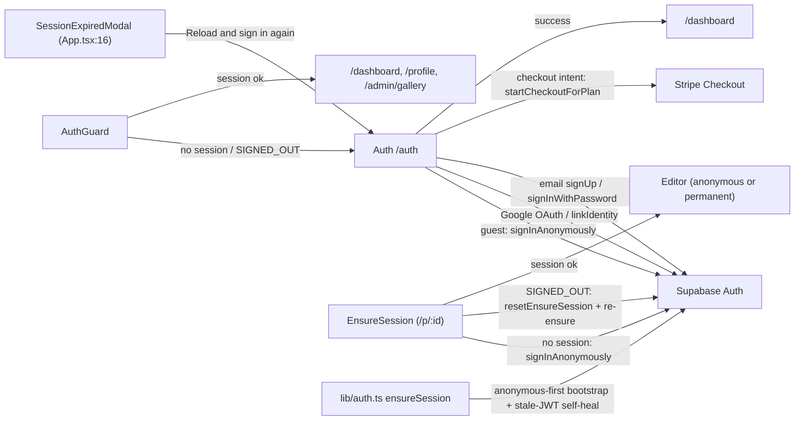

#### `pages/Auth.tsx` — /auth sign-in/sign-up/guest + account-first checkout

**Elements**
- [ ] Postr logo + wordmark — router link — `Auth.tsx:363` — navigates to `/`
- [ ] `Start creating — no account needed` (busy: `Loading…`) — button — `Auth.tsx:389-395` — `handleGuest()` → `supabase.auth.signInAnonymously()` then `/dashboard` (hidden when checkout plan intent present)
- [ ] `Continue with Google` — button — `Auth.tsx:443-455` — `handleGoogle()` → `signInWithOAuth`/`linkIdentity` (google), redirects to `/dashboard` or back to `/auth?plan=…`
- [ ] email field — input type=email, required — `Auth.tsx:465-472` — form state
- [ ] password field — input type=password, required, minLength 8 — `Auth.tsx:474-482` — form state; signup mode renders `<PasswordStrength>` (§6.13) at `Auth.tsx:483`
- [ ] `Forgot password?` — button — `Auth.tsx:491-497` — `supabase.auth.resetPasswordForEmail` (signin mode only)
- [ ] `consent-research` — checkbox, unchecked by default — `Auth.tsx:513-519` — sets researchOptIn (signup mode only)
- [ ] `consent-marketing` — checkbox, unchecked by default — `Auth.tsx:529-535` — sets marketingOptIn (signup mode only)
- [ ] submit: `Sign in` / `Create account` / `Create account & continue` / busy `Loading…` / `Continuing to checkout…` — button type=submit — `Auth.tsx:545-559` — `handleEmailAuth` → `signUp`/`updateUser`/`signInWithPassword`; on checkout intent → `startCheckoutForPlan` (Stripe redirect)
- [ ] `Sign up` — mode-toggle button — `Auth.tsx:566-568` — switches to signup mode
- [ ] `Sign in` — mode-toggle button — `Auth.tsx:573-575` — switches to signin mode

**Copy**
- [ ] "Postr" — wordmark next to logo — `Auth.tsx:370`
- [ ] "Term · CA$18.99 / 4 months" or "Export pack · CA$9.99" — paid-intent banner label — `Auth.tsx:379`
- [ ] "Continuing to secure checkout…" / "Create your account below to continue to secure checkout." — banner body — `Auth.tsx:382-384`
- [ ] "Jump straight into the editor as a guest. Your work saves in this browser. Link an account anytime to sync across devices." — guest pitch — `Auth.tsx:396-399`
- [ ] "Sign in" / "Create your account" / "Or create an account" — card h2 variants — `Auth.tsx:406-410`
- [ ] "Access your posters from any device." / "Save your work across devices." — card subtitle — `Auth.tsx:413-415`
- [ ] "Check your inbox" — confirm-email heading — `Auth.tsx:420`
- [ ] "We sent a confirmation link to {email}. Click it to finish setting up your account{ — your posters stay with you}{ Then come back here and we'll continue to checkout. / Then come back to sign in.}" — confirm body — `Auth.tsx:421-429`
- [ ] "Don't see it? Check spam, or wait a minute and look again." — confirm hint — `Auth.tsx:430-432`
- [ ] "{error}" — error banner slot (Supabase error messages + two local ones below) — `Auth.tsx:436-440`
- [ ] "We couldn't start checkout. Please try again." — local error — `Auth.tsx:138`
- [ ] "Enter your email address first." — local error — `Auth.tsx:302`
- [ ] "or use email" — divider — `Auth.tsx:459`
- [ ] "Email address" — placeholder — `Auth.tsx:469`
- [ ] "Create password" / "Password" — placeholder — `Auth.tsx:478`
- [ ] "Password reset email sent to {email}." — reset confirmation — `Auth.tsx:487-489`
- [ ] "Stay in touch (optional)" — consent fieldset legend — `Auth.tsx:509-511`
- [ ] "Occasionally invite me to a short interview or survey about Postr." — checkbox label — `Auth.tsx:521`
- [ ] "Turn off anytime in settings. Never affects your access." — checkbox sublabel — `Auth.tsx:522-524`
- [ ] "Email me product updates and new features." — checkbox label — `Auth.tsx:536`
- [ ] "Occasional only. Unsubscribe anytime." — checkbox sublabel — `Auth.tsx:537-539`
- [ ] "Don't have an account?" / "Already have an account?" — mode-toggle lead-ins — `Auth.tsx:565,572`

**Graphics**
- [ ] Postr logo — inline-svg (rounded square + two curved paths + dot) — `Auth.tsx:364-369` — header
- [ ] Google "G" — inline-svg, 4 brand-color paths — `Auth.tsx:448-453` — OAuth button

#### `components/AuthGuard.tsx` — redirects to /auth when no session; loading gate

**Elements** — none interactive (redirect logic only: `navigate('/auth')` on no-session/SIGNED_OUT, `AuthGuard.tsx:19,31`)

**Copy**
- [ ] "Loading…" — loading state — `AuthGuard.tsx:41`

**Graphics** — none

#### `components/AuthBootstrap.tsx` — session gate with full-screen loading/error states (DEAD — unmounted)

Defined but never mounted anywhere in `src/` (only referenced in a comment in `pages/Share.tsx:4`) — see §10 watchlist.

**Elements**
- [ ] `Try again` — button — `AuthBootstrap.tsx:66` — `window.location.reload()`

**Copy**
- [ ] "Loading…" — loading state — `AuthBootstrap.tsx:55`
- [ ] "Couldn’t start your session" — error heading — `AuthBootstrap.tsx:64`
- [ ] "No session returned by Supabase" — error message source — `AuthBootstrap.tsx:36`
- [ ] "Unknown auth error" — error message fallback — `AuthBootstrap.tsx:43`

**Graphics** — none

#### `components/SessionExpiredModal.tsx` — full-screen JWT-expired nag (mounted in App.tsx:16)

**Elements**
- [ ] `Reload and sign in again` — button — `SessionExpiredModal.tsx:139` — `window.location.href = '/auth'`
- [ ] `Dismiss (save text first)` — button — `SessionExpiredModal.tsx:157` — hides modal

**Copy**
- [ ] "Your session has expired" — heading — `SessionExpiredModal.tsx:115`
- [ ] "For security, Postr sessions eventually time out. Any unsaved edits in this tab have **not** been saved to the server since the session expired — copy anything important before reloading." — body — `SessionExpiredModal.tsx:126-129`

**Graphics**
- [ ] 🔒 — emoji — `SessionExpiredModal.tsx:104` — above heading

#### `lib/auth.ts` — anonymous-first session bootstrap (`ensureSession`) + stale-JWT self-heal

Consumers: `components/AuthBootstrap.tsx` (dead), `data/posters.ts`, `manuscript/condenseClient.ts`, `pages/Share.tsx`. Stale-JWT recovery wipes local session via `signOut({ scope: 'local' })` (`:54`).
**Elements** — none.
**Copy** (thrown boot errors; surfaced by AuthBootstrap error UI):
- [ ] "Anonymous sign-in failed: {message}" — thrown error — `auth.ts:61,96`
- [ ] "Failed to read Supabase session: {message}" — thrown error — `auth.ts:76`
- [ ] "Failed to validate Supabase session: {message}" — thrown error — `auth.ts:89`
**Graphics** — none.

---

### 6.6 Dashboard & Profile

`/dashboard` poster grid (Home), `/profile` account settings (Profile), and the admin-gated `/admin/gallery` moderation queue. Dashboard-specific shared components `NewPosterButton` / `PosterCard` / `PresetEditModal` / `ConfirmModal` are inventoried in §6.13.

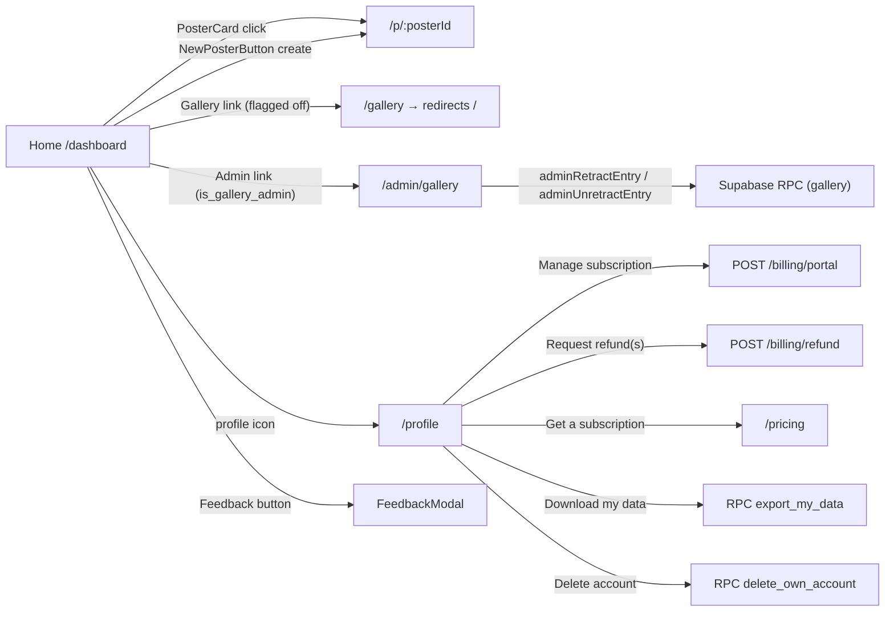

#### `pages/Home.tsx` — /dashboard "My Posters" grid (auth-gated)

**Elements**
- [ ] Postr logo + "Postr" — router link — `Home.tsx:138-146` — `/dashboard`
- [ ] `Gallery` — router link — `Home.tsx:149-154` — `/gallery`; **feature-flagged off** (`GALLERY_PUBLIC_ENABLED=false`)
- [ ] `NAV_LINKS` map render site — router links — `Home.tsx:164-168` — labels in `components/PublicHeader.tsx` (§6.13)
- [ ] `Admin` — router link — `Home.tsx:170-175` — `/admin/gallery` (only when `checkIsGalleryAdmin()` true)
- [ ] `Feedback` (title `Send feedback`) — button — `Home.tsx:177-187` — `openFeedback('feature')`
- [ ] profile icon (aria-label `Profile and settings`, title `Profile & Settings`) — router link — `Home.tsx:188-198` — `/profile`
- [ ] `<NewPosterButton />` ×2 — `Home.tsx:212,258` — creates poster + navigates to editor (§6.13)
- [ ] `<PosterCard onDuplicate onDelete>` per row — `Home.tsx:266-271` (§6.13); handlers here: duplicate → `duplicatePoster`, delete → opens ConfirmModal
- [ ] `<ConfirmModal>` "Delete poster" — `Home.tsx:277-285` — confirm → `deletePoster` (optimistic + rollback)
- [ ] `<ConfirmModal>` "Duplicated" — `Home.tsx:287-299` — confirm → `navigate('/p/{newId}')`

**Copy**
- [ ] "Postr is designed for desktop browsers. For the best editing experience, please use a laptop or desktop computer." — mobile notice (sm:hidden) — `Home.tsx:204-206`
- [ ] "My posters" — section heading — `Home.tsx:209-211`
- [ ] "{actionError}" — inline error banner — `Home.tsx:215-219` (fallbacks: "Failed to duplicate" `Home.tsx:101`, "Failed to delete" `Home.tsx:126`, "Failed to load posters" `Home.tsx:83`)
- [ ] "Loading…" — `Home.tsx:222` · [ ] "Couldn't load posters: {status.message}" — `Home.tsx:226`
- [ ] "Welcome to Postr" — welcome card h3 — `Home.tsx:239`
- [ ] "Create conference-quality research posters in minutes, not hours." — `Home.tsx:240`
- [ ] "Pick a template" / "5 layouts — 3-column classic, billboard, sidebar + focus, and more. Start with structure, not a blank page." — card — `Home.tsx:245-246`
- [ ] "Write with guidance" / "Built-in writing guide, conference size specs, and a checklist to keep you on track from intro to references." — card — `Home.tsx:249-250`
- [ ] "Check before you print" / "Paste your R or Python code to verify figure text is readable at poster size. Out-of-bounds warnings catch layout issues." — card — `Home.tsx:253-254`
- [ ] Modal strings: "Delete poster" title, "Permanently delete "{title or 'Untitled Poster'}"? This cannot be undone." message, "Delete" confirmLabel — `Home.tsx:279-281`; "Duplicated" title, "Created "{title}". Open the new copy now?" message, "Open copy" / "Stay here" labels — `Home.tsx:289-292`

**Graphics**
- [ ] Postr logo — inline-svg — `Home.tsx:139-144` (header) and larger variant `Home.tsx:232-237` (welcome card)
- [ ] Chat-bubble icon — inline-svg — `Home.tsx:183-185` — Feedback button
- [ ] User icon — inline-svg, aria-hidden — `Home.tsx:194-197` — profile link

#### `pages/Profile.tsx` — /profile account settings (auth-gated)

**Elements**
- [ ] Postr logo + "Postr" — router link — `Profile.tsx:902-910` — `/dashboard`
- [ ] `← Back to posters` — router link — `Profile.tsx:911-913` — `/dashboard`
- [ ] `Sign up with Google` — button — `Profile.tsx:364-372` — `signInWithOAuth(google)` redirect to `/profile` (guests only)
- [ ] `EmailSignUp` form: email input (`:1235-1242`), password input (`:1243-1251`), `Create account with email` submit (busy `Creating account…`) (`:1253-1259`) — `supabase.auth.updateUser` converts guest in place (guests only)
- [ ] `ProfileFields`: 5 inputs ("Display name" :1319, "Institution" :1320, "Department" :1321, "ORCID" :1322, "Website / Lab page" :1323) + `Save profile` / `✓ Saved` button (`:1324-1330`) — saves to localStorage `postr.profile`
- [ ] `Manage` — button — `Profile.tsx:414-421` — opens `PresetEditModal` (disabled at 0 presets; title tooltips "Save a preset from the editor first" / "Rename or delete presets")
- [ ] `Clear all` — button — `Profile.tsx:422-431` — clears localStorage `postr.style-presets`
- [ ] `Replay tour` — button — `Profile.tsx:441-450` — `resetOnboarding()`
- [ ] `Product-research emails` — switch (role=switch) — `Profile.tsx:470-489` — `writeConsent({research})` optimistic (non-guests with email only)
- [ ] `Product-update emails` — switch — `Profile.tsx:500-519` — `writeConsent({marketing})`
- [ ] `Delete` — button per custom checklist template — `Profile.tsx:543-553` — `saveCustomTemplates(next)`
- [ ] `Upload external PDF or image` — button — `Profile.tsx:591-593` — `openUploadFlow()`; **feature-flagged off**
- [ ] `{entry.title}` — router link to `/gallery/{entry.id}` — `Profile.tsx:815-820`; **flagged off** (plain span renders instead :822-824)
- [ ] `Retract` — button per gallery entry — `Profile.tsx:839-845` — opens ConfirmModal → `retractGalleryEntry`
- [ ] `Report a bug` / `Request a feature` / `Other` — buttons — `Profile.tsx:639-647` — `openFeedback(kind)`
- [ ] `Manage subscription ↗` (busy `Opening…`) — button — `Profile.tsx:1126-1133` — `openBillingPortal()` → `window.open(url)`
- [ ] `Request refund` (busy `Processing…`) — button — `Profile.tsx:1134-1141` — `requestRefund('term')`
- [ ] `Refund {n} unused credit{s}` — button — `Profile.tsx:1179-1186` — `requestRefund('pack')`
- [ ] `Get a subscription` — router link — `Profile.tsx:1199-1204` — `/pricing`
- [ ] `↓ Download my data (JSON)` (busy `Preparing…`) — button — `Profile.tsx:682-689` — RPC `export_my_data` → JSON file download `postr-export-{ts}.json`
- [ ] `Delete all posters` — DangerAction button — `Profile.tsx:704-710` — ConfirmModal → deletes all posters (disabled at 0)
- [ ] `Delete account` — DangerAction button — `Profile.tsx:712-717` — ConfirmModal with typed confirmation `I confirm the deletion of my account` (:735) → delete posters + RPC `delete_own_account` + signOut → `/auth`
- [ ] `<PresetEditModal>` — `Profile.tsx:723-727`; `<ConfirmModal>` — `Profile.tsx:729-738` (§6.13)

**Copy**
- [ ] "Loading…" — `Profile.tsx:320` · [ ] "{actionStatus}" / "{actionError}" banners — `:331-340`; status strings: "Gallery entry retracted." (:142), "Retract failed." (:145), "Style presets cleared." (:163), "Could not save that preference. Please try again." (:180,196), "Data export downloaded." (:230), "Export failed. Please try again or contact support." (:236), "Deleting posters…" (:256), "Deleted {n} poster(s)." (:263), "Failed to delete posters" (:266), "Deleting account…" (:272), "Failed to delete account" (:301), "Account created! Your guest data has been linked." (:380), "Tour reset — it will play next time you open a poster." (:444), "Deleted template "{name}"." (:547), "Profile saved." (:1301)
- [ ] "Create an Account" section title + body "You're using a guest account. Sign up to preserve your posters across devices and prevent data loss if your browser clears storage. All your current work will be linked to your new account automatically." — `:358-363` · [ ] "or use email" divider — `:375`
- [ ] "Profile Details" + body "Optional — helps identify your posters and auto-fill author info." — `:391-394`; field hints "Used for author auto-fill", "Optional — links to your ORCID profile" — `:1319,1322`; placeholders "e.g. Dr. Jane Smith", "e.g. Acme State University", "e.g. Department of Psychology", "e.g. 0000-0002-1234-5678", "e.g. https://lab.example.com" — `:1319-1323`
- [ ] "Preferences" section — `:402`; "🎨 Saved style presets" — `:405`; "{n} preset{s} saved locally." — `:407`; "Create new presets from the Style tab inside the editor — use the "Save as style preset" row to name your font + palette + typography combo." — `:409-411`; "Onboarding tour" + "Click-through tutorial of the editor interface" — `:436-439`; "Product-research emails" + "Let us occasionally email you to invite you to a short interview or survey about Postr. Turn it on or off anytime. It never affects your access." — `:463-468`; "Product-update emails" + "Occasional emails about new Postr features and updates. Turn it on or off anytime; unsubscribe links are in every email too." — `:493-498`; "Checklist templates" + "Custom templates you saved from the Scratch Pad. Built-in templates cannot be deleted." — `:524-527`; "{t.name} (built-in)" + "{n} items" — `:537-540`; empty "No custom templates yet. Use "Save as..." in the editor's Scratch Pad to create one." — `:558-560`
- [ ] "Gallery submissions" section — `:572` (rendered when flag on OR entries exist); flag-on body "Posters you have published to the public gallery. You can retract any entry at any time — it disappears from the public listing immediately." — `:574-581`; flag-off body "Posters you published while the gallery was open. The gallery is currently offline, but you can still retract any entry at any time — the entry row and stored image are deleted." — `:583-587`; empty states "You haven't published anything yet. Use the Publish button on a poster card, the Publish button in the editor, or the upload button above." (`:601-603`) / "You haven't published anything to the gallery." (`:613`); row meta "Published {date} · {conference} · {year}" — `:828-830`; badge "Retracted by moderator" — `:811`; "Moderator note: {reason}" — `:834`
- [ ] "Feedback" section + body "Found a bug? Have an idea? Send it in — everything lands in the developer's queue and shapes what ships next." — `:633-637`; "Your submissions" — `:652-654`; kind badges "Bug"/"Feature"/"Other" — `:873`; status labels FEEDBACK_STATUS_LABEL `:851-857`: "Received", "Triaged", "In progress", "Shipped", "Declined"
- [ ] "Subscription" section — `:668`; "Loading your plan…" — `:1105`; term-active body "Your term is active — PowerPoint and LaTeX export are unlocked, no watermark." + past-due "There's a payment issue on your latest renewal — update your card to keep your term." — `:1111-1119`; "The term renews every 4 months. Manage it — update your card, see receipts, or cancel — through Stripe, which handles billing for Postr." — `:1121-1124`; "Refundable in full within 14 days of your charge if you haven't taken a paid export." — `:1143-1146`; refund outcomes "Refunded CA${amount}. It may take a few days to appear." (:1088), "The 14-day refund window has passed. You can cancel anytime to stop renewals." (:1093), "This term isn't refundable once you've taken a paid export." (:1094), "You have no unused credits to refund." (:1095), "No refundable pack purchase found." (:1096), "We couldn't process that refund. Please try again or contact support." (:1098)
- [ ] Free-state body "You're on the free plan — unlimited editing and print-ready PDF export, with a small "made with postr.sh" mark." — `:1158-1161`; "Export credits" + "{n}" — `:1167-1170`; "{n} PowerPoint or LaTeX export{s} left — credits never expire." / "From a $9.99 export pack. Credits never expire once purchased." — `:1173-1175`; "CA$3.33 per unused credit. Refunding removes them from your account." — `:1187-1189`; "Unlock clean PowerPoint & LaTeX export with the term, or a one-time export pack whose credits never expire." — `:1195-1198`
- [ ] "Your data" section + body "Download everything Postr has stored for your account as a single JSON file — your posters (with full contents), gallery submissions, feedback you've sent, and your profile. Useful for backups, or to comply with GDPR Art. 15 / 20 right-of-access requests." — `:673-681`
- [ ] "Danger Zone" — `:702`; "Delete all posters" + "Permanently delete all {n} poster(s). This cannot be undone." — `:705-706`; "Delete account" + "Permanently delete your account and all associated data. You will be signed out and a new guest account will be created." — `:713-714`
- [ ] ConfirmModal strings `confirmModalTitle/Message/Label` — `:747-771`: "Retract from gallery" / "Remove "{title}" from the public gallery? The entry row and stored image will be deleted. Third parties may still have cached copies." / "Retract" · "Delete account" / "This will permanently delete your account, all posters, and all preferences. You will be signed out. This action cannot be undone." / "Delete my account" · "Delete all posters" / "Permanently delete all {n} poster(s)? This cannot be undone." / "Delete all"
- [ ] AccountCelebrationCard — `:949-1036`: "Account" heading (:982); "{posterCount}" + "poster crafted"/"posters crafted" (:978,1011-1013); tiered messages (:968-976): "Your canvas is waiting — start your first poster! ✨" · "Welcome to the club! 🎉" · "You're getting the hang of it! 🌱" · "You're on a roll! 🚀" · "Power user in training ⚡" · "Certified poster pro 🏆"; "Guest (no email linked yet)" (:1023); "Member since {createdAt} · {daysActive}d" (:1027-1030)

**Graphics**
- [ ] Postr logo — inline-svg — `Profile.tsx:903-908` — header
- [ ] Google "G" — inline-svg — `Profile.tsx:365-370` — signup button
- [ ] 🎨 — emoji — `Profile.tsx:405` — presets row · [ ] 📧 / 📅 — emoji — `Profile.tsx:1022,1026` — account card
- [ ] Decorative radial-gradient blobs ×2 — aria-hidden CSS — `Profile.tsx:989-1004` — account card background
- [ ] `{entry.image_url}` thumbnails — img — `Profile.tsx:799-803` — gallery submission rows

#### `pages/Gallery.tsx` — /gallery grid (DEAD — route redirects to `/`; component kept for reactivation)

**Elements**
- [ ] `Let us know at support@resila.ai` — mailto link — `Gallery.tsx:66-71`
- [ ] field filter — select — `Gallery.tsx:82-93` — sets field filter, reloads via `listGallery`; options: `All fields` + `FIELD_OPTIONS` from `@/data/gallery` (§6.9)
- [ ] `GalleryCard` — router link per entry — `Gallery.tsx:138` — `/gallery/{row.id}`

**Copy**
- [ ] "Public gallery" — eyebrow — `Gallery.tsx:56` · [ ] "Real posters," + "from real researchers." — h1 — `Gallery.tsx:59-60`
- [ ] "Browse posters published by the Postr community. Everything here was uploaded by its author, who confirmed they hold the rights to share it. Found something off?" — lede — `Gallery.tsx:62-73`
- [ ] "Filter by field" — label — `Gallery.tsx:79-81`
- [ ] "{n} entry/entries" — counter — `Gallery.tsx:95-97`
- [ ] "Loading gallery…" — `Gallery.tsx:105` · [ ] "Couldn't load gallery: {message}" — `Gallery.tsx:108-110`
- [ ] "Nothing here yet." — empty h3 — `Gallery.tsx:114`
- [ ] "Be the first to publish a poster. Sign in and look for the "Publish" button on the dashboard or in the editor." / "No posters have been published under {field} yet. Try a different field." — empty bodies — `Gallery.tsx:116-118`

**Graphics**
- [ ] `{row.image_url}` — img, lazy — `Gallery.tsx:143-148` — card thumbnail

#### `pages/GalleryEntry.tsx` — /gallery/:entryId detail (DEAD — route redirects to `/`)

**Elements**
- [ ] `Back to the gallery` — router link — `GalleryEntry.tsx:93` — `/gallery` (not-found state)
- [ ] `← Back to the gallery` — router link — `GalleryEntry.tsx:119` — `/gallery` (detail state)
- [ ] `Download PDF` — external anchor, `target="_blank"` — `GalleryEntry.tsx:151-158` — opens `{entry.pdf_url}`
- [ ] `email us at support@resila.ai` — mailto — `GalleryEntry.tsx:177-181`
- [ ] `Terms` — router link — `GalleryEntry.tsx:184` — `/terms`

**Copy**
- [ ] "Loading…" — `GalleryEntry.tsx:77` · [ ] "Couldn't load the entry: {message}" — `GalleryEntry.tsx:81-83`
- [ ] "This entry is unavailable." — not-found h1 — `GalleryEntry.tsx:88`
- [ ] "It may have been retracted by its author, or the link is wrong. Browse the rest of the gallery below." — `GalleryEntry.tsx:89-92`
- [ ] "{fieldLabel} · {conference} · {year} · published {dateLabel}" — meta line — `GalleryEntry.tsx:125-134`; "{entry.title}" — h1 — `GalleryEntry.tsx:136-138`
- [ ] "Notes from the author" — section heading — `GalleryEntry.tsx:164-166`; "{entry.notes}" — `GalleryEntry.tsx:167-169`
- [ ] "Postr is a sharing platform, not a publisher. This poster was uploaded by its author, who confirmed they own or have permission to share everything on it. If you believe it infringes your rights, email us at support@resila.ai — see Section 5.4 of the Terms for the takedown procedure." — disclaimer block — `GalleryEntry.tsx:173-188`

**Graphics**
- [ ] `{entry.image_url}` — img — `GalleryEntry.tsx:142-146` — full poster image

#### `pages/AdminGallery.tsx` — /admin/gallery moderation queue (admin-gated; still live despite gallery freeze)

**Elements**
- [ ] Postr logo — router link — `AdminGallery.tsx:132` — navigates to `/dashboard`
- [ ] `NAV_LINKS` map render site — router links — `AdminGallery.tsx:151-155` — labels defined in `components/PublicHeader.tsx` (§6.13)
- [ ] `← Back to dashboard` — router link — `AdminGallery.tsx:156` — `/dashboard`
- [ ] `All` / `Active` / `Retracted` — filter buttons (3, from `(['all','active','retracted'])` map) — `AdminGallery.tsx:177-190` — set local filter state
- [ ] `{row.title}` — router link, `target="_blank"` — `AdminGallery.tsx:302-309` — opens `/gallery/{row.id}` in new tab (currently redirects to `/` while gallery is frozen)
- [ ] `Unretract` — button — `AdminGallery.tsx:331-337` — `adminUnretractEntry(row.id)` → Supabase RPC, reloads list
- [ ] `Retract` — button (collapsed state) — `AdminGallery.tsx:339-345` — expands inline retract form
- [ ] reason textarea — textarea, maxLength 500, autoFocus — `AdminGallery.tsx:355-363` — sets reasonDraft
- [ ] `Cancel` — button — `AdminGallery.tsx:367-372` — collapses retract form
- [ ] `Retract` — button (submit, disabled when empty) — `AdminGallery.tsx:374-380` — `adminRetractEntry(entryId, reasonDraft)`

**Copy**
- [ ] "Admin" — header badge — `AdminGallery.tsx:140`
- [ ] "Gallery moderation" — h2 — `AdminGallery.tsx:167`
- [ ] "Force-retract content that violates the Terms. Reasons are stored on the entry and shown to the author. Retractions are reversible — the image files stay in storage until the owner hard-deletes." — para — `AdminGallery.tsx:168-172`
- [ ] "{filteredRows.length} / {data.rows.length} entries" — counter — `AdminGallery.tsx:193`
- [ ] "Loading entries…" — loading state — `AdminGallery.tsx:208`
- [ ] "Couldn't load entries: {data.message}" — error state — `AdminGallery.tsx:212`
- [ ] "No entries match this filter." — empty state — `AdminGallery.tsx:217`
- [ ] "Checking admin access…" / "Access denied." — gate states — `AdminGallery.tsx:115`
- [ ] "Retracted" — row badge — `AdminGallery.tsx:299`
- [ ] "Published {publishedAt} · {row.conference} · {row.year} · user {row.user_id.slice(0,8)}…" — row meta line — `AdminGallery.tsx:311-316`
- [ ] "Reason: {row.retraction_reason}" — retraction note — `AdminGallery.tsx:324`
- [ ] "Retraction reason (required, max 500 characters)" — form label — `AdminGallery.tsx:353`
- [ ] "Why is this being retracted? Copyright, confidentiality, spam, terms violation…" — textarea placeholder — `AdminGallery.tsx:358`
- [ ] "{reasonDraft.length} / 500" — char counter — `AdminGallery.tsx:365`

**Graphics**
- [ ] Postr logo — inline-svg — `AdminGallery.tsx:133-138` — header
- [ ] `{row.image_url}` poster thumbnail — img — `AdminGallery.tsx:286-290` — each entry row

---

### 6.7 Poster Editor Core

The editor route hosts (`pages/Editor.tsx`, `pages/Share.tsx`) and everything under `poster/` EXCEPT the sidebar (§6.8): block renderers + selection chrome, crop UI, floating format toolbar, group frame, guidelines rail, the top-level `PosterEditor.tsx` (zoom, rulers, grid, drag guides, overlays, shortcuts), resize handles, rich-text editor + symbol library, selection marquee, layout templates, poster constants, and the toast pill.

Scope note: `Sidebar.tsx`, `CommentsPanel.tsx`, `VersionPanel.tsx`, `ReadabilityPanel.tsx`, and `poster/sidebar/*` are in §6.8 — `Sidebar.tsx` imports all three panels (`Sidebar.tsx:56,64`; `sidebar/FigureTab.tsx:20` imports ReadabilityPanel). `GuidelinesPanel.tsx` IS here (imported and rendered directly by `PosterEditor.tsx:41,3305`). External components mounted from this slice but inventoried elsewhere: `Sidebar` (§6.8), `PaletteDesigner`, `StaplesPrintModal`, `ConfirmModal`, `AutosaveStatusPill`, `OnboardingTour`, `InputModal`, `LogoPicker` (§6.13), `ChartBlock` (§6.10).

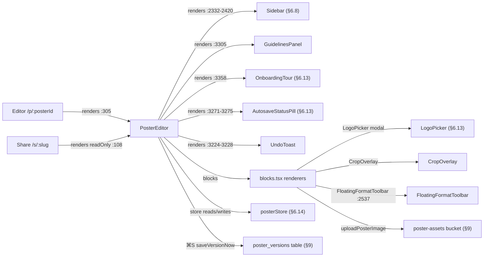

#### `pages/Editor.tsx` — /p/:posterId loader shell around PosterEditor

**Elements**
- [ ] `Back to Dashboard` — anchor — `Editor.tsx:224-229` — href `/dashboard` (not-found state only)
- [ ] `×` (aria-label `Dismiss warning`) — button — `Editor.tsx:287-302` — dismisses two-tab collision alert

**Copy**
- [ ] "Loading poster…" — loading state — `Editor.tsx:211`
- [ ] "Poster not found" — not-found heading — `Editor.tsx:220`
- [ ] "The poster you're looking for doesn't exist or you don't have access to it." — not-found body — `Editor.tsx:221-223`
- [ ] "Couldn't load this poster" — error heading — `Editor.tsx:239`; "{status.message}" — `Editor.tsx:240`
- [ ] "This poster is already open in another tab." — collision alert bold — `Editor.tsx:279-281`
- [ ] "Postr autosave is last-write-wins, so edits in one tab can silently overwrite the other. Close the duplicate tab to avoid losing work." — collision alert body — `Editor.tsx:283-285`

**Graphics**
- [ ] ⚠️ — emoji, aria-hidden — `Editor.tsx:277` — collision alert
- [ ] Render site: `<PosterEditor />` — `Editor.tsx:305`. `hydrateIfEmpty`/`normalizeStaleStyles`/`migrateBase64ToStorage` are logic only.

#### `pages/Share.tsx` — /s/:slug public read-only viewer

**Elements** — none of its own; ready state renders `<PosterEditor readOnly />` (`Share.tsx:108`).

**Copy**
- [ ] "Loading poster…" — `Share.tsx:85`
- [ ] "Poster not found" — h1 — `Share.tsx:92`; "The link may be wrong, or the owner may have unpublished it." — `Share.tsx:93-95`
- [ ] "Couldn't load this poster" — h1 — `Share.tsx:102`; "{status.message}" — `Share.tsx:103`

**Graphics** — none.

#### `poster/blocks.tsx` — Block renderers (Logo/Image/Table/Authors/Refs/Caption) + BlockFrame selection chrome + block context menu

**Elements**
- [ ] `+ Logo` (empty-logo click target) — div button — `blocks.tsx:227-252` — opens `LogoPicker` modal
- [ ] `LogoPicker` (filled state) — modal — `blocks.tsx:215-219` — pick → `onUpdate({ imageSrc })`
- [ ] `LogoPicker` (empty state) — modal — `blocks.tsx:253-257` — pick → `onUpdate({ imageSrc })`
- [ ] hidden file input (filled image) — `<input type="file" accept="image/*">` — `blocks.tsx:397` — upload → Supabase Storage (`uploadPosterImage`) or base64 fallback
- [ ] `+ Upload figure` (empty-image click target) — div button — `blocks.tsx:403-433` — clicks hidden file input
- [ ] hidden file input (empty image) — `<input type="file" accept="image/*">` — `blocks.tsx:432`
- [ ] table cell editor — contentEditable div (one per cell) — `blocks.tsx:1001-1034` — edits cell HTML → `updateCell`
- [ ] `Drag to resize column` — column-border drag handle ×(cols−1) — `blocks.tsx:904-918` — pointer drag redistributes `colWidths`
- [ ] `Select row ${r + 1}` / title `Select row ${r + 1} (Delete to remove)` — row selector strip ×rows — `blocks.tsx:1056-1090` — selects whole row
- [ ] `Select column ${c + 1}` / title `Select column ${c + 1} (Delete to remove)` — column selector strip ×cols — `blocks.tsx:1102-1136` — selects whole column
- [ ] `Add row` — hover-only bottom bar button — `blocks.tsx:1147-1168` — `insertRow(data, rows-1, 'below')`
- [ ] `Add column` — hover-only right bar button — `blocks.tsx:1171-1193` — `insertCol(data, cols-1, 'right')`
- [ ] right-click on cell — gesture — `blocks.tsx:971-975` — opens `TableContextMenu` at cursor
- [ ] `Insert row above` — context-menu item — `blocks.tsx:1305` — `insertRow(r, 'above')`
- [ ] `Insert row below` — context-menu item — `blocks.tsx:1306` — `insertRow(r, 'below')`
- [ ] `Insert column left` — context-menu item — `blocks.tsx:1308` — `insertCol(c, 'left')`
- [ ] `Insert column right` — context-menu item — `blocks.tsx:1309` — `insertCol(c, 'right')`
- [ ] `Clear cell` — context-menu item — `blocks.tsx:1311` — `updateCell(r, c, '')`
- [ ] `Delete row` — context-menu item (danger, disabled when rows ≤ 1) — `blocks.tsx:1313` — `deleteRowAt(r)`
- [ ] `Delete column` — context-menu item (danger, disabled when cols ≤ 1) — `blocks.tsx:1314` — `deleteColAt(c)`
- [ ] `Tab` / `Shift+Tab` — keyboard — `blocks.tsx:591-602` — focus next/previous cell
- [ ] `ArrowUp/Down/Left/Right` (at content edge) — keyboard — `blocks.tsx:623-626` — move cell focus
- [ ] `Escape` — keyboard — `blocks.tsx:628,1243-1249` — closes table context menu
- [ ] `Delete`/`Backspace` (row/col selected) — keyboard — `blocks.tsx:652-670` — deletes selected row/column
- [ ] `Delete`/`Backspace` (multi-cell range) — keyboard — `blocks.tsx:674-699` — clears all cells in range
- [ ] paste TSV/CSV/HTML — clipboard — `blocks.tsx:781-789` — `parseTablePaste` replaces/grows table
- [ ] cell drag-select — mouse drag across cells — `blocks.tsx:940-970` — rectangular range selection
- [ ] block click — click — `blocks.tsx:1908-1924` — selects block; `Shift`/`⌘`/`Ctrl`+click = additive toggle (`blocks.tsx:1910`)
- [ ] block drag from body — pointer drag (not image/logo) — `blocks.tsx:1925-1937` — move block
- [ ] block right-click — gesture (non-table, non-text blocks) — `blocks.tsx:1938-1957` — opens block context menu
- [ ] `ResizeHandles` — 8 (or 4 corner) drag handles — `blocks.tsx:2221-2239` — resize block; corners-only for contain-mode images (`:2237`)
- [ ] `Drag to move (or use arrow keys)` — circular move handle — `blocks.tsx:2289-2323` — drag → move block
- [ ] `Replace logo` / `Replace image` — circular button (image/logo only) — `blocks.tsx:2372-2406` — dispatches `postr:replace-block` → opens picker/file input
- [ ] `Crop image` / `Exit crop` — circular toggle (image/logo only, `aria-pressed`) — `blocks.tsx:2407-2436` — toggles `CropOverlay`
- [ ] `Delete block` — red circular button — `blocks.tsx:2440-2468` — `onDelete(b.id)`
- [ ] `Drag to rotate — snaps at 0/45/90/135/180° (Shift = 15° steps)` — circular rotate handle below block — `blocks.tsx:2500-2529` — drag → rotate
- [ ] `Duplicate` `⌘D` — block context-menu item — `blocks.tsx:2580` — `onDuplicate(b.id)`
- [ ] `Bring Forward` — block context-menu item — `blocks.tsx:2581` — `onReorder(b.id, 1)`
- [ ] `Send Back` — block context-menu item — `blocks.tsx:2582` — `onReorder(b.id, -1)`
- [ ] `Delete` `⌫` — block context-menu item (danger) — `blocks.tsx:2583` — `onDelete(b.id)`
- [ ] context-menu backdrop — click-catcher overlay — `blocks.tsx:2546-2559` — dismisses block menu
- [ ] `CropOverlay` — inline crop UI mount (image/logo, selected+cropMode) — `blocks.tsx:2165-2171,2184-2190`
- [ ] `FloatingFormatToolbar` — portal toolbar mount — `blocks.tsx:2537` — shows on text selection

**Copy**
- [ ] "+ Logo" — placeholder label — `blocks.tsx:248`
- [ ] "presets · upload · reuse" — placeholder hint — `blocks.tsx:250`
- [ ] "Poster logo" — img alt — `blocks.tsx:180`
- [ ] "+ Upload figure" — placeholder label — `blocks.tsx:430`
- [ ] "click to browse · drag to move" — placeholder hint — `blocks.tsx:431`
- [ ] `"{file.name}" doesn't look like an image (got {type}).\n\nUpload PNG, JPEG, GIF, WebP, or SVG instead.` — alert() error — `blocks.tsx:109-112`
- [ ] `"{file.name}" is {mb} MB — too large.\n\nImages must be under 10 MB. Try compressing the PNG/JPEG in Preview (macOS) or an online tool.` — alert() error — `blocks.tsx:117-120`
- [ ] `Couldn't read "{file.name}". The file may be corrupted or unreadable.` — alert() error — `blocks.tsx:126-128`
- [ ] `{caption plain-text} || 'Figure'` — img alt — `blocks.tsx:348`
- [ ] "Add authors in sidebar →" — empty state (×2 variants) — `blocks.tsx:1352,1367`
- [ ] " · " — institution separator — `blocks.tsx:1372,1427`
- [ ] ", " — author separator — `blocks.tsx:1414`
- [ ] "*Equal contribution" — footnote marker line — `blocks.tsx:1436`
- [ ] "†Corresponding author" — footnote marker line — `blocks.tsx:1438`
- [ ] "Add references in Refs tab →" — empty state — `blocks.tsx:1461`
- [ ] "References" — refs-block heading — `blocks.tsx:1482`
- [ ] `Poster made with postr.sh https://postr.sh` — injected last reference entry (rawText from `@/export/attribution.ts:276`; bold via `ACK_REFERENCE_ID` check at `blocks.tsx:1493`)
- [ ] `Figure {N}.` / `Table {N}.` — auto caption prefix — `blocks.tsx:1624`
- [ ] `{b.type}` (e.g. "image", "table") — block-type pill on selection chrome — `blocks.tsx:2355`
- [ ] `{rotation}°` — rotation readout in pill — `blocks.tsx:2358`
- [ ] "Poster Title" — editor placeholder — `blocks.tsx:2075`
- [ ] "Section Heading" — editor placeholder — `blocks.tsx:2117`
- [ ] "Type here… (type / for symbols)" — editor placeholder — `blocks.tsx:2140`
- [ ] `{headingNumber}.` — auto heading number — `blocks.tsx:2113`
- [ ] "⌘D" — shortcut hint in context menu — `blocks.tsx:2580`
- [ ] "⌫" — shortcut hint in context menu — `blocks.tsx:2583`
- [ ] `Cell ({r + 1}, {c + 1})` — table context-menu header — `blocks.tsx:1302`

**Graphics**
- [ ] 1×1 transparent GIF (`PLACEHOLDER_SRC`) — img data-URI — `blocks.tsx:48-49` — fills img while `storage://` URL resolves
- [ ] move icon (4-arrow cross) — inline-svg — `blocks.tsx:2304-2322` — move handle
- [ ] replace icon (circular arrows) — inline-svg — `blocks.tsx:2389-2405` — replace button
- [ ] crop icon — inline-svg — `blocks.tsx:2421-2435` — crop toggle
- [ ] X icon — inline-svg — `blocks.tsx:2453-2467` — delete button
- [ ] rotate icon (two chasing arrows) — inline-svg — `blocks.tsx:2523-2528` — rotate handle
- [ ] rotate stem — css line — `blocks.tsx:2484-2499` — connects rotate handle to block
- [ ] active-cell row + column bands — css overlay — `blocks.tsx:865-900` — table focus guides (Excel-style)
- [ ] affiliation `*` / `†` superscript markers — text glyphs — `blocks.tsx:1410-1411` — author line

#### `poster/boundsCheck.ts` — OOB detection (logic; produces user-visible message strings)

**Copy**
- [ ] `{block.type} block is completely outside the poster — it won't appear in print.` — warning message (severity full) — `boundsCheck.ts:58` — rendered in OOB banner `PosterEditor.tsx:3259` and Issues tab
- [ ] `{block.type} block extends past the {edges.join(' and ')} edge{s} — content may be cut off in print.` — warning message (partial) — `boundsCheck.ts:59` — same render sites

#### `poster/CropOverlay.tsx` — Inline 4-edge crop UI for image/logo blocks

**Elements**
- [ ] `crop top edge` — edge drag handle (`role="button"`) — `CropOverlay.tsx:161` (handle render `:240-256`) — drag grows top crop %
- [ ] `crop right edge` — edge drag handle — `CropOverlay.tsx:162` — drag grows right crop %
- [ ] `crop bottom edge` — edge drag handle — `CropOverlay.tsx:163` — drag grows bottom crop %
- [ ] `crop left edge` — edge drag handle — `CropOverlay.tsx:164` — drag grows left crop %
- [ ] `✕` `Cancel (Esc)` — button — `CropOverlay.tsx:186-188` — reverts to open-time snapshot, exits
- [ ] `↺` `Reset crop (revert to no crop, stay in crop mode)` — button — `CropOverlay.tsx:189-195` — clears crop, stays open
- [ ] `✓` `Apply crop (Enter)` — primary button — `CropOverlay.tsx:196-198` — closes (crop already committed live)
- [ ] `Escape` — keyboard — `CropOverlay.tsx:74-76` — cancel
- [ ] `Enter` — keyboard — `CropOverlay.tsx:77-79` — apply

**Copy** — none beyond the button labels/titles above.

**Graphics**
- [ ] kept-region rect with 9999px dark dim mask — css overlay — `CropOverlay.tsx:135-144,159` — darkens cropped-away area

#### `poster/FloatingFormatToolbar.tsx` — Notion-style selection toolbar (+ docked variant for sidebar)

**Elements** (`FormatToolbarButtons`, `FloatingFormatToolbar.tsx:243-396`; floating mount `:429-476`; docked export `:417-427` used by sidebar Edit tab)
- [ ] `B` `Bold` — execCommand button (`aria-pressed`) — `FloatingFormatToolbar.tsx:255` — `execCommand('bold')`
- [ ] `I` `Italic` — execCommand button — `FloatingFormatToolbar.tsx:256` — `execCommand('italic')`
- [ ] `U` `Underline` — execCommand button — `FloatingFormatToolbar.tsx:257` — `execCommand('underline')`
- [ ] `S` `Strike Through` (label "S", title via cmdButton = 'S') — execCommand button — `FloatingFormatToolbar.tsx:258` — `execCommand('strikeThrough')`
- [ ] `⟸` — align-left button — `FloatingFormatToolbar.tsx:271` — `execCommand('justifyLeft')`
- [ ] `≡` — align-center button — `FloatingFormatToolbar.tsx:272` — `execCommand('justifyCenter')`
- [ ] `⟹` — align-right button — `FloatingFormatToolbar.tsx:273` — `execCommand('justifyRight')`
- [ ] `•` — bulleted-list button — `FloatingFormatToolbar.tsx:286` — `execCommand('insertUnorderedList')`
- [ ] `1.` — numbered-list button — `FloatingFormatToolbar.tsx:287` — `execCommand('insertOrderedList')`
- [ ] `⇥` — indent button — `FloatingFormatToolbar.tsx:288` — `execCommand('indent')`
- [ ] `⇤` — outdent button — `FloatingFormatToolbar.tsx:289` — `execCommand('outdent')`
- [ ] `A−` `Smaller` — button — `FloatingFormatToolbar.tsx:311-322` — wraps selection in `font-size:0.94em` span (fallback `execCommand('fontSize','3')`)
- [ ] `A+` `Larger` — button — `FloatingFormatToolbar.tsx:323-334` — `font-size:1.06em` span (fallback `'4'`)
- [ ] `Highlight · Yellow` — swatch button — `FloatingFormatToolbar.tsx:340` (constant `:114`) — `execCommand('hiliteColor','#FFEB3B66')`
- [ ] `Highlight · Green` — swatch button — `FloatingFormatToolbar.tsx:340` (constant `:115`) — `'#4CAF5055'`
- [ ] `Highlight · Blue` — swatch button — `FloatingFormatToolbar.tsx:340` (constant `:116`) — `'#2196F355'`
- [ ] `Highlight · Red` — swatch button — `FloatingFormatToolbar.tsx:340` (constant `:117`) — `'#FF572255'`
- [ ] `Highlight · Purple` — swatch button — `FloatingFormatToolbar.tsx:340` (constant `:118`) — `'#9C27B055'`
- [ ] `∅` `Clear highlight` — swatch button — `FloatingFormatToolbar.tsx:341` — `hiliteColor 'transparent'`
- [ ] `Text · Red` — swatch button — `FloatingFormatToolbar.tsx:348-350` (constant `:123`) — `foreColor '#ef4444'`
- [ ] `Text · Orange` — swatch button — constant `FloatingFormatToolbar.tsx:124` — `'#f97316'`
- [ ] `Text · Green` — swatch button — constant `FloatingFormatToolbar.tsx:125` — `'#16a34a'`
- [ ] `Text · Blue` — swatch button — constant `FloatingFormatToolbar.tsx:126` — `'#2563eb'`
- [ ] `Text · Purple` — swatch button — constant `FloatingFormatToolbar.tsx:127` — `'#7c3aed'`
- [ ] `∅` `Default color` — swatch button — `FloatingFormatToolbar.tsx:351` — `foreColor 'inherit'`
- [ ] `Clear` `Clear formatting` — button — `FloatingFormatToolbar.tsx:356-373` — `execCommand('removeFormat')`
- [ ] `💬` `Comment on selection` — button — `FloatingFormatToolbar.tsx:377-393` — dispatches `postr:comment-text` (blockId + offsets + quote)

**Copy** — none beyond labels/titles above (dividers are pure css).

**Graphics**
- [ ] 💬 — emoji — `FloatingFormatToolbar.tsx:392` — comment button
- [ ] `∅` — text glyph — `FloatingFormatToolbar.tsx:223` — "none" swatches
- [ ] 6 vertical divider bars — css — `FloatingFormatToolbar.tsx:260,275,291,336,344,354,375`

#### `poster/GroupFrame.tsx` — Multi-select bounding box (union rect + group move/resize)

**Elements**
- [ ] group bounding box — drag-anywhere move surface — `GroupFrame.tsx:100-115` — drag → `onGroupMove(dx,dy)`
- [ ] `ResizeHandles` — 8 group resize handles — `GroupFrame.tsx:116-119` — drag → `onGroupResize(handle,dx,dy)`

**Copy** — none.

**Graphics**
- [ ] dashed accent union border — css — `GroupFrame.tsx:109`

#### `poster/GuidelinesPanel.tsx` — Right-side reference rail: scratch-pad checklist, conference specs, writing guide, shortcuts cheatsheet, resources

**Elements**
- [ ] `Hide guidelines` — X button — `GuidelinesPanel.tsx:571-590` — `onToggle()` → closes panel
- [ ] `Scratch Pad ({done}/{total})` — section toggle — `GuidelinesPanel.tsx:595-599` — collapse/expand
- [ ] template `<select>` — select — `GuidelinesPanel.tsx:603-635` — `applyTemplate(name)` loads checklist into scratch pad
- [ ] `Save as...` — button — `GuidelinesPanel.tsx:636-642` — opens InputModal
- [ ] item checkbox — `<input type="checkbox">` ×N — `GuidelinesPanel.tsx:647-652` — `toggleItem(id)`
- [ ] item text input `New item...` — `<input>` ×N — `GuidelinesPanel.tsx:653-665` — `updateItemText`
- [ ] `×` `Remove` — button ×N — `GuidelinesPanel.tsx:666-672` — `removeItem(id)`
- [ ] `+ Add item` — button — `GuidelinesPanel.tsx:676-681` — `addItem()`
- [ ] notes textarea `Reminders, talking points, reviewer feedback...` — textarea — `GuidelinesPanel.tsx:688-707` — `updateNote` → localStorage `postr.scratch-note`
- [ ] `Conference Guidelines ({GUIDELINES.length})` — section toggle — `GuidelinesPanel.tsx:713-717`
- [ ] `Writing Guide ({WRITING_TIPS.length})` — section toggle — `GuidelinesPanel.tsx:729-733`
- [ ] `Shortcuts & Manipulations` — section toggle — `GuidelinesPanel.tsx:748-752`
- [ ] `General Resources ({GENERAL_RESOURCES.length})` — section toggle — `GuidelinesPanel.tsx:757-761`
- [ ] conference card header (×7: APA, SfN, APS, ACNP, SOBP, ECNP, SPSP) — expand toggle button — `GuidelinesPanel.tsx:801-814`
- [ ] `{g.urlLabel} ↗` — external link ×7 — `GuidelinesPanel.tsx:851-858` — opens conference URL (new tab)
- [ ] writing-tip card header (×6) — expand toggle — `GuidelinesPanel.tsx:1225-1238`
- [ ] `Source: {s.source} ↗` — external link ×5 (4 sections have sources… 5 with source+url) — `GuidelinesPanel.tsx:1264-1272`
- [ ] resource link (×5, name + description) — external `<a>` — `GuidelinesPanel.tsx:763-774`
- [ ] `Save as template` InputModal — modal (external component) — `GuidelinesPanel.tsx:779-787` — confirm → `saveCurrentAsTemplate`

**Copy**
- [ ] "Poster Guidelines" — panel heading — `GuidelinesPanel.tsx:565`
- [ ] "Official requirements from major conferences. Click to expand." — subheading — `GuidelinesPanel.tsx:568`
- [ ] "Load template..." — disabled select option — `GuidelinesPanel.tsx:622`
- [ ] "Built-in" — optgroup label — `GuidelinesPanel.tsx:623`
- [ ] "Custom" — optgroup label — `GuidelinesPanel.tsx:629`
- [ ] `{t.name} ({t.items.length})` — option label template — `GuidelinesPanel.tsx:625,631`
- [ ] "Notes" — label — `GuidelinesPanel.tsx:686`
- [ ] "Save as template" — modal title — `GuidelinesPanel.tsx:781`
- [ ] "Give your checklist template a name so you can reuse it on future posters." — modal message — `GuidelinesPanel.tsx:782`
- [ ] "e.g. My Meta-Analysis Checklist" — modal placeholder — `GuidelinesPanel.tsx:783`
- [ ] "Save template" — modal confirm label — `GuidelinesPanel.tsx:784`
- [ ] `Note: {g.sizeNote}` — size note template — `GuidelinesPanel.tsx:819-821`
- [ ] "Element" / "Min" / "Ideal" — font-table headers — `GuidelinesPanel.tsx:827-829`
- [ ] `—` — missing recommended-font fallback — `GuidelinesPanel.tsx:837`
- [ ] GUIDELINES constant (`GuidelinesPanel.tsx:57-261`) — conference rows rendered by ConferenceCard. Verbatim fields per row `{conference / field / size / sizeNote / fonts(element:min:recommended) / tips / urlLabel}`:
  - APA / Psychology / `48" × 72" (4' high × 6' wide)` / "Maximum poster size — APA sets the poster maximum equal to the board, so you may fill it entirely. Landscape." / Title 72pt→158pt, Headings 46pt→56pt, Body 24pt→36pt, Captions 18pt / tips: "Sans-serif font (Arial, Calibri recommended)", "Title readable from 10–15 feet", ""Better Poster" modification template available from APA", "Dark text on white/off-white, or white on dark — verify contrast" / "APA Convention — Poster Presenters" — `GuidelinesPanel.tsx:58-85`
  - SfN / Neuroscience / `72" × 48" (6' × 4') landscape` / "Board is 6ft wide × 4ft high — this is a maximum, not a required size. A smaller poster is fine." / Title 72pt→85pt+, Headings 36pt→48pt, Body 24pt→28–32pt, Captions 18pt / tips: "Readable from 4–6 feet away", "Sans-serif strongly preferred", "Figures should dominate — minimize text", "Number your poster with your assigned board number" / "SfN Neuroscience 2026 — Poster Sessions" — `GuidelinesPanel.tsx:86-121`
  - APS / Psychological Science / `A0 — 33.1" × 46.8" (84.1 × 118.9 cm)` / "A0, landscape or portrait. Note this is metric A0, not a US size — considerably narrower than a 48"×96" board." / Headings 30pt, Body 20pt / tips: "Content readable from 3 feet", "Assertion-evidence format encouraged", "No A/V equipment allowed at standard poster sessions", "Include QR code linking to your OSF/preprint" / "APS 2026 — Poster Rules & Guidelines" — `GuidelinesPanel.tsx:122-152`
  - ACNP / Neuropsychopharmacology / `45" × 45" (square)` / "Maximum 45×45 inches, square. Confirmed for the January 2027 annual meeting." / Title 72pt, Body 24pt / tips: "Mount at eye level", "Include institutional logo and funding acknowledgments", "Download the yearly poster guidelines PDF from ACNP" / "ACNP — Submissions & Guidelines" — `GuidelinesPanel.tsx:153-176`
  - SOBP / Biological Psychiatry / `48" × 48" (4' × 4')` / "Maximum 4ft × 4ft. ⚠ Most recent published SOBP guidance found is from 2018 — confirm against your acceptance letter before printing." / Title 72pt, Body 24pt / tips: "Square format increasingly common", "Data-forward: figures > text" / "SOBP — Meetings" — `GuidelinesPanel.tsx:177-205`
  - ECNP / European Neuropsychopharmacology / `A0 portrait — 84.1 × 118.9 cm (33.1" × 46.8")` / "A0, portrait, one page, submitted as PDF. ECNP prints posters for presenters. Source is the 2025 congress guidance — re-check for your congress year." / Title 72pt, Headings 36pt, Body 24pt / tips: "A0 portrait — narrower than a typical US landscape poster, so plan a vertical column flow", "Casual observer should grasp the message within seconds", "Disclose conflicts of interest at the bottom", "Posters hung after 09:00 may not qualify for the ECNP Poster Award" / "ECNP 2025 — Poster Guidelines" — `GuidelinesPanel.tsx:206-235`
  - SPSP / Social/Personality Psychology / `48" × 72" (4' high × 6' wide)` / "Posters must fit within the board. Landscape." / Title 72pt, Body 24pt / tips: "Do NOT use foam-core or thick heavy materials", "Cannot set materials on the floor or lean against the board", "Keep methods brief — focus on results + implications", "Fabric printing recommended (Spoonflower) — reusable, wrinkle-free" / "SPSP 2025 — Poster Presenter Guidelines (PDF)" — `GuidelinesPanel.tsx:236-260`
- [ ] WRITING_TIPS constant (`GuidelinesPanel.tsx:272-343`) — 6 sections rendered by WritingTipCard:
  - "Section Structure": "Introduction (~200 words): Why it matters → brief background → the gap → your hypothesis.", "Methods (~200 words): Equipment + procedure. Use flowcharts instead of paragraphs. Mention stats.", "Results (~200 words + legends): State if procedures worked, then data. Figures > tables.", "Conclusions (~200 words): Restate key result → why it matters → future directions.", "Total target: under 800–1000 words. More than 1000 is "problematic"." (source "Colin Purrington") — `:273-284`
  - "Saving Space": "Aim for 20% text, 40% figures, 40% whitespace.", "Use bullet points, not paragraphs. Lists of sentences, not blocks of prose.", "Only cite key references integral to your study — refs are wordy. Use smaller font for refs.", "Say the rest verbally — the poster is a conversation starter, not a paper.", "Cut every sentence that doesn't answer "so what?"" (source "UCLA / Ohio State poster guides") — `:285-296`
  - "Tables vs. Text": "Use a table when you have 3+ comparable items with 2+ dimensions (e.g. Study × d × CI).", "Use inline text when comparing just 2 values — "Group A scored higher than B (d = 0.42, p < .01)."", "Bold or highlight the row/column the reader should focus on.", "Figures > tables > text for communicating results. Use tables only when exact numbers matter.", "Min 20pt font in tables. If you can't fit it at 20pt, the table has too many columns." (source "Ohio State Poster Guide") — `:297-308`
  - "Color Strategy": "Pick 2–3 colors max. Use them consistently: one for Group A, one for Group B, across ALL figures and tables.", "Same color = same concept throughout the poster. If treatment is blue in Methods, it's blue in Results.", "Don't rely on color alone to distinguish groups — add patterns, labels, or shapes as fallback.", "Test contrast with WebAIM's free checker. Dark text on light bg, or light on dark — never mid-tones on mid-tones.", "Print a small test page — screen colors ≠ printed colors." (source "UChicago Library") — `:309-320`
  - "Text Formatting to Highlight": "Bold your key statistics (p-values, effect sizes, CIs) so skimmers can find them instantly.", "Use italic for emphasis within sentences, not for entire paragraphs.", "Color a key result (e.g. significant p-value in your accent color) — but sparingly.", "Left-align body text. Never center body paragraphs — it's harder to read.", "Add breathing room: line spacing 1.3–1.5× for body text." (no source) — `:321-330`
  - "Common Beginner Mistakes": "Too much text — the #1 mistake. If your poster reads like a paper, cut 60%.", "Unreadable figure legends — they must stand alone without the presenter explaining.", "No clear "take-home message" — add one sentence in the title or conclusion that a passerby can grasp.", "Using the poster as a teleprompter — don't read from it. Talk naturally, point at figures.", "Forgetting to include your email / QR code — the poster lives on after you leave." (source "Better Posters / Purrington") — `:331-342`
- [ ] GENERAL_RESOURCES constant (`GuidelinesPanel.tsx:345-371`) — 5 link cards: "Colin Purrington — Designing Conference Posters" / "Title 85pt, body 32pt, captions 24pt. Target <1000 words. 45-65 chars per line."; "Better Posters (Zen Faulkes)" / "ADA accessibility: 66pt from 6ft, 120pt from 10ft. "Design with empathy.""; "Better Posters — Font Size Article" / ""Your poster text is too damn small" — why 24pt body is half the ADA standard."; "NYU Poster Design Tips" / "Min 18pt any text. 300-800 words. 120+ ppi images. 1-inch margins."; "UAB Poster Design — Font Size Chart" / "Font size reference chart by poster dimension. Purrington-style specs."
- [ ] BUILT_IN_TEMPLATES constant (`GuidelinesPanel.tsx:393-453`) — 4 checklist templates: "Standard Poster" (10 items: 'Draft title + key finding sentence', 'Write Introduction (~200 words)', 'Write Methods (~200 words)', 'Create results figure + table', 'Write Conclusions (~200 words)', 'Add references (3-5 key citations)', 'Add authors + affiliations', 'Check figure readability (paste R/Python code)', 'Review against conference size requirements', 'Proofread — total under 1000 words?'); "Quick Poster (Minimal)" (6 items: 'Title + one-sentence finding', 'Background (3 bullet points)', 'Method (1 paragraph)', 'Key result figure', 'Conclusion + future directions', 'References (3 max)'); "Meta-Analysis" (10 items: 'PRISMA flow diagram', 'Search strategy description', 'Inclusion/exclusion criteria table', 'Forest plot (main outcome)', 'Heterogeneity stats (I², Q)', 'Sensitivity/subgroup analyses', 'Funnel plot for publication bias', 'Summary of findings table', 'Limitations + future directions', 'PROSPERO registration number'); "RCT / Clinical Trial" (9 items: 'CONSORT flow diagram', 'Primary + secondary outcomes defined', 'Participant demographics table', 'Intervention description', 'Results table (effect sizes + CIs)', 'Adverse events summary', 'Clinical significance statement', 'Trial registration number', 'Funding + COI disclosure')
- [ ] ShortcutsPanel copy (`GuidelinesPanel.tsx:881-971`) — group titles + rows:
  - "Select a block": "Click a block on the canvas" / "Shows the selection frame, external handles, and the Edit tab in the sidebar."; "Click an empty area" / "Deselects. Arrow keys and Delete only fire while a block is selected." — `:884-891`
  - "External handles (appear when selected)": "Move — top-left, purple. Drag to reposition. Required for image and logo blocks (the browser's native image-drag otherwise hijacks the pointer)."; "Rotate — bottom-center, connected by a stem. Drag in a circle around the block."; "Delete — top-right, red. One click removes the block."; "Resize — bottom-right corner of the frame. Drag to resize. When a block is rotated, resize still follows the block's local "right/down" direction." — `:893-910`
  - "Keyboard": "Nudge by 1/2 inch (one grid cell) — default respects the grid."; "Nudge by 1/10 inch — fine sub-grid adjustment."; "Delete the selected block. Backspace works too."; "Undo. ⌘⇧Z or ⌘Y to redo."; "Toggle the left sidebar (Notion-style)." — `:912-928`
  - "Rotation tricks": "Dragging the rotate handle magnetically snaps at 0° / 45° / 90° / 135° / 180° with a 4° catch radius. Loose enough that intentional 43° rotations still work."; "Hold while rotating → hard 15° steps instead of magnetic. Useful when you want every rotation to land on a clean multiple." — `:930-939`
  - "Tables": "Move to the next cell. Shift+Tab goes backward."; "Paste TSV / CSV from Excel or Word — Tabs become columns, newlines become rows. The existing table auto-grows."; "Right-click a cell — Custom context menu for insert / delete row + column, table border preset, clear range." — `:941-951`
  - "💡 Tip: autosave runs continuously, so you can experiment freely. The autosave pill in the top-right of the canvas shows when the latest change landed on the server." — tip box — `:953-968`

**Graphics**
- [ ] X icon — inline-svg — `GuidelinesPanel.tsx:587-589` — hide button
- [ ] `▸` chevron — text glyph (rotates 90°) — `GuidelinesPanel.tsx:811,1190,1235` — section/card toggles
- [ ] select dropdown chevron — svg data-URI background — `GuidelinesPanel.tsx:616`
- [ ] KeyBadge icons: move / rotate / delete / resize — inline-svg ×4 — `GuidelinesPanel.tsx:1087-1125` — shortcuts cheatsheet
- [ ] `↻` — text glyph — `GuidelinesPanel.tsx:931` — rotation-tricks badge
- [ ] `<kbd>` key chips (↑ ↓ ← →, Shift, Delete, Backspace, ⌘, Z, Y, /, Tab) — styled kbd elements — `GuidelinesPanel.tsx:1127-1156`
- [ ] 💡 — emoji — `GuidelinesPanel.tsx:965` — tip box

#### `poster/PosterEditor.tsx` — Top-level editor: sidebar/canvas wiring, zoom, rulers, grid, drag guides, overlays, modals, shortcuts

**Elements**
- [ ] `Back to Editor` — button (preview mode) — `PosterEditor.tsx:1158-1172` — exits preview
- [ ] `Print / Save PDF` — button (preview mode) — `PosterEditor.tsx:1173-1187` — exits preview + `printPoster()` (opens print window → `window.print()`)
- [ ] `Duplicated` ConfirmModal — modal — `PosterEditor.tsx:2459-2471` — confirm navigates to `/p/{newId}`
- [ ] `Dismiss` — button on duplicate-error toast — `PosterEditor.tsx:2495-2507` — clears error
- [ ] `Comments` — button (mobile share bar only) — `PosterEditor.tsx:2536-2557` — opens comments sheet
- [ ] `Make your own` — link (mobile share bar) — `PosterEditor.tsx:2558-2577` — navigates to `/`
- [ ] `Show sidebar` / title `Show sidebar (⌘/)` — reveal-tab button (sidebar closed, desktop) — `PosterEditor.tsx:2583-2617` — opens sidebar
- [ ] canvas rubber-band — pointer drag on workspace — `PosterEditor.tsx:2638-2705` — marquee multi-select (click = deselect)
- [ ] pinch / `Ctrl`+wheel — gesture — `PosterEditor.tsx:1243-1298` — cursor-anchored zoom (0.2–10×)
- [ ] two-finger scroll — native pan via overflow:auto — `PosterEditor.tsx:1214-1216` (comment), container `:2720-2721`
- [ ] `Zoom out` (`−`) — ZoomBar button — `PosterEditor.tsx:3415-3421` — `setZoom(zoom - 0.15)`
- [ ] `Reset zoom to fit` (`{percent}%` readout) — ZoomBar button — `PosterEditor.tsx:3422-3431` — `setZoom(null)` (auto-fit)
- [ ] `Zoom in` (`+`) — ZoomBar button — `PosterEditor.tsx:3432-3438` — `setZoom(zoom + 0.15)`
- [ ] `Fit poster to screen` (`FIT`) — ZoomBar button — `PosterEditor.tsx:3440-3446` — `setZoom(null)`
- [ ] `Show poster guidelines` — toggle button (guidelines closed) — `PosterEditor.tsx:3313-3352` — opens GuidelinesPanel
- [ ] `FigureSizeOverlay` body — draggable gray rect (Check tab active, no image selected) — `PosterEditor.tsx:3113-3123,3535-3605` — drag moves `checkFigureRect`
- [ ] `FigureSizeOverlay` corner — resize handle — `PosterEditor.tsx:3589-3603` — drag resizes rect
- [ ] `PendingAreaAnchor` body — draggable comment-area rect — `PosterEditor.tsx:3718-3749` — move pending/focused area anchor
- [ ] `PendingAreaAnchor` handles ×8 (nw,n,ne,e,se,s,sw,w) — resize handles — `PosterEditor.tsx:3740-3747` — resize area anchor
- [ ] `AreaCommentOverlay` — full-canvas drag layer (area-comment mode) — `PosterEditor.tsx:3758-3871` — drag rect → `postr:comment-area`; right-click cancels (`:3791-3794`)
- [ ] `Escape` (area-comment mode) — keyboard — `PosterEditor.tsx:3767-3775` — cancels area comment
- [ ] `⌘/` or `Ctrl+/` — keyboard — `PosterEditor.tsx:906-909` — toggles sidebar
- [ ] `⌘Z` / `Ctrl+Z` — keyboard — `PosterEditor.tsx:911-918` — store `undo()` + toast "Undo"
- [ ] `Ctrl+Y` or `⌘⇧Z` / `Ctrl+Shift+Z` — keyboard — `PosterEditor.tsx:920-930` — store `redo()` + toast "Redo"
- [ ] `⌘S` / `Ctrl+S` — keyboard (edit mode only) — `PosterEditor.tsx:1059-1076` — `saveVersionNow()` (Supabase `poster_versions`)
- [ ] `Delete` / `Backspace` (selection active) — keyboard — `PosterEditor.tsx:2093-2101` — batch-deletes selected blocks (`filterDeletable`)
- [ ] `⌘D` / `Ctrl+D` — keyboard — `PosterEditor.tsx:2104-2108` — duplicates selected block
- [ ] `ArrowLeft/Right/Up/Down` — keyboard — `PosterEditor.tsx:2110-2131` — nudge selection by SNAP_GRID (½")
- [ ] `Shift`+Arrow — keyboard — `PosterEditor.tsx:2111` — nudge by 1 unit (1/10")
- [ ] `Shift` during resize drag — modifier — `PosterEditor.tsx:457-467` — locks aspect ratio
- [ ] `Shift` during rotate drag — modifier — `PosterEditor.tsx:388-390` — hard 15° snap steps
- [ ] block pointer drag (via `useBlockDrag`) — gesture — `PosterEditor.tsx:237-525` — move/resize/rotate with grid snap
- [ ] `Sidebar` mount — panel — `PosterEditor.tsx:2332-2420` — §6.8
- [ ] `PaletteDesigner` mount — modal — `PosterEditor.tsx:2424-2443` — §6.13
- [ ] `StaplesPrintModal` mount — modal — `PosterEditor.tsx:2446-2454` — `onSavePdf` → `printPoster()`
- [ ] `GuidelinesPanel` mount — right rail — `PosterEditor.tsx:3305`
- [ ] `AutosaveStatusPill` mount — status pill — `PosterEditor.tsx:3271-3275` — §6.13
- [ ] `UndoToast` mount — toast — `PosterEditor.tsx:3224-3228`
- [ ] `OnboardingTour` mount (edit mode only) — tour — `PosterEditor.tsx:3358`
- [ ] `?publish=1` auto-open publish flow — feature-flagged (`GALLERY_PUBLIC_ENABLED`) — `PosterEditor.tsx:1314-1329` — opens `usePublishFlowStore` flow once on load

**Copy**
- [ ] "No poster loaded." — empty state — `PosterEditor.tsx:1081`
- [ ] `{POSTER_SIZES[sizeKey]!.label} · {doc.fontFamily} · {palName || 'Custom'}` — preview-mode footer — `PosterEditor.tsx:1188-1190` (labels from `constants.ts:81-88`: `48"×36" Landscape`, `36"×48" Portrait`, `42"×36" Landscape`, `36"×42" Portrait`, `42"×42" Square`, `24"×36" Small`, `A0 Landscape`, `A0 Portrait`; font names from `constants.ts:110-123`)
- [ ] "Undo" — toast — `PosterEditor.tsx:917`
- [ ] "Redo" — toast — `PosterEditor.tsx:929`
- [ ] "Version saved" — toast — `PosterEditor.tsx:1015`
- [ ] "Could not save version" — toast — `PosterEditor.tsx:1019`
- [ ] "Version restored" — toast — `PosterEditor.tsx:1053`
- [ ] `Before restore — {stamp}` — auto-saved version name (visible in VersionPanel) — `PosterEditor.tsx:1049`
- [ ] "Failed to duplicate poster" — duplicate-error fallback — `PosterEditor.tsx:995`
- [ ] `{duplicateError}` — dynamic error text in toast — `PosterEditor.tsx:2494`
- [ ] "Duplicated" — ConfirmModal title — `PosterEditor.tsx:2461`
- [ ] `Created "{title || 'Untitled Poster'}". Open the new copy now?` — ConfirmModal message — `PosterEditor.tsx:2462`
- [ ] "Open copy" — ConfirmModal confirm — `PosterEditor.tsx:2463`
- [ ] "Stay here" — ConfirmModal cancel — `PosterEditor.tsx:2464`
- [ ] "Popup blocked. Please allow popups for this site to use "Save PDF", or press Ctrl/⌘+P directly from the editor as a fallback." — alert() — `PosterEditor.tsx:2234-2236`
- [ ] "Untitled Poster" — publish-flow fallback title — `PosterEditor.tsx:1311`
- [ ] `{N} block{s} outside poster bounds` — OOB banner heading — `PosterEditor.tsx:3255`
- [ ] `⛔ {message}` / `⚠️ {message}` — OOB banner lines (messages from boundsCheck.ts) — `PosterEditor.tsx:3259`
- [ ] `+{N} more…` — OOB banner overflow line — `PosterEditor.tsx:3264`
- [ ] `{inch}"` — ruler tick labels (top + left rulers) — `PosterEditor.tsx:3177,3205`
- [ ] "FIGURE PREVIEW" — overlay label — `PosterEditor.tsx:3580`
- [ ] `{widthIn}" × {heightIn}"` — overlay dimensions — `PosterEditor.tsx:3582`
- [ ] "drag to move · corner to resize" — overlay hint — `PosterEditor.tsx:3585`
- [ ] "Drag to mark an area · Esc to cancel" — area-comment hint pill — `PosterEditor.tsx:3867`
- [ ] resize-warning toasts (`PosterEditor.tsx:494-498`): "Heading height is auto-sized from font", "Authors height adjusts to content", "References height adjusts to content"
- [ ] new-block default contents (`PosterEditor.tsx:1800`): "Section Title" (heading), "Enter your text here." (text)
- [ ] `Table {N}` — poster-table chip label for chart chooser (Figure tab, sidebar) — `PosterEditor.tsx:1487`
- [ ] posterIssues strings (defined here, rendered in sidebar Issues tab; `PosterEditor.tsx:1505-1618`): `{blockType} out of bounds` (category); "Empty figure" / "Image block has no file attached — it will export as a dashed placeholder."; "Default title" / "Poster title is still the default placeholder."; "Placeholder text" / `A text block still contains "Enter your text here."`; "Long title" / `Poster title is {N} characters — may wrap to 3+ lines at typical poster sizes.`; "Missing authors" / "No authors have been added yet. Use the Authors tab to add them."; "Missing institutions" / "Authors are listed but no institution affiliations are set."; "Empty references" / "References block is on the canvas but the Refs tab is empty."; "Reference missing title" / `Reference "{author} {year}" has no title.`; "Reference missing authors" / `Reference "{title}" has no authors listed.`
- [ ] "Postr is free — this credit stays on the poster." — locked-block refusal toast (constant `@/export/blockLock.ts:33`) — shown via `PosterEditor.tsx:1656,2096`
- [ ] `Postr` — publish flow fallback handled at `PosterEditor.tsx:1311` (see above); `Poster` — print-document title fallback — `PosterEditor.tsx:2249`

**Graphics**
- [ ] hamburger icon (3 lines) — inline-svg — `PosterEditor.tsx:2614-2616` — show-sidebar tab
- [ ] book icon — inline-svg — `PosterEditor.tsx:3347-3350` — show-guidelines button
- [ ] workspace grid (CSS repeating background, minor+major) — css — `PosterEditor.tsx:2725-2741`
- [ ] poster grid overlay — inline-svg lines ×(rows+cols) — `PosterEditor.tsx:2821-2851` — `data-postr-overlay="grid"`
- [ ] drag guides (block edges, centerlines, canvas-center match ticks, dashed accent) — inline-svg — `PosterEditor.tsx:2866-2925` — visible while dragging
- [ ] rulers (top + left bars, corner square, tick marks) — css/divs — `PosterEditor.tsx:3133-3322`
- [ ] comment hover/focus highlight rects (area: filled; block/text: dashed outline; sticky glow) — css overlays — `PosterEditor.tsx:2949-3037`
- [ ] ⛔ / ⚠️ — emoji — `PosterEditor.tsx:3259` — OOB banner severity icons
- [ ] area-comment live drag rect (dashed purple) — css overlay — `PosterEditor.tsx:3838-3851`
- [ ] pending/focused area anchor rect (purple outline + fill) — css overlay — `PosterEditor.tsx:3718-3749`
- [ ] mobile share bar backdrop (blur bar) — css — `PosterEditor.tsx:2517-2535`
- [ ] ZoomBar divider — css — `PosterEditor.tsx:3439`

#### `poster/resizeHandles.tsx` — Shared 8-handle (or 4-corner) resize component

**Elements**
- [ ] resize handle ×8 (`nw,n,ne,e,se,s,sw,w`) or ×4 corners when `cornersOnly` — drag handles (`data-postr-resize-handle`) — `resizeHandles.tsx:51-81` — `onPointerDown(e, handle)`; cursors from `CURSORS` (`:14-23`)

**Copy** — none. **Graphics**
- [ ] 5×5 white square with accent border per handle — css — `resizeHandles.tsx:71-79`

#### `poster/RichTextEditor.tsx` — contentEditable editor with slash-command symbol menu

**Elements**
- [ ] contentEditable surface — text input — `RichTextEditor.tsx:301-323` — typing → `onChange(sanitized HTML)`; placeholder via `data-placeholder`
- [ ] `/prefix` — slash-command trigger — `RichTextEditor.tsx:176-194` — opens symbol listbox at caret
- [ ] symbol option `/{key}` (up to 8, role="option") — listbox item — `RichTextEditor.tsx:350-373` — click/mousedown inserts symbol, replacing `/prefix`
- [ ] `Tab` / `Enter` (slash open) — keyboard — `RichTextEditor.tsx:211-218` — inserts first matching symbol
- [ ] `Escape` (slash open) — keyboard — `RichTextEditor.tsx:206-209` — closes menu
- [ ] `Enter` (single-line mode) — keyboard — `RichTextEditor.tsx:220-222` — swallowed (keeps one line)
- [ ] paste — clipboard — `RichTextEditor.tsx:238-245` — sanitized HTML insert via `execCommand('insertHTML')`

**Copy**
- [ ] "Tab or Enter to insert" — slash-menu footer — `RichTextEditor.tsx:374-376`
- [ ] "Select text to format · / for symbols" — focus hint pill (portal) — `RichTextEditor.tsx:406-408`
- [ ] `/{k}` — symbol key label per option — `RichTextEditor.tsx:370`

**Graphics**
- [ ] symbol glyphs per option (from SYMBOLS, see symbols.ts) — text glyphs — `RichTextEditor.tsx:371`

#### `poster/SelectionRect.tsx` — Rubber-band marquee rectangle

**Elements** — none (pure visual, `pointerEvents: 'none'`).
**Copy** — none.
**Graphics**
- [ ] dashed accent rect with translucent fill — css — `SelectionRect.tsx:18-31`

#### `poster/symbols.ts` — Slash-command symbol library (constant; render site `RichTextEditor.tsx:350-373`)

**Copy** (66 entries, `symbols.ts:11-34`; rendered as `/{key}` + glyph)
- [ ] Greek lowercase (21): alpha α, beta β, gamma γ, delta δ, epsilon ε, zeta ζ, eta η, theta θ, kappa κ, lambda λ, mu μ, nu ν, xi ξ, pi π, rho ρ, sigma σ, tau τ, phi φ, chi χ, psi ψ, omega ω — `symbols.ts:13-16`
- [ ] Greek uppercase (9): Alpha Α, Gamma Γ, Delta Δ, Theta Θ, Lambda Λ, Sigma Σ, Phi Φ, Psi Ψ, Omega Ω — `symbols.ts:19-20`
- [ ] Math operators (15): pm ±, times ×, div ÷, cdot ·, leq ≤, geq ≥, neq ≠, approx ≈, inf ∞, deg °, sqrt √, sum ∑, int ∫, partial ∂, nabla ∇ — `symbols.ts:23-25`
- [ ] Arrows (5): arrow →, larrow ←, darrow ↓, uarrow ↑, iff ⇔ — `symbols.ts:28`
- [ ] Stats shortcuts (16): eta2 η², chi2 χ², R2 R², p 𝑝, F 𝐹, t 𝑡, d 𝑑, r 𝑟, N 𝑁, M 𝑀, SD SD, SE SE, CI CI, df 𝑑𝑓, ns n.s. — `symbols.ts:31-33`

#### `poster/templates.ts` — Layout templates (logic; produces default on-canvas block content + picker names used by sidebar)

**Copy** (default block content rendered on canvas; names/descriptions rendered in sidebar Layout picker)
- [ ] "Your Poster Title" — default title content — `templates.ts:206`
- [ ] 3col (`templates.ts:54-79`): "Introduction", "Background and research question. Provide context, motivation, and the gap your work addresses.", "Hypotheses", "State your specific hypotheses or research aims here.", "Methods", "Participants, design, materials, procedure, and analysis approach.", "Results", "Conclusions", "Key findings, implications, and future directions."
- [ ] 2col (`templates.ts:95-102`): "Introduction", "Motivation and background.", "Methods", "Design and analysis approach.", "Key Results", "Discussion", "Interpretation of findings."
- [ ] billboard (`templates.ts:118-125`): "YOUR KEY FINDING IN ONE CLEAR SENTENCE. Make this the takeaway.", "Background", "Brief context.", "Methods", "Essential method details.", "Implications", "So what? Future directions."
- [ ] sidebar template (`templates.ts:143-154`): "Background", "Context and aims.", "Methods", "Design and analysis.", "Results", "Conclusions", "Key findings and implications."
- [ ] template names + descriptions (`templates.ts:43-44,87-88,110-111,132-133,161-162`): "3-Column Classic" / "Traditional conference layout."; "2-Col Wide Figure" / "Full-width figure zone."; "Billboard" / "Award-winning assertion-evidence."; "Sidebar + Focus" / "Narrow text, wide visuals."; "Blank" / "Title + authors only."

#### `poster/constants.ts` — Poster sizes / palettes / fonts / table border presets (constants; render sites noted)

**Copy**
- [ ] POSTER_SIZES labels (`constants.ts:81-88`) — `48"×36" Landscape`, `36"×48" Portrait`, `42"×36" Landscape`, `36"×42" Portrait`, `42"×42" Square`, `24"×36" Small`, `A0 Landscape`, `A0 Portrait` — rendered in preview footer `PosterEditor.tsx:1189` and sidebar size picker
- [ ] PALETTES names (`constants.ts:163-177`) — "Classic Academic", "Nature / Biology", "Medical / Clinical", "Engineering", "Psychology / Neuro", "Humanities / Arts", "Earth Sciences", "Clean Minimal" — rendered in sidebar Style tab; resolved name in preview footer
- [ ] FONTS names (`constants.ts:110-123`) — "Source Sans 3", "DM Sans", "IBM Plex Sans", "Fira Sans", "Libre Franklin", "Outfit", "Charter", "Literata", "Source Serif 4", "Lora" — sidebar Style tab + preview footer
- [ ] TABLE_BORDER_PRESETS names (`constants.ts:251-255`) — "None", "APA 3-Line", "All Lines", "H-Lines", "Header Box" — sidebar table editor (canvas reads flags only)

#### `poster/UndoToast.tsx` — Bottom-center toast (all editor toasts, not just undo)

**Elements**
- [ ] toast pill — non-interactive (`pointerEvents: 'none'`), auto-dismiss 1.2s — `UndoToast.tsx:32-60` — renders `{message}` from PosterEditor

**Copy** — none of its own (message prop). **Graphics** — none.

#### Adjunct constants whose strings render inside this slice

- [ ] `@/export/blockLock.ts:33` — "Postr is free — this credit stays on the poster." (locked-delete refusal toast; render `PosterEditor.tsx:1656,2096`)
- [ ] `@/export/attribution.ts:42,52,276` — "Poster made with postr.sh" + "https://postr.sh" (last References entry on canvas; render `blocks.tsx:1478-1498`)
- [ ] `@/export/ackBlock.ts` — locked logo-type ack mark (`__postr_ack_mark__`, `ackMarkDataUri` image) injected onto canvas; undeletable, movable — renders as a normal LogoBlock

#### Logic-only files in `poster/` (no UI)

- [ ] `academicMarkdown.ts`, `ackPlacement.ts`, `autoLayout.ts`, `citations.ts` (sort-mode labels "Manual order"/"Alphabetical (first author)"/"Year (newest first)"/"Year (oldest first)" at `citations.ts:112-115` render only in sidebar Refs tab — but `sortMode` is hardcoded `'alpha'` with no user-facing toggle, see §10), `colorDistance.ts`, `colorblind.ts`, `customPalettes.ts`, `fontLoader.ts`, `logoPresets.ts` (data for `LogoPicker`, §6.13), `paletteTools.ts`, `parsers.ts`, `readability.ts` (feeds sidebar `ReadabilityPanel`), `sanitizeHtml.ts`, `slashCommand.ts`, `snap.ts`, `styleExtraction.ts`, `tableOps.ts`

#### Flags / dead-ish UI notes (editor core)

- [ ] `GALLERY_PUBLIC_ENABLED=false` → `?publish=1` auto-publish flow (`PosterEditor.tsx:1314-1329`) and `handlePublish` entry are inert when flag off.
- [ ] `sortMode` hardcoded `'alpha'` — "no user-facing toggle" (`PosterEditor.tsx:653-655`).
- [ ] Review mode (`sidebarTab === 'comments'`) suppresses: block selection, drag/resize/rotate, delete/nudge/duplicate keys (`PosterEditor.tsx:2079`), and hides resize/rotate handles via CSS gate (`PosterEditor.tsx:2276-2279`).
- [ ] Mobile share view (`readOnly && isSmallScreen`) suppresses ruler, grid, guidelines rail, and desktop sidebar reveal tab (`PosterEditor.tsx:689-690,3291-3293`); ZoomBar gets 44px touch sizing.
- [ ] Table context-menu docs mention "table border preset, clear range" (`GuidelinesPanel.tsx:949`) but the menu has no border-preset or clear-range items — stale cheatsheet copy.
- [ ] `UndoToast` is misnamed — it renders ALL editor toasts (undo, redo, version, lock refusals, resize warnings).
- [ ] `posterTables` label `Table {N}` (`PosterEditor.tsx:1487`) renders only in the sidebar Figure tab chart chooser.

---

### 6.8 Poster Sidebar (11 tabs)

`poster/Sidebar.tsx` (4,263 lines — 11-tab control panel) + tab panels `CommentsPanel.tsx`, `VersionPanel.tsx`, `ReadabilityPanel.tsx` + `poster/sidebar/` satellite files: `EditableExportButtons.tsx` (paid export + paywall), `FigureTab.tsx`, `ImportSection.tsx`, `ImportTile.tsx`, `PostrExportButton.tsx`.

Slice-wide notes:
- `GALLERY_PUBLIC_ENABLED = false` (`config/features.ts:21`) → the Export tab's "Share to gallery" section (`Sidebar.tsx:1183-1202`) is **currently dead UI**, and the Layout tab footer tip uses the non-gallery copy branch.
- `HIGHLIGHT_PRESETS` imported at `Sidebar.tsx:29` but **never used** in the file — dead import (block-level highlight UI intentionally removed, see comment `Sidebar.tsx:4036-4044`).
- Stale header comment `Sidebar.tsx:1-4` says "5-tab control panel / Tabs: Layout · Authors · Refs · Style · Edit" — there are actually 11 tabs (§10).
- Out-of-slice components rendered from this slice (internals covered elsewhere): `CopyDesignModal` (`:2393`), `UpdateAvailableBanner`/`JustRefreshedBanner` (`:581-582`), `ChartChooser` (via `FigureTab`, §6.10), `RichTextEditor`/`DockedFormatToolbar`/`FloatingFormatToolbar` (`:3865,3881,3890`), `AuthorLine` (`:1245`), `ImportPosterModal`/`ImportConfirmReplaceModal` (via `ImportSection`), `BusyIndicator` (via `EditableExportButtons`). In-slice panels: `CommentsPanel`, `VersionPanel`, `ReadabilityPanel` — inventoried below.

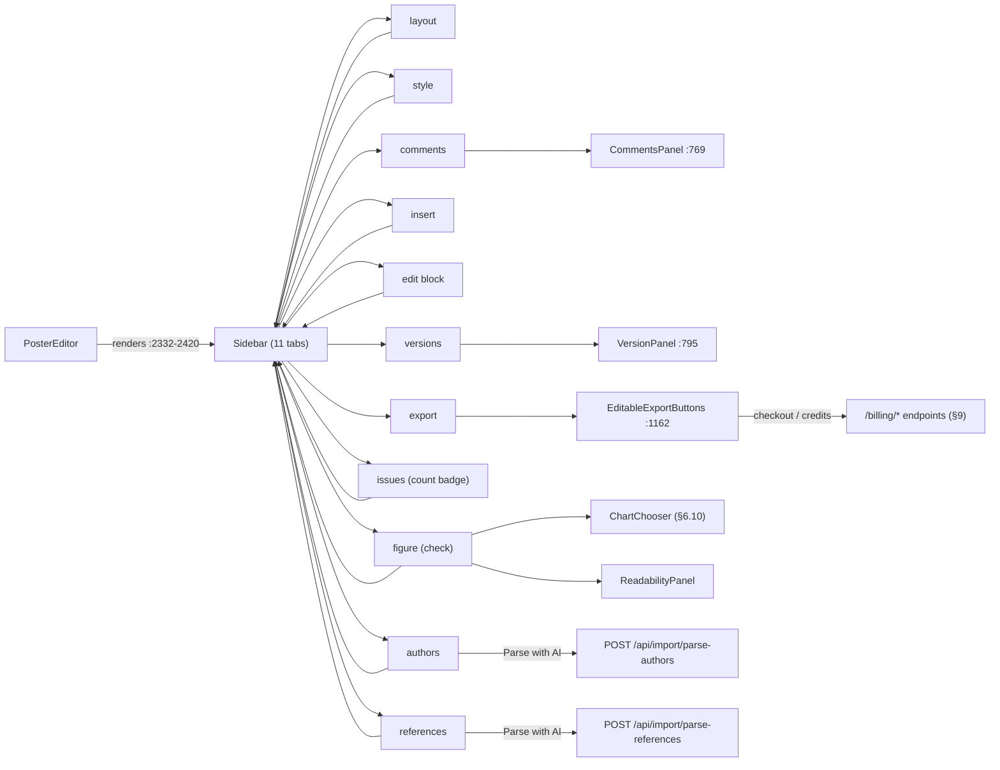

#### `poster/CommentsPanel.tsx` — review-thread UI: doc/block/text/area-anchored comment threads with replies, resolve, delete, share-link copy (owner), guest display name

Mounted from: imported `Sidebar.tsx:56`, rendered `Sidebar.tsx:768-782` under `tab === 'comments'` (`isOwner` hardcoded `true` at `Sidebar.tsx:780`). Guests reach it via `pages/Share.tsx` → `PosterEditor`. Talks to canvas via window events (`postr:comment-area`, `postr:cancel-area-comment`, `postr:comment-edit-anchor`, `postr:comment-hover/focus/blur`).

**Elements**
- [ ] `▭ Comment on area` / active: `▣ Drag a rectangle on the canvas` — toggle button (`aria-pressed`) — `CommentsPanel.tsx:170-196` — dispatches `postr:start-area-comment` / `postr:cancel-area-comment` window events (canvas area-drag mode); hidden while `pendingAnchor` set
- [ ] `🔗 Copy share link` / `…` (loading) / `✓ Link copied` — button, owner-only — `CommentsPanel.tsx:309-334` — `ensureShareLink(posterId)` API (`data/posters`) then `navigator.clipboard.writeText(<origin>/s/<slug>)`; auto-resets after 2400ms
- [ ] Display name input — text input, `maxLength=60` — `CommentsPanel.tsx:352-361` — sets `name` state + `writeGuestName` (localStorage)
- [ ] `×` — anchor-preview clear button — `CommentsPanel.tsx:398-400` — `onClearPendingAnchor` prop
- [ ] Comment draft textarea (3 rows) — `CommentsPanel.tsx:422-438` — keyboard shortcut **Cmd/Ctrl+Enter** submits (`:425-430`)
- [ ] `Post comment` / `Posting…` — primary button — `CommentsPanel.tsx:440-447` — `state.addComment(...)` (useComments → API)
- [ ] `Show resolved` — checkbox — `CommentsPanel.tsx:228-233` — toggles `showResolved` filter
- [ ] Reply input (per thread) — `CommentsPanel.tsx:575-586` — keyboard shortcut **Enter** (without Shift) submits (`:578-583`)
- [ ] `Reply` — secondary button, disabled while replying/empty — `CommentsPanel.tsx:587-594` — `state.addComment` with `parentId`
- [ ] `Mark resolved` / `Reopen` — link-style button, owner-or-author only — `CommentsPanel.tsx:600-606` — `state.resolveComment(root.id, !resolved)`
- [ ] Anchor jump chip `📝 "{quote}"` / `▭ area` / `◧ block` with `title="Jump to anchor"` — button — `CommentsPanel.tsx:668-676` — `onJump(c)` → `onJumpToAnchor` prop → `Sidebar.tsx:773-779` → `onJumpToBlock`
- [ ] Thread card body — clickable region — `CommentsPanel.tsx:516-524` — hover dispatches `postr:comment-hover/blur`, click dispatches `postr:comment-focus` (canvas highlight); ignores clicks from INPUT/TEXTAREA/BUTTON
- [ ] Edit-mode textarea (per comment) — `CommentsPanel.tsx:680-685`
- [ ] `Save` — button — `CommentsPanel.tsx:687-694` — `onEdit(draft)` → `state.editComment`
- [ ] `Cancel` — link button — `CommentsPanel.tsx:695-704` — exits edit mode, resets draft
- [ ] `Edit` — link button (canEdit only) — `CommentsPanel.tsx:731-733`
- [ ] `Delete` — link button (canDelete only) — `CommentsPanel.tsx:736-742` — opens ConfirmModal
- [ ] Delete-comment ConfirmModal — modal — `CommentsPanel.tsx:746-758` — `danger`, `state.removeComment` on confirm
- [ ] Keyboard shortcut **Escape** cancels area mode (handled in PosterEditor, surfaced here via `postr:cancel-area-comment` listener `:66-74`)

**Copy**
- [ ] "Save your poster first — comments are attached to a specific poster." — empty state (no posterId) — `CommentsPanel.tsx:157-160`
- [ ] "Enter a display name first." — validation error — `CommentsPanel.tsx:131`
- [ ] "Write something before posting." — validation error — `CommentsPanel.tsx:135`
- [ ] "Display name" — field label — `CommentsPanel.tsx:351`
- [ ] "Your name (shown next to your comments)" — input placeholder — `CommentsPanel.tsx:358`
- [ ] "Commenting on: {label}" where label = `"{quote up to 60 chars}"` | "highlighted text" | `Area {W}×{H} in` | "Block" — anchor preview text — `CommentsPanel.tsx:374-379, 395-396`
- [ ] "What should change about this spot?" — draft placeholder (pending anchor) — `CommentsPanel.tsx:433`
- [ ] "Add a note about the poster (or highlight text / drag an area on the canvas to pin feedback)" — draft placeholder (no anchor) — `CommentsPanel.tsx:434`
- [ ] "{n} thread{s}" — thread counter — `CommentsPanel.tsx:225`
- [ ] "Couldn't load comments: {error}" — load error — `CommentsPanel.tsx:238`
- [ ] "Loading…" — loading state — `CommentsPanel.tsx:242`
- [ ] "No comments yet. Highlight text or drag a rectangle on the canvas to anchor feedback to a specific spot." — empty state — `CommentsPanel.tsx:248`
- [ ] "All threads resolved. Toggle "Show resolved" to review them." — empty-filtered state — `CommentsPanel.tsx:249`
- [ ] "Enter a display name above to reply." — reply validation error — `CommentsPanel.tsx:480`
- [ ] "Reply…" — reply input placeholder — `CommentsPanel.tsx:584`
- [ ] "just now" / "{m}m ago" / "{h}h ago" / "{d}d ago" / locale date — relative timestamps — `CommentsPanel.tsx:767-773`
- [ ] `📝 "{quote up to 40 chars}"` / `text` fallback / `▭ area` / `◧ block` — anchor chip labels — `CommentsPanel.tsx:643-650`
- [ ] "Delete comment?" — modal title — `CommentsPanel.tsx:748`
- [ ] "This will permanently remove the comment and any replies. This can't be undone." — modal message — `CommentsPanel.tsx:749`
- [ ] "Delete" / "Cancel" — modal button labels — `CommentsPanel.tsx:750-751`
- [ ] Share-link error: raw `{errMsg}` — inline error text — `CommentsPanel.tsx:336`
- [ ] Author name + `{formatRelative(createdAt)}` — per-comment meta line — `CommentsPanel.tsx:663-666`

**Graphics**
- [ ] 🔗 emoji — icon-in-label — `CommentsPanel.tsx:333` — share link button
- [ ] ✓ glyph — `CommentsPanel.tsx:333` — copied state of share button
- [ ] ▭ / ▣ glyphs — `CommentsPanel.tsx:195` — area-mode toggle button
- [ ] × glyph — `CommentsPanel.tsx:399` — anchor preview clear button
- [ ] 📝 emoji — `CommentsPanel.tsx:645` — text-anchor chip
- [ ] ▭ and ◧ glyphs — `CommentsPanel.tsx:647, 649` — area/block anchor chips

#### `poster/ReadabilityPanel.tsx` — "Check a figure" tab: paste R/Python plotting code → readability-at-print-size table + auto-fix snippet; optional Claude-Vision OCR scan of a selected image block

Mounted from: imported `sidebar/FigureTab.tsx:20`, rendered `FigureTab.tsx:122-126` when `mode === 'check'`; `FigureTab` rendered at `Sidebar.tsx:743-758` under `tab === 'check'`.

**Elements**
- [ ] `Auto` / `R` / `Python` — language segment buttons (3) — `ReadabilityPanel.tsx:630-644` — sets `lang` state
- [ ] Code textarea (line-numbered CodeEditor) — `ReadabilityPanel.tsx:236-259` — keyboard: **Tab** inserts two spaces (`:180-194`); scroll syncs number gutter (`:174-178`)
- [ ] `▶ Check` — primary button, disabled when code empty — `ReadabilityPanel.tsx:670-681` — `runCheck` → local `parseRCode`/`parsePythonCode`/`computeReadability`
- [ ] `Copy snippet` / `✓ Copied` — CopyButton — `ReadabilityPanel.tsx:801-805` (component def `:282-304`) — clipboard write, 2400ms feedback, opens copied banner
- [ ] `Open full edited code →` — button — `ReadabilityPanel.tsx:811-821` — opens FullCodeModal
- [ ] FullCodeModal — modal — `ReadabilityPanel.tsx:385-450` — backdrop click closes (`:387`), **Escape** closes (`:374-381`)
- [ ] `×` (`title="Close (Esc)"`) — modal close button — `ReadabilityPanel.tsx:422-433`
- [ ] `Copy full code` / `✓ Copied` — CopyButton inside modal — `ReadabilityPanel.tsx:447`
- [ ] Copied-to-clipboard banner — toast/status (`role="status" aria-live="polite"`, auto-dismiss 3s) — `ReadabilityPanel.tsx:684-701`
- [ ] `🔎 Scan image` / `Scanning…` — button (image block selected only) — `ReadabilityPanel.tsx:939-950` — API `POST /api/import/extract` (mode `measure-text`) via `postJson` (`:542-559`)
- [ ] `Clear` — button (after scan result) — `ReadabilityPanel.tsx:952-955` — resets scan state

**Copy**
- [ ] "Code Readability Check" — section label — `ReadabilityPanel.tsx:583`
- [ ] "🔎 Paste your R or Python plotting code, then click **Check** to see if figure text will be readable at poster print size." — intro paragraph — `ReadabilityPanel.tsx:596-597`
- [ ] `Using selected image block {W}" × {H}".` — intro variant (image selected) — `ReadabilityPanel.tsx:599-613`
- [ ] `Sizing against the gray figure preview on the canvas {W}" × {H}" — drag or resize it to match your real figure, or click an existing image block to use its exact dimensions.` — intro variant (no image) — `ReadabilityPanel.tsx:615-625`
- [ ] "# Paste your ggplot / matplotlib code here..." — editor placeholder — `ReadabilityPanel.tsx:650`
- [ ] "Detected: R / ggplot2" / "Detected: Python / matplotlib" — detection status — `ReadabilityPanel.tsx:663`
- [ ] "Auto-detect waiting for code…" — detection idle status — `ReadabilityPanel.tsx:667`
- [ ] "✓ Copied to clipboard — paste it into your editor, re-run, and re-upload the image." — banner text — `ReadabilityPanel.tsx:698-699`
- [ ] "{warning}" rows prefixed with ⚠ — dynamic warnings from `computeReadability` — `ReadabilityPanel.tsx:705-717`
- [ ] "Scale factor: {x.xx}x" + " (default block size)" suffix when no image — `ReadabilityPanel.tsx:720-721`
- [ ] "Element" / "Source" / "Print" / "Min" — results table headers — `ReadabilityPanel.tsx:727-731`
- [ ] "{n}pt" ×3 per row — source/effective/min point cells — `ReadabilityPanel.tsx:745, 760, 769`
- [ ] "Recommended fix (base_size = {n}):" — fix section label — `ReadabilityPanel.tsx:799`
- [ ] "All elements pass readability thresholds at this poster size." — all-pass success box — `ReadabilityPanel.tsx:835`
- [ ] "Full edited code" — modal header — `ReadabilityPanel.tsx:421`
- [ ] "📷 Scan Image Text" — scan section label — `ReadabilityPanel.tsx:931`
- [ ] "Use Claude Vision to measure every text region in this image and compute its effective print size at the block's current dimensions. Useful for plots and tables you imported from a PDF or JPG and don't have the source code for." — scan explainer — `ReadabilityPanel.tsx:932-937`
- [ ] "{p} pass · {w} warn · {f} fail · {t} total" — scan summary — `ReadabilityPanel.tsx:958-959`
- [ ] "{error message}" (e.g. "Could not resolve image URL.", "Scan failed.") — scan error line — `ReadabilityPanel.tsx:567, 541, 963-967`
- [ ] "Status" / "Role" / "Text" / "Effective pt" / "Min" — scan table headers — `ReadabilityPanel.tsx:981-985`
- [ ] "{role}", "{region text}", "{effectivePt}", "{minPt}" — scan table row cells — `ReadabilityPanel.tsx:994-1003`

**Graphics**
- [ ] 🔎 emoji — `ReadabilityPanel.tsx:596` — intro paragraph
- [ ] Animated dimension pill (`.postr-dimension-pill` span) — `ReadabilityPanel.tsx:608, 618-621` — inline in intro
- [ ] ⚠ warning glyph — `ReadabilityPanel.tsx:715` — warning rows
- [ ] ✓ / ⚠ / ✗ status glyphs — `ReadabilityPanel.tsx:772` — code results table status column
- [ ] ▶ glyph — `ReadabilityPanel.tsx:680` — Check button label
- [ ] ✓ glyph — `ReadabilityPanel.tsx:698` — copied banner
- [ ] ✓ Copied state glyph — `ReadabilityPanel.tsx:302` — CopyButton feedback
- [ ] 📷 emoji — `ReadabilityPanel.tsx:931` — scan section label
- [ ] 🔎 emoji — `ReadabilityPanel.tsx:949` — scan button label
- [ ] ✓ / ! / ✗ status glyphs — `ReadabilityPanel.tsx:992` — scan table status column
- [ ] Line-number gutters (aria-hidden, decorative) — `ReadabilityPanel.tsx:214-235` (editor), `:324-343` (CodeView)

#### `poster/Sidebar.tsx` — 11-tab editor control panel: tab rail + per-tab panels (layout/style/authors/insert/edit/refs/figure/issues/comments/versions/export)

**Elements**

*Chrome (always visible)*
- [ ] `Hide sidebar` (aria-label, title `Hide sidebar (⌘/)`) — button — `Sidebar.tsx:441-487` — calls `props.onToggleSidebar` (collapses sidebar; keyboard shortcut ⌘/ advertised in title)
- [ ] logo link (no label; contains logo SVG + "Postr") — link — `Sidebar.tsx:488-496` — navigates to `/dashboard` (plain href, full page load)
- [ ] `Back to My Posters` (title `Back to My Posters`) — link — `Sidebar.tsx:505-536` — navigates to `/dashboard`
- [ ] `Duplicate` (title `Duplicate this poster`) — button — `Sidebar.tsx:538-571` — calls `props.onDuplicatePoster` (owner runs confirm-and-navigate); hidden when `readOnly` or no handler
- [ ] `layout` — tab-rail button — `Sidebar.tsx:610` (rendered `:626-656`) — switches to Layout tab via `onChangeTab`
- [ ] `style` — tab-rail button — `Sidebar.tsx:611` — switches to Style tab
- [ ] `authors` — tab-rail button — `Sidebar.tsx:612` — switches to Authors tab
- [ ] `insert` — tab-rail button — `Sidebar.tsx:613` — switches to Insert tab
- [ ] `edit block` — tab-rail button (key `edit`) — `Sidebar.tsx:614` — switches to Edit tab
- [ ] `references` — tab-rail button (key `refs`) — `Sidebar.tsx:615` — switches to Refs tab
- [ ] `figure` — tab-rail button (key `check`) — `Sidebar.tsx:616` — switches to Figure tab
- [ ] `issues` — tab-rail button — `Sidebar.tsx:617` — switches to Issues tab; shows count badge (below)
- [ ] `comments` — tab-rail button — `Sidebar.tsx:618` — switches to Comments tab (only tab shown in `readOnly` mode, `:607-608`)
- [ ] `versions` — tab-rail button — `Sidebar.tsx:619` — switches to Versions tab
- [ ] `export` — tab-rail button — `Sidebar.tsx:620` — switches to Export tab
- [ ] issue-count badge `{issueCount}` (non-interactive span inside issues tab button) — `Sidebar.tsx:634-654` — red bg if errors else yellow

*Layout tab (`LayoutTab`, :822-1098)*
- [ ] poster-name input (placeholder `e.g. Smith Lab — APA 2026`) — text input — `Sidebar.tsx:867-878` — local state; Enter commits via `saveTitle` → `onChangePosterTitle`; border turns red when empty / amber when dirty
- [ ] `Save` / `✓ Saved` — button — `Sidebar.tsx:879-897` — commits poster title; disabled when blank; green flash state
- [ ] poster-size select — select — `Sidebar.tsx:916-930` — options from `POSTER_SIZES` (see Copy below) + `Custom Size`; calls `onChangePosterSize` ('custom' option is display-only, no handler call)
- [ ] width input — number input (min 10, max 100, step 0.1) — `Sidebar.tsx:934-945` — calls `onChangeCustomSize(w, h)`
- [ ] height input — number input (min 10, max 100, step 0.1) — `Sidebar.tsx:950-961` — calls `onChangeCustomSize(w, h)`
- [ ] `⬡ Auto-Arrange` — button — `Sidebar.tsx:966-1008` — calls `onAutoLayout`
- [ ] template button `3-Column Classic` — button — `Sidebar.tsx:1031-1050` (data `templates.ts:43-44`) — calls `onApplyTemplate('3col')`-style key
- [ ] template button `2-Col Wide Figure` — button — `Sidebar.tsx:1031-1050` (data `templates.ts:87-88`) — calls `onApplyTemplate`
- [ ] template button `Billboard` — button — `Sidebar.tsx:1031-1050` (data `templates.ts:110-111`) — calls `onApplyTemplate`
- [ ] template button `Sidebar + Focus` — button — `Sidebar.tsx:1031-1050` (data `templates.ts:132-133`) — calls `onApplyTemplate`
- [ ] template button `Blank` — button — `Sidebar.tsx:1031-1050` (data `templates.ts:161-162`) — calls `onApplyTemplate`
- [ ] `Show grid` — checkbox — `Sidebar.tsx:1056-1064` — calls `onToggleGrid`
- [ ] `Show ruler` — checkbox — `Sidebar.tsx:1065-1073` — calls `onToggleRuler`
- [ ] `ImportSection` (tile + 2 modals) — panel render site — `Sidebar.tsx:913` — see `sidebar/ImportSection.tsx` / `ImportTile.tsx`

*Export tab (`ExportTab`, :1104-1205)*
- [ ] `👁 Preview poster` — button — `Sidebar.tsx:1114-1116` — calls `onPreview`
- [ ] `⎙ Save PDF` — button (accent style) — `Sidebar.tsx:1123-1125` — calls `onPrint` (browser print → PDF)
- [ ] `EditableExportButtons` — panel render site — `Sidebar.tsx:1162` — see `sidebar/EditableExportButtons.tsx`
- [ ] `PostrExportButton` — render site — `Sidebar.tsx:1165` — see `sidebar/PostrExportButton.tsx`
- [ ] `🏪 Email to Staples kiosk` — button (red outline) — `Sidebar.tsx:1168-1177` — calls `onPrintAtStaples`
- [ ] `↗ Publish to gallery` — button — `Sidebar.tsx:1186-1195` — calls `onPublish` — **DEAD UI: inside `GALLERY_PUBLIC_ENABLED &&` (flag = false)**

*Authors tab (`AuthorsTab` :1211-1261, `InstitutionManager` :1263-1340, `AuthorManager` :1551-1891)*
- [ ] `+ Logo` — button — `Sidebar.tsx:1256-1258` — calls `onAddBlock('logo')`
- [ ] institution-name input (placeholder `University`) — text input, one per institution — `Sidebar.tsx:1293-1298` — updates institution
- [ ] `×` remove-institution — button, one per institution — `Sidebar.tsx:1299-1304` — deletes institution
- [ ] dept input (placeholder `Department`) — text input, one per institution — `Sidebar.tsx:1307-1312` — updates institution
- [ ] location input (placeholder `City`) — text input, one per institution — `Sidebar.tsx:1313-1318` — updates institution
- [ ] `+ Add Institution` — button — `Sidebar.tsx:1322-1337` — appends blank institution
- [ ] `▲` move-author-up — button, one per author (dimmed at top) — `Sidebar.tsx:1687-1692` — swaps author order
- [ ] `▼` move-author-down — button, one per author — `Sidebar.tsx:1693-1703` — swaps author order
- [ ] author-name input (placeholder `Author name`) — text input, one per author — `Sidebar.tsx:1705-1710` — updates author
- [ ] `×` remove-author — button, one per author — `Sidebar.tsx:1711-1716` — deletes author
- [ ] affiliation chip (`{idx+1}` + `{inst.name || '?'}`) — toggle button, one per institution per author — `Sidebar.tsx:1723-1750` — toggles id in `affiliationIds`
- [ ] `Corresponding` — checkbox, one per author — `Sidebar.tsx:1756-1764` — sets `isCorresponding`
- [ ] `Equal contrib.` — checkbox, one per author — `Sidebar.tsx:1765-1773` — sets `equalContrib`
- [ ] `+ Add Author` — button — `Sidebar.tsx:1777-1792` — appends blank author
- [ ] bulk-paste textarea — textarea — `Sidebar.tsx:1821-1836` — local `pasteText` state
- [ ] `✨ Parse with AI` / `✨ Parsing…` — button — `Sidebar.tsx:1854-1877` — calls API `POST /api/import/parse-authors` (`:1365`) with regex-parser fallback (`parseAuthorBlock`); disabled when empty/parsing

*Refs tab (`RefsTab`, :1897-2201)*
- [ ] `Import .bib / .ris / .enw` — button — `Sidebar.tsx:2017-2037` — clicks hidden file input; parses via `parseBibtex`/`parseRis`, appends references
- [ ] hidden file input (accept `.bib,.bibtex,.ris,.enw`) — file input — `Sidebar.tsx:2038` — **`.enw` is accept-listed but has no parser (§10)**
- [ ] citation-style select — select — `Sidebar.tsx:2044-2054` — options `APA 7`, `Vancouver`, `IEEE`, `Harvard` (keys of `CITATION_STYLES`, `citations.ts:45,64-101`); calls `onChangeCitationStyle`
- [ ] `×` (aria-label `Remove reference`) — button, one per reference — `Sidebar.tsx:2078-2085` — deletes reference
- [ ] paste-references textarea — textarea — `Sidebar.tsx:2099-2116` — local `pasteText`
- [ ] `✨ Parse with AI` / `✨ Parsing…` — button — `Sidebar.tsx:2118-2138` — calls API `POST /api/import/parse-references` (`:1416`) with line-splitter fallback
- [ ] manual authors input (placeholder `Authors (Last, F., comma-separated)`) — text input — `Sidebar.tsx:2153-2158`
- [ ] manual year input (placeholder `Year`) — text input — `Sidebar.tsx:2160-2165`
- [ ] manual journal input (placeholder `Journal`) — text input — `Sidebar.tsx:2166-2171`
- [ ] manual title input (placeholder `Title`) — text input — `Sidebar.tsx:2173-2178`
- [ ] `+ Add Reference` — button — `Sidebar.tsx:2179-2197` — appends manual reference (no-op if title blank)

*Style tab (`StyleTab` :2207-2527, `StyleEditor` :2529-2629, `HeadingEditor` :2631-2696)*
- [ ] `🎨 Copy a design` — button — `Sidebar.tsx:2361-2380` — opens `CopyDesignModal`
- [ ] `CopyDesignModal` — modal — `Sidebar.tsx:2393-2396` — external component; open/close via local state
- [ ] palette row button (4 swatches + `{p.name}`) — button, one per palette (8 built-in + custom) — `Sidebar.tsx:2252-2323` — calls `onChangePalette(palette, name)`
- [ ] `✏️` (title `Edit palette`) — button, custom palettes only — `Sidebar.tsx:2326-2336` — calls `onEditCustomPalette(name)`
- [ ] `🗑️` (title `Delete palette`) — button, custom palettes only — `Sidebar.tsx:2337-2351` — `confirm()` dialog then `onDeleteCustomPalette(name)`
- [ ] `➕ Create custom palette` — button — `Sidebar.tsx:2419-2437` — calls `onCreateCustomPalette`
- [ ] font select — select with `Sans`/`Serif` optgroups — `Sidebar.tsx:2453-2472` — options = 10 `FONTS` keys (`constants.ts:110-121`); calls `onChangeFont`
- [ ] size number input (title `Font size (points)`, min 12, max 200, step 2) — number input, one per level ×4 (Title/Heading/Authors/Body) — `Sidebar.tsx:2559-2569` — updates `styles[level].size` (pt ↔ units)
- [ ] weight select — select, one per level ×4 — `Sidebar.tsx:2572-2582` — options `300,400,500,600,700,800` (`FONT_WEIGHTS`, `constants.ts:216`)
- [ ] `I` italic toggle (aria-pressed) — button, one per level ×4 — `Sidebar.tsx:2583-2607` — toggles `styles[level].italic`
- [ ] line-height input (title `Line height (1.0–3.0)`, min 1, max 3, step 0.05) — number input, one per level ×4 — `Sidebar.tsx:2610-2622`
- [ ] `None` / `Bottom` / `Left` / `Box` / `Thick` — heading-border pill buttons ×5 — `Sidebar.tsx:2661-2665` (factory `:2648-2652`) — sets `headingStyle.border`
- [ ] `left` / `center` — heading-align pill buttons ×2 — `Sidebar.tsx:2673-2682` — sets `headingStyle.align`
- [ ] `Fill` — checkbox — `Sidebar.tsx:2683-2691` — sets `headingStyle.fill`
- [ ] preset-name input (placeholder `e.g. Smith Lab Green`) — text input — `Sidebar.tsx:2485-2490`
- [ ] `💾 Save` / `✓ Saved!` — button — `Sidebar.tsx:2491-2509` — calls `onSavePreset(name)`; green flash ~1.6 s
- [ ] saved-preset button `{p.name}` — button, one per saved preset — `Sidebar.tsx:2513-2522` — calls `onLoadPreset(p)`

*Edit tab (`EditTab` :2702-2784 + sub-editors)*
- [ ] `💡 Tips for editing tables` — `
/
` disclosure — `Sidebar.tsx:2797-2828` — native expand/collapse
- [ ] `Stretch to fit block` — checkbox (`ImageFitToggle`) — `Sidebar.tsx:2895-2904` — sets `imageFit` `fill`/`contain` on image/logo blocks
- [ ] caption input (placeholder `{figure|table} description…`) — text input (`CaptionEditor`) — `Sidebar.tsx:3000-3008` — sets `block.caption`
- [ ] `Top` / `Bottom` / `Left` / `Right` / `Hide` — caption-position buttons ×5 — `Sidebar.tsx:3017-3039` (data `:2981-2990`) — sets `captionPosition`
- [ ] caption-spacing slider (0–24 px) — range input — `Sidebar.tsx:3062-3074` — sets `captionGap`; only when position ≠ `none`
- [ ] `✨ Format {table|note}` / `✓ Formatted {table|note}` / `✓ {Table|Note} formatted` — button — `Sidebar.tsx:3092-3126` — runs `autoFormatAPA` over caption+note+cells via `onUpdateBlock`; pulses; disabled when clean
- [ ] note textarea (placeholder `Error bars show 95% CI. **p** < .01.` for figures, `*Note.* *p* < .05. SD in parentheses.` for tables) — textarea — `Sidebar.tsx:3127-3143` — sets `block.note`
- [ ] `−` (title `Remove last row`) — button — `Sidebar.tsx:3377-3384` — `deleteRowAt`; disabled at 1 row
- [ ] `+` (title `Add row at bottom`) — button — `Sidebar.tsx:3388-3394` — `insertRow`
- [ ] `−` (title `Remove last column`) — button — `Sidebar.tsx:3401-3408` — `deleteColAt`; disabled at 1 col
- [ ] `+` (title `Add column at right`) — button — `Sidebar.tsx:3412-3418` — `insertCol`
- [ ] border-preset buttons `None`, `APA 3-Line`, `All Lines`, `H-Lines`, `Header Box` — buttons ×5 — `Sidebar.tsx:3443-3464` (data `constants.ts:250-256`) — `setBorderPreset`
- [ ] `Custom` — border-preset button — `Sidebar.tsx:3465-3487` — switches to `borderPreset: 'custom'`
- [ ] outer-edge hit zones ×4 (aria/title `Add/Remove top edge line` `:3682`, `bottom` `:3687`, `left` `:3692`, `right` `:3697`) — transparent overlay buttons — `Sidebar.tsx:3679-3698` — toggles `topLine/bottomLine/leftLine/rightLine`
- [ ] header-row-box hit zone (title `Add/Remove header row box`) — overlay button — `Sidebar.tsx:3701-3711` — toggles `headerBox`
- [ ] header-separator hit zone (title `Add/Remove header separator`) — overlay button — `Sidebar.tsx:3714-3724` — toggles `headerLine`
- [ ] inner-horizontal hit zones (title `Add/Remove line between row {i+2} and row {i+3}`) — overlay buttons, one per inner row gap — `Sidebar.tsx:3731-3750` — toggles `innerH[i]`
- [ ] inner-vertical hit zones (title `Add/Remove line between col {i+1} and col {i+2}`) — overlay buttons, one per inner col gap — `Sidebar.tsx:3753-3770` — toggles `innerV[i]`
- [ ] `All borders` — bulk-preset button — `Sidebar.tsx:3785-3787` — `applyBulkPreset('all')`
- [ ] `No borders` — bulk-preset button — `Sidebar.tsx:3788-3790`
- [ ] `Outer only` — bulk-preset button — `Sidebar.tsx:3791-3793`
- [ ] `Inner only` — bulk-preset button — `Sidebar.tsx:3794-3796`
- [ ] `Horizontal only` — bulk-preset button — `Sidebar.tsx:3797-3799`
- [ ] `Vertical only` — bulk-preset button — `Sidebar.tsx:3800-3802`
- [ ] `APA 3-line` — bulk-preset button — `Sidebar.tsx:3803-3805`
- [ ] `RichTextEditor` content editor (placeholder `Type here… (type / for symbols)`) — rich-text editor (`TextBlockEditor`) — `Sidebar.tsx:3881-3888` — sets `block.content`
- [ ] `DockedFormatToolbar` — toolbar render site — `Sidebar.tsx:3865` — external component
- [ ] `FloatingFormatToolbar` — toolbar render site (selection-dependent) — `Sidebar.tsx:3890`
- [ ] font-size input (title `Font size (points)`) — number input — `Sidebar.tsx:3898-3913` — updates style-level size
- [ ] weight select — select — `Sidebar.tsx:3916-3932` — options `FONT_WEIGHTS`
- [ ] `I` (title `Italic`, aria-pressed) — button — `Sidebar.tsx:3933-3958` — toggles style-level italic
- [ ] line-spacing slider (1–3, step 0.05) — range input — `Sidebar.tsx:3967-3975`
- [ ] line-spacing number (title `Line height (1.0–3.0)`) — number input — `Sidebar.tsx:3976-3994`
- [ ] text-color picker — color input — `Sidebar.tsx:4002-4015` — sets style-level color
- [ ] `Reset to palette` — button — `Sidebar.tsx:4016-4032` — sets color to `null`

*Insert tab (`AddBlockPanel`, :4053-4129)*
- [ ] `+ Heading` — button — `Sidebar.tsx:4077-4105` (data `:4062`) — calls `onAddBlock('heading')`
- [ ] `+ Text` — button — `Sidebar.tsx:4077-4105` (data `:4063`) — `onAddBlock('text')`
- [ ] `+ Image` — button — `Sidebar.tsx:4077-4105` (data `:4064`) — `onAddBlock('image')`
- [ ] `+ Chart` — button — `Sidebar.tsx:4077-4105` (data `:4065`) — routes to Figure tab Make mode via `onOpenChartChooser` (sets `figureMode='make'`, tab `check`, `:787-790`)
- [ ] `+ Table` — button — `Sidebar.tsx:4077-4105` (data `:4066`) — `onAddBlock('table')`
- [ ] `+ References` — button — `Sidebar.tsx:4077-4105` (data `:4067`) — `onAddBlock('references')`
- [ ] `+ Logo` — button — `Sidebar.tsx:4077-4105` (data `:4068`) — `onAddBlock('logo')`

*Issues tab (`IssuesTab`, :4135-4263)*
- [ ] issue card button (shows `{issue.category}` + `{issue.message}`) — button, one per issue — `Sidebar.tsx:4193-4243` — calls `onJumpToBlock(issue.blockId)` when a blockId exists (else non-clickable)

**Copy** (`poster/Sidebar.tsx`)
- [ ] "Postr" — wordmark text in logo link — `Sidebar.tsx:495`
- [ ] "Poster Name" — section label — `Sidebar.tsx:865`
- [ ] "A poster name is required for dashboard identification." — validation error — `Sidebar.tsx:901`
- [ ] "Dashboard label — separate from the poster's main title on the canvas." — helper — `Sidebar.tsx:905`
- [ ] "Name your poster for the dashboard. Try: presenter, event, date (e.g. \"Smith Lab — APA 2026\")." — dynamic tip (empty title) — `Sidebar.tsx:856`
- [ ] "Tip: Add the conference name or date for quick identification (e.g. \"Smith Lab — SfN Nov 2026\")." — dynamic tip (<10 chars) — `Sidebar.tsx:858`
- [ ] "Consider shortening — this name is for the dashboard, not the poster itself." — dynamic tip (>80 chars) — `Sidebar.tsx:860`
- [ ] "Poster Size" — section label — `Sidebar.tsx:915`
- [ ] `48"×36" Landscape`, `36"×48" Portrait`, `42"×36" Landscape`, `36"×42" Portrait`, `42"×42" Square`, `24"×36" Small`, `A0 Landscape`, `A0 Portrait` — size `<option>` labels (`POSTER_SIZES`, `constants.ts:80-89`, rendered `Sidebar.tsx:924-928`)
- [ ] "Custom Size" — select option — `Sidebar.tsx:929`
- [ ] "Width (in)" — field label — `Sidebar.tsx:933`
- [ ] "×" — dimension separator — `Sidebar.tsx:947`
- [ ] "Height (in)" — field label — `Sidebar.tsx:949`
- [ ] "Auto Layout" — section label — `Sidebar.tsx:965`
- [ ] "Tidy existing blocks into an even grid — measures each text block's actual content height so short sections don't leave empty space. Great after dragging things around or after editing a lot of text." — helper — `Sidebar.tsx:1009-1013`
- [ ] "Templates" — section label — `Sidebar.tsx:1015`
- [ ] "Pick a starting column layout. Apply anytime — blocks rearrange without losing their content." — helper — `Sidebar.tsx:1024-1025`
- [ ] template descriptions: "Traditional conference layout." / "Full-width figure zone." / "Award-winning assertion-evidence." / "Narrow text, wide visuals." / "Title + authors only." — template-button subtext (`templates.ts:44,88,111,133,162`, rendered `Sidebar.tsx:1049`)
- [ ] "📐 Canvas overlays" — section label — `Sidebar.tsx:1055`
- [ ] "Visual aids only — they never print or export." — helper — `Sidebar.tsx:1075`
- [ ] "💡 Done building? Head to the Export tab to preview, save PDF, or print at Staples." — footer tip (active branch; gallery branch adds "publish to the gallery", dead while flag=false) — `Sidebar.tsx:1090-1094`
- [ ] "Preview" — section label — `Sidebar.tsx:1113`
- [ ] "See the poster at full size without the editor chrome. Great for a final sanity check before exporting." — helper — `Sidebar.tsx:1117-1120`
- [ ] "Save as PDF" — section label — `Sidebar.tsx:1122`
- [ ] "🖨️ Browser Print dialog steps:" — info-box heading — `Sidebar.tsx:1138`
- [ ] "Click \"Save PDF\" or press Ctrl+P / Cmd+P" — list item — `Sidebar.tsx:1140`
- [ ] "Destination = \"Save as PDF\"" — list item — `Sidebar.tsx:1141-1144`
- [ ] "Layout = Landscape (for landscape posters)" — list item — `Sidebar.tsx:1145-1149`
- [ ] "Margins = None" — list item — `Sidebar.tsx:1150-1152`
- [ ] "Enable \"Background graphics\"" — list item — `Sidebar.tsx:1153-1156`
- [ ] "Click Save" — list item — `Sidebar.tsx:1157`
- [ ] "✎ Editable formats" — section label — `Sidebar.tsx:1161`
- [ ] "📦 Lossless backup" — section label — `Sidebar.tsx:1164`
- [ ] "🏪 Print at Staples" — section label — `Sidebar.tsx:1167`
- [ ] "Staples' Print & Go flow — email the PDF, get an 8-digit release code, print at any Staples kiosk without a USB drive." — helper — `Sidebar.tsx:1178-1181`
- [ ] "↗ Share to gallery" — section label — **DEAD (flag false)** — `Sidebar.tsx:1185`
- [ ] "Publish to the public gallery at /gallery. You can retract at any time from your Profile → Gallery submissions." — helper — **DEAD (flag false)** — `Sidebar.tsx:1196-1200`
- [ ] "① Institutions" — section label — `Sidebar.tsx:1223`
- [ ] "② Authors" — section label — `Sidebar.tsx:1226`
- [ ] "Preview" — card heading (author line preview) — `Sidebar.tsx:1244`
- [ ] "Logos" — section label — `Sidebar.tsx:1255`
- [ ] "Paste author list" — card heading — `Sidebar.tsx:1819`
- [ ] "John Smith¹, Jane Doe¹,², (1) Acme State University, (2) Sample Research Institute\n\nWe parse:\n· author names — split on , ; / and / &\n· (N) institution names from the byline\n· trailing 1,2 superscripts → linked affiliations" — textarea placeholder — `Sidebar.tsx:1824-1826`
- [ ] "Paste an author list first." — feedback message — `Sidebar.tsx:1603`
- [ ] "Parsing with AI…" — feedback message — `Sidebar.tsx:1608`
- [ ] "No authors detected. Try cleaning up the formatting." — feedback message — `Sidebar.tsx:1624`
- [ ] "✓ Added {n} author{s} · {n} institution{s} · {n} linked to affiliations." — success feedback (parts joined) — `Sidebar.tsx:1665-1677`
- [ ] "AI-assisted parsing handles messy bylines — Unicode superscripts, mixed scripts, footnote markers, range affiliations (1-3), parenthesised nicknames. Detects a trailing (1) X, (2) Y institution list, creates the institutions, and links each author's 1,2 markers automatically. Falls back to the offline regex parser if the API is unreachable." — explainer — `Sidebar.tsx:1879-1887`
- [ ] "Import" — section label — `Sidebar.tsx:2016`
- [ ] "Display" — section label — `Sidebar.tsx:2040`
- [ ] "Style" — field label — `Sidebar.tsx:2043`
- [ ] "References ({n})" — section label with count — `Sidebar.tsx:2060`
- [ ] formatted citation string per reference (from `CITATION_STYLES[style](r, i)`) — dynamic row text — `Sidebar.tsx:2075-2077`
- [ ] "Paste from Manuscript" — section label — `Sidebar.tsx:2092`
- [ ] "Already have your references formatted in a paper? Paste the whole block here — one per line, or separated by blank lines. Each entry is stored verbatim and rendered exactly as pasted, so your existing APA / Vancouver / in-house formatting is preserved." — helper paragraph — `Sidebar.tsx:2093-2098`
- [ ] "Smith, J. (2023). Example paper title. Journal of Examples, 12(3), 42–69.\nDoe, A., & Roe, B. (2024). Another paper title. Journal of Samples, 8(1), 1–14." — textarea placeholder — `Sidebar.tsx:2102-2104`
- [ ] "Paste some references first." — feedback message — `Sidebar.tsx:1932`
- [ ] "No references detected." — feedback message — `Sidebar.tsx:1954`
- [ ] "✓ Added {n} reference{s}." — success feedback — `Sidebar.tsx:1963-1965`
- [ ] "Manual Entry" — section label — `Sidebar.tsx:2151`
- [ ] "Copy a design" — section label — `Sidebar.tsx:2360`
- [ ] "Upload a poster you admire and apply its colours and font to yours. Copies the look, not the content." — helper — `Sidebar.tsx:2390-2391`
- [ ] "Palette" — section label — `Sidebar.tsx:2398`
- [ ] palette names: "Classic Academic", "Nature / Biology", "Medical / Clinical", "Engineering", "Psychology / Neuro", "Humanities / Arts", "Earth Sciences", "Clean Minimal" — palette row labels (`PALETTES`, `constants.ts:160-178`, rendered `Sidebar.tsx:2294`)
- [ ] "custom" — badge on custom palette rows — `Sidebar.tsx:2306`
- [ ] "Under {type}, \"{a}\" and \"{b}\" may look alike (ΔE {n})." — colorblind-warning tooltip (title attr) — `Sidebar.tsx:2311`
- [ ] "Your palettes" — subsection heading — `Sidebar.tsx:2414`
- [ ] "Delete custom palette \"{name}\"? This cannot be undone." — `confirm()` dialog text — `Sidebar.tsx:2342`
- [ ] "Build your own with color-theory randomizer, paste from Coolors, or extract from an image." — helper — `Sidebar.tsx:2447-2448`
- [ ] "Font" — section label — `Sidebar.tsx:2452`
- [ ] "Sans" / "Serif" — optgroup labels — `Sidebar.tsx:2454,2463`
- [ ] font option labels: "Source Sans 3", "DM Sans", "IBM Plex Sans", "Fira Sans", "Libre Franklin", "Outfit", "Charter", "Literata", "Source Serif 4", "Lora" — (`FONTS`, `constants.ts:110-121`, rendered `Sidebar.tsx:2455-2471`)
- [ ] "Typography" — section label — `Sidebar.tsx:2474`
- [ ] "Title" / "Heading" / "Authors" / "Body" — style-level headings (`levels` array `Sidebar.tsx:2530-2535`, rendered `:2556`)
- [ ] "pt" — unit suffix — `Sidebar.tsx:2570` (also `:3914`)
- [ ] "LH" — field label — `Sidebar.tsx:2609`
- [ ] "Headings" — section label — `Sidebar.tsx:2477`
- [ ] "Border" — subsection heading — `Sidebar.tsx:2658`
- [ ] "Alignment" — subsection heading — `Sidebar.tsx:2670`
- [ ] "🎨 Save as style preset" — section label — `Sidebar.tsx:2480`
- [ ] "Name your current font + palette + typography combo to reuse it on your next poster. Manage saved presets from your Profile → Preferences." — helper — `Sidebar.tsx:2481-2483`
- [ ] "Click a text, table, or image block on the canvas to edit it here, or switch to the Insert tab to add a new one. Open the Figure tab to build a chart from your data or check figure readability." — Edit-tab empty state — `Sidebar.tsx:2773-2780`
- [ ] "✏️ Click any cell on the canvas to type directly." — tips list item — `Sidebar.tsx:2820`
- [ ] "🖱️ Click a row/column header strip to select the whole row or column." — tips list item — `Sidebar.tsx:2821`
- [ ] "📋 Paste TSV from Word, Excel, or Google Sheets into any cell — the grid auto-grows." — tips list item — `Sidebar.tsx:2822`
- [ ] "↔️ Drag column borders to resize." — tips list item — `Sidebar.tsx:2823`
- [ ] "🗑️ Select a row/column and press Delete to remove it." — tips list item — `Sidebar.tsx:2824`
- [ ] "⌨️ Tab / Shift+Tab to jump between cells." — tips list item — `Sidebar.tsx:2825`
- [ ] "✨ Type **bold**, *italic*, or M (SD)* in a cell, then click Format table in the Caption section below." — tips list item — `Sidebar.tsx:2826`
- [ ] "✂︎ Crop" — section label — `Sidebar.tsx:2844`
- [ ] "Click the ✂︎ button on the block's top toolbar to crop the image directly. Drag any edge to trim, press Enter to apply, Esc to cancel. The original is preserved — nothing is baked." — helper — `Sidebar.tsx:2845-2849`
- [ ] "Image fit" — section label — `Sidebar.tsx:2882`
- [ ] "Off (default): keep the image's aspect ratio — block padding may appear if you resize freely. On: image fills the block exactly, distorting if needed. Use when the source image has whitespace baked in that you can't crop away." — helper — `Sidebar.tsx:2909-2913`
- [ ] "{Figure|Table} Caption" — section label — `Sidebar.tsx:2994`
- [ ] "The {Figure|Table} N. number is assigned automatically from reading order — drag this block on the canvas to renumber. Just type the descriptive text below." — helper — `Sidebar.tsx:2995-2999`
- [ ] "Caption position" — field label — `Sidebar.tsx:3009`
- [ ] "Caption spacing" — field label — `Sidebar.tsx:3057`
- [ ] "{n} px" — slider value readout — `Sidebar.tsx:3058-3060`
- [ ] "{Figure|Table} Note" — section label — `Sidebar.tsx:3079`
- [ ] "Longer footnote shown directly below the {figure|table}. Just paste or type normally — clicking ✨ Format {table|note} auto-italicizes APA stat symbols (p, t, F, M, SD, N, r, df, β, χ², …) in the caption, note, and every cell." — helper — `Sidebar.tsx:3080-3088`
- [ ] "💡 Tip: after typing markers like **bold** or *p*{ in the note or in any cell}, click ✨ Format {table|note} to convert them into bold / italic / superscript on the poster. Re-click anytime — it's safe to run more than once." — tip box (light-bg callout) — `Sidebar.tsx:3144-3162`
- [ ] "Editing: table · {rows} × {cols}" — status heading — `Sidebar.tsx:3368-3370`
- [ ] "Rows" — field label — `Sidebar.tsx:3375`
- [ ] "Columns" — field label — `Sidebar.tsx:3399`
- [ ] "Border Style" — section label — `Sidebar.tsx:3441`
- [ ] "Click any edge, gridline, or header cell to toggle it — each line is independent. Solid purple = on, faint dashed = off." — mockup instructions — `Sidebar.tsx:3606-3609`
- [ ] "Showing a {R}×{C} preview of your {r}×{c} table — bulk presets below apply to every line." — big-table notice — `Sidebar.tsx:3774-3776`
- [ ] "Bulk presets" — subsection heading — `Sidebar.tsx:3781-3783`
- [ ] "Editing: {block.type}" — status heading — `Sidebar.tsx:3850-3852`
- [ ] "Content" — field label — `Sidebar.tsx:3863`
- [ ] "Font" — field label — `Sidebar.tsx:3895`
- [ ] "Line spacing" — field label — `Sidebar.tsx:3965`
- [ ] "Text color" — field label — `Sidebar.tsx:4000`
- [ ] "Add a block" — heading — `Sidebar.tsx:4073-4075`
- [ ] block descriptions: "Section title with auto-numbering" / "Paragraph with slash-command symbols" / "Figure or photo upload" / "Build a figure from your data" / "Data table with border presets" / "Auto-formatted from Refs tab" / "Institution or sponsor mark" — (`blocks` array `Sidebar.tsx:4061-4069`, rendered `:4104`)
- [ ] "✨ Slash symbols" — card heading — `Sidebar.tsx:4109-4111`
- [ ] "Inside a text block type /alpha, /beta, /leq, /pm, or stats shortcuts like /p, /SD, /df." — card body — `Sidebar.tsx:4112-4114`
- [ ] "📋 Pasting tables" — card heading — `Sidebar.tsx:4118-4120`
- [ ] "Copy a table from Word, Excel, or Google Sheets, add a table block, then paste into any cell — Postr will expand the grid and fill every cell for you. No need to retype." — card body — `Sidebar.tsx:4121-4125`
- [ ] "Issues" — section label (empty state) — `Sidebar.tsx:4147`
- [ ] "✓ No issues detected. Your poster passes all automated checks — ready to export." — empty-state banner — `Sidebar.tsx:4159-4161`
- [ ] "This tab scans for common pre-flight problems: blocks outside the canvas, missing authors or institutions, empty image blocks, very long titles, overlapping blocks, and references missing key fields. Issues refresh automatically as you edit." — empty-state explainer — `Sidebar.tsx:4162-4167`
- [ ] "Issues ({n})" — section label with count — `Sidebar.tsx:4250-4252`
- [ ] "Pre-flight checks scan for blocks outside the canvas, missing required content, empty figures, and other common problems. Click any issue to jump to the block it affects." — explainer — `Sidebar.tsx:4253-4257`
- [ ] "⛔ Errors ({n})" / "⚠ Warnings ({n})" / "ℹ Suggestions ({n})" — severity section headings — `Sidebar.tsx:4258-4260` (renderer `:4191`)
- [ ] "→ click to jump to this block" — issue-card hint — `Sidebar.tsx:4238-4240`

**Graphics** (`poster/Sidebar.tsx`)
- [ ] sidebar-collapse icon (rect + divider + left chevron) — inline-svg — `Sidebar.tsx:471-485` — inside Hide-sidebar button
- [ ] Postr logo mark (purple rounded square, two curved strokes, center dot) — inline-svg — `Sidebar.tsx:489-494` — logo link top-left
- [ ] left-arrow icon — inline-svg — `Sidebar.tsx:531-534` — "Back to My Posters" pill
- [ ] duplicate/copy icon (overlapping rects) — inline-svg — `Sidebar.tsx:566-569` — Duplicate button
- [ ] select chevron (`SELECT_ARROW`, data-URI SVG polyline) — css-background-svg — `Sidebar.tsx:257` — every styled `<select>` (size, font, citation style)
- [ ] `⬡` hexagon glyph — unicode-glyph — `Sidebar.tsx:1006` — Auto-Arrange button
- [ ] `📐` — emoji — `Sidebar.tsx:1055` — "Canvas overlays" label
- [ ] `💡` — emoji — `Sidebar.tsx:1090` — Layout-tab footer tip
- [ ] `👁` / `⎙` / `✎` / `🏪` / `↗` — glyphs in Export-tab buttons/labels — `Sidebar.tsx:1115,1124,1161,1167,1176,1185,1194`
- [ ] `🖨️` — emoji — `Sidebar.tsx:1138` — print-steps box
- [ ] `①` / `②` — unicode glyphs — `Sidebar.tsx:1223,1226` — Authors-tab labels
- [ ] institution index badge `{i+1}` (styled number chip) — css-badge — `Sidebar.tsx:1275-1292`
- [ ] `▲` / `▼` — unicode glyphs — `Sidebar.tsx:1691,1702` — author reorder buttons
- [ ] `×` remove glyphs — unicode — `Sidebar.tsx:1303,1715,2084`
- [ ] `✨` — emoji — `Sidebar.tsx:1876,2137` — Parse-with-AI buttons
- [ ] palette color swatches ×4 per palette row (bg/primary/accent/accent2 divs) — css-swatch — `Sidebar.tsx:2268-2281`
- [ ] `◐` not-colorblind-safe badge (aria-label `Not colorblind-safe`) — unicode-glyph — `Sidebar.tsx:2309-2321`
- [ ] `✏️` / `🗑️` — emoji — `Sidebar.tsx:2335,2350` — custom palette edit/delete
- [ ] `➕` / `🎨` / `💾` — emoji — `Sidebar.tsx:2436,2379,2508` — style-tab buttons
- [ ] italic `I` glyph (Georgia serif styled) — text-glyph — `Sidebar.tsx:2606,3957` — italic toggles
- [ ] `💡` table-tips + per-item emojis ✏️🖱️📋↔️🗑️⌨️✨ — emoji — `Sidebar.tsx:2817-2826`
- [ ] `✂︎` — unicode glyph — `Sidebar.tsx:2844,2846` — crop hint
- [ ] border-mockup mini-table grid (clickable line mockup) — css-rendered-diagram — `Sidebar.tsx:3611-3771` — CustomBorderMockup
- [ ] `✨` / `📋` — emoji — `Sidebar.tsx:4110,4119` — Insert-tab cards
- [ ] `⛔` / `⚠` / `ℹ` — emoji/glyphs — `Sidebar.tsx:4258-4260` — issue severity headings
- [ ] `✓` green check — unicode — `Sidebar.tsx:4159` — issues empty state

#### `poster/VersionPanel.tsx` — "Versions" sidebar tab: list named snapshots, save checkpoint, restore (non-destructive), delete

Mounted from: imported `Sidebar.tsx:64`, rendered `Sidebar.tsx:794-800` under `tab === 'versions'`; save/restore callbacks come from PosterEditor. Refetches on `postr:versions-changed` window event (`:68-73`).

**Elements**
- [ ] Version name input — text input, placeholder below, disabled when busy/at limit — `VersionPanel.tsx:152-171` — keyboard shortcut **Enter** → save (`:157-159`)
- [ ] `Save version` — primary button — `VersionPanel.tsx:172-191` — `onSaveVersion(name)` prop (PosterEditor → store/API); disabled at limit
- [ ] `Restore` — row button (per version) — `VersionPanel.tsx:249-256` — opens restore ConfirmModal
- [ ] `Delete` (aria-label `Delete version`) — row button (per version) — `VersionPanel.tsx:257-265` — opens delete ConfirmModal
- [ ] Restore ConfirmModal — modal — `VersionPanel.tsx:271-279` — `onRestoreVersion(id)` prop on confirm
- [ ] Delete ConfirmModal — modal, `danger` — `VersionPanel.tsx:281-290` — `deleteVersion(id)` API + dispatches `postr:versions-changed`
- [ ] Keyboard shortcut **Cmd/Ctrl+S** save (referenced in empty-state copy; handled in PosterEditor, not this file) — `VersionPanel.tsx:212`

**Copy**
- [ ] "Versions ({count})" — heading — `VersionPanel.tsx:141`
- [ ] "Save a checkpoint you can return to. Restoring first auto-saves your current work, so nothing is lost." — explainer paragraph — `VersionPanel.tsx:145-148`
- [ ] "Save your poster first — versions are attached to a specific poster." — empty state (no posterId) — `VersionPanel.tsx:78`
- [ ] "Optional name (e.g. Before advisor review)" — input placeholder — `VersionPanel.tsx:155`
- [ ] "You've hit the {MAX_VERSIONS_PER_POSTER}-version limit. Delete an old version to save a new one." — limit warning — `VersionPanel.tsx:196-197`
- [ ] "{n} of {MAX_VERSIONS_PER_POSTER} versions used." — near-limit warning — `VersionPanel.tsx:201`
- [ ] "Could not load versions. Try reopening this tab." — error — `VersionPanel.tsx:62`
- [ ] "Could not save this version. Please try again." — error — `VersionPanel.tsx:96`
- [ ] "Could not restore this version. Your current work is unchanged." — error — `VersionPanel.tsx:113`
- [ ] "Could not delete this version. Please try again." — error — `VersionPanel.tsx:131`
- [ ] "Loading…" — loading state — `VersionPanel.tsx:209`
- [ ] "No versions yet. Save one above, or press Cmd/Ctrl+S." — empty state — `VersionPanel.tsx:212`
- [ ] "{v.name}" or timestamp e.g. "Jul 2, 5:30 PM" — version row label (+ `title` tooltip; timestamp sub-line when named) — `VersionPanel.tsx:239-246`
- [ ] "Restore this version?" — modal title — `VersionPanel.tsx:273`
- [ ] "This replaces your current poster with the saved snapshot. Your current state is auto-saved as a version first, so you can undo this by restoring it back." — modal message — `VersionPanel.tsx:274`
- [ ] "Restore" / "Cancel" — modal labels — `VersionPanel.tsx:275-276`
- [ ] "Delete this version?" — modal title — `VersionPanel.tsx:283`
- [ ] `"{name or timestamp}" will be permanently removed. This can't be undone.` — modal message template — `VersionPanel.tsx:284`
- [ ] "Delete" / "Cancel" — modal labels — `VersionPanel.tsx:285-286`

**Graphics**: none.

#### `poster/sidebar/EditableExportButtons.tsx` — paid PowerPoint (.pptx) + LaTeX (.zip) export buttons with paywall, size-ceiling warnings, and credit spend

(Mounted in `Sidebar.tsx:1162`, under the `✎ Editable formats` label at `Sidebar.tsx:1161`. See also the cross-listing in §6.11, which has the more exact export-flow copy.)

**Elements**
- [ ] withdrawal-consent checkbox (`id="withdrawal-ack"`) — checkbox — `EditableExportButtons.tsx:263-269` — gates both buy buttons; local state (paywall only)
- [ ] `Refund terms` — link — `EditableExportButtons.tsx:273-275` — opens `/terms#refunds` in new tab
- [ ] `Get the term` — button — `EditableExportButtons.tsx:280-296` — `startCheckout('term')` → API `createCheckout` (billing) then `window.location.href = url`; guests → `stashCheckoutIntent` + navigate `/auth?plan=term`; disabled until checkbox ticked
- [ ] `Get the pack` — button — `EditableExportButtons.tsx:297-313` — `startCheckout('pack')`, same flow
- [ ] `✓ Saved` / busy `Building slides…` / `▤ PowerPoint (.pptx)` — button (`data-postr-export-pptx`) — `EditableExportButtons.tsx:335-356` — dynamic-imports `@/export/pptx/writer`, downloads `{title}.pptx`; consumes 1 export credit post-export (`consumeExportCredit` API) or `markPaidExport` on term; disabled when busy/over-112″/no plan
- [ ] `✓ Saved` / busy `Writing LaTeX…` / `⌨ LaTeX source (.zip)` — button (`data-postr-export-latex`) — `EditableExportButtons.tsx:384-402` — dynamic-imports `@/export/latex/exportLatex`, downloads `{title}-latex.zip`; same credit flow
- [ ] paywall panel (heading + copy + checkbox + 2 buy buttons + guest note) — conditional panel — `EditableExportButtons.tsx:239-326` — shown when `!plan.loading && !canExport`

**Copy**
- [ ] "Keep editing in PowerPoint or Overleaf" — paywall heading — `EditableExportButtons.tsx:250`
- [ ] "Your PDF export is free. Unlock clean PowerPoint & LaTeX with the CA$18.99 term (renews every 4 months, cancel anytime), or a CA$9.99 3-export pack whose credits never expire." — paywall body — `EditableExportButtons.tsx:253-256`
- [ ] "I want access right away and understand I lose my 14-day refund right once I take a paid export. Refund terms." — checkbox label — `EditableExportButtons.tsx:271-277`
- [ ] "You're working as a guest — you'll create a free account (or sign in with Google) first, so your purchase and posters stay yours across devices." — guest note — `EditableExportButtons.tsx:319-323`
- [ ] "{n} export{s} left in your pack — each PowerPoint or LaTeX export uses one. Credits never expire." — credits hint — `EditableExportButtons.tsx:331-333`
- [ ] "This poster is {w}×{h} in — too large for PowerPoint even at half size (its limit is {PPTX_MAX_DIMENSION_IN} in per side). Export LaTeX or PDF instead; neither has a size limit." — over-2×-ceiling error — `EditableExportButtons.tsx:358-362`
- [ ] "Your poster is {w}×{h} in. PowerPoint's limit is {n} in per side, so this file will be exactly half size ({w/2}×{h/2} in) — print at 200%. The note is also written inside the file. For a full-size editable export, use LaTeX below." — over-ceiling warning — `EditableExportButtons.tsx:365-372`
- [ ] "One editable slide — every block stays a real PowerPoint text box, image, or table. Also opens in Keynote, Google Slides, and LibreOffice." — pptx hint — `EditableExportButtons.tsx:375-379`
- [ ] "A compilable poster.tex with your figures and a references.bib — every block keeps its exact position, ready to keep editing in Overleaf or any TeX setup. Full size at any poster dimension." — latex hint — `EditableExportButtons.tsx:403-408`
- [ ] "{note/warning strings from the pptx/latex writers}" — dynamic notes list items — `EditableExportButtons.tsx:410-424`
- [ ] "Something went wrong. Try again, or use Send Feedback so we can look into it." — export error (role=alert) — `EditableExportButtons.tsx:426-429`
- [ ] "PowerPoint file saved" / "LaTeX source saved" — sr-only aria-live status — `EditableExportButtons.tsx:431-435`

**Graphics**
- [ ] `▤` / `⌨` — unicode glyphs — `EditableExportButtons.tsx:354,400` — pptx/latex button labels
- [ ] `BusyIndicator` spinner (inline, tone-colored) — icon-component — `EditableExportButtons.tsx:352,398` — busy states of both buttons

#### `poster/sidebar/FigureTab.tsx` — Figure tab's two-mode segmented workbench ("Make a figure" chart chooser / "Check a figure" readability) + per-chart palette picker

**Elements**
- [ ] `ChartPalettePicker` — panel render site (above the mode toggle), shown only when the selected block is a **multi-series** chart (`distinctSeries(spec).length >= 2`) — `FigureTab.tsx` — `onChange` writes/clears `seriesPaletteId` via `onUpdateChartSpec(id, spec)` → `updateBlock` (§6.10)
- [ ] `Make a figure` — segmented-control button (aria-pressed) — `FigureTab.tsx:76-83` — `onChangeMode('make')`
- [ ] `Check a figure` — segmented-control button (aria-pressed) — `FigureTab.tsx:84-91` — `onChangeMode('check')`
- [ ] `ChartChooser` (action button label `Insert selected figures`, busy label `Inserting {n} figures…` / `Inserting…`) — panel render site — `FigureTab.tsx:96-117` — insert loops `onInsertChart(spec, caption)` per selected figure (§6.10)
- [ ] `ReadabilityPanel` — panel render site (check mode) — `FigureTab.tsx:121-127` — this slice, above

**Copy**
- [ ] "Inserted — legible at print size" — ChartChooser confirmation string (prop) — `FigureTab.tsx:116`
- [ ] "Figure tools" — aria-label on segment group — `FigureTab.tsx:64`

**Graphics** — none.

#### `poster/sidebar/ImportSection.tsx` — wrapper owning the import-modal flow (confirm-replace → import) for the Layout tab

**Elements**
- [ ] `ImportTile` — button render site — `ImportSection.tsx:37` — click opens confirm modal if >2 blocks (`REPLACE_THRESHOLD = 2`, `:15`) else import modal directly
- [ ] `ImportConfirmReplaceModal` — modal render site — `ImportSection.tsx:38-47` — §6.13; confirm advances to import modal
- [ ] `ImportPosterModal` (mode `replace`) — modal render site — `ImportSection.tsx:48-53` — §6.13

**Copy** — none of its own (all strings live in the modals / ImportTile).
**Graphics** — none.

#### `poster/sidebar/ImportTile.tsx` — Layout-tab import entry tile: prominent purple tile on blank posters, subtle pill on populated ones

**Elements**
- [ ] `📥 Import existing poster` — prominent tile button (`data-postr-import-tile`, shown when ≤2 blocks) — `ImportTile.tsx:19-80` — calls `onClick` (opens import flow in `ImportSection`)
- [ ] `📥 Replace with PDF / image / .postr…` — subtle pill button (`data-postr-import-tile`, >2 blocks) — `ImportTile.tsx:84-107` — calls `onClick`

**Copy**
- [ ] "Drop a PDF, image, or .postr bundle. Text + headings land at their original positions — figures get re-added with the Insert tab." — prominent-tile subtext — `ImportTile.tsx:74-78`

**Graphics**
- [ ] `📥` — emoji — `ImportTile.tsx:65` — prominent tile title
- [ ] `📥` (aria-hidden) — emoji — `ImportTile.tsx:104` — subtle pill

#### `poster/sidebar/PostrExportButton.tsx` — Export-tab button downloading the poster as a lossless `.postr` zip bundle

**Elements**
- [ ] `✓ Saved` / `Packing…` / `📦 Save as .postr` — button (`data-postr-export-postr`) — `PostrExportButton.tsx:46-64` — calls `exportPostr(doc)`, triggers download `{title}.postr`; disabled while busy

**Copy**
- [ ] "Lossless backup that bundles the poster JSON + every image. Re-import from the dashboard \"+ New poster ▾\" menu to restore." — hint — `PostrExportButton.tsx:65-68`
- [ ] "{error message}" / fallback "Export failed" — error text — `PostrExportButton.tsx:38,70`

**Graphics**
- [ ] `📦` — emoji — `PostrExportButton.tsx:63` — button label

---

### 6.9 Import & Data

`import/` — the PDF/PPTX/image/.postr extraction pipelines (all progress `stage`/`detail` strings and `warnings[]` are rendered by `components/ImportPosterModal.tsx`, §6.13; thrown `Error.message` strings are shown by the modal's error state unless noted) — and `data/` — the Supabase repositories (no DOM UI; they throw the user-visible validation/rate-limit errors listed below). Billing-related data modules (`data/billing.ts`, `data/checkoutIntent.ts`, `data/talkWaitlist.ts`) are in §6.3.

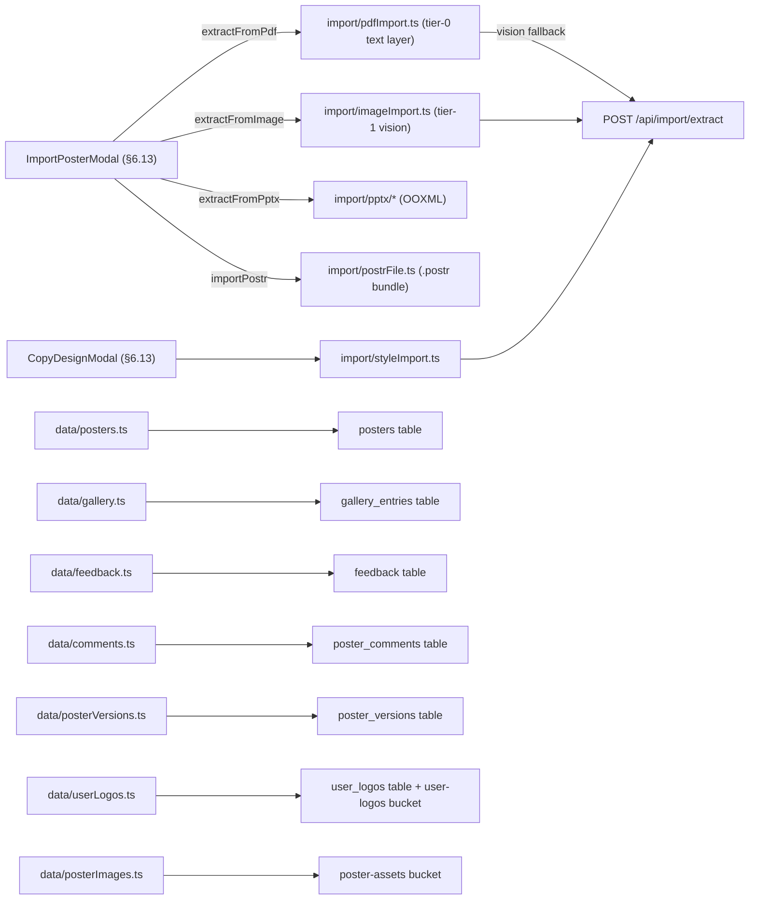

#### `import/bboxSanitize.ts` — bbox clamp/scale/caption-count helpers — no UI, logic only

#### `import/clusterText.ts` — PDF text clustering/role assignment — no UI, logic only

#### `import/imageImport.ts` — Tier-1 vision import (image/flattened-PDF OCR) — no DOM UI

**Copy**
- [ ] "Uploading…" — progress detail — `imageImport.ts:215`
- [ ] "Calling Claude Vision…" — progress detail — `imageImport.ts:257`
- [ ] "Could not encode upload image." — thrown error — `imageImport.ts:228`
- [ ] "Could not upload import: {message}" — thrown error — `imageImport.ts:239`
- [ ] "Could not sign upload URL for vision call." — thrown error — `imageImport.ts:246`
- [ ] "Daily AI import limit reached.{ Try again in {retryAfter}.}" — 429 error (daily) — `imageImport.ts:275-278`
- [ ] "Too many AI requests in the last minute.{ Try again in {retryAfter}.}" — 429 error (burst) — `imageImport.ts:277-278`
- [ ] "Vision call failed." — thrown error fallback — `imageImport.ts:280`
- [ ] "Text-only import — figures and tables were not captured. We detected {n} figure/table caption{s} in the source; you'll need to re-add the visuals manually using the Insert tab." — warning (captioned source) — `imageImport.ts:359`
- [ ] "Text-only import — figures, tables, and other graphics were not captured. Use the Insert tab to add visuals manually." — warning (no captions) — `imageImport.ts:360`
- [ ] "Imported via vision model — verify the extracted text against the source." — trailing warning — `imageImport.ts:377`
- [ ] "Could not parse PDF: {message}" — thrown error (rasterize helper) — `imageImport.ts:613`
- [ ] "Multi-page PDFs are not yet supported — this file has {n} pages." — thrown error — `imageImport.ts:619-620`
- [ ] "Image has no dimensions — it may be corrupt or unsupported." — thrown error — `imageImport.ts:654`
- [ ] "No 2D context available." — thrown error — `imageImport.ts:630,660`

#### `import/parseAuthors.ts` — author-line parsing — no UI, logic only

#### `import/pdfImport.ts` — Tier-0 text-layer PDF import — no DOM UI

**Copy**
- [ ] "Could not parse PDF: {message}" — `PdfImportError`, kind `parse-failed` — `pdfImport.ts:137`
- [ ] "Multi-page PDFs are not yet supported — this file has {n} pages." — `PdfImportError`, kind `multi-page` — `pdfImport.ts:146`
- [ ] "Could not rasterize page for vision fallback." — `PdfImportError`, kind `parse-failed` — `pdfImport.ts:175`
- [ ] "Daily AI import limit reached.{ Try again in {retryAfter}.}" — rate-limited error (daily) — `pdfImport.ts:93-95`
- [ ] "Too many AI requests in the last minute.{ Try again in {retryAfter}.}" — rate-limited error (burst) — `pdfImport.ts:94-95`
- [ ] "Reading order auto-detected from column layout — re-order via Auto-Arrange if needed." — import warning — `pdfImport.ts:263`
- [ ] "Source fonts ({first 3 font names}{…}) replaced with the editor default." — import warning — `pdfImport.ts:265`
- [ ] "{n} figure{s} couldn't be uploaded (storage timeout). Drop the PDF again to retry the missing figures — your text has already been imported." — import warning — `pdfImport.ts:268`
- [ ] "Verifying {n} small region{s}…" — progress detail — `pdfImport.ts:697`
- [ ] "Verifying figures {done}/{total}" — progress detail — `pdfImport.ts:727`
- [ ] "Splitting {n} multi-logo block{s}…" — progress detail — `pdfImport.ts:1076`

#### `import/postrFile.ts` — `.postr` bundle export/import — no DOM UI

**Copy**
- [ ] ".postr bundle is too large ({n} MB). Max supported size is 100 MB." — thrown error — `postrFile.ts:112-113`
- [ ] "Could not read .postr bundle — file may be corrupted." — thrown error — `postrFile.ts:121`
- [ ] ".postr bundle expands to {n} MB, over the 200 MB limit." — thrown error — `postrFile.ts:133-134`
- [ ] ".postr bundle is missing poster.json." — thrown error — `postrFile.ts:139`
- [ ] ".postr bundle is missing manifest.json." — thrown error — `postrFile.ts:141`
- [ ] "Unsupported .postr schema version {n}. Update the editor to import this file." — thrown error — `postrFile.ts:146-148`
- [ ] (note: `hashMatch` flag returned for a "bundle intact" badge in the preview modal — `postrFile.ts:40-43`; badge UI, if any, lives outside slice)

#### `import/pptx/ooxml.ts` — OOXML zip/XML helpers — no UI

- [ ] ⚠️ Per the house-rule comment (`ooxml.ts:25`), `PptxImportError` messages "never reach the user" — the modal shows generic copy. Internal messages: "PowerPoint file exceeds the size limit." (:43), "File is not a readable PowerPoint archive." (:50), "PowerPoint file expands beyond the size limit." (:56), "Archive is not a PowerPoint presentation." (:62), "PowerPoint file contains malformed XML." (:77).

#### `import/pptx/parsePptx.ts` — .pptx parsing — no DOM UI

**Copy** (user-visible warnings)
- [ ] "This PowerPoint file was exported at half size to fit PowerPoint’s 56-inch limit. It has been restored to its original dimensions." — half-scale restore warning — `parsePptx.ts:205-207`
- [ ] "This file has {n} slides. Only one was imported — {skipped} {slide was|slides were} skipped, because a poster is a single canvas." — multi-slide warning — `parsePptx.ts:260-264`
- [ ] "No text, images, or tables were found on the first slide — the imported poster is empty." — empty-import warning — `parsePptx.ts:295-297`
- [ ] (internal `PptxImportError`s, not shown verbatim: :70, :75, :225, :232, :253, :269, :271)

#### `import/pptx/pptxImport.ts` — .pptx import entry (media upload) — no DOM UI

**Copy**
- [ ] "An image from the slide could not be saved and was left as an empty frame." — upload-failure warning — `pptxImport.ts:67`
- [ ] (progress stages only: `reading` :39, `clustering` :42, `uploading-figures` :48, `building-preview` :76, `ready` :82 — labels mapped outside slice)

#### `import/pptx/shapes.ts` — slide shape-tree parser — no DOM UI

**Copy** (interpolated into the toBlocks unsupported-shape warning)
- [ ] "a chart" — `shapes.ts:221`
- [ ] "a SmartArt diagram" — `shapes.ts:222`
- [ ] "an embedded object" — `shapes.ts:223`
- [ ] "a grouped shape" — `shapes.ts:224`
- [ ] "an unsupported shape" — `shapes.ts:225`

#### `import/pptx/text.ts` — DrawingML text-body parser — no UI, logic only

#### `import/pptx/toBlocks.ts` — shapes → poster blocks — no DOM UI

**Copy**
- [ ] "An image on the slide could not be read and was left as an empty frame." — `UNREADABLE_IMAGE_WARNING` — `toBlocks.ts:76-77`
- [ ] "{Capitalized shape label} could not be imported — PowerPoint stores it in a format Postr can't edit. Re-add it from the Insert tab." — unsupported-shape warning — `toBlocks.ts:131`
- [ ] "PowerPoint stored the position of “{first 40 chars of text}” in the slide layout, so it was placed at the top-left corner. Drag it where you want it." — fallback-placement warning — `toBlocks.ts:143-146`

#### `import/styleImport.ts` — copy-a-design (style extraction) client pipeline — no DOM UI

**Copy** (`userMessage` strings are "safe to render verbatim" per :39; render site `poster/sidebar/ImportSection.tsx`, outside slice)
- [ ] "That doesn't look like a poster — try a photo or PDF of the whole thing." — `UNREADABLE_MESSAGE` — `styleImport.ts:65-66`
- [ ] "Sign-in expired. Please refresh and try again." — auth-expired userMessage — `styleImport.ts:84`
- [ ] "Daily design-copy limit reached.{ Try again in {retryAfter}.}" — 429 userMessage (daily) — `styleImport.ts:128-138`
- [ ] "Too many requests right now.{ Try again in {retryAfter}.}" — 429 userMessage (burst) — `styleImport.ts:136-138`
- [ ] "Could not encode upload image." — thrown error — `styleImport.ts:176`
- [ ] "Could not upload style source: {message}" — thrown error — `styleImport.ts:188`
- [ ] "Could not sign upload URL for the style call." — thrown error — `styleImport.ts:196`
- [ ] stage ids 'reading' / 'colours' / 'matching' — `styleImport.ts:36` — progress labels mapped by caller (outside slice)

#### `import/synthDoc.ts` — extraction output → PosterDoc synthesis — no DOM UI

**Copy**
- [ ] "Imported poster" — fallback poster title (both synth paths) — `synthDoc.ts:146,195`

#### `data/comments.ts` — `poster_comments` repository — no DOM UI; throws user-visible validation errors

**Copy**
- [ ] "Not signed in." — thrown error — `comments.ts:136`
- [ ] "Please enter a display name to comment." — validation error — `comments.ts:139`
- [ ] "Display name must be 60 characters or fewer." — validation error — `comments.ts:140`
- [ ] "Comment cannot be empty." — validation error — `comments.ts:142,225`
- [ ] "Comment is too long (4000 char max)." — validation error — `comments.ts:143`

#### `data/consent.ts` — signup research/marketing consent persistence — no UI, logic only

Storage: sessionStorage `postr.signupConsent` (const `:34`; write `:44`, read `:54`, remove `:69`) — see §8.

#### `data/feedback.ts` — `feedback` repository — no DOM UI; throws user-visible validation errors

**Copy**
- [ ] "Please add a short title." — validation error, title empty — `feedback.ts:61`
- [ ] "Title is too long (max 120 characters)." — validation error — `feedback.ts:64`
- [ ] "Please describe what you have in mind." — validation error, body empty — `feedback.ts:67`
- [ ] "Description is too long (max 4000 characters)." — validation error — `feedback.ts:70`
- [ ] "Could not start a session: {message}" — thrown error — `feedback.ts:93`
- [ ] "Could not establish a session. Please reload and try again." — thrown error — `feedback.ts:97`
- [ ] "You have reached the daily limit. Please try again tomorrow." — rate-limit error — `feedback.ts:141`
- [ ] "Could not send feedback: {message}" — thrown error — `feedback.ts:143`
- [ ] (not UI — stored in DB body for triage) "--- ATTACHMENT ---", "--- ATTACHMENT (upload failed; metadata only) ---", "--- CONSOLE LOG (last {n} chars) ---" — `feedback.ts:119-126`

#### `data/gallery.ts` — `gallery_entries` repository + field constants — no DOM UI

**Copy** (`FIELD_OPTIONS` rendered at `pages/Gallery.tsx` + `components/PublishGalleryModal.tsx`, outside slice)
- [ ] "Neuroscience" / "Psychology" / "Medicine" / "Biology" / "Computer Science" / "Physics" / "Chemistry" / "Engineering" / "Social Sciences" / "Humanities" / "Other" — field option labels — `gallery.ts:36-46`
- [ ] "Could not load gallery: {message}" — thrown error — `gallery.ts:120`
- [ ] "Could not load gallery entry: {message}" — thrown error — `gallery.ts:133`
- [ ] "Not signed in." — thrown error — `gallery.ts:142`
- [ ] "Could not load your gallery submissions: {message}" — thrown error — `gallery.ts:150`
- [ ] "You need to be signed in to publish to the gallery." — thrown error — `gallery.ts:183`
- [ ] "Please add a title." — validation error — `gallery.ts:188`
- [ ] "Title is too long (max 200 characters)." — validation error — `gallery.ts:189`
- [ ] "You have reached the daily limit of 5 gallery publishes." — rate-limit error — `gallery.ts:209`
- [ ] "Could not create gallery entry: {message}" — thrown error — `gallery.ts:211`
- [ ] "Upload failed, entry rolled back: {message}" — thrown error — `gallery.ts:257`
- [ ] "Could not retract entry: {message}" — thrown error — `gallery.ts:273,356`
- [ ] "Could not load admin gallery: {message}" — thrown error — `gallery.ts:322`
- [ ] "You need to be signed in as an admin." — thrown error — `gallery.ts:338`
- [ ] "A retraction reason is required." — validation error — `gallery.ts:342`
- [ ] "Reason is too long (max 500 characters)." — validation error — `gallery.ts:345`
- [ ] "Could not unretract entry: {message}" — thrown error — `gallery.ts:374`

#### `data/posterImages.ts` — image upload/signed-URL helpers — no UI, logic only (failures return null; only `console.warn` at :64)

#### `data/posterVersions.ts` — `poster_versions` repository — no DOM UI

**Copy**
- [ ] "Failed to list versions: {message}" — `posterVersions.ts:59`
- [ ] "Cannot save version — no active user: {message}" — `posterVersions.ts:79`
- [ ] "Failed to save version: {message}" — `posterVersions.ts:89`
- [ ] "Failed to delete version: {message}" — `posterVersions.ts:96`
- [ ] "Failed to load version: {message}" — `posterVersions.ts:110`
- [ ] constants driving Versions-sidebar copy (outside slice): `MAX_VERSIONS_PER_POSTER = 20` (:42), `VERSION_WARNING_THRESHOLD = 15` (:45)

#### `data/posters.ts` — `posters` repository — no DOM UI; throws user-visible errors

**Copy**
- [ ] "Anonymous re-sign-in failed: {message}" — `posters.ts:35`
- [ ] "Failed to load poster: {message}" — `posters.ts:90`
- [ ] "Failed to load shared poster: {message}" — `posters.ts:117`
- [ ] "Failed to load most recent poster: {message}" — `posters.ts:136`
- [ ] "Cannot list posters — no active user: {message}" — `posters.ts:166`
- [ ] "Failed to list posters: {message}" — `posters.ts:187`
- [ ] "Cannot create poster — no active user: {message}" — `posters.ts:231`
- [ ] "Failed to create poster: {message}" — `posters.ts:247`
- [ ] "Failed to create poster after re-authenticating" — `posters.ts:252`
- [ ] "Failed to save poster: {message}" — `posters.ts:294`
- [ ] "Cannot duplicate poster {id}: not found" — `posters.ts:316`
- [ ] "Cannot duplicate poster — no active user: {message}" — `posters.ts:325`
- [ ] "{source.title} (copy)" — duplicated-poster title template — `posters.ts:333`
- [ ] "Failed to duplicate poster: {message}" — `posters.ts:342`
- [ ] "Poster {posterId} not found" — `posters.ts:393`
- [ ] "Failed to publish share link: {message}" — `posters.ts:413`
- [ ] "Could not mint a unique share link after 3 tries" — `posters.ts:417`
- [ ] "Failed to delete poster: {message}" — `posters.ts:431`

#### `data/seedWelcomePoster.ts` — welcome-poster seeder — no UI, logic only

**Copy**
- [ ] "Welcome — sample poster" — fallback seeded-poster title — `seedWelcomePoster.ts:88`

Storage: localStorage `postr.welcome-seeded:{userId}` (prefix const `:36`; read `:40`, write `:50`) — see §8.

#### `data/thumbnails.ts` — poster thumbnail capture/upload — no UI, logic only (failures return null)

#### `data/userLogos.ts` — user logo library client — no DOM UI; throws user-visible errors

**Copy**
- [ ] ""{file.name}" isn't an image. Upload PNG, JPEG, SVG, or WebP." — validation error — `userLogos.ts:60-62`
- [ ] ""{file.name}" is {n} MB — logos must be under 10 MB." — validation error — `userLogos.ts:65-67`
- [ ] "Not signed in." — thrown error — `userLogos.ts:72`
- [ ] "Upload failed: {message}" — thrown error — `userLogos.ts:90`
- [ ] "Failed to save logo metadata." — thrown error fallback — `userLogos.ts:120`
- [ ] "Storage delete failed: {message}" — thrown error — `userLogos.ts:177`
- [ ] "Couldn't create signed URL for {path}: {message}" — thrown error — `userLogos.ts:192-194`

---

### 6.10 Charts

The plot-picker engine: standalone `/chart-chooser` page, the embedded ladder questionnaire (`charts/ladder/*`), recommender + design-shape copy, SVG rendering (`renderChart`/`plotOptions`), the on-canvas `ChartBlock`, sample-data labels, the CVD-tested series palettes, and the per-chart `ChartPalettePicker`. `ChartChooser` is embedded in three places: the standalone page, the sidebar Figure tab Make mode (§6.8), and the manuscript ChartPanel (§6.12).

**Series-palette override (wired 2026-07-29):** a chart's categorical series fills normally resolve from the poster theme's `paletteSlots` at render time ("restyle poster → restyle charts"). An optional `ChartSpec.seriesPaletteId` overrides that for one chart, pinning its series fills to a fixed CVD-tested palette from `seriesPalettes.ts` (Simplified Science + Okabe-Ito + Paul Tol). `chartColors.ts::resolveSeriesColors` resolves it (categorical fills only — heatmap/Likert ramps stay slot-based); a stale/removed id falls back to slots, visibly. The `ChartPalettePicker` (Figure tab, shown only for a selected **multi-series** chart) writes the choice into `posters.data` via `updateBlock`; "Poster theme (default)" clears it.

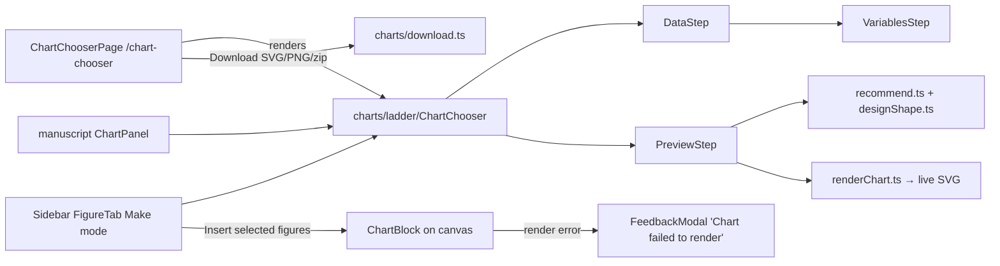

#### `pages/ChartChooser.tsx` — /chart-chooser standalone plot picker (public, no session)

**Elements**
- [ ] palette swatch buttons — one per `PALETTES` entry (from `@/poster/constants`, §6.7), `title={p.name}`, `aria-pressed` — `ChartChooser.tsx:130-168` — sets palette for previews/downloads
- [ ] `Send feedback` — button in error banner — `ChartChooser.tsx:183-189` — `openFeedback('bug')`
- [ ] `Download SVG` / `Download PNG` — action labels passed via `actions` prop, busy labels `Zipping {n} figures…` / `Drawing your figure…` / `Rendering the image…` — `ChartChooser.tsx:199-213` — rendered inside `ChartChooser` component (below); trigger `downloadChartSvg`/`downloadChartPng`/`downloadChartsZip`
- [ ] `Start a poster` — router link — `ChartChooser.tsx:230-235` — `/auth`

**Copy**
- [ ] "Which chart fits your data?" — h1 (must match routes.json) — `ChartChooser.tsx:110`
- [ ] "Paste a table, upload a CSV or Excel file, or answer three short questions — the picker ranks the figures that fit your data, drawn as journal-style panels with captions. Download any panel as SVG or PNG. No account, and your data never leaves the browser." — lede — `ChartChooser.tsx:112-117`
- [ ] "Palette" — switcher label — `ChartChooser.tsx:123-125`
- [ ] "{paletteName}" — active palette name — `ChartChooser.tsx:172-174`
- [ ] "Chart palette" — aria-label on swatch group — `ChartChooser.tsx:126`
- [ ] "Something went wrong preparing that download." — error banner — `ChartChooser.tsx:182`
- [ ] "Need the figure on a conference poster?" — CTA h2 — `ChartChooser.tsx:223`
- [ ] "Postr is a free academic poster editor with this same chart engine built in — plus a print-readability check for figures you already have." — CTA para — `ChartChooser.tsx:225-229`
- [ ] "Saved — vector SVG scales to any print size" — download confirmation string (prop) — `ChartChooser.tsx:214`
- [ ] JSON-LD: "Postr Plot Picker" + "Paste a table or answer three short questions and get ranked, journal-style chart suggestions with captions. Download SVG or PNG." — structured data — `ChartChooser.tsx:36-41`

**Graphics**
- [ ] Palette swatch dots (accent + accent2 circles) — aria-hidden spans — `ChartChooser.tsx:147-166` — inside each swatch button

#### `charts/ChartBlock.tsx` — renders a chart block's `ChartSpec` to live SVG on the poster canvas

**Elements**
- [ ] `Send Feedback` — button — `ChartBlock.tsx:91` — calls `useFeedbackStore.open('bug', { title: 'Chart failed to render' })` (opens feedback modal, prefilled); only rendered in the error state

**Copy**
- [ ] "Rendering chart…" — loading state text — `ChartBlock.tsx:87`
- [ ] "Something went wrong rendering this chart." — error state text — `ChartBlock.tsx:90`
- [ ] "Chart failed to render" — feedback-modal prefill title passed to the store — `ChartBlock.tsx:93`

**Graphics**
- [ ] none in-file — the chart `<svg>` is injected by `renderChart()` into `hostRef` (`ChartBlock.tsx:53`); error/loading frame is a CSS dashed border, no glyph

#### `charts/declaredVariables.ts` — declared-variable (mobile) data synthesis; no DOM UI

**Copy** (surface indirectly as generated column headers / axis labels / category ticks in previews)
- [ ] "Measure" — fallback outcome column name (`FALLBACK_OUTCOME`) — `declaredVariables.ts:112`
- [ ] "Group" — fallback factor column name (`FALLBACK_FACTOR`) — `declaredVariables.ts:113`
- [ ] "Timepoint" — fallback ordered column name (`FALLBACK_ORDERED`) — `declaredVariables.ts:114`
- [ ] "Group A", "Group B", "Group C", "Group D", "Group E", "Group F", "Group G", "Group H", "Group I" — bogus category levels (`BOGUS_LEVELS`) — `declaredVariables.ts:91-101`

#### `charts/designShape.ts` — design-shape → treatment ruleset; `label` + `rationale` shown verbatim by PreviewStep

**Copy** (render sites: `PreviewStep.tsx:198-203` empty state, `PreviewStep.tsx:260-265` header line)
- [ ] "No columns of numbers were found, so there is nothing to plot. Add a column of measured values and try again." — rationale, treatment `nothing-to-plot` — `designShape.ts:287`
- [ ] "Every column is a label or a grouping factor, with no measured outcome. Counts of each combination belong in a table, not a chart." — rationale, `summary-table` — `designShape.ts:291`
- [ ] "Crossing the factors gives {cells} cells — too many for one set of bars or lines. Splitting into panels keeps each comparison legible." — rationale, `faceted` — `designShape.ts:301`
- [ ] "One measured outcome and no grouping factor — a single distribution figure carries the whole table." — rationale, `single-chart` (iv=0) — `designShape.ts:308`
- [ ] "One measured outcome against {one factor|two factors} — a single figure carries this without dropping anything." — rationale, `single-chart` — `designShape.ts:309`
- [ ] "One outcome across {ivCount} factors — two factors fit in a single figure, so the remaining {ivCount − 2} become panels rather than extra colours nobody can separate." — rationale, `faceted` — `designShape.ts:317`
- [ ] "{dvCount} outcomes share the same factor{s}, but they are measured on different scales — one small panel per outcome compares them honestly, where a shared axis would not." — rationale, `small-multiples` — `designShape.ts:325`
- [ ] "{dvCount} outcomes across {ivCount} factors — one panel per outcome, with the two strongest factors inside each panel. Report the remaining factors in the text." — rationale, `small-multiples` — `designShape.ts:334`
- [ ] "{dvCount} outcomes across {ivCount} factors is wider than any single figure can show honestly — a chart covering all of it would either drop most columns or overplot into noise. Pick the one or two outcomes your claim rests on and chart those{, or plot the time course of a single outcome}; put the rest in a summary table." — rationale, `no-single-chart` — `designShape.ts:341`
- [ ] "{n} outcome{s} × {n} factor{s}" — shape label template, e.g. "1 outcome × 3 factors" — `designShape.ts:345-349`

#### `charts/download.ts` — SVG/PNG/zip download helpers — no UI, logic only

- [ ] Thrown `Error` messages are internal (not rendered verbatim): `'chart image failed to load'` (:80), `'canvas 2d context unavailable'` (:87), `'png encode failed'` (:92), `'no figures selected'` (:135). Filenames/zip names come from callers outside this slice.

#### `charts/inferColumns.ts` — no UI — logic only

#### `charts/ladder/ChartChooser.tsx` — the auto-scrolling questionnaire ladder (panel + page layouts)

**Elements**
- [ ] `▸ change` (via StepSection) — button — rendered for every answered step — `ChartChooser.tsx:217,265` — `onReopen` (`resetData` for step 1, `reopen(rung)` for the rest); invalidates all rungs below
- [ ] chips from `SHAPE_OPTIONS` (7 labels, enumerated at `steps.ts:270-278`) — chip buttons — `ChartChooser.tsx:274-279` — synthetic branch measure rung; `answer('measure', { shape })`
- [ ] `Pick the outcome column` chip per numeric column (dynamic, `{c.name}`) — chip buttons — `ChartChooser.tsx:281-292` — data branch; `answer('measure', { measure })`
- [ ] `Just the measure` — chip — `ChartChooser.tsx:52` (rendered :301-307) — `answer('grouping', { vars: 0 })`
- [ ] `One grouping variable` — chip — `ChartChooser.tsx:53` — `vars: 1`
- [ ] `Two grouping variables` — chip — `ChartChooser.tsx:54` — `vars: 2`
- [ ] `Pick up to two columns to compare across` chips (dynamic grouping column names, multi, max 2) — chip buttons — `ChartChooser.tsx:310-322` — toggles `pendingGroups`
- [ ] `Use these` — button — `ChartChooser.tsx:324-340` — `answer('grouping', { groupings: pendingGroups })`; disabled when none picked
- [ ] `Don't split` — button — `ChartChooser.tsx:341-355` — `answer('grouping', { groupings: [] })`
- [ ] `What do you want people to take away?` chips from `EMPHASIS_OPTIONS` (5 labels, enumerated at `steps.ts:262-268`) — chip buttons — `ChartChooser.tsx:366-371` — `answer('emphasis', { emphasis })`

**Copy**
- [ ] "Your data" — step 1 title — `ChartChooser.tsx:192`
- [ ] "What are you showing?" — step 2 title, synthetic branch — `ChartChooser.tsx:194`
- [ ] "What did you measure?" — step 2 title, data branch — `ChartChooser.tsx:194`
- [ ] "How many variables?" — step 3 title, synthetic branch — `ChartChooser.tsx:196`
- [ ] "Compare across which columns?" — step 3 title, data branch — `ChartChooser.tsx:196` (+ helper line via StepSection `hint`)
- [ ] "What should the figure emphasise?" — step 4 title — `ChartChooser.tsx:198`
- [ ] "Pick your figure" — step 5 title — `ChartChooser.tsx:200`
- [ ] "Worked example — swap in your numbers after inserting" — step-1 collapsed summary after "I don't have data yet" — `ChartChooser.tsx:132`
- [ ] "{dataSummary} — {SAMPLE_DATA_LABEL}" — collapsed-summary template when values synthesised — `ChartChooser.tsx:171`
- [ ] "None" — collapsed grouping summary when no groupings — `ChartChooser.tsx:181`
- [ ] "Pick the outcome column" — ChipRow group aria-label — `ChartChooser.tsx:282`
- [ ] "Pick up to two grouping columns" — ChipRow group aria-label — `ChartChooser.tsx:311`
- [ ] "What do you want people to take away?" — ChipRow group aria-label — `ChartChooser.tsx:367`

**Graphics** — none

#### `charts/ladder/ChipRow.tsx` — accessible chip-option row for ladder questions

**Elements**
- [ ] `{option.label}` chips — button, `aria-pressed`, class `postr-chart-chip` — `ChipRow.tsx:45-75` — `onPick(option.value)` (single-select auto-advances; multi toggles)

**Copy** — none of its own (labels arrive via props)

**Graphics**
- [ ] "✓ " checkmark prefix — text glyph — `ChipRow.tsx:72` — prepended to selected chips in `multi` mode

#### `charts/ladder/ChartPreview.tsx` — one candidate spec rendered as live SVG preview

**Elements** — none interactive

**Copy**
- [ ] "Drawing the figure…" — BusyIndicator label while rendering — `ChartPreview.tsx:81`
- [ ] "Something went wrong rendering this preview." — render-failure text — `ChartPreview.tsx:96`

**Graphics** — none in-file (`BusyIndicator` imported from `@/components/BusyIndicator`, §6.13)

#### `charts/ladder/DataStep.tsx` — ladder step 1: paste/upload/poster-table/synthetic data input

**Elements**
- [ ] `Paste your table` (aria-label) — textarea — `DataStep.tsx:198-236` — ⌘V paste parses immediately; blur parses if it looks like a table
- [ ] `Use this table` — button — `DataStep.tsx:240-247` — parses the draft; only rendered when draft non-empty
- [ ] `Upload CSV or Excel` — button — `DataStep.tsx:248-255` — clicks hidden file input; disabled while reading
- [ ] `List my variables` — button — `DataStep.tsx:260-267` — `onListVariables()` → swaps in VariablesStep
- [ ] `I don’t have data yet` — button — `DataStep.tsx:268-275` — `onSynthetic()` (worked-example branch)
- [ ] (hidden) file input `accept=".csv,.tsv,.txt,.xlsx,.xls"` — input[type=file] — `DataStep.tsx:276-284` — `handleFile`
- [ ] `{ref.label}` poster-table chips — button per table block on the poster — `DataStep.tsx:298-307` — `parsePending({ kind: 'block' })`
- [ ] `{sheet.name}` sheet chips — button per non-empty Excel sheet (multi-sheet workbooks) — `DataStep.tsx:316-325` — `parsePending({ kind: 'sheet' })`
- [ ] `Use the first {CHART_MAX_ROWS.toLocaleString()} rows` — button — `DataStep.tsx:348-355` — re-parse with `allowTruncate: true`; only inside too-large failure banner

**Copy**
- [ ] "Paste cells from Excel, Sheets, or Numbers (⌘V) — include the header row" — textarea placeholder — `DataStep.tsx:200`
- [ ] "We couldn’t find any rows in that. Try pasting the cells, including the header row." — error, reason `empty` — `DataStep.tsx:68`
- [ ] "That looks like prose, not a table — paste cells from a spreadsheet, or upload a CSV or Excel file." — error, reason `no-delimiter` — `DataStep.tsx:70`
- [ ] "That’s {rowCount} rows — charts cap at 2,000 so the poster stays fast." — error, reason `too-large` — `DataStep.tsx:72`
- [ ] "That’s a legacy .xls file. In Excel, save it as .xlsx (or CSV) and try again." — error, reason `legacy-xls` — `DataStep.tsx:74`
- [ ] "Something went wrong reading that file. Try CSV, or paste the cells directly." — error, reason `unreadable` — `DataStep.tsx:76`
- [ ] "{rows} rows × {cols} columns" + optional " (first 2,000 rows)" — success summary handed to step-1 collapsed summary — `DataStep.tsx:112-113`
- [ ] "Reading your spreadsheet…" — BusyIndicator label (Excel path) — `DataStep.tsx:149`
- [ ] "Reading your file…" — BusyIndicator label (CSV/TSV path) — `DataStep.tsx:168`
- [ ] "Large spreadsheets can take a few seconds." — BusyIndicator hint — `DataStep.tsx:290`
- [ ] "Or use a table from this poster:" — section label — `DataStep.tsx:296`
- [ ] "Which sheet?" — section label — `DataStep.tsx:314`

**Graphics** — none in-file

#### `charts/ladder/PreviewStep.tsx` — ranked candidate figures as journal-style panels A/B/C + selection + actions

**Elements**
- [ ] panel-select checkbox — input[type=checkbox], 22px, per panel — `PreviewStep.tsx:311-329` — `toggle(rec.form)`; disabled while an action runs
- [ ] "☑ {letter} {form name}" label row — label (whole row is the click target) — `PreviewStep.tsx:298-343`
- [ ] `{action.label}` / `{action.label} ({count})` — action buttons from `actions` prop (labels defined by callers outside slice) — `PreviewStep.tsx:388-415` — `runAction` → `action.run(selection)`; disabled when nothing selected or busy; `aria-describedby="postr-chart-selection-hint"` when empty

**Copy**
- [ ] "{SAMPLE_DATA_LABEL}" banner heading (constant text at `sampleData.ts:30`) — `PreviewStep.tsx:251`
- [ ] "These values were generated from the columns we detected, so you can see the shape of the figure. Replace them with your own numbers before using it." — sample banner body (`role="status"`) — `PreviewStep.tsx:252-255`
- [ ] "{advice.shape.label}" — design-shape readback (templates at designShape.ts) — `PreviewStep.tsx:198,261`
- [ ] "We couldn’t find a numeric measure to chart in this table. Add a column of numbers and try again." — empty-state fallback note — `PreviewStep.tsx:201-202`
- [ ] "{advice.note}" — treatment rationale (designShape.ts strings) — `PreviewStep.tsx:201,264`
- [ ] "Recommended" — uppercase badge on panel A — `PreviewStep.tsx:358`
- [ ] "{letter}. {panel.caption}" — journal-style figcaption (caption templates at `buildSpec.ts:378-424`) — `PreviewStep.tsx:366`
- [ ] "{panel.rec.why}" — methods-voice justification (templates at `recommend.ts:461-495`) — `PreviewStep.tsx:370`
- [ ] "Preparing {count} figures…" — busy label, multi — `PreviewStep.tsx:424`
- [ ] "Preparing your figure…" — busy label, single — `PreviewStep.tsx:425`
- [ ] "✓ {confirmation}" / "✓ {count} figures — {confirmation}" — post-action confirmation (`role="status"`, text from `confirmation` prop) — `PreviewStep.tsx:437`
- [ ] "Tick at least one figure above to continue." — empty-selection hint (id `postr-chart-selection-hint`) — `PreviewStep.tsx:447`

**Graphics**
- [ ] "✓" check glyph — text glyph — `PreviewStep.tsx:437` — confirmation line
- [ ] Panel letters "A"/"B"/"C" (`PANEL_LETTERS`) — text, 800-weight — `PreviewStep.tsx:87,338` — panel headers + figcaptions

#### `charts/ladder/StepSection.tsx` — one rung of the ladder (collapsed summary ↔ active reveal)

**Elements**
- [ ] `▸ change` — button — `StepSection.tsx:131-152` — `onReopen()`; only on answered steps

**Copy**
- [ ] "Step {index}: {title}" — section aria-label (both states) — `StepSection.tsx:106,160`
- [ ] "{summary}" — one-line answer summary in collapsed state (text from ChartChooser `summaryFor`) — `StepSection.tsx:128`

**Graphics**
- [ ] "▸" triangle glyph — text glyph — `StepSection.tsx:150` — reopen button

#### `charts/ladder/VariablesStep.tsx` — declare-your-variables form (mobile entry path)

**Elements**
- [ ] `Remove` (aria-label `Remove variable {i + 1}`) — button, one per variable row — `VariablesStep.tsx:215-229` — removes row; hidden when only 1 row
- [ ] name input (aria-label `Variable {i + 1} name`) — input[type=text] — `VariablesStep.tsx:232-241` — updates `variable.name`
- [ ] `Measured` / `Compared` segmented buttons (group `What is it?`) — buttons, `aria-pressed` — `VariablesStep.tsx:243-256` via `Segmented` :99-146 — sets role (+ coherent type default)
- [ ] `Number` / `Groups` / `Time / order` segmented buttons (group `Type`) — buttons — `VariablesStep.tsx:258-263` — sets type
- [ ] `2` / `3–5` / `6+` segmented buttons (group `How many groups?`) — buttons — `VariablesStep.tsx:265-272` — sets level band; only for categorical factors
- [ ] `+ Something measured` — button — `VariablesStep.tsx:278-280` — adds outcome row; hidden at capacity (4)
- [ ] `+ Something compared` — button — `VariablesStep.tsx:281-283` — adds factor row; hidden at capacity
- [ ] `Show me the figure` — button — `VariablesStep.tsx:298-312` — `onDeclare(variables, describeVariables(variables))`; disabled until a numeric outcome exists
- [ ] `Back` — button — `VariablesStep.tsx:313-315` — `onCancel()` → returns to DataStep

**Copy**
- [ ] "Name what you measured and what you compared it across. We’ll draw the figure with stand-in numbers so you can see the shape before you have results." — intro paragraph — `VariablesStep.tsx:191-195`
- [ ] "Measured" / hint "dependent" — role option — `VariablesStep.tsx:39`
- [ ] "Compared" / hint "independent" — role option — `VariablesStep.tsx:40`
- [ ] "Number" / "Groups" / "Time / order" — type options — `VariablesStep.tsx:44-46`
- [ ] "2" / "3–5" / "6+" — level-band options — `VariablesStep.tsx:50-52`
- [ ] "What is it?" — segmented group legend + aria-label — `VariablesStep.tsx:244`
- [ ] "Type" — segmented group legend + aria-label — `VariablesStep.tsx:259`
- [ ] "How many groups?" — segmented group legend + aria-label — `VariablesStep.tsx:267`
- [ ] "Variable {i + 1}" — row label — `VariablesStep.tsx:212`
- [ ] "e.g. Reaction time (ms)" — outcome name placeholder — `VariablesStep.tsx:236`
- [ ] "e.g. Caffeine dose" — factor name placeholder — `VariablesStep.tsx:236`
- [ ] "Add at least one measured variable that’s a number — that’s the value the figure plots." — disabled-state explainer — `VariablesStep.tsx:291-294`
- [ ] "{n} outcome{s} × {n} factor{s}" — `describeVariables` collapsed-summary template — `VariablesStep.tsx:163-168`

**Graphics** — none

#### `charts/ladder/steps.ts` — ladder planning + option constants — no DOM UI

**Copy** (rendered as chips/titles in ChartChooser)
- [ ] "Difference between groups" — `steps.ts:263`
- [ ] "Change over time" — `steps.ts:264`
- [ ] "Spread / variability" — `steps.ts:265`
- [ ] "Relationship between two measures" — `steps.ts:266`
- [ ] "Share of a whole" — `steps.ts:267`
- [ ] "A number compared across groups" — `steps.ts:271`
- [ ] "A measure tracked over time" — `steps.ts:272`
- [ ] "The relationship between two measures" — `steps.ts:273`
- [ ] "Parts of a whole" — `steps.ts:274`
- [ ] "Ratings on an agreement scale" — `steps.ts:275`
- [ ] "Before-and-after values" — `steps.ts:276`
- [ ] "The spread of one measure" — `steps.ts:277`

#### `charts/parseData.ts` — tabular input parsing — no UI, logic only

**Copy** (generated headers surface in chips, axes, captions)
- [ ] "Column {index + 1}" — fallback header name for empty/headerless columns — `parseData.ts:61,103`

#### `charts/parseExcel.ts` — .xlsx reader — no UI, logic only (failure reasons mapped to copy in DataStep)

#### `charts/plotOptions.ts` — Observable Plot option builder — no DOM UI; emits in-SVG strings

**Copy** (rendered inside the chart SVG)
- [ ] "Count" — histogram y-axis label — `plotOptions.ts:243`
- [ ] "All responses" — fallback y category for single-statement Likert — `plotOptions.ts:293`
- [ ] "Before" / "After" — fallback dumbbell legend labels when encoding names absent — `plotOptions.ts:358-359`

#### `charts/recommend.ts` — hardcoded chart recommender; `FORM_NAMES` + `whyText` shown verbatim in PreviewStep

**Copy**
- [ ] "Bar chart" — `recommend.ts:85`
- [ ] "Grouped bar chart" — `recommend.ts:86`
- [ ] "Stacked bar chart" — `recommend.ts:87`
- [ ] "Diverging stacked bar" — `recommend.ts:88`
- [ ] "Line chart" — `recommend.ts:89`
- [ ] "Area chart" — `recommend.ts:90`
- [ ] "Scatter plot" — `recommend.ts:91`
- [ ] "Histogram" — `recommend.ts:92`
- [ ] "Box plot" — `recommend.ts:93`
- [ ] "Heatmap" — `recommend.ts:94`
- [ ] "Dumbbell plot" — `recommend.ts:95`
- [ ] "One categorical variable ({k} levels) against one continuous measure — a bar chart maps magnitude to length, which is read more accurately than area or angle." — why, bar — `recommend.ts:470`
- [ ] "One measure across two categorical factors — grouping keeps the primary comparison adjacent within each cluster." — why, bar-grouped — `recommend.ts:472`
- [ ] "Parts of a whole — stacked segments preserve the part-to-whole reading while keeping every share on a common scale." — why, bar-stacked — `recommend.ts:474`
- [ ] "An ordered agreement scale — a diverging stack anchors the neutral point so agreement and disagreement read in opposite directions." — why, bar-diverging — `recommend.ts:476`
- [ ] "An ordered axis with one measure per group — lines encode change as slope, and hue separates the {k} series." — why, line (multi) — `recommend.ts:479`
- [ ] "An ordered axis with one continuous measure — a line encodes change between adjacent points as slope, the fastest-read cue for trend." — why, line (single) — `recommend.ts:480`
- [ ] "A single ordered series — filling under the line adds visual weight to cumulative magnitude without adding a second encoding." — why, area — `recommend.ts:482`
- [ ] "Two continuous measures per observation (n = {rowCount}) — position on both axes shows the joint distribution and any association directly." — why, scatter — `recommend.ts:484`
- [ ] "A single continuous measure (n = {rowCount}) — binning shows the full distribution rather than a single summary statistic." — why, histogram — `recommend.ts:486`
- [ ] "Repeated observations per group — boxes show median and spread, which a bar of means would hide." — why, box (grouped) — `recommend.ts:489`
- [ ] "A compact distribution summary — median, quartiles, and outliers in one mark." — why, box (single) — `recommend.ts:490`
- [ ] "A magnitude across two factors — a matrix of shaded cells stays legible where dozens of bars or lines would not." — why, heatmap — `recommend.ts:492`
- [ ] "Paired before/after values per item — a dumbbell shows each item’s change as a distance along a common scale, more accurate than paired bars." — why, dumbbell — `recommend.ts:494`

#### `charts/renderChart.ts` — ChartSpec → SVG renderer — no UI, logic only

**Copy**
- [ ] "legend" — aria-label set on the generated legend `<g>` — `renderChart.ts:92`
- [ ] (thrown errors `'chart spec has no rows'` :121, `'chart render produced no svg'` :130 are internal, caught by ChartBlock/ChartPreview error states)

#### `charts/sampleData.ts` — seeded sample-data generators + the mandatory sample-data labels — no DOM UI

**Copy**
- [ ] "Sample data — not your results" — `SAMPLE_DATA_LABEL`, rendered at `PreviewStep.tsx:251` and `ChartChooser.tsx:171` — `sampleData.ts:30`
- [ ] "Sample data, not real results." — `SAMPLE_CAPTION_PREFIX`, baked into captions via `buildSpec.captionFor` (survives into the inserted block's caption field) — `sampleData.ts:37`
- [ ] "One number per group" — dataset label — `sampleData.ts:98` — ⚠️ dead copy: `SampleDataset.label` is never read in production UI (chips use `SHAPE_OPTIONS`; grep confirms only tests read `label`)
- [ ] "Change over time" — dataset label — `sampleData.ts:115` — ⚠️ dead copy (same)
- [ ] "Change over time, several groups" — dataset label — `sampleData.ts:136` — ⚠️ dead copy
- [ ] "Two measures per participant" — dataset label — `sampleData.ts:153` — ⚠️ dead copy
- [ ] "One measure, many observations" — dataset label — `sampleData.ts:170` — ⚠️ dead copy
- [ ] "One number across two groupings" — dataset label — `sampleData.ts:195` — ⚠️ dead copy
- [ ] "Parts of a whole" — dataset label — `sampleData.ts:208` — ⚠️ dead copy
- [ ] "Agreement ratings" — dataset label — `sampleData.ts:237` — ⚠️ dead copy
- [ ] "Before and after" — dataset label — `sampleData.ts:256` — ⚠️ dead copy
- [ ] "Sample values for your columns" — dataset label — `sampleData.ts:417` — ⚠️ dead copy
- [ ] sample-table headers (appear as axis labels/ticks in previews + captions): "Condition", "Mean reaction time (ms)" (:99); "Week", "Symptom severity (0–10)" (:116); "Month", "Site", "Participants enrolled" (:137); "Sleep duration (h)", "Recall accuracy (%)" (:154); "Response time (ms)" (:171); "Condition", "Timepoint", "Mean anxiety score" (:196); "Activity", "Share of shift" (:209); "Statement", "Response", "Respondents (%)" (:238); "Outcome", "Baseline (T-score)", "Follow-up (T-score)" (:257)
- [ ] sample category values (visible as ticks/legend entries in previews): "Control", "Placebo", "Low dose", "High dose", "Combined", "Waitlist" (:90,179); "Acme State University", "Sample Research Institute", "Acme Community Clinic" (:124,286-290); "The intervention was easy to follow", "I would recommend it to others", "The sessions fit my schedule", "The materials were clear" (:216-221); "Strongly disagree", "Disagree", "Neutral", "Agree", "Strongly agree" (:222); "Anxiety", "Depression", "Sleep quality", "Fatigue", "Pain interference" (:246); "Direct care", "Documentation", "Coordination", "Training", "Other" (:203); "Baseline", "Week 6" (:180); "Group A"–"Group F" (:277-284); "John Smith", "Jane Doe" (:292)

#### `charts/seriesPalettes.ts` — CVD-tested series-palette constants — rendered by `ChartPalettePicker`

- [ ] **Wired (2026-07-29):** `seriesPalettesFor(seriesCount)` feeds the `ChartPalettePicker` (Figure tab); `findSeriesPalette(id)` resolves a chart's `seriesPaletteId` at render time. Names/notes below render as swatch labels in that picker. Simplified Science sets (3/6) plus the named CVD-safe sets: Okabe-Ito (8), Tol bright (7), Tol muted (9), Tol high-contrast (3) — `SERIES_PALETTES_NAMED`.

**Copy**
- [ ] "Blue · Orange · Gray" / note "The most robust pair under red-green CVD, plus a neutral." — `seriesPalettes.ts:62,65`
- [ ] "Teal · Red · Gray" / "Strong separation when a "bad" category should read as red." — `seriesPalettes.ts:69,72`
- [ ] "Purple · Gray · Gold" / "Muted alternative when blue is already used elsewhere." — `seriesPalettes.ts:76,79`
- [ ] "Blues (light → dark)" / "Ordered categories — dose, time bin, or severity." — `seriesPalettes.ts:83,86`
- [ ] "Reds (light → dark)" / "Ordered categories where intensity should read as risk." — `seriesPalettes.ts:90,93`
- [ ] "Teals (light → dark)" / "Ordered categories in a cooler register." — `seriesPalettes.ts:97,100`
- [ ] "Contrasting six" / "Six unordered categories — the general-purpose choice." — `seriesPalettes.ts:111,114`
- [ ] "Blue → Red (divergent)" / "Change from a midpoint — heat maps, gain vs loss." — `seriesPalettes.ts:118,121`
- [ ] "Teal ramp" / "Six ordered levels, light to dark." — `seriesPalettes.ts:125,128`
- [ ] "Grayscale" / "Mono printing, or when colour carries no meaning." — `seriesPalettes.ts:132,135`

**Graphics** — palette hex colours across all sets (Simplified Science + `SERIES_PALETTES_NAMED`) — rendered as swatch strips in `ChartPalettePicker`.

#### `charts/ChartPalettePicker.tsx` — per-chart series-palette picker (Figure tab)

- [ ] "Chart colours" — section label — `ChartPalettePicker.tsx`
- [ ] "Poster theme (default)" — reset option (clears `seriesPaletteId`) — `ChartPalettePicker.tsx`
- [ ] "This chart's saved palette is no longer available — showing the poster theme." — stale-id note — `ChartPalettePicker.tsx`
- [ ] Multi-colour swatch buttons — one per `seriesPalettesFor(seriesCount)` entry; `aria-pressed` on the active palette. Shown only for a selected **multi-series** chart (single-series charts fill from one slot, so the picker is gated out in `FigureTab.tsx`).

#### `charts/chartColors.ts` — palette-slot resolution/color math (incl. `resolveSeriesColors` override) — no UI, logic only

---

### 6.11 Export & Attribution

`export/` — the print-window shell, the PPTX and LaTeX writers, the `.postr` bundle, the "Poster made with postr.sh" attribution system (ack mark + locked canvas block + references entry + colophon), and the PowerPoint 56-inch ceiling policy. The paid-export buttons + paywall live in `poster/sidebar/EditableExportButtons.tsx` (cross-listed from §6.8).

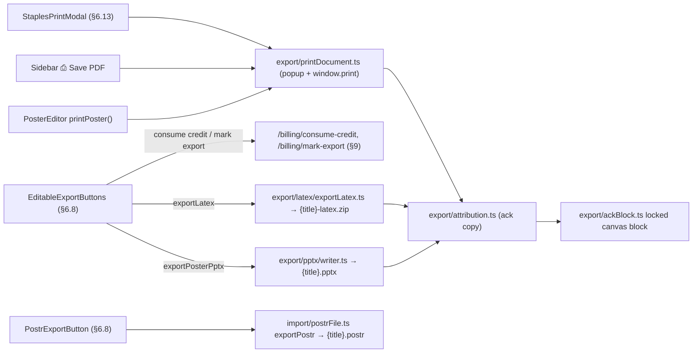

#### `export/ackBlock.ts` — builds/places the locked acknowledgement `logo` block on the doc

No UI — logic only. Constructs `Block` with `imageSrc: ackMarkDataUri()`, `locked: true` (ackBlock.ts:52-65). No user-visible strings.

#### `export/ackMark.ts` — the acknowledgement mark SVG (monochrome muted-grey brand geometry)

**Copy**
- [ ] `aria-label="Poster made with postr.sh"` — aria-label on the exported SVG root — `ackMark.ts:53` — rides every exported ack-mark image

**Graphics**
- [ ] Ack mark — two crossing curved strokes (`M14 14 C32 14, 32 50, 50 50` / `M14 50 C32 50, 32 14, 50 14`, `#6b7280`, opacity 0.85/0.6) + centre dot circle — inline-svg (generated string, emitted as base64 data URI) — `ackMark.ts:34-42` — appears as the on-poster acknowledgement logo block and inside PPTX exports

#### `export/attribution.ts` — single source of truth for the "Poster made with postr.sh" credit across all export formats

**Copy** (all emitted into exported artifacts, not DOM)
- [ ] `Poster made with postr.sh` — frozen ack copy, `ACKNOWLEDGEMENT_TEXT` — `attribution.ts:42` — rendered in print colophon, PPTX text box, LaTeX footer, .bib entry, references entry, SVG aria-label
- [ ] `https://postr.sh` — canonical URL, `ATTRIBUTION_URL` — `attribution.ts:52`
- [ ] `Poster made with postr.sh (https://postr.sh)` — document-property/generator value (PPTX app.xml, .postr bundle) — `attribution.ts:182`
- [ ] `%% Poster made with postr.sh` — LaTeX header comment — `attribution.ts:190`
- [ ] `Postr` — `ACK_REFERENCE_AUTHOR`, author field of the software citation — `attribution.ts:239`
- [ ] `Poster made with postr.sh https://postr.sh` — `rawText` of the appended references entry — `attribution.ts:276`
- [ ] `@misc{postr, title = {Poster made with postr.sh}, author = {Postr}, howpublished = {\url{https://postr.sh}}, }` — .bib entry — `attribution.ts:332-338`
- [ ] `ATTRIBUTION_TEXT` = alias of ACKNOWLEDGEMENT_TEXT (`@deprecated`, attribution.ts:49); back-compat aliases `attributionPrintHtml` etc. (attribution.ts:345-351) — dead-compat surface, still exported (§10)

#### `export/blockLock.ts` — locked-block delete guard shared by all six editor delete paths

**Copy**
- [ ] `Postr is free — this credit stays on the poster.` — toast copy (`LOCKED_BLOCK_REFUSAL`) returned to callers for surfacing in the editor toast — `blockLock.ts:33`

#### `export/latex/bib.ts` — references.bib generator for the LaTeX bundle

**Copy**
- [ ] `% Generated by Postr (postr.sh)` + `% Every poster reference, ready for \bibliography.` — .bib header comment — `bib.ts:94`

#### `export/latex/escape.ts` — LaTeX character escaper

No UI — logic only.

#### `export/latex/exportLatex.ts` — LaTeX zip assembly (poster.tex + figures/ + references.bib + README.txt)

**Copy** (README.txt shipped inside the zip)
- [ ] `{title} — LaTeX export from Postr (https://postr.sh)` — README first line — `exportLatex.ts:50`
- [ ] `Compile:` — README line — `exportLatex.ts:52`
- [ ] `  xelatex poster.tex` — README compile command — `exportLatex.ts:53`
- [ ] `(LuaLaTeX also works: lualatex poster.tex. The document uses fontspec, so plain pdflatex needs the commented fallback block near the top of poster.tex.)` — README paragraph — `exportLatex.ts:55-57`
- [ ] `Fonts: the poster uses "{doc.fontFamily}". Install it from Google Fonts if your system lacks it:` + `  https://fonts.google.com/specimen/{Family+Name}` — README lines — `exportLatex.ts:59-61`
- [ ] `figures/ holds every image at the resolution stored in Postr.` — README conditional line — `exportLatex.ts:64`
- [ ] `references.bib mirrors the poster reference list for \bibliography workflows; the .tex renders the same list as literal text so the compiled poster matches the original.` — README conditional lines — `exportLatex.ts:68-70`
- [ ] `Every \begin{textblock}{W}(X,Y) uses poster coordinates where one module = 0.1 inch — edit the numbers to nudge a block.` — README lines — `exportLatex.ts:74-75`

#### `export/latex/writer.ts` — PosterDoc → compilable poster.tex

**Copy** (user-facing warnings surfaced in the export UI via `warnings[]`)
- [ ] `Figure "{path}" uses cover fit — LaTeX cannot crop to fill, so it is scaled to fit instead.` — warning — `writer.ts:298`
- [ ] `"{path}" is an SVG — compile with the svg package (\usepackage{svg}) or convert it to PNG first.` — warning — `writer.ts:303`
- [ ] `An inline image crop is not applied in the LaTeX export — the full image is included.` — warning — `writer.ts:308`
- [ ] `An image block had no resolvable file — exported as a placeholder box.` — warning — `writer.ts:313`
- [ ] `A side caption (left/right) was exported above its figure — textpos stacks caption and figure vertically.` — warning — `writer.ts:322`
- [ ] `Custom per-line table borders are approximated in LaTeX (all-or-nothing inner rules).` — warning — `writer.ts:352`

**Copy** (text inside the generated .tex)
- [ ] `missing image` — placeholder box text for unresolved images — `writer.ts:316`
- [ ] `Figure {n}. ` / `Table {n}. ` — bold caption labels — `writer.ts:259,267`
- [ ] `References` — bold heading inside the references block — `writer.ts:409`
- [ ] `%% {title}` — header comment — `writer.ts:493`
- [ ] `%% Generated by Postr (https://postr.sh) — editable LaTeX export.` — header comment — `writer.ts:495`
- [ ] `%% Compile:  xelatex poster.tex   (or: lualatex poster.tex)` — header comment — `writer.ts:496`
- [ ] `%% Geometry: 1 textpos module = 0.1 in = 1 Postr unit, so every \begin{textblock}{W}(X,Y) below carries the poster's own coordinates verbatim. Nudge a block by editing its numbers.` — header comment — `writer.ts:498-500`
- [ ] `%% References also ship as references.bib for \bibliography use.` — conditional header comment — `writer.ts:501`
- [ ] `%% ── pdfLaTeX fallback ─────…`, `%% On a locked-down TeX install without XeLaTeX, comment the`, `%% fontspec lines above and uncomment:`, `%%   \usepackage[T1]{fontenc}`, `%%   \usepackage[opts]{pkg}`, `   % nearest TeX-native match for {family}` — fallback comment block — `writer.ts:439-444`
- [ ] `\usepackage{fontspec}          % XeLaTeX / LuaLaTeX` — inline comment — `writer.ts:448`
- [ ] `\setlength{\TPHorizModule}{0.1in}   % 1 Postr unit` — inline comment — `writer.ts:504`

#### `export/posterContent.ts` — pure content derivations (caption/heading numbers, authors lines, formatted references)

**Copy**
- [ ] `*Equal contribution` — footnote part — `posterContent.ts:119`
- [ ] `†Corresponding author` — footnote part — `posterContent.ts:120`
- [ ] ` · ` — footnote separator (e.g. "*Equal contribution · †Corresponding author") — `posterContent.ts:125`
- [ ] `poster` — fallback download filename base — `posterContent.ts:188`

#### `export/pptx/masters.ts` — PPTX slide-layout definitions + theme colour scheme

**Copy** (layout names — appear in PowerPoint's New Slide / Layout gallery)
- [ ] `Poster (as exported)` — layout name — `masters.ts:95`
- [ ] `3-Column Classic` — layout name — `masters.ts:96`
- [ ] `2-Col Wide Figure` — layout name — `masters.ts:97`
- [ ] `Billboard` — layout name — `masters.ts:98`
- [ ] `Sidebar + Focus` — layout name — `masters.ts:99`
- [ ] `Blank` — layout name — `masters.ts:100`

**Copy** (placeholder prompt texts inside layouts)
- [ ] `Click to add title` — title placeholder — `masters.ts:207`
- [ ] `Authors and affiliations` — authors placeholder — `masters.ts:221`
- [ ] `Click to add text` — body placeholder (reused in every column) — `masters.ts:262`
- [ ] `Figure caption` — caption placeholder — `masters.ts:344`
- [ ] `Your key finding in one clear sentence` — Billboard assertion placeholder — `masters.ts:374`
- [ ] `Introduction` — column heading (3-Col col1; 2-Col left) — `masters.ts:322,337`
- [ ] `Methods` — column heading (3-Col col2; 2-Col right; Billboard bb2; Sidebar side2) — `masters.ts:323,338,385,401`
- [ ] `Results` — column heading (3-Col col3; Sidebar main-heading) — `masters.ts:324,406`
- [ ] `Discussion` — 2-Col discussion column heading — `masters.ts:354`
- [ ] `Background` — Billboard bb1 / Sidebar side1 heading — `masters.ts:384,400`
- [ ] `Implications` — Billboard bb3 heading — `masters.ts:386`
- [ ] `Conclusions` — Sidebar main-concl heading — `masters.ts:423`
- [ ] `Postr` — theme colour scheme name (`<a:clrScheme name="Postr">`) — `masters.ts:467`

**Graphics**
- [ ] Dashed figure guide rectangle — muted dashed `rect` marking figure slots in 2-Col/Billboard/Sidebar layouts — pptx shape (not DOM) — `masters.ts:183-191,339,383,415`

#### `export/pptx/rasterizeSvg.ts` — SVG→PNG rasterizer for PPTX (pptxgenjs can't embed SVG)

No UI — logic only. (Internal error `'svg image failed to load'` at rasterizeSvg.ts:93 never reaches the user; failures degrade to the missing-image placeholder.)

#### `export/pptx/tableBorders.ts` — canvas table border rules → pptxgenjs BorderProps

No UI — logic only.

#### `export/pptx/templateMarker.ts` — slide-name marker distinguishing Postr's appended slides from user content

**Copy**
- [ ] `Postr template - ` — `TEMPLATE_SLIDE_PREFIX`, written into each appended slide's `<p:cSld name>` — `templateMarker.ts:16`
- [ ] `APPENDED_SLIDE_COUNT = 6` — count constant (not a string; importer cap) — `templateMarker.ts:27`

#### `export/pptx/templateSlides.ts` — explainer slide + one empty template slide per layout (talk deck; the poster export no longer appends these — module retained for the talk path)

**Copy**
- [ ] `Postr template - About these slides` — `EXPLAINER_SLIDE_NAME`, slide name — `templateSlides.ts:46`
- [ ] `The slides after this one are empty templates.` — `EXPLAINER_HEADING`, on-slide heading — `templateSlides.ts:65`
- [ ] `They already use your poster’s fonts and colours. Right-click the one you want and choose Duplicate Slide to add a section, then type over it. Delete any you don’t use — including this slide.` — `EXPLAINER_BODY`, on-slide body — `templateSlides.ts:66-69`
- [ ] `{layoutName}` (one of the six names from masters.ts) — small muted label at top-right of each empty template slide — `templateSlides.ts:202`
- [ ] Each appended slide is named `{TEMPLATE_SLIDE_PREFIX}{layoutName}` — `templateSlides.ts:198`

#### `export/pptx/themePatch.ts` — post-write theme1.xml colour substitution

No UI — logic only. Silent-degradation note: failure keeps Office swatches (cosmetic, by design).

#### `export/pptx/writer.ts` — PosterDoc → .pptx via pptxgenjs

**Copy** (user-facing warnings surfaced in the export UI via `warnings[]`)
- [ ] `Fonts are referenced by name, not embedded — install "{doc.fontFamily}" (https://fonts.google.com/specimen/{Family+Name}) before opening, or PowerPoint will substitute and reflow lines.` — always-on warning — `writer.ts:617-619`
- [ ] `An inline image crop is not applied in the PowerPoint export — the full image is included.` — warning — `writer.ts:391`
- [ ] `An image could not be loaded — exported as a placeholder box.` — warning — `writer.ts:408`
- [ ] `PowerPoint tables cannot rotate — a rotated table was exported upright.` — warning — `writer.ts:430`

**Copy** (text inside the generated deck)
- [ ] `Poster` — fallback document title — `writer.ts:596`
- [ ] `missing image` — italic muted placeholder text — `writer.ts:409`
- [ ] `References` — bold accent heading run — `writer.ts:486`
- [ ] `Figure {n}. ` / `Table {n}. ` — bold caption prefixes — `writer.ts:354`
- [ ] `⚠ {plan.note}` — red off-slide warning text box (half-scale note; note text from units.ts) — `writer.ts:702`
- [ ] `Poster made with postr.sh` — colophon text box near bottom edge (from attribution.ts) — `writer.ts:686`
- [ ] `Poster made with postr.sh (https://postr.sh)` — `company`/`subject` doc properties — `writer.ts:606,613`

#### `export/printDocument.ts` — print-window HTML shell (editor print/PDF flow)

**Elements** (inside the popup window)
- [ ] `🖨 Print / Save as PDF` — button `#postr-print-btn` — `printDocument.ts:212` — re-triggers `window.print()` (printDocument.ts:247-250)
- [ ] `Close tab` — button `#postr-close-btn`, `.secondary` — `printDocument.ts:213` — calls `window.close()` (printDocument.ts:251-254)

**Copy**
- [ ] `{title} — Print` — popup `<title>` — `printDocument.ts:65`
- [ ] `{title}` — toolbar title (`.print-toolbar-title`) — `printDocument.ts:208`
- [ ] `{w} × {h} in` — toolbar size line — `printDocument.ts:209`
- [ ] `Before printing:` in the Print dialog, set Destination to `Save as PDF`, Paper size to `{w} × {h} in`, Margins = `None`, and enable `Background graphics`. The page will auto-open the Print dialog once the fonts finish loading. — toolbar hint banner (bolded segments in `<strong>`) — `printDocument.ts:216-219`
- [ ] `Poster made with postr.sh` — colophon line pinned bottom-left of the sheet (from attribution.ts `acknowledgementPrintHtml`) — `printDocument.ts:222`

**Graphics**
- [ ] `🖨` — emoji in print button label — `printDocument.ts:212`
- [ ] `💡` — emoji leading the hint banner — `printDocument.ts:216`

#### `export/resolveAssets.ts` — image-src → bytes resolver (storage://, data:, URL)

No UI — logic only.

#### `export/richText.ts` — sanitized-HTML → styled-run parser shared by both writers

No UI — logic only.

#### `export/units.ts` — unit conversions + the PowerPoint 56-inch ceiling policy

**Copy**
- [ ] `This poster is {widthIn}×{heightIn} in. PowerPoint cannot represent it even at half size (its limit is 56 in per side). Export LaTeX or PDF instead — neither has a size limit.` — `PptxSizeLimitError.userMessage` (>112 in) — `units.ts:93-96`
- [ ] `This poster is {widthIn}×{heightIn} in. PowerPoint's limit is 56 in per side, so this file is exactly half size ({halfW}×{halfH} in). Print at 200% to restore full size.` — `PptxScalePlan.note` (shown in export UI AND written into the file's core properties + off-slide box) — `units.ts:141-144`
- [ ] `Invalid poster dimensions: {widthIn}×{heightIn} in` — internal Error (not product copy) — `units.ts:115`

#### `poster/sidebar/EditableExportButtons.tsx` — CROSS-LISTING (paywall + export flow; full element list in §6.8)

**Copy** (paywall panel, shown when `!plan.loading && !canExport`)
- [ ] `Keep editing in PowerPoint or Overleaf` — paywall heading — `EditableExportButtons.tsx:250`
- [ ] `Your PDF export is free. Unlock clean PowerPoint & LaTeX with the CA$18.99 term (renews every 4 months, cancel anytime), or a CA$9.99 3-export pack whose credits never expire.` — paywall body (CA$ prices) — `EditableExportButtons.tsx:253-255`
- [ ] `I want access right away and understand I lose my 14-day refund right once I take a paid export.` — checkbox label (followed by Refund terms link + `.`) — `EditableExportButtons.tsx:271-276`
- [ ] `You're working as a guest — you'll create a free account (or sign in with Google) first, so your purchase and posters stay yours across devices.` — guest note (plan.isGuest only) — `EditableExportButtons.tsx:320-322`

**Copy** (export area)
- [ ] `{plan.credits} export{s} left in your pack — each PowerPoint or LaTeX export uses one. Credits never expire.` — credit-holder reassurance (usesCredit only) — `EditableExportButtons.tsx:331-332`
- [ ] `✓ Saved` — transient done label on both buttons (2.5 s) — `EditableExportButtons.tsx:347,396`
- [ ] `Building slides…` — BusyIndicator label during PPTX export — `EditableExportButtons.tsx:352`
- [ ] `Writing LaTeX…` — BusyIndicator label during LaTeX export — `EditableExportButtons.tsx:398`
- [ ] `This poster is {w}×{h} in — too large for PowerPoint even at half size (its limit is 56 in per side). Export LaTeX or PDF instead; neither has a size limit.` — red hint, beyond-half (>112 in) — `EditableExportButtons.tsx:359-361`
- [ ] `Your poster is {w}×{h} in. PowerPoint's limit is 56 in per side, so this file will be exactly half size ({w/2}×{h/2} in) — print at 200%. The note is also written inside the file. For a full-size editable export, use LaTeX below.` — yellow hint, over-ceiling (56–112 in); `print at 200%` bolded — `EditableExportButtons.tsx:366-371`
- [ ] `One editable slide — every block stays a real PowerPoint text box, image, or table. Also opens in Keynote, Google Slides, and LibreOffice.` — PPTX hint (hidden when beyond-half) — `EditableExportButtons.tsx:376-379`
- [ ] `A compilable poster.tex with your figures and a references.bib — every block keeps its exact position, ready to keep editing in Overleaf or any TeX setup. Full size at any poster dimension.` — LaTeX hint (`poster.tex`/`references.bib` in `<code>`) — `EditableExportButtons.tsx:404-407`
- [ ] `Something went wrong. Try again, or use Send Feedback so we can look into it.` — `role="alert"` failure line — `EditableExportButtons.tsx:427-429`
- [ ] `PowerPoint file saved` / `LaTeX source saved` — sr-only `role="status"` aria-live announcement — `EditableExportButtons.tsx:432-434`
- [ ] writer notes/warnings (`state.notes`, from units.ts/writer.ts above) rendered as a yellow `<ul>` — `EditableExportButtons.tsx:410-424`

**Graphics**
- [ ] `✓` — text glyph in done label — `EditableExportButtons.tsx:347,396`
- [ ] `▤` — text glyph in PPTX button label — `EditableExportButtons.tsx:354`
- [ ] `⌨` — text glyph in LaTeX button label — `EditableExportButtons.tsx:400`
- [ ] BusyIndicator inline dot — component (components/BusyIndicator, §6.13) — `EditableExportButtons.tsx:352,398`

#### Flag notes for refactoring (export slice)

- [ ] `ATTRIBUTION_TEXT` + 7 back-compat aliases (`attributionPrintHtml`, …) are deprecated-compat surface — `attribution.ts:49,345-351`.
- [ ] `paidPlan` seam in `AttributionOptions` was written pre-billing; EditableExportButtons now passes `{ paidPlan: canExport }`, so paid users' exports drop the ack mark. Comment in attribution.ts ("no paid tier today") is stale relative to the paywall in EditableExportButtons (§10).
- [ ] `figureCheck.ts` pass-message is dead UI by design (filtered at PaperToPoster.tsx:268).
- [ ] No feature flags in this slice; nothing commented-out.

---

### 6.12 Manuscript → Poster

> Sibling pipeline: **§6.16 Manuscript → Slides** (`/paper-to-slides`) — same manuscript ingest, a slide-deck output instead of a poster.

The `/paper-to-poster` standalone pipeline: chat interviewer script (`manuscript/interviewer.ts` — every interviewer message quoted below), ingest parsers, deterministic mapper/rubric/relevance, the one LLM call (`POST /api/narrative/condense`), outline checkpoint, static preview, and downloads. `pages/PaperToPoster.tsx` is the pipeline host.

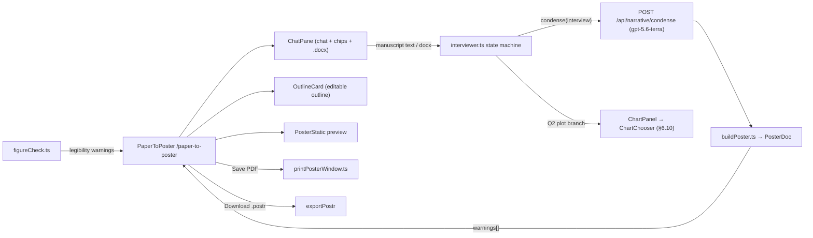

#### `pages/PaperToPoster.tsx` — pipeline host — route /paper-to-poster (chat + outline + preview + downloads)

(Inventory note: this page was covered by two slices — the pages slice and the export+manuscript slice. Entries merged below; where line refs differed between slices both are noted.)

**Elements**
- [ ] `<ChatPane>` — interview chat (text input, chips, .docx upload) — `PaperToPoster.tsx:293-301` — internals below; handlers `handleManuscriptText`/`handleDocxFile` here
- [ ] `<ChartPanel onClose>` — inline chart chooser (Q2 branch) — `PaperToPoster.tsx:309-314`
- [ ] `Try drafting again` — button — `PaperToPoster.tsx:324-330` — retries `condense()` (LLM call via `requestCondense`); shown only in condense-error phase
- [ ] `<OutlineCard onEdit>` — editable outline — `PaperToPoster.tsx:334-338`
- [ ] `Save PDF` — button — `PaperToPoster.tsx:344-350` — `handleSavePdf` → `openPosterPrintWindow` (print dialog flow)
- [ ] `Download .postr` — button — `PaperToPoster.tsx:351-357` — `exportPostr(poster.doc)` → downloads `{slug}.postr`
- [ ] `aria-label="Interview"` on chat section — `PaperToPoster.tsx:290-291`
- [ ] `aria-label="Poster preview"` on preview section — `PaperToPoster.tsx:320-321`
- [ ] `aria-label="Figure legibility warnings"` on warning list — `PaperToPoster.tsx:367-368`

**Copy**
- [ ] "From paper to poster" — h1 (must match routes.json) — `PaperToPoster.tsx:279`
- [ ] "Paste your manuscript, answer a few short questions, download a poster draft — a structured first pass you can print or refine in the editor." — lede/intro paragraph — `PaperToPoster.tsx:281-285`
- [ ] `That looks shorter than a manuscript — paste the full text (or upload the .docx) and I will take it from there.` — chat message (<50 words paste) — `PaperToPoster.tsx:86-87`
- [ ] `That file is too large. Export a lighter copy from Word, or paste the text instead.` — chat message (docx too_large) — `PaperToPoster.tsx:107-108`
- [ ] `Something went wrong reading that file. Try exporting it again from Word, or paste the text instead.` — chat message (docx parse_failed/empty) — `PaperToPoster.tsx:108-109`
- [ ] `You have reached the daily drafting limit — try again later.` — chat message (condense 429) — `PaperToPoster.tsx:141`
- [ ] `Something went wrong drafting your poster text. You can try again, or use Send Feedback if it keeps happening.` — chat message (condense failure) — `PaperToPoster.tsx:142`
- [ ] `Your browser blocked the print window — allow popups for this site and try again.` — chat message (popup blocked) — `PaperToPoster.tsx:227`
- [ ] `Something went wrong preparing the file. Try again, or use Send Feedback if it keeps happening.` — chat message (.postr export failure) — `PaperToPoster.tsx:253`
- [ ] `Reading your manuscript…` — busy string (docx ingest) — `PaperToPoster.tsx:262-263`
- [ ] `Drafting your poster text…` — busy string (condense) — `PaperToPoster.tsx:265-266`
- [ ] `Drafting your poster text…` — BusyIndicator label (empty preview pane) — `PaperToPoster.tsx:410-411`
- [ ] `This usually takes a few seconds.` — BusyIndicator hint — `PaperToPoster.tsx:412-414`
- [ ] `Your poster preview appears here once the questions are done.` — empty-state text — `PaperToPoster.tsx:416`
- [ ] `The .postr file opens in the editor for full control.` — helper text next to download buttons — `PaperToPoster.tsx:358-360`
- [ ] `Pinned section` — descriptor for pinned outline entries — `PaperToPoster.tsx:463`
- [ ] `Untitled section` — cut-list fallback heading — `PaperToPoster.tsx:487`
- [ ] `Little overlap with your main message` — cut-list fallback reason — `PaperToPoster.tsx:488`
- [ ] Dynamic `{warning}` list from `buildPosterDoc` — `PaperToPoster.tsx:377-383`
- [ ] Figure-legibility warning items are dynamic `{check.message}` from `figureCheck` (below) — `PaperToPoster.tsx:367-374`

**Graphics** — none directly; `<PosterStatic>` canvas preview render site `PaperToPoster.tsx:398`; `BusyIndicator` reused from components/ (§6.13).

#### `manuscript/audiencePresets.ts` — deterministic Q3-"Other" audience keyword matching

**Copy** (preset labels echoed back in the chat as `Got it — {label}.`; render site interviewer.ts:521)
- [ ] `Children` — preset label — `audiencePresets.ts:39`
- [ ] `Adolescents` — preset label — `audiencePresets.ts:55`
- [ ] `Undergraduates` — preset label — `audiencePresets.ts:71`
- [ ] `Clinicians` — preset label — `audiencePresets.ts:88`
- [ ] `Policymakers` — preset label — `audiencePresets.ts:112`
- [ ] `Industry` — preset label — `audiencePresets.ts:132`
- [ ] `General public` — preset label — `audiencePresets.ts:153`
- [ ] `Specialists in my subfield` — preset label — `audiencePresets.ts:178`
- [ ] `General researchers in my field` — preset label — `audiencePresets.ts:195`

#### `manuscript/buildDocumentModel.ts` — shared IngestItem[] → DocumentModel builder

No UI — logic only.

#### `manuscript/buildPoster.ts` — condensed narrative → PosterDoc (fixed 3-column 48×36 layout)

**Copy** (warnings surfaced in the yellow warning list on PaperToPoster)
- [ ] `Not enough room for the "{heading}" panel — it was left off. Open the poster in the editor to rearrange.` — warning — `buildPoster.ts:96`
- [ ] `The "{heading}" panel was clipped to fit — trim its text or rearrange in the editor.` — warning — `buildPoster.ts:118`
- [ ] `No room for the main figure next to the findings — add it in the editor.` — warning — `buildPoster.ts:226`
- [ ] `Only your highest-impact figure fit on the poster — {n} other {figure was|figures were} left out. Open it in the editor to add them.` — warning — `buildPoster.ts:238-240`
- [ ] `References trimmed to the 5 most relevant — the full list stays in your manuscript.` — warning — `buildPoster.ts:277`
- [ ] `No room for the reference list — add it in the editor.` — warning — `buildPoster.ts:293`
- [ ] `Untitled poster` — fallback title block content — `buildPoster.ts:155`

#### `manuscript/condenseClient.ts` — client for POST /api/narrative/condense (the one LLM call)

No UI — logic only. Failures map to `CondenseError('rate_limited'|'failed')`; user copy lives in PaperToPoster.tsx:141-142. API: `POST /api/narrative/condense` (condenseClient.ts:40).

#### `manuscript/coreRelevance.ts` — deterministic core-message relevance scoring

**Copy** (one-phrase reasons; render sites: OutlineCard entry reason via PaperToPoster entriesFrom, "Left off" cuts list)
- [ ] `This is your main message` — reason (core override) — `coreRelevance.ts:322`
- [ ] `You chose this to lead` — reason (user-ranking override) — `coreRelevance.ts:323`
- [ ] `You asked to keep this` — reason (pinned override) — `coreRelevance.ts:324`
- [ ] `Credits — rarely earns poster space` — reason (tier-4 acknowledgements) — `coreRelevance.ts:330`
- [ ] `Supplementary detail` — reason (tier-4 appendix) — `coreRelevance.ts:331`
- [ ] `Background reading, not your finding` — reason (tier-4 literature-review) — `coreRelevance.ts:332`
- [ ] `Little overlap with your main message` — reason (tier-4 default) — `coreRelevance.ts:333`
- [ ] `Shares the numbers behind your point` — reason (numbers signal dominant) — `coreRelevance.ts:335`
- [ ] `Direct evidence for your main message` — reason (tier 2) — `coreRelevance.ts:336`
- [ ] `Context readers need to trust the result` — reason (kind signal dominant) — `coreRelevance.ts:337`
- [ ] `Related to your main message` — reason (fallback) — `coreRelevance.ts:338`

#### `manuscript/docxIngest.ts` — .docx → DocumentModel via mammoth (dynamic import)

No UI — logic only. Error codes `docx_ingest_too_large|parse_failed|empty` (docxIngest.ts:24) are mapped to chat copy in PaperToPoster.tsx:106-109.

#### `manuscript/figureCheck.ts` — figure legibility (effective-DPI) gate

**Copy** (messages render in the orange warning list next to the download buttons, PaperToPoster.tsx:366-375; 'pass' is filtered out and never shown)
- [ ] `Your figure is sharp enough to print at this size.` — pass message (suppressed in UI) — `figureCheck.ts:90`
- [ ] `Your figure prints at about {dpi} DPI at this size — readable, but soft up close. Export it larger from your plotting software for a crisper result.` — warn message — `figureCheck.ts:92`
- [ ] `Your figure prints at about {dpi} DPI at this size, which will look blurry and its axis labels may be unreadable. Export it at a higher resolution and swap it in the editor.` — fail message — `figureCheck.ts:94`
- [ ] `We could not measure your figure’s resolution — check it looks sharp before printing.` — unknown message (note curly `’`) — `figureCheck.ts:96`

#### `manuscript/interviewer.ts` — the scripted interview state machine (the entire chat script)

**Elements** (chips — rendered as buttons in ChatPane.tsx:104-121; ids in parens)
- [ ] `A plot` — chip (`plot`) — `interviewer.ts:98` — sets resultDisplay=plot, opens ChartPanel
- [ ] `A table` — chip (`table`) — `interviewer.ts:99` — sets resultDisplay=table
- [ ] `{i+1}. {finding text, truncated to 90 chars}` — dynamic finding chips — `interviewer.ts:246-249` — sets finding ranking override
- [ ] `Keep this order` — chip (`keep-order`) — `interviewer.ts:250` — declines to reorder findings
- [ ] `Specialists in my subfield` — chip (`specialists`) — `interviewer.ts:113`
- [ ] `General researchers in my field` — chip (`general`), hint `Conference or department talk` — `interviewer.ts:114-118`
- [ ] `Other` — chip (`audience-other`) — `interviewer.ts:119` — goes to free-text audience step
- [ ] `Back to the options` — chip (`audience-back`) — `interviewer.ts:261` — returns to Q3 chips
- [ ] `Course requirement` — chip (`requirement`) — `interviewer.ts:133`
- [ ] `One-time presentation` — chip (`one-time`), hint `Present it once, no follow-up` — `interviewer.ts:134`
- [ ] `Committee meeting` — chip (`committee`) — `interviewer.ts:135`
- [ ] `Lab presentation` — chip (`lab-meeting`) — `interviewer.ts:136`
- [ ] `Getting feedback` — chip (`feedback`), hint `You want people to push back` — `interviewer.ts:137`
- [ ] `Finding collaborators` — chip (`collaborators`) — `interviewer.ts:138`
- [ ] `Job market` — chip (`job-market`) — `interviewer.ts:139`
- [ ] `Keeping: {heading}` / `Add: {heading}` — dynamic Q5 toggle chips, hint = section reason — `interviewer.ts:272-278` — toggles a pinned section
- [ ] `Looks right` — chip (`sections-done`) — `interviewer.ts:279` — confirms Q5 selection
- [ ] `No limit` — chip (`req-none`) — `interviewer.ts:284`
- [ ] `5 minutes` — chip (`req-5`) — `interviewer.ts:285`
- [ ] `10 minutes` — chip (`req-10`) — `interviewer.ts:286`
- [ ] `15 minutes` — chip (`req-15`) — `interviewer.ts:287`

**Copy** (every interviewer message, in script order)
- [ ] `Paste your manuscript below, or drop a .docx — I will read it and ask a few short questions about what to emphasise.` — opening message — `interviewer.ts:187`
- [ ] `Got it — {wordCount} words, {figureCount} figure{s}, {findingCount} finding{s} detected.` — ingest summary — `interviewer.ts:213`
- [ ] `What's the one thing someone should remember from your poster? One sentence, up to 25 words.` — Q1 — `interviewer.ts:231`
- [ ] `That's {words} words — can you get it under 25? The takeaway works hardest when it fits in one breath.` — Q1 over-length retry — `interviewer.ts:418`
- [ ] `How should your key results appear — as a table, or as a plot?` — Q2a — `interviewer.ts:301`
- [ ] `A plot usually condenses results better than a table on a poster.` — Q2a follow-up — `interviewer.ts:302`
- [ ] `I have opened the chart builder beside this chat — it walks you through picking the right figure.` — Q2a plot branch note — `interviewer.ts:446`
- [ ] `Which result leads? Pick one, or keep the order I found.` — Q2b — `interviewer.ts:313`
- [ ] `Who's reading this poster?` — Q3 — `interviewer.ts:318`
- [ ] `Who are they? A few words is enough.` — Q3-other — `interviewer.ts:324`
- [ ] `Noted — writing for {typed text}.` — Q3-other custom audience ack — `interviewer.ts:520`
- [ ] `Got it — {preset label}.` — Q3-other preset match ack — `interviewer.ts:521`
- [ ] `What's the poster for?` — Q4 — `interviewer.ts:329`
- [ ] `Beyond the main sections, these look closest to your point: {headings, comma-joined}. Add or remove anything, then confirm.` — Q5 with suggestions — `interviewer.ts:367`
- [ ] `Beyond the main sections, nothing else looks essential. Add anything you need, then confirm.` — Q5 without suggestions — `interviewer.ts:368`
- [ ] `2 extra sections is the most the poster can hold — drop one first, or confirm what you have.` — Q5 pin cap — `interviewer.ts:571`
- [ ] `Any limit on the presentation — a number of slides, or a time slot? Pick one or type it.` — Q6 — `interviewer.ts:375`
- [ ] `I could not read a number there — try "10 minutes" or "12 slides", or tap No limit.` — Q6 unparseable retry — `interviewer.ts:616`
- [ ] `Here is the outline I will build from — each panel shows which section it came from. Edit anything that reads wrong, then build your poster.` — outline handoff — `interviewer.ts:406`
- [ ] `I can help with your poster's structure — shall we keep going?` — bounded off-script reply (`OFF_SCRIPT_REPLY`) — `interviewer.ts:93-94`

**Copy** (user-echo bubbles composed by the machine — appear as user turns)
- [ ] `Keeping: {kept headings}` / `Nothing extra` — Q5 confirm echo — `interviewer.ts:547`
- [ ] `Drop: {heading}` / `Add: {heading}` — Q5 toggle echoes — `interviewer.ts:564,570,575`
- [ ] `{minutes} minutes` — Q6 chip echo — `interviewer.ts:597`
- [ ] `Back to the options` — audience-back echo — `interviewer.ts:665`

#### `manuscript/mapper.ts` — deterministic narrative mapper (roles, findings, cuts, warnings)

**Copy** (warnings — pushed into the chat transcript via ingestManuscript, interviewer.ts:226-228)
- [ ] `Background dropped — your title already carries the hook.` — warning — `mapper.ts:443`
- [ ] `No explicit research question found. A poster without a question is the most common structural failure — the outline lets you write one in.` — warning — `mapper.ts:470`
- [ ] `No quantitative findings detected in the Results section — the Key Findings panel will need your input.` — warning — `mapper.ts:520`
- [ ] `No discussion or conclusion found for the take-home message.` — warning — `mapper.ts:546`
- [ ] `Working from your title and abstract for now — your answer below will sharpen what gets kept.` — warning (derived core) — `mapper.ts:698`

**Copy** (role reasons — OutlineCard reason lines)
- [ ] `This is your main message` — core role reason — `mapper.ts:389`
- [ ] `Sets up why your point matters` — hook floor reason — `mapper.ts:429`
- [ ] `Every poster needs its question` — question floor reason — `mapper.ts:430`
- [ ] `Context readers need to trust the result` — methods floor reason — `mapper.ts:431`
- [ ] `The evidence for your main message` — keyResult floor reason — `mapper.ts:432`
- [ ] `This is your main message` — takeaway floor reason — `mapper.ts:433`

**Copy** (cut-kind reasons after blocklist penalty — "Left off" list)
- [ ] `Credits — rarely earns poster space` — acknowledgements — `mapper.ts:651`
- [ ] `Supplementary detail` — appendix — `mapper.ts:653`
- [ ] `Background reading, not your finding` — literature-review — `mapper.ts:655`
- [ ] `Caveats — kept only if they bound your claim` — limitations — `mapper.ts:657`
- [ ] `Little overlap with your main message` — default — `mapper.ts:659`

**Copy** (misc fallbacks)
- [ ] `Abstract` — source-heading label for abstract-sourced roles — `mapper.ts:450,480,553`
- [ ] `Additional Notes` — fallback heading for a pinned section with empty heading — `mapper.ts:725`
- [ ] `You asked to keep this` — pinned-section fallback reason — `mapper.ts:730`

#### `manuscript/parseManuscriptText.ts` — pasted-text ingest

No UI — logic only.

#### `manuscript/requirements.ts` — Q6 slides↔minutes derivation

**Copy** (echoed into the transcript via applyRequirements, interviewer.ts:623)
- [ ] `No limit noted — I will aim for a standard poster.` — describeRequirements none-branch — `requirements.ts:93`
- [ ] `{n} minute{s} is about {m} slide{s}, at a minute each. I will keep the poster to that much content.` — duration branch — `requirements.ts:98`
- [ ] `{m} slide{s} is about {n} minute{s}, at a minute each. I will keep the poster to that much content.` — slides branch — `requirements.ts:99`

#### `manuscript/rubric.ts` — the five-role poster spine as data (budgets, headings, descriptors)

**Copy** (displayHeading/descriptor render on the OutlineCard via PaperToPoster entriesFrom:445-446 and as poster panel headings via buildPoster)
- [ ] `Background` — hook displayHeading — `rubric.ts:36`
- [ ] `Why anyone should care` — hook descriptor — `rubric.ts:37`
- [ ] `Research Question` — question displayHeading — `rubric.ts:42`
- [ ] `The actual question or hypothesis` — question descriptor — `rubric.ts:43`
- [ ] `Methods` — methods displayHeading — `rubric.ts:48`
- [ ] `Only what is needed to trust the result` — methods descriptor — `rubric.ts:49`
- [ ] `Key Findings` — keyResult displayHeading — `rubric.ts:54`
- [ ] `Figure-led, 1-3 findings max` — keyResult descriptor — `rubric.ts:55`
- [ ] `Take-Home Message` — takeaway displayHeading — `rubric.ts:60`
- [ ] `What changes now` — takeaway descriptor — `rubric.ts:61`

#### `manuscript/sectionLexicon.ts` — heading → SectionKind classifier

No UI — logic only.

#### `manuscript/sectionRelevance.ts` — Q5 section ranking (derive-then-adjust)

**Copy** (reason strings — render as Q5 chip hints, interviewer.ts:277)
- [ ] `Its heading matches your main point` — reason — `sectionRelevance.ts:205`
- [ ] `Closely tied to your key result` — reason — `sectionRelevance.ts:206`
- [ ] `Shares wording with your takeaway` — reason — `sectionRelevance.ts:207`
- [ ] `Limitations — often expected in your field` — reason — `sectionRelevance.ts:208`
- [ ] `Background reading — usually cut` — reason — `sectionRelevance.ts:209`
- [ ] `Supplementary — usually cut` — reason — `sectionRelevance.ts:210`
- [ ] `Credits — usually a small footer` — reason — `sectionRelevance.ts:211`
- [ ] `Loosely related to your main point` — reason — `sectionRelevance.ts:212`
- [ ] `Untitled section` — fallback heading — `sectionRelevance.ts:248`

#### `manuscript/tableExtract.ts` — offers manuscript tables to the chart chooser

**Copy** (render in ChartPanel's offer list, ChartPanel.tsx:123-126)
- [ ] `{caption, truncated to 60 chars with …}` — table label — `tableExtract.ts:58`
- [ ] `Table {index+1}` — fallback label — `tableExtract.ts:60`
- [ ] `{rows} rows × {cols} columns` — summary line — `tableExtract.ts:95`

#### `manuscript/ui/ChatPane.tsx` — chat transcript, chip row, .docx upload, text input (presentational)

**Elements**
- [ ] Chip buttons — button — `ChatPane.tsx:105-120` — calls `onChip(chip.id)`; labels/hints from interviewer.ts chip constants (see above); rendered only when `chips.length > 0 && !busy`
- [ ] file input (`accept=".docx"`, visually hidden) — input — `ChatPane.tsx:128-138` — calls `onDocxFile(file)`; only on the manuscript step
- [ ] `Upload a .docx` — button — `ChatPane.tsx:139-146` — clicks the hidden file input; only on manuscript step
- [ ] message textarea — textarea — `ChatPane.tsx:150-168` — local draft state; Enter sends (not on manuscript step; Shift+Enter = newline)
- [ ] `Read it` (manuscript step) / `Send` (other steps) — button — `ChatPane.tsx:169-176` — calls `onSubmitText(text)`; disabled while busy or draft empty

**Copy**
- [ ] `Paste your manuscript here…` — textarea placeholder (manuscript step) — `ChatPane.tsx:18`
- [ ] `e.g. school nurses, policymakers…` — textarea placeholder (q3-audience-other) — `ChatPane.tsx:20`
- [ ] `e.g. 10 minutes, or 12 slides` — textarea placeholder (q6-requirements) — `ChatPane.tsx:22`
- [ ] `Type your answer…` — textarea placeholder (default) — `ChatPane.tsx:24`
- [ ] `{busy}` string prop — busy bubble text, e.g. "Reading your manuscript…" / "Drafting your poster text…" (values from PaperToPoster.tsx:263-265) — `ChatPane.tsx:97`
- [ ] `aria-live="polite"` on transcript container — `ChatPane.tsx:73`

**Graphics**
- [ ] busy dot — `span.postr-busy-dot` (CSS-animated dot, `aria-hidden`) — css — `ChatPane.tsx:96` — busy bubble in transcript

#### `manuscript/ui/ChartPanel.tsx` — Q2 plot-branch side panel hosting the ChartChooser inline

**Elements**
- [ ] `Open the full tool` — link (`<a href="/chart-chooser" target="_blank">`) — `ChartPanel.tsx:88-95` — opens /chart-chooser in a new tab
- [ ] `Close` — button, `aria-label="Close chart builder"` — `ChartPanel.tsx:96-103` — calls `onClose()` (closes panel via closeChartPanel)
- [ ] `{table.label}` + `{table.summary}` — dynamic per-extracted-table buttons — `ChartPanel.tsx:117-127` — picks that manuscript table as chart data
- [ ] `Use different data` — button — `ChartPanel.tsx:129-135` — dismisses the table offer, falls back to chooser's own ingest
- [ ] `<ChartChooser layout="panel" actions={[]}>` — embedded component (its internal elements belong to §6.10) — `ChartPanel.tsx:140-146`

**Copy**
- [ ] `Build your figure` — panel heading — `ChartPanel.tsx:82`
- [ ] `A plot usually reads better than a table at three feet.` — panel subheading — `ChartPanel.tsx:84`
- [ ] `I found a table in your manuscript. Use it?` — offer text (1 table) — `ChartPanel.tsx:112`
- [ ] `I found {n} tables in your manuscript. Use one?` — offer text (n tables) — `ChartPanel.tsx:113`
- [ ] `aria-label="Chart builder"` on the aside — `ChartPanel.tsx:77`

#### `manuscript/ui/OutlineCard.tsx` — the editable outline checkpoint (five panels + pins + cuts)

**Elements**
- [ ] per-entry textarea — textarea — `OutlineCard.tsx:115-125` — calls `onEdit(entry.key, value)`; placeholder only when entry.missing

**Copy**
- [ ] `Poster outline` — card eyebrow heading — `OutlineCard.tsx:48`
- [ ] `Left off` — cuts section label — `OutlineCard.tsx:58`
- [ ] `{cut.heading} — {cut.reason}` — cut list item — `OutlineCard.tsx:63`
- [ ] `from {provenance}` — provenance line per entry — `OutlineCard.tsx:91`
- [ ] `shortened to fit` — badge (truncated entries) — `OutlineCard.tsx:96`
- [ ] `core` — badge (tier-1 entry) — `OutlineCard.tsx:101`
- [ ] `needs your input` — badge (missing entries) — `OutlineCard.tsx:106`
- [ ] `Write the {heading, lowercased} here — {descriptor, lowercased}.` — missing-entry textarea placeholder — `OutlineCard.tsx:120`
- [ ] `{words}/{budgetWords} words` — word counter under each textarea — `OutlineCard.tsx:129`
- [ ] ` — over budget, the poster will clip this` — over-budget suffix — `OutlineCard.tsx:130`

#### `manuscript/ui/PosterStatic.tsx` — read-only natural-size PosterDoc renderer (preview + print source)

**Copy**
- [ ] `Figure {n}. ` — bold auto-number caption prefix — `PosterStatic.tsx:186`
- [ ] `Figure` — fallback img alt text (when no caption) — `PosterStatic.tsx:168`

**Graphics**
- [ ] `` — user figure images — img — `PosterStatic.tsx:166-175` — inside image blocks

#### `manuscript/ui/printPosterWindow.ts` — lean print-window shell for the standalone page

**Copy**
- [ ] `{title} — Print` — popup `<title>` — `printPosterWindow.ts:45`
- [ ] (No toolbar in this variant — auto-opens `window.print()` once fonts load; no buttons.)

---

### 6.16 Manuscript → Slides

The `/paper-to-slides` standalone pipeline: a chat wizard that walks 6 steps (Constraints → Star finding → Figures & tables → Narrative → Visuals & notes → Tweaks) to turn a manuscript into an ordered slide deck. Phase 1 builds a plain deck — LLM ranked-findings extraction via `POST /api/narrative/extract-findings`, a deterministic talk arc through `buildDeck`, a hard ≤30-word-per-slide gate, and speaker notes drawn (with provenance) from the paper. Phase 2 is an automatic design pass: Arm P (`POST /api/narrative/style-deck`) picks a device + positioned elements per slide and Arm T (`POST /api/narrative/theme`) returns a field-appropriate theme + 4 palettes; the two merge through the pure `applyTheme` into one shared `StyledSlideDeck` that feeds the PPTX writer, the client-side PDF writer, and the live preview — the `vibe` field re-runs Arm T alone to re-theme, PPTX-only utility slides (palette + icon library + 5 layout templates) are appended on export, and a count-mismatched styled response degrades gracefully to the plain deck. `pages/PaperToSlides.tsx` is the page shell host and `SlidesWizard.tsx` owns the whole flow (state, auto-design-pass effect, build/vibe/export handlers, the aligned-styled-deck trust guard). Monetization split: the polish is free to both formats (PDF *and* the styled preview), and only the editable `.pptx` is paid (spec §6).

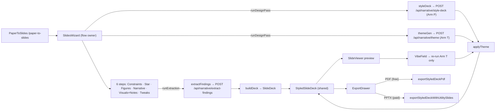

#### `apps/web/src/pages/PaperToSlides.tsx` — public page shell (header + crawler H1/intro + footer) around `<SlidesWizard/>`, lazy-loaded

**Elements**
- [ ] `<main>` page root — layout container — `PaperToSlides.tsx:28`
- [ ] `<PublicHeader />` — shared marketing header — `PaperToSlides.tsx:29`
- [ ] `<h1>` "From paper to slides" — page heading (must match routes.json `/paper-to-slides`.h1) — `PaperToSlides.tsx:35`
- [ ] `<SlidesWizard />` — the whole wizard flow — `PaperToSlides.tsx:43`
- [ ] `<PublicFooter />` — shared marketing footer — `PaperToSlides.tsx:46`

**Copy**
- [ ] "From paper to slides" — H1 (crawler-visible; mirrors routes.json injected string) — `PaperToSlides.tsx:35`
- [ ] "Paste your manuscript, answer a few short questions, and build an ordered slide deck — one finding per slide, with speaker notes drawn from your paper. Download a free PDF, or an editable PowerPoint." — lede/intro paragraph — `PaperToSlides.tsx:36-40`

**Graphics** — none directly; document meta (title/description) set via `useDocumentMeta(STATIC_ROUTE_META['/paper-to-slides'])` — `PaperToSlides.tsx:25`.

#### `apps/web/src/routes.tsx` — /paper-to-slides route + canonical-slug redirects

No UI — logic only. Lazy-imports `PaperToSlides` (`routes.tsx:103`) and mounts it at `/paper-to-slides` (`routes.tsx:135`). Two alias redirects funnel to the canonical slug: `/paper-to-present` → `<Navigate to="/paper-to-slides" replace />` (`routes.tsx:142-145`) and `/paper-to-presentation` → `<Navigate to="/paper-to-slides" replace />` (`routes.tsx:146-149`). Header comment notes vercel.json 308s these same aliases (`routes.tsx:16-18`, `45-48`).

#### `apps/web/src/manuscript/slides/SlidesWizard.tsx` — wizard shell: owns all flow state, the auto-design-pass effect, build/vibe/export handlers, and the styled-deck alignment guard

**Elements**
- [ ] `<StepBar>` — left step spine (foldable cards), `onToggle` sets active + toggles open — `SlidesWizard.tsx:353-361`
- [ ] `<section aria-label="Slide deck">` — main column container — `SlidesWizard.tsx:363-366`
- [ ] `<ProgressBar>` — top progress indicator (`current`/`total`/`label`) — `SlidesWizard.tsx:368-372`
- [ ] `<WizardStepBody>` — active step body / SlideViewer, wired to all handlers — `SlidesWizard.tsx:388-412`
- [ ] `<ExportDrawer>` — bottom drawer, `exportReady={Boolean(alignedStyledDeck)}`, `onExportPdf`/`onExportPptx` — `SlidesWizard.tsx:415-422`

**Copy**
- [ ] "PDF export is free." — Turn-1 tip (bold span) — `SlidesWizard.tsx:376`
- [ ] "PowerPoint (.pptx) export is paid." — Turn-1 tip (continuation) — `SlidesWizard.tsx:376-378`
- [ ] "Your manuscript is never stored on our servers, and is never used to train AI." — persistent privacy line — `SlidesWizard.tsx:382-383`

**Graphics** — none directly; slide thumbnails/preview and vibe UI live in `<SlideViewer>` (via `WizardStepBody`).

Logic notes (this file owns the flow):
- Wizard state: `activeStep`/`openSteps`, `constraints`, `docModel`, `findings`/`starIndex`, `builtDeck`, `styledDeck`/`palettes`/`vibe`, `designLoading`/`designError`, `exportOpen` — `SlidesWizard.tsx:96-130`.
- `runExtraction` — parses manuscript (cached `.docx` model or `parseConstraints`), calls `extractRankedFindings` (or `testHooks.extractClient`), advances to `starFinding` — `SlidesWizard.tsx:168-192`.
- `buildFromFindings` — promotes star to front, `deriveDeckInput` → `buildDeck`, resets prior styled state, advances to `narrative`, then fires `runDesignPass` — `SlidesWizard.tsx:195-236`.
- `runDesignPass` — Phase-2 auto design pass: `styleDeck` (Arm P) + `generateTheme` (Arm T) in `Promise.all`, `applyTheme` merges into one `StyledSlideDeck`; `designPassSeq` ref guards stale responses; failure keeps last-good styled deck (viewer degrades to plain) — `SlidesWizard.tsx:244-272`.
- `handleVibeSubmit` — re-runs `generateTheme(topic, vibe)` and re-`applyTheme`s to the EXISTING styled structure only (Arm P never re-runs); no-op if no styled deck — `SlidesWizard.tsx:278-296`.
- `alignedStyledDeck` trust guard — `styledDeck && styledDeck.slides.length === deck.slides.length ? styledDeck : null`; gates preview, vibe re-theme, AND export together so a count-mismatched styled response can never be exported when the viewer fell back to plain — `SlidesWizard.tsx:140-141`, consumed at `326-345`, `419`.
- `handleExportPptx` — `exportStyledDeckWithUtilitySlides(alignedStyledDeck, palettes)` → downloads `presentation.pptx`; guarded on `alignedStyledDeck` — `SlidesWizard.tsx:326-336`.
- `handleExportPdf` — `exportStyledDeckPdf(alignedStyledDeck)` → downloads `presentation.pdf` (omits pptx-only utility slides); guarded on `alignedStyledDeck` — `SlidesWizard.tsx:341-345`.

#### `apps/web/src/manuscript/slides/WizardStepBody.tsx` — main-column step switch; renders Constraints/StarFinding live, later steps as stubbed notes above the live `SlideViewer`

**Elements**
- [ ] `<ConstraintsStep>` — constraints step (paste/.docx, duration, format) — `WizardStepBody.tsx:84-89`
- [ ] "Find the key findings" `<button>` — runs extraction; disabled until manuscript text present — `WizardStepBody.tsx:90-97`
- [ ] `<StarFindingStep>` — ranked-findings picker — `WizardStepBody.tsx:105-112`
- [ ] "Build the deck" `<button>` — builds deck from findings; shown once findings exist and not loading — `WizardStepBody.tsx:113-121`
- [ ] `<SlideViewer>` — live deck preview + styled stage + vibe field — `WizardStepBody.tsx:135-145`

**Copy**
- [ ] "Find the key findings" — extraction trigger button label — `WizardStepBody.tsx:96`
- [ ] "Build the deck" — deck-build button label — `WizardStepBody.tsx:120`
- [ ] "The narrative arc is derived from your paper automatically. Editing the gap and resolution comes next." — `narrative` stub note — `WizardStepBody.tsx:51-52`
- [ ] "Figure and table selection is coming next." — `figures` stub note — `WizardStepBody.tsx:53`
- [ ] "Speaker notes are drawn from your paper. Visual styling comes next." — `visualsNotes` stub note — `WizardStepBody.tsx:54-55`
- [ ] "Per-slide tweaks are coming next." — `tweaks` stub note — `WizardStepBody.tsx:56`

**Graphics** — none directly; preview thumbnails render inside `<SlideViewer>`.

#### `apps/web/src/manuscript/slides/StepBar.tsx` — left step spine: one foldable card per step, documenting each step's collected input

**Elements**
- [ ] `<aside aria-label="Wizard steps">` — step-bar container — `StepBar.tsx:48-51`
- [ ] per-step `
` — card, accent-highlighted when active — `StepBar.tsx:59-67`
- [ ] header `<button>` (`aria-expanded`, `aria-current="step"`) — navigates/toggles the step — `StepBar.tsx:68-90`
- [ ] `<StepChip>` — numbered chip (ordinal, or ✓ when complete/active accent) — `StepBar.tsx:75`, def `126-159`
- [ ] `▸` disclosure caret (`aria-hidden`, rotates 90° when open) — `StepBar.tsx:83-89`
- [ ] open body `
` — lists input `<dl>` k/v rows — `StepBar.tsx:92-117`

**Copy**
- [ ] "Nothing recorded yet." — empty-state when a step has no input rows — `StepBar.tsx:99-100`
- [ ] "▸" — disclosure caret glyph — `StepBar.tsx:88`
- [ ] "✓" — completed-step chip glyph — `StepBar.tsx:143`

**Graphics** — none directly; chip/caret are text glyphs (✓, ▸); `data-motion-card`/`data-step-body` hooks drive GSAP entrances via the shell's `useWizardMotion`.

#### `apps/web/src/manuscript/slides/ProgressBar.tsx` — top progress indicator (label + count + filled track), one ARIA progressbar

**Elements**
- [ ] `
` (`aria-valuemin`/`aria-valuemax`/`aria-valuenow`/`aria-label`) — progress container — `ProgressBar.tsx:36-42`
- [ ] label `` — current step label — `ProgressBar.tsx:45`
- [ ] count `` — "{now} / {total}" — `ProgressBar.tsx:46-48`
- [ ] fill `
` — CSS width-transition track fill (`width: percent%`) — `ProgressBar.tsx:51-54`

**Copy**
- [ ] `Wizard progress — ${label}, step ${now} of ${total}` — progressbar `aria-label` template — `ProgressBar.tsx:41`
- [ ] `{now} / {total}` — visible step-count text — `ProgressBar.tsx:47`

**Graphics** — none directly; the fill is a styled `
` width transition, no SVG/icon.

#### `apps/web/src/manuscript/slides/stepConfig.ts` — authoritative ordered wizard step list, labels, and total

No UI — logic only. Exports `WIZARD_STEPS` (`['constraints','starFinding','figures','narrative','visualsNotes','tweaks']`, `stepConfig.ts:10-17`), the `StepId` type (`:19`), `STEP_TOTAL = WIZARD_STEPS.length` (`:22`), and `STEP_LABELS` (`:24-31`). Consumed by StepBar (render order + completion), ProgressBar (count), and SlidesWizard (active-index/labels). Note the on-screen spine order is constraints → star-finding → figures → narrative → visuals & notes → tweaks, but `buildFromFindings` advances directly to `narrative` after star-finding.

Label strings (Copy, `stepConfig.ts:25-30`):
- [ ] "Constraints" — `constraints` label — `stepConfig.ts:25`
- [ ] "Star finding" — `starFinding` label — `stepConfig.ts:26`
- [ ] "Figures & tables" — `figures` label — `stepConfig.ts:27`
- [ ] "Narrative" — `narrative` label — `stepConfig.ts:28`
- [ ] "Visuals & notes" — `visualsNotes` label — `stepConfig.ts:29`
- [ ] "Tweaks" — `tweaks` label — `stepConfig.ts:30`

#### `apps/web/src/manuscript/slides/ConstraintsStep.tsx` — wizard step 1: manuscript paste + .docx upload, talk length, aiming-for format

**Elements**
- [ ] Manuscript `<textarea id="p2s-manuscript">` — paste box — `ConstraintsStep.tsx:96-108`
- [ ] Hidden `<input type="file" accept=".docx">` — file picker — `ConstraintsStep.tsx:110-120`
- [ ] "Upload a .docx" trigger — button (opens file picker) — `ConstraintsStep.tsx:121-128`
- [ ] File-error `
` — error region — `ConstraintsStep.tsx:129-133`
- [ ] Talk length `<select id="p2s-duration">` — duration dropdown (options 5/10/15/20/30) — `ConstraintsStep.tsx:145-159`
- [ ] Format toggle buttons (pptx/pdf, `aria-pressed`) — segmented control — `ConstraintsStep.tsx:170-185`

**Copy**
- [ ] "Manuscript" — textarea label — `ConstraintsStep.tsx:94`
- [ ] "Paste your manuscript here…" — textarea placeholder — `ConstraintsStep.tsx:102`
- [ ] "Reading…" — busy button label — `ConstraintsStep.tsx:127`
- [ ] "Upload a .docx" — button label — `ConstraintsStep.tsx:127`
- [ ] "Something went wrong reading that file. Try pasting the text instead." — generic file-read error — `ConstraintsStep.tsx:81`
- [ ] "Talk length" — select label — `ConstraintsStep.tsx:143`
- [ ] "{m} minutes" — duration option label — `ConstraintsStep.tsx:156-157`
- [ ] "One slide per minute — {value.durationMinutes} content slides." — helper text — `ConstraintsStep.tsx:160-162`
- [ ] "Aiming for" — format group label — `ConstraintsStep.tsx:167`
- [ ] "PowerPoint" / "PDF" — format button labels — `ConstraintsStep.tsx:183`

**Graphics**
- none directly.

#### `apps/web/src/manuscript/slides/StarFindingStep.tsx` — wizard step 2: ranked finding cards, star selection, loading/error/empty branches

**Elements**
- [ ] Loading region `
` with busy dot — busy state — `StarFindingStep.tsx:37-45`
- [ ] Error `
` — error region — `StarFindingStep.tsx:51-53`
- [ ] "Try again" retry button — button — `StarFindingStep.tsx:54-60`
- [ ] Empty-state `
` — empty region — `StarFindingStep.tsx:66-71`
- [ ] Finding card buttons (`aria-pressed={isStar}`) — selectable list — `StarFindingStep.tsx:84-110`

**Copy**
- [ ] "Finding the key findings in your results…" — loading message — `StarFindingStep.tsx:43`
- [ ] "Something went wrong. Please try again." — generic error — `StarFindingStep.tsx:52`
- [ ] "Try again" — retry button label — `StarFindingStep.tsx:59`
- [ ] "No clear findings were detected in the results. Check that the manuscript includes a results section, then try again." — empty state — `StarFindingStep.tsx:68-70`
- [ ] "Pick your star finding — it leads the talk. The rest follow in order." — instruction — `StarFindingStep.tsx:76-78`
- [ ] "Star" — star badge label — `StarFindingStep.tsx:100`
- [ ] `“{finding.sourceQuote}”` — verbatim source quote on card — `StarFindingStep.tsx:108`

**Graphics**
- [ ] `postr-busy-dot` span — CSS busy indicator — `StarFindingStep.tsx:42`

#### `apps/web/src/manuscript/slides/SlideViewer.tsx` — deck preview: thumbnail rail, plain/styled active stage, word-count gate, speaker notes w/ provenance, VibeField mount

**Elements**
- [ ] ThumbnailRail `
` — thumbnail rail — `SlideViewer.tsx:161-166`
- [ ] Thumbnail buttons (`role="tab"`, `aria-selected`, `aria-label={`Slide ${i+1}: ...`}`) — per-slide select — `SlideViewer.tsx:170-190`
- [ ] Design-loading region `
` w/ busy dot — busy state — `SlideViewer.tsx:110-118`
- [ ] Design-error `
` — error region — `SlideViewer.tsx:119-123`
- [ ] StyledSlideStage `
` — styled stage — `SlideViewer.tsx:269-274`
- [ ] SlideStage `
` — plain stage — `SlideViewer.tsx:287-291`
- [ ] WordCount badge — N/30 word indicator — `SlideViewer.tsx:336-346`
- [ ] VibeField mount (gated on aligned styled deck) — re-theme input — `SlideViewer.tsx:141-145`
- [ ] SpeakerNotesStrip — speaker-notes list — `SlideViewer.tsx:349-372`

**Copy**
- [ ] "{i + 1} · {ROLE_LABEL}" — thumbnail role caption — `SlideViewer.tsx:184`
- [ ] ROLE_LABEL map: "Title", "Hook", "Question", "Methods", "Result", "Takeaway", "References" — role labels — `SlideViewer.tsx:55-63`
- [ ] "Styling your deck…" — design-loading message — `SlideViewer.tsx:116`
- [ ] "Something went wrong. Showing your deck unstyled for now." — design-error message — `SlideViewer.tsx:121`
- [ ] "Your slides will appear here once the deck is built." — empty stage — `SlideViewer.tsx:137`
- [ ] "{words}/{SLIDE_WORD_CAP} words" + " — trimmed to fit" (when cut) — word-count badge — `SlideViewer.tsx:344`
- [ ] "Evidence / figure" — figure placeholder — `SlideViewer.tsx:328`
- [ ] "Speaker notes" — notes heading — `SlideViewer.tsx:353`
- [ ] "No notes for this slide." — empty notes — `SlideViewer.tsx:356`
- [ ] `{note.provenance}` — provenance tag on each note — `SlideViewer.tsx:364`

**Graphics**
- [ ] `postr-busy-dot` span — CSS busy indicator (design-loading) — `SlideViewer.tsx:115`
- [ ] StyledElementView — positioned styled elements (background full-bleed, shape rects, text) rendered at (x,y)-inch→percent — `SlideViewer.tsx:209-252`
- [ ] Dashed "Evidence / figure" framed region — figure-slot placeholder — `SlideViewer.tsx:326-330`

#### `apps/web/src/manuscript/slides/ExportDrawer.tsx` — upward-expanding export surface: free-PDF card + paid-PPTX card (monetization copy contract)

**Elements**
- [ ] Export toggle button (`aria-expanded={open}`) — drawer toggle — `ExportDrawer.tsx:61-82`
- [ ] Not-ready `
` — styling-in-progress notice — `ExportDrawer.tsx:95-99`
- [ ] Free PDF ExportCard — free card — `ExportDrawer.tsx:102-127`
- [ ] "Download PDF" button (`disabled={!exportReady}`) — free CTA — `ExportDrawer.tsx:118-125`
- [ ] Paid PowerPoint ExportCard — paid card — `ExportDrawer.tsx:129-164`
- [ ] "Export PowerPoint (.pptx)" button (`disabled={!exportReady}`) — paid CTA — `ExportDrawer.tsx:154-161`

**Copy**
- [ ] "Export" — toggle label — `ExportDrawer.tsx:68`
- [ ] "{slideCount} slide{s}" — slide-count suffix — `ExportDrawer.tsx:71-72`
- [ ] "The polish is free." — promise (bold) — `ExportDrawer.tsx:89-91`
- [ ] "You never pay for beauty — you pay only for the editable file." — promise continuation — `ExportDrawer.tsx:92`
- [ ] "Styling your deck — export unlocks once it's done." — not-ready notice — `ExportDrawer.tsx:97`
- [ ] "Free" — PDF badge — `ExportDrawer.tsx:104`
- [ ] "PDF" — PDF card title — `ExportDrawer.tsx:106`
- [ ] "The full polished deck, print-ready." — PDF subtitle — `ExportDrawer.tsx:107`
- [ ] "Full polished deck — identical to paid" — PDF feature (incl) — `ExportDrawer.tsx:109`
- [ ] "Print-ready, final-form pages" — PDF feature (incl) — `ExportDrawer.tsx:110`
- [ ] `“Made by Postr.sh” mark on the acknowledgement slide (never over your content)` — PDF feature (incl) — `ExportDrawer.tsx:113`
- [ ] "Editable in PowerPoint" — PDF feature (excl) — `ExportDrawer.tsx:114`
- [ ] "Empty layout slides to duplicate" — PDF feature (excl) — `ExportDrawer.tsx:115`
- [ ] "Download PDF" — free button label — `ExportDrawer.tsx:124`
- [ ] "Paid" — PPTX badge — `ExportDrawer.tsx:130`
- [ ] "PowerPoint (.pptx)" — PPTX card title — `ExportDrawer.tsx:132`
- [ ] "The same polished deck — now yours to edit." — PPTX subtitle — `ExportDrawer.tsx:133`
- [ ] "Same polished deck — identical to the PDF" — PPTX feature (incl) — `ExportDrawer.tsx:135`
- [ ] "Real, editable text boxes" — PPTX feature (incl) — `ExportDrawer.tsx:136`
- [ ] "5 empty layout slides to duplicate" — PPTX feature (incl) — `ExportDrawer.tsx:137`
- [ ] "Icon-library slide, ready to reuse" — PPTX feature (incl) — `ExportDrawer.tsx:138`
- [ ] "4-palette slide, ready to reuse" — PPTX feature (incl) — `ExportDrawer.tsx:139`
- [ ] "No watermark" — PPTX feature (incl) — `ExportDrawer.tsx:140`
- [ ] "$18.99 CAD / 4-month term · or $9.99 for 3 exports" — canonical price line (PRICE_LINE const) — `ExportDrawer.tsx:47`, rendered `ExportDrawer.tsx:149`
- [ ] "Account asked only here — no card to preview." — account note — `ExportDrawer.tsx:152`
- [ ] "Export PowerPoint (.pptx)" — paid button label — `ExportDrawer.tsx:160`

**Graphics**
- [ ] "▴" chevron (rotates 180deg when open) — toggle affordance — `ExportDrawer.tsx:80`
- [ ] "✓" / "—" FeatureRow markers — included/excluded glyphs — `ExportDrawer.tsx:222`

#### `apps/web/src/manuscript/slides/VibeField.tsx` — optional vibe text input + 2 suggestion chips (re-runs theme only)

**Elements**
- [ ] Vibe `<input type="text">` (Enter submits) — vibe input — `VibeField.tsx:47-54`
- [ ] Suggestion buttons (tap fills+submits) — suggestion chips — `VibeField.tsx:58-66`

**Copy**
- [ ] "Describe the vibe, or leave blank to follow your narrative" — input placeholder — `VibeField.tsx:49`
- [ ] "Clean & minimal, lots of whitespace" — default suggestion 1 — `VibeField.tsx:23`
- [ ] "Confident & bold, strong headline emphasis" — default suggestion 2 — `VibeField.tsx:24`

**Graphics**
- none directly.

#### `apps/web/src/manuscript/slides/useWizardMotion.ts` — wizard's GSAP motion layer (scoped hook)

No UI — logic only. Scoped `useGSAP` hook driving: first-mount staggered fade+rise of step-bar cards (`[data-motion-card]`, 40ms stagger, `EASE_OUT`, 220ms), active-step body reveal (`[data-step-body][data-active="true"]`, `animateStepIn` 220ms), and export-drawer open reveal (`[data-export-body]`, `playExportDrawer` 280ms enter / 180ms exit, `EASE_DRAWER`). Gates every hide-then-reveal on `entranceAllowed()` (prefers-reduced-motion no-preference + `canAnimate()` hidden-tab guard); transform/opacity only via `autoAlpha`+`y`. Consumes `@gsap/react` useGSAP and `@/motion/canAnimate`; consumed by `SlidesWizard.tsx`.

#### `apps/web/src/manuscript/slides/wizardHelpers.ts` — pure/DOM utilities for the wizard shell

No UI — logic only. `placeholderDeck()` builds a placeholder `SlideDeck` through the real `buildDeck` (bogus author "Jane Doe", title "Your talk will appear here", plus placeholder gap/resolution/methods copy) so the shell renders before a real deck; `downloadBytes(bytes, filename, mimeType)` triggers a browser download via Blob + object URL. Wires to `../deck/buildDeck` and `../deck/types`; consumed by `SlidesWizard.tsx`. Note: placeholder copy strings live here — "Your talk will appear here" (title, `wizardHelpers.ts:16`), "Paste a manuscript to begin — the arc builds from your paper." (gap, `wizardHelpers.ts:20`), "Answer a few short questions and the deck assembles itself." (resolution, `wizardHelpers.ts:21`), "Methods, figures, and speaker notes come from your text." (methodsSummary, `wizardHelpers.ts:22`).

#### `apps/web/src/manuscript/deck/types.ts` — Phase-1 SlideDeck domain types (Slide/SlideDeck/SpeakerNote)

No UI — logic only.
Defines the dependency-free deck shape shared by the deterministic builder (`buildDeck.ts`) and the multi-slide PPTX writer (`export/pptx/deckWriter.ts`): `SlideRole` union (`types.ts:17-24`), `SpeakerNote` (`types.ts:26-29`), `Slide` with the anti-invention `sourceQuote` + `wordCapCut` fields (`types.ts:31-39`), `SlideDeck` (`types.ts:41-44`). No API, no consumer wiring beyond being imported by builder + writers.

#### `apps/web/src/manuscript/deck/styledTypes.ts` — Phase-2 StyledSlideDeck model + device vocabulary + shared `SHAPE_KINDS` classifier

No UI — logic only.
Defines the Phase-2 data model consumed by both writers (PPTX + PDF) and the live preview: `DeviceKind` (`styledTypes.ts:14`), `StyledElement` (`styledTypes.ts:16-23`), `StyledSlide` (`styledTypes.ts:25-29`), `Theme` (`styledTypes.ts:31-39`), `StyledSlideDeck` (`styledTypes.ts:41-45`), and the `SUPPORTED_DEVICES` vocabulary Arm P selects from (`styledTypes.ts:47-53`). `SHAPE_KINDS` is the single source of truth for which `kind` values render as a vector shape (rect/line/dot) vs text — shared by all three renderers (pptx `deckWriter.ts` `addKnownElement`, pdf `deckPdf.ts`, preview `SlideViewer.tsx` `StyledElementView`); it MUST stay in exact sync with `deckWriter.ts`'s switch, exact-match not substring (`styledTypes.ts:73-82`). `isShapeKind()` is the exact-match test (`styledTypes.ts:88-90`). No API call — pure types + one classifier.

#### `apps/web/src/manuscript/deck/buildDeck.ts` — deterministic Phase-1 deck assembly + ≤30-word gate application

No UI — logic only.
Assembles the fixed talk arc (title → hook → question → methods → one slide per ranked finding → references) from `BuildDeckInput` (`buildDeck.ts:18-33`); every CONTENT slide passes through `enforceSlideWordCap` via `gated()` (`buildDeck.ts:35-38`), finding count capped by `contentSlideCount(durationMinutes)` (`buildDeck.ts:118-119`). Intro references ride onto hook + question as provenance-tagged speaker notes; methods references onto the methods slide (`buildDeck.ts:40-43`, `88-100`, `112`). References slide merges + case-insensitively dedupes all reference lists and is NOT word-capped (`buildDeck.ts:50-64`, `132-143`). No API — imports `contentSlideCount` + `enforceSlideWordCap` from `./slideBudget`, consumes the shared manuscript pipeline's DocumentModel-derived findings.

**Copy**
- [ ] "References" — references-slide `assertion` label — `buildDeck.ts:137`

#### `apps/web/src/manuscript/deck/deriveDeckInput.ts` — deterministic DocumentModel → BuildDeckInput mapper (no LLM)

No UI — logic only.
Turns a parsed `DocumentModel` + duration + user-ranked findings into a `BuildDeckInput` with no model call: `gap` = first sentence of introduction/literature-review, else abstract, else title (`deriveDeckInput.ts:49-56`); `resolution` = first abstract sentence, else a paper-agnostic fallback (`deriveDeckInput.ts:63-67`); `methodsSummary` = first methods sentence (`deriveDeckInput.ts:73-77`); `references` in document order (`deriveDeckInput.ts:80-84`). `deriveDeckInput()` is pure/reproducible and routes all pasted refs onto the references slide in Phase 1 (`deriveDeckInput.ts:98-114`). `resultsTextForExtraction()` concatenates Results + Discussion prose for the extraction client (`deriveDeckInput.ts:121-125`). No API — feeds `buildDeck` + `extractFindings`.

**Copy**
- [ ] "The problem this work addresses." — `deriveGap` last-resort fallback — `deriveDeckInput.ts:55`
- [ ] "This study takes up that question directly." — `deriveResolution` fallback — `deriveDeckInput.ts:66`
- [ ] "Methods as described in the manuscript." — `deriveMethodsSummary` fallback — `deriveDeckInput.ts:76`
- [ ] "Untitled manuscript" — `title` fallback — `deriveDeckInput.ts:101`

#### `apps/web/src/manuscript/deck/slideBudget.ts` — slide-count-from-duration + ≤30-word content-slide gate

No UI — logic only.
`SLIDE_WORD_CAP = 30` (`slideBudget.ts:15`); `contentSlideCount(durationMinutes)` = one content slide per spoken minute, floor, min 3 (`slideBudget.ts:18-20`); `enforceSlideWordCap(text)` cuts at a word boundary after the LLM condense, never mid-word, returning `{ text, cut }` (`slideBudget.ts:23-27`). No API — consumed by `buildDeck.ts`.

#### `apps/web/src/manuscript/deck/extractFindings.ts` — client for POST /api/narrative/extract-findings (Phase-1 LLM ranked-findings extraction, Arm-independent)

No UI — logic only.
`extractRankedFindings(resultsText, opts)` ensures an anonymous-first Supabase session then POSTs to `/api/narrative/extract-findings` with `resultsText` + optional `context`, auth on (`extractFindings.ts:53-70`). Returns gated `RankedFinding[]` (`extractFindings.ts:19-24`); empty array is a legitimate non-error outcome. Fallback: 429 → throws `ExtractFindingsError('rate_limited', retryAfterSec)`; any other error → `console.error` then throws `ExtractFindingsError('failed')` — never surfaces raw error text (`extractFindings.ts:30-40`, `71-77`).

#### `apps/web/src/manuscript/deck/applyTheme.ts` — pure Arm-T recolor/re-size layer over a styled deck

No UI — logic only.
`applyTheme(deck, theme)` returns a new `StyledSlideDeck` (no mutation) recoloring every element to palette slot semantics and re-sizing text to the theme type scale; P's structure/positions/device/text untouched — this is what makes "re-vibe = re-run T only" cheap (`applyTheme.ts:99-128`). `roleToColorSlot` maps title/heading→ink[1], accent-*→accent[2], muted/footer→muted[3], bg/background→bg[0] (`applyTheme.ts:22-28`); `kindToTypeScaleKey` maps title→heading, body/quote→body, label→label (`applyTheme.ts:37-42`); `remapColor` deterministically re-slots known kinds (guards the invisible-on-dark-background re-vibe bug) and only preserves an existing off-slot color when the kind has no mapping and the color is already in the new palette (`applyTheme.ts:72-94`). No API — pure function; consumed by `SlidesWizard.tsx` `handleVibeSubmit`.

#### `apps/web/src/manuscript/deck/styleClient.ts` — client for POST /api/narrative/style-deck (Arm P: plain deck → structured StyledSlide[])

No UI — logic only.
`styleDeck(plainDeck, opts)` ensures an anonymous-first Supabase session then POSTs the plain `SlideDeck` to `/api/narrative/style-deck`, auth on, returning `StyledSlide[]` (one device + positioned elements per slide, same order) (`styleClient.ts:49-63`). Trusts the server's device-vocabulary gate (`coerceDevices` in `styleDeck.ts`) rather than re-validating. Fallback: 429 → throws `StyleDeckError('rate_limited', retryAfterSec)`; any other error → `console.error` then throws `StyleDeckError('failed')` (`styleClient.ts:29-39`, `64-70`).

#### `apps/web/src/manuscript/deck/themeClient.ts` — client for POST /api/narrative/theme (Arm T: field-appropriate Theme + 4 palette variations)

No UI — logic only.
`generateTheme(topic, vibe, opts)` ensures an anonymous-first Supabase session then POSTs `topic` + optional `vibe` to `/api/narrative/theme`, auth on, returning `{ theme, palettes }` where `palettes` are the 4 variations for the palette slide / re-vibe UI (`themeClient.ts:68-93`). Deliberately drops the api's extra `RawTheme.rationale` field by mapping only `palette`/`typeScale`/`accentTreatment` — an explicit, type-checked omission (`themeClient.ts:29-34`, `87-93`). Fallback: 429 → throws `ThemeGenError('rate_limited', retryAfterSec)`; any other error → `console.error` then throws `ThemeGenError('failed')` (`themeClient.ts:46-56`, `94-100`).

#### `apps/web/src/export/deck/exportStyledDeckWithUtilitySlides.ts` — orchestrates the FULL styled-deck pptx: styled content slides + palette + icon-library + 5 layout template slides, in one file

No UI — logic only.
`exportStyledDeckWithUtilitySlides(deck, palettes, options)` (`exportStyledDeckWithUtilitySlides.ts:179-213`) builds one `PptxGenJS` via `buildStyledDeckPptxInstance` (deckWriter), then appends in order: `addPaletteSlide` (`:187`), `await addIconLibrarySlide` with `pickIcons(topicKeywordsFromDeck(deck))` (`:189-192`), and `addTemplateSlides` (1 explainer + 5 named layouts) (`:210`); returns a single `pptx.write({outputType:'uint8array'})` (`:212`).
- `paletteStyleFromTheme` (`:57-65`), `masterPaletteFromTheme` maps the 4-slot `Theme.palette` → 7-field `MasterPalette` (`:111-125`), `templateStyleFromTheme` (`:131-139`), `topicKeywordsFromDeck` (`:147-160`).
- PDF path never sees these utility slides — pptx-only by construction (`:16-20`). `SLIDE_WIDTH_IN = 13.333` / `SLIDE_HEIGHT_IN = 7.5` (`:51-52`), `UTILITY_FONT = 'Arial'` (`:44`).

#### `apps/web/src/export/deck/paletteSlide.ts` — PPTX-only palette-swap utility slide (one labeled swatch row per curated palette)

No UI — logic only. `addPaletteSlide(pptx, palettes, style)` (`paletteSlide.ts:141-177`) appends one slide named `PALETTE_SLIDE_NAME` (`:27`, = `TEMPLATE_SLIDE_PREFIX + 'Palette swatches'`), white background, and one `addPaletteRow` per palette (`:71-120`) drawing real `rect` swatches (editable, never rasterized) plus a per-swatch hex label whose color is chosen by `readableLabelColor` luminance heuristic (`:127-134`).

**Copy**
- [ ] "Swap the deck’s palette" — slide heading (`HEADING_TEXT`) — `paletteSlide.ts:42`
- [ ] "Pick a row below, then select each shape in the deck and repaint it with these colors (Format Shape → Fill / Font Color). Delete this slide when you’re done." — slide body (`BODY_TEXT`) — `paletteSlide.ts:43-45`
- [ ] "Palette ${rowIndex + 1}" — per-row label — `paletteSlide.ts:80`
- [ ] "#${toHex6(color, 'CCCCCC')}" — per-swatch hex caption — `paletteSlide.ts:108`

**Graphics** — `rect` swatch shapes with solid theme-color fill, one per palette color (`paletteSlide.ts:100-107`). No icons.

#### `apps/web/src/export/deck/iconLibrarySlide.ts` — PPTX-only icon-library utility slide; ASYNC SVG→PNG raster of theme-recolored curated icons in a 6-column grid

No UI — logic only. `addIconLibrarySlide(pptx, icons, theme, options)` (`iconLibrarySlide.ts:158-202`) appends one slide named `ICON_LIBRARY_SLIDE_NAME` (`:38`, = `TEMPLATE_SLIDE_PREFIX + 'Icon library'`), background = theme `palette[0]`, and places up to `MAX_ICONS = 12` (`:41`) icons via `addIconCell` (`:106-145`). Each icon SVG is recolored by wrapping in `<svg style="color:#hex">` (`recolorIconSvg`, `:97-99`), rasterized to PNG through an injectable `SvgRasterizer` defaulting to `browserRasterizeSvg` (`:164`) — pptxgenjs cannot embed SVG; raster failures are dropped silently, never thrown (`:124`). Accent stroke = `themeAccentHex` (`palette[1]` → `palette[0]`, `:77-80`); label color = last palette entry (`:169`).

**Copy**
- [ ] "Icon library" — slide heading (`HEADING_TEXT`) — `iconLibrarySlide.ts:50`
- [ ] "Copy any icon below into your own slides. They already match the deck’s theme color. Delete this slide when you’re done." — slide body (`BODY_TEXT`) — `iconLibrarySlide.ts:51-53`
- [ ] `icon.label` — per-icon caption (from `iconSet.ts`) — `iconLibrarySlide.ts:135`

**Graphics** — theme-recolored curated icons rasterized to PNG and placed via `addImage` in a 6-col grid (`iconLibrarySlide.ts:127-133`); icon SVG sources come from `iconSet.ts`.

#### `apps/web/src/export/deck/iconSet.ts` — the 11 curated original CC0 icons + `pickIcons` tag-matcher

No UI — logic only. Exports `CURATED_ICONS` (`iconSet.ts:50-159`) — 10 hand-authored monochrome `currentColor` line glyphs (`flask`, `brain`, `chart`, `dna`, `book`, `clock`, `magnifier`, `bars`, `molecule`, `person`), each on a 24×24 grid via shared `ICON_ATTRS` (`:45-48`) — and `pickIcons(topicKeywords)` (`:172-199`) which tag-matches case-insensitively substring-both-ways (min keyword length 3, `:186`), de-dups by id, preserves order, and falls back to the full set on no match / empty input (`:177`, `:198`). `CuratedIcon` interface at `:34-43`. Icons are declared original work, CC0-equivalent, `currentColor` stroke (`:1-32`). Consumed by `iconLibrarySlide.ts` and `exportStyledDeckWithUtilitySlides.ts`.

#### `apps/web/src/export/pdf/deckPdf.ts` — client-side pdf-lib styled-deck PDF writer (real selectable text + vector shapes; utility slides omitted; trailing ack page)

No UI — logic only. `exportStyledDeckPdf(deck)` (`deckPdf.ts:246-261`) renders the shared `StyledSlideDeck` to PDF (13.33×7.5in, one page per slide) with embedded Helvetica / Helvetica-Bold, filtering out any slide flagged by `isUtilitySlide` (`:64-66`, marker kind `'template-marker'`, `:62`), then appends `addAckPage` (`:219-236`). `drawSlide` (`:188-215`) always fills the page with `themeBgHex` (= `deck.theme.palette[0]`) first, then dispatches per element: `background` → full-bleed rect; `isShapeKind` → `drawShapeElement` (kind wins over text, mirroring deckWriter's `addKnownElement`); else `text` → `drawTextElement`. Uses the shared `isShapeKind` from `styledTypes.ts` (`:41`). Ack mark = `ackMarkPngDataUri` embedded only on its own trailing page (`:32-38`, `:220-235`).

**Graphics** — vector text/rectangles via pdf-lib `drawText`/`drawRectangle` (never rasterized content); ack-mark PNG on the trailing page only (`deckPdf.ts:230-235`).

#### `apps/web/src/export/pptx/deckWriter.ts` (styled path) — the styled-deck pptx writer; `addKnownElement` switch is the authority for shape-vs-text

No UI — logic only. Styled path: `exportStyledDeckPptx(deck, options)` (`deckWriter.ts:343-350`) is a thin wrapper over `buildStyledDeckPptxInstance(deck, options)` (`:362-381+`), which is the seam `exportStyledDeckWithUtilitySlides` uses to append utility slides before the single `pptx.write()`. `defineLayout` sets `SLIDE_WIDTH_IN = 13.333` / `SLIDE_HEIGHT_IN = 7.5` (`:33-34`, `:368-372`); background = `deck.theme.palette[0]` (`:379`). `addStyledSlide` (`:320-328`) sets `slide.background` then `addElements` (`:291-302`), the single graceful-degradation choke point (unknown kind → plain text box or skipped, never thrown, `:296-300`). `addKnownElement` (`:218-282`) is THE AUTHORITY switch mapping element `kind` → shape vs text and MUST match `SHAPE_KINDS` in `styledTypes.ts` (the 8 shape-returning cases: `background`, `top-rule`/`accent-line`/`quote-rule`, `accent-dot`, `progress-track`, `progress-fill`, `callout-box`) (`:208-217`); text kinds via `addStyledText` (`:167-190`), shapes via `addStyledRect` (`:193-206`). `STYLED_FONT_FACE = 'Arial'` (`:156`). No images on this path (`:330-336`).

#### `apps/web/src/export/pptx/templateMarker.ts` — the `TEMPLATE_SLIDE_PREFIX` marker + `APPENDED_SLIDE_COUNT` cap

No UI — logic only. Exports `TEMPLATE_SLIDE_PREFIX = 'Postr template - '` (`templateMarker.ts:16`) — stamped by exporters, read by `import/pptx/parsePptx.ts` to avoid "skipped slide" warnings — and `APPENDED_SLIDE_COUNT = 8` (`templateMarker.ts:36`), the importer's CAP on how many prefixed slides count as Postr's own (explainer + 5 layouts + palette slide + icon slide). ASCII-only / no XML metacharacters because pptxgenjs interpolates the name into `<p:cSld name>` unescaped (`:9-15`).

#### `apps/api/src/narrative/styleDeck.ts` — Arm P provider: LLM deck-styling (device + positioned elements per slide) with the device-vocabulary gate

No UI — logic only. Provider-agnostic Arm P: `createOpenAiStyleProvider` (`styleDeck.ts:296-385`) posts a forced-tool-use `style_deck` call to `/chat/completions` with `reasoning_effort:'none'` (`:324`) and `max_completion_tokens: STYLE_MAX_TOKENS`; mirrors extractFindings/condense (injected `fetch`, zod-validated args, `StyleUpstreamError` with machine-readable `code`, `:114-127`). `SUPPORTED_DEVICES` = `plain`/`quote-block`/`progress-bar`/`stat-emphasis`/`callout` (`:52-58`, redefined by hand from web `styledTypes.ts`). `coerceDevices` (`:276-283`) is the device-vocabulary gate coercing any out-of-vocab device to `'plain'` (graceful degradation). `parseStyleOutput`/`RawStyleSchema` (`:234-264`), `STYLE_SYSTEM_PROMPT` (`:140-165`), `STYLE_TOOL_SCHEMA` (`:181-222`). Wired to route `POST /api/narrative/style-deck` (narrative.ts). Model `gpt-5.6-terra` via `STYLE_MODEL` (config.ts).

#### `apps/api/src/narrative/themeGen.ts` — Arm T provider: LLM theme generation (palette + type scale + exactly 4 palette variations); the `vibe` re-theme input

No UI — logic only. Provider-agnostic Arm T: `createOpenAiThemeProvider` (`themeGen.ts:255-345`) posts a forced-tool-use `generate_theme` call to `/chat/completions` with `reasoning_effort:'none'` (`:284`) and `max_completion_tokens: THEME_MAX_TOKENS`; mirrors styleDeck/extractFindings/condense (injected `fetch`, zod-validated args, `ThemeUpstreamError`, `:86-99`). `ThemeGenInput` carries optional `vibe` steering text — a "vibe" re-run re-invokes this arm alone (`:66-75`, `:1-8`). THE PALETTES-LENGTH-4 GUARD is `.length(4)` in `RawThemeOutputSchema` (`:225-228`) — a reply with 3 or 5 variations fails as `bad_tool_json`, no safe fallback (unlike styleDeck's device gate). `THEME_SYSTEM_PROMPT` (`:113-132`), `THEME_TOOL_SCHEMA` (`:187-202`), `parseThemeOutput` (`:236-242`). Feeds the deterministic `applyTheme` recolor step (web). Wired to route `POST /api/narrative/theme`. Model `gpt-5.6-terra` via `THEME_MODEL` (config.ts).

#### `apps/api/src/narrative/config.ts` — model + token/timeout config for all four narrative LLM arms

No UI — logic only. Single source of the model ids and ceilings the narrative routes swap by config, not code. `STYLE_MODEL = 'gpt-5.6-terra'` / `STYLE_MAX_TOKENS = 3000` (`config.ts:78`, `:84`); `THEME_MODEL = 'gpt-5.6-terra'` / `THEME_MAX_TOKENS = 1500` (`:103`, `:109`); `EXTRACTION_MODEL = 'gpt-5.6-terra'` / `EXTRACTION_MAX_TOKENS = 2048` (`:55`, `:61`); `CONDENSER_MODEL = 'gpt-5.6-terra'` / `CONDENSER_MAX_TOKENS = 4096` (`:29`, `:33`); shared `CONDENSER_TIMEOUT_MS = 60_000` used by all arms (`:38`); `CONDENSER_PROVIDER: 'openai'` (`:11`).

#### `apps/api/src/narrative.ts` (route registrations only) — registers the 3 Phase-1/2 endpoints, each mirroring the `/condense` middleware stack

No UI — logic only. Three route registrations, each `requireAuth(getSupabase)` (anonymous-ok) → `createRateLimiter({ maxPerWindow: 6, maxPerDay: 30 })` → zod validation → provider call → generic errors, mirroring `POST /api/narrative/condense` (`narrative.ts:247`). Error passthrough on all three: statuses 401/429/529 reach the client, everything else is a generic 502.
- `POST /api/narrative/extract-findings` (`narrative.ts:344-401`) — Phase-1 talk-path extraction; runs the verbatim fidelity gate `rankAndGate` after the model reply (`:374-377`); provider `createOpenAiExtractionProvider`, model `EXTRACTION_MODEL` (gpt-5.6-terra), error `extract_failed`.
- `POST /api/narrative/style-deck` (`narrative.ts:415-470`) — Arm P; runs `coerceDevices` device-vocabulary gate after the reply (`:444`); provider `createOpenAiStyleProvider`, model `STYLE_MODEL` (gpt-5.6-terra, `reasoning_effort:'none'`), error `style_failed`.
- `POST /api/narrative/theme` (`narrative.ts:486-533+`) — Arm T; palettes-length-4 guard lives in themeGen.ts's zod schema (rejected as `bad_tool_json` before the route); returns `{ theme, palettes }` (`:512`); provider `createOpenAiThemeProvider`, model `THEME_MODEL` (gpt-5.6-terra, `reasoning_effort:'none'`), error `theme_failed`.

**Copy**
- [ ] "The extraction provider API key is missing on the server." — provider-not-configured message (extract-findings) — `narrative.ts:362`
- [ ] "The style provider API key is missing on the server." — provider-not-configured message (style-deck) — `narrative.ts:434`
- [ ] "The theme provider API key is missing on the server." — provider-not-configured message (theme) — `narrative.ts:505`

#### `apps/web/src/components/PublicHeader.tsx` — shared public-page header; Tools nav (incl. Paper to slides) + mobile overflow menu

**Elements**
- [ ] `PublicHeader` header container — `<header>` — `PublicHeader.tsx:118`
- [ ] Brand wordmark link to `/` — `<Link>` — `PublicHeader.tsx:119`
- [ ] `NAV_LINKS.map` top-level nav links (includes `/paper-to-slides`) — `<Link>` (flat row, `sm:`-gated) — `PublicHeader.tsx:145-149`
- [ ] `MobileNav` overflow trigger — `<MobileNav>` — `PublicHeader.tsx:151`
- [ ] Feedback button (signed-in, desktop) — `<button>` title "Send feedback" — `PublicHeader.tsx:155-165`
- [ ] Profile link `/profile` — `<Link>` title "Profile & Settings" — `PublicHeader.tsx:166-175`
- [ ] Sign in link `/auth` (signed-out) — `<Link>` — `PublicHeader.tsx:178-184`
- [ ] Mobile overflow trigger — `<button>` `aria-label="Menu"`, `aria-expanded`, `aria-haspopup`, `aria-controls` — `PublicHeader.tsx:250-284`
- [ ] Mobile menu panel — `<ul>` `aria-labelledby` — `PublicHeader.tsx:287-311`
- [ ] `TOOL_LINKS.map` blurbed tool rows (includes `/paper-to-slides`) — `<Link>` — `PublicHeader.tsx:313-328`
- [ ] Learn-page rows (NAV_LINKS minus tools) — `<Link>` — `PublicHeader.tsx:332-344`
- [ ] Mobile "Send feedback" (signed-in) — `<button>` — `PublicHeader.tsx:351-361`

**Copy**
- [ ] "Paper to slides" — tool link label (TOOL_LINKS + NAV_LINKS) — `PublicHeader.tsx:50`
- [ ] "Turn a manuscript into a talk (coming soon)" — tool blurb (mobile menu row) — `PublicHeader.tsx:50`
- [ ] "Paper to poster" — tool link label — `PublicHeader.tsx:46`
- [ ] "Turn a manuscript into a poster draft" — tool blurb — `PublicHeader.tsx:47`
- [ ] "Plot picker" — tool link label — `PublicHeader.tsx:54`
- [ ] "Find the figure that fits your data" — tool blurb — `PublicHeader.tsx:55`
- [ ] "Pricing" — nav link label — `PublicHeader.tsx:72`
- [ ] "Why posters" — nav link label — `PublicHeader.tsx:73`
- [ ] "About" — nav link label — `PublicHeader.tsx:74`
- [ ] "Postr" — brand wordmark — `PublicHeader.tsx:127`
- [ ] "Feedback" — desktop feedback button label — `PublicHeader.tsx:164`
- [ ] "Sign in" — auth button label — `PublicHeader.tsx:183`
- [ ] "Send feedback" — mobile feedback button label — `PublicHeader.tsx:359`

**Graphics**
- [ ] Brand logo (rounded-rect + double-curve + center dot) — inline `<svg>` — `PublicHeader.tsx:120-125`
- [ ] Feedback speech-bubble icon — inline `<svg>` — `PublicHeader.tsx:161-163`
- [ ] Profile person icon — inline `<svg>` — `PublicHeader.tsx:171-174`
- [ ] Hamburger/close icon (toggles by `open`) — inline `<svg>` — `PublicHeader.tsx:261-283`

#### `apps/web/src/components/PublicFooter.tsx` — shared 4-column site footer; Product column links to Paper to slides

**Elements**
- [ ] `PublicFooter` footer container — `<footer>` — `PublicFooter.tsx:20`
- [ ] Brand link to `/` — `<Link>` — `PublicFooter.tsx:25`
- [ ] Product column — `<FooterColumn>` — `PublicFooter.tsx:42-48`
- [ ] `/paper-to-slides` footer link — `<FooterLink>` — `PublicFooter.tsx:46`
- [ ] `/paper-to-poster` footer link — `<FooterLink>` — `PublicFooter.tsx:45`
- [ ] `/chart-chooser` footer link — `<FooterLink>` — `PublicFooter.tsx:47`
- [ ] Learn column (About, Why posters, Send feedback) — `<FooterColumn>` — `PublicFooter.tsx:50-56`
- [ ] Account column (Sign in, Profile) — `<FooterColumn>` — `PublicFooter.tsx:58-61`
- [ ] Legal column (Privacy, Cookies, Terms) — `<FooterColumn>` — `PublicFooter.tsx:63-67`

**Copy**
- [ ] "Paper to slides" — Product column link — `PublicFooter.tsx:46`
- [ ] "Paper to poster" — Product column link — `PublicFooter.tsx:45`
- [ ] "Plot picker" — Product column link — `PublicFooter.tsx:47`
- [ ] "Home" — Product column link — `PublicFooter.tsx:43`
- [ ] "Pricing" — Product column link — `PublicFooter.tsx:44`
- [ ] "Product" — column heading — `PublicFooter.tsx:42`
- [ ] "Postr" — brand wordmark — `PublicFooter.tsx:32`
- [ ] "Built by researchers. Built for researchers." — brand tagline — `PublicFooter.tsx:35`
- [ ] "Send feedback" — Learn column button — `PublicFooter.tsx:54`
- [ ] "© {CURRENT_YEAR} Resila Technologies Inc." — copyright line — `PublicFooter.tsx:71`

**Graphics**
- [ ] Brand logo (rounded-rect + double-curve + center dot) — inline `<svg>` — `PublicFooter.tsx:26-31`

#### `apps/web/src/components/NewPosterButton.tsx` — dashboard entry point; "Import manuscript" link routes to paper-to-poster (Phase-1 manuscript entry) with privacy notice

**Elements**
- [ ] Primary "+ New poster" button — `<button>` — `NewPosterButton.tsx:60-67`
- [ ] "Import…" button — `<button>` `aria-label="Import an existing poster"` `data-postr-import-cta` — `NewPosterButton.tsx:68-78`
- [ ] Chevron "more options" button — `<button>` `aria-label="More poster options"` `aria-haspopup="menu"` `aria-expanded` — `NewPosterButton.tsx:79-89`
- [ ] "Import manuscript" link to `/paper-to-poster` — `<Link>` `data-postr-import-manuscript-cta` — `NewPosterButton.tsx:103-110`
- [ ] Privacy-notice paragraph — `
` — `NewPosterButton.tsx:111-114`
- [ ] Options dropdown — `
` — `NewPosterButton.tsx:117-149`
- [ ] "New blank poster" menu item — `<button role="menuitem">` — `NewPosterButton.tsx:127-134`
- [ ] "Import PDF / image / .postr…" menu item — `<button role="menuitem">` — `NewPosterButton.tsx:135-147`
- [ ] Error message — `
` — `NewPosterButton.tsx:151`
- [ ] `ImportPosterModal` (mode="new") — `<ImportPosterModal>` — `NewPosterButton.tsx:153-157`

**Copy**
- [ ] "+ New poster" — primary button label — `NewPosterButton.tsx:66`
- [ ] "Creating…" — primary button busy label — `NewPosterButton.tsx:66`
- [ ] "Import…" — import button label — `NewPosterButton.tsx:77`
- [ ] "Import manuscript" — paper-to-poster link label — `NewPosterButton.tsx:109`
- [ ] "Your manuscript is never stored on our servers, and is never used to train AI." — privacy notice — `NewPosterButton.tsx:112-113`
- [ ] "Failed to create poster" — fallback error message — `NewPosterButton.tsx:46`
- [ ] "New blank poster" — menu item label — `NewPosterButton.tsx:133`
- [ ] "Import PDF / image / .postr…" — menu item label — `NewPosterButton.tsx:142`
- [ ] "Text-only for image inputs · figures stay manual" — menu item sub-label — `NewPosterButton.tsx:145`

**Graphics**
- [ ] 📥 emoji (Import button + menu item) — inline emoji — `NewPosterButton.tsx:76,142`
- [ ] 📄 emoji (Import manuscript link) — inline emoji — `NewPosterButton.tsx:108`
- [ ] ▾ chevron glyph — text glyph — `NewPosterButton.tsx:88`
- [ ] ＋ glyph (New blank poster item) — text glyph — `NewPosterButton.tsx:133`

#### `apps/web/src/seo/routes.json` — per-route SEO meta; `/paper-to-slides` title/description/h1/copy

No UI — data only. Defines the SEO metadata injected at build time for `/paper-to-slides` (marketing group).

**Copy** (verbatim from the `/paper-to-slides` entry, `routes.json:108-119`)
- [ ] "Paper to Slides: Turn a Manuscript into a Deck | Postr" — title — `routes.json:109`
- [ ] "Turn a paper into an editable slide deck. Paste a manuscript or upload a Word file, answer a few short questions, and download a free PDF or a PowerPoint." — description — `routes.json:110`
- [ ] "index,follow" — robots — `routes.json:111`
- [ ] "From paper to slides" — h1 — `routes.json:112`
- [ ] "Turn a paper into a slide deck. Paste your manuscript or upload a .docx, answer a few short questions about your talk, and build an ordered deck — no editor session required." — copy[0] — `routes.json:114`
- [ ] "The deck follows the arc a research talk needs: the most important result first, the gap and tension it resolves, then methods and figures as fill-ins. One finding per slide, each under a hard word budget so the slide never competes with the speaker." — copy[1] — `routes.json:115`
- [ ] "Every slide carries speaker notes taken from your paper, each showing which section it came from, so nothing on a slide is invented." — copy[2] — `routes.json:116`
- [ ] "Your manuscript is never stored on our servers and is never used to train models. Download a free PDF, or an editable PowerPoint you can open in PowerPoint, Keynote, Google Slides, or LibreOffice." — copy[3] — `routes.json:117`

#### `apps/web/vercel.json` — Vercel edge config; alias redirects → `/paper-to-slides`

No UI — config only. Two permanent (308) redirects fold the alias spellings onto the canonical route:
- [ ] `/paper-to-present` → `/paper-to-slides` (`"permanent": true`) — `vercel.json:19-23`
- [ ] `/paper-to-presentation` → `/paper-to-slides` (`"permanent": true`) — `vercel.json:24-28`

(No rewrite entry for `/paper-to-slides` itself — it is a real prerendered marketing route, not one of the SPA-shell rewrites at `vercel.json:30-44`.)

---

### 6.17 Presentation Checker

The standalone reviewer for posters AND talks (spec §1: one unified surface). Two surfaces share one pipeline: the `/presentation-checker` page (upload a poster PDF, a talk deck `.pptx` / `.pdf`, or an image) and the editor's `review` sidebar tab (the Postr-native input — the review gets both the rendered capture AND the structured PosterDoc, so its fix cards jump straight to the block). A review returns per-dimension scores (narrative / design / content, each /5), an attention summary, an optional priority call, and anchored fix cards with a personalized rewritten example each. Paywall (D4, resolved server-side): the one-time **review pack** (`review_pack`, payment-mode SKU → `grant_review_credits` +`REVIEW_PACK_CREDITS = 3`, `apps/api/src/billing.ts:54`) or the term-riding **weekly add-on** (`review_addon`, subscription-mode SKU → a 7-day-window quota enforced API-side, `REVIEW_ADDON_WEEKLY_QUOTA = 4` placeholder pending repricing, `apps/api/src/review/config.ts:54`). One follow-up is included in the initial credit and disclosed up front ("This is your one follow-up — the review closes after it."); the follow-up closes the review and a third critique is refused server-side (`409 review_closed`, `apps/api/src/review.ts:610` — terminal in the DB, not just hidden in UI). Credits are consumed AFTER a successful critique (D6) with compensation on a persistence failure — typed ingest/upstream failures never burn one. Route gating (D12): registered and public but deliberately unlinked + noindex until the launch checklist flips the SEO record to `static`. PPTX input renders server-side via LibreOffice + pdftoppm and ships last (D10 — needs the Docker-based Render service). User-visible copy names the workflow, never "AI" (D15).

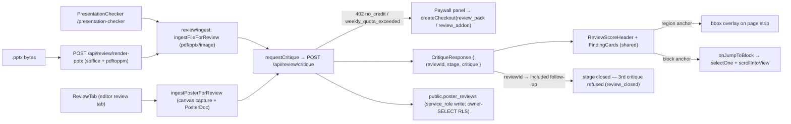

#### `apps/web/src/routes.tsx` — /presentation-checker route (registered, unlinked — D12)

No UI — logic only. Lazy-imports `PresentationChecker` (`routes.tsx:108`) and mounts it at `/presentation-checker` (`routes.tsx:146`). Header comment marks it "public, code-split, noindex; registered but not linked from nav — D12" (`routes.tsx:15-17`).

#### `apps/web/src/pages/PresentationChecker.tsx` — standalone review page: upload card, score header, finding cards with region overlays, one-follow-up flow, paywall panel, past-reviews list

**Elements**
- [ ] `<main>` page root + `<PublicHeader />` / `<PublicFooter />` chrome — `PresentationChecker.tsx:244-245`, `:543`
- [ ] `<h1>` "Presentation Checker" — page heading — `PresentationChecker.tsx:247`
- [ ] Always-mounted sr-only `<input id="review-file" type="file" accept=".pdf,.pptx,.png,.jpg" aria-label="File to review">` — the ONE input; every trigger is a real button forwarding the click (the follow-up needs it during the results phase) — `PresentationChecker.tsx:257-270`
- [ ] Upload card `<section aria-label="Start a review">` with `busyProps(busy)` — `PresentationChecker.tsx:443-447`
- [ ] "Choose a file" `<button>` — opens the picker — `PresentationChecker.tsx:483-489`
- [ ] `<BusyIndicator>` — ingesting/reviewing busy state — `PresentationChecker.tsx:448-460`
- [ ] Error `
` + "Try again" `<button>` — `PresentationChecker.tsx:461-473`
- [ ] Results `<section aria-label="Review results">` — `PresentationChecker.tsx:280`
- [ ] `<ReviewScoreHeader scores={…}>` — three /5 dimension tiles — `PresentationChecker.tsx:281`
- [ ] "How a first-time viewer reads it" attention-summary block — `PresentationChecker.tsx:283-290`
- [ ] "Priority call" banner (when `prioritization` present) — `PresentationChecker.tsx:292-301`
- [ ] Page strip `
` — thumbnails + `data-testid="region-overlay"` bbox overlay (normalized [x, y, w, h] fractions, D7) — `PresentationChecker.tsx:305-327`
- [ ] "Fix cards ({n})" severity-grouped `<FindingCard>` list — region anchors wire `onJump` → `setActiveRegion` — `PresentationChecker.tsx:329-367`
- [ ] Follow-up `<section aria-label="Follow-up review">` (stage 'initial') — "Request your one follow-up" → disclosure → "Choose the revised file" / "Not yet" — `PresentationChecker.tsx:369-421`
- [ ] Closed `<section aria-label="Review closed">` — "Start a new review" (`resetForNewReview`) — `PresentationChecker.tsx:422-438`
- [ ] Past-reviews `<section aria-label="Your past reviews">` — signed-in only, non-empty only — `PresentationChecker.tsx:512-539`
- [ ] `<ReviewPaywallPanel>` — replaces the working view on 402; the artifact stays in state so a successful purchase can simply re-run — `PresentationChecker.tsx:272-278`, def `:557-660`

**Copy**
- [ ] "Presentation Checker" — H1 — `PresentationChecker.tsx:247`
- [ ] "Get feedback on your poster or talk — scores for narrative, design, and content, plus fix cards anchored to the exact spots to change." — lede — `PresentationChecker.tsx:248-251`
- [ ] "Upload a poster PDF, talk deck, or image" — upload card title — `PresentationChecker.tsx:476-478`
- [ ] "PDF, PPTX, PNG, or JPG — up to 24 pages. Nothing is published; the review is only for you." — upload helper — `PresentationChecker.tsx:479-482`
- [ ] "Choose a file" — upload button label — `PresentationChecker.tsx:488`
- [ ] "Preparing your file for review…" / "Reading your poster or talk…" — busy labels (ingesting / reviewing) — `PresentationChecker.tsx:449-454`
- [ ] "Large files can take a moment." / "A full review usually takes under a minute." — busy hints — `PresentationChecker.tsx:455-459`
- [ ] "Working on a poster in Postr? Open it in the editor and run the review from the new review tab in the sidebar." — editor cross-link (signed-in only; "review" bolded) — `PresentationChecker.tsx:491-500`
- [ ] "You're browsing as a guest — upload a file to start; you'll create a free account to run the review." — guest note — `PresentationChecker.tsx:502-507`
- [ ] "How a first-time viewer reads it" — attention heading — `PresentationChecker.tsx:284-286`
- [ ] "Priority call" — prioritization label — `PresentationChecker.tsx:294-296`
- [ ] "Fix cards ({result.critique.findings.length})" — findings heading — `PresentationChecker.tsx:330-332`
- [ ] "Your one follow-up" — follow-up heading — `PresentationChecker.tsx:374-376`
- [ ] "Revise against these cards, then run the follow-up — it checks your revision against these exact findings." — follow-up body — `PresentationChecker.tsx:379-382`
- [ ] "Request your one follow-up" — follow-up arm button — `PresentationChecker.tsx:388`
- [ ] "This is your one follow-up — the review closes after it." — disclosure (`role="note"`) — `PresentationChecker.tsx:393-395`
- [ ] "Pick the revised file — the follow-up reads it against the findings above." — disclosure body — `PresentationChecker.tsx:396-399`
- [ ] "Choose the revised file" / "Not yet" — disclosure buttons — `PresentationChecker.tsx:409`, `:416`
- [ ] "This review is closed — the follow-up was its last pass. A fresh review uses a new credit." — closed body — `PresentationChecker.tsx:427-430`
- [ ] "Start a new review" — reset button — `PresentationChecker.tsx:436`
- [ ] "Try again" — error dismiss — `PresentationChecker.tsx:471`
- [ ] `INGEST_ERROR_MESSAGES` — one typed line per failure kind (never a silent truncation): "That file has more than 24 pages — trim it to 24 pages or fewer and try again." (too-many-pages) · "That file type is not supported — upload a PDF, PPTX, PNG, or JPG." (unsupported-mime) · "That file is too large to review — export a lighter copy and try again." (file-too-large) · "We couldn't read that file — try exporting it again from the app that made it." (unreadable-file) · "That file rendered blank — check it opens correctly and try again." (blank-render) · "Something went wrong uploading your file. Try again, or use Send Feedback if it keeps happening." (upload-failed) · "Something went wrong preparing your file. Try again, or use Send Feedback if it keeps happening." (server-render-failed) — `PresentationChecker.tsx:73-88`
- [ ] Critique-error mapping: "That review is already closed — start a new one instead." (`review_closed`) · "That review is not ready for its follow-up yet — run the initial review first." (`review_not_complete`) · "One of the page images is too large to review — export a lighter copy and try again." (`image_too_large`) · 429 arrives with the human wait already in the message · generic "Something went wrong reviewing your file. Try again, or use Send Feedback if it keeps happening." — `PresentationChecker.tsx:90-108`
- [ ] "Your past reviews" — history heading — `PresentationChecker.tsx:513-516`
- [ ] `STAGE_LABELS`: "Initial review" / "Follow-up" / "Closed" — history stage labels — `PresentationChecker.tsx:66-70`
- [ ] `SOURCE_LABELS`: "Postr poster" / "PDF" / "Slides" / "Image" — fallback filename by source kind — `PresentationChecker.tsx:59-64`
- [ ] "Narrative {n}/5 · Design {n}/5 · Content {n}/5" — history score line — `PresentationChecker.tsx:528-533`
- [ ] Paywall (`aria-label="Unlock reviews"`): "Get feedback on your poster or talk" — heading — `PresentationChecker.tsx:587-593`
- [ ] "A review scores your narrative, design, and content, then walks you through fix cards anchored to the exact spots to change — each with a rewritten example from your own content. One follow-up review is included, so you can check your revision." — paywall body — `PresentationChecker.tsx:594-599`
- [ ] "You've used this week's reviews — your next weekly review opens up in {formatRetryAfter(retryAfterSec)}. A review pack works right away." — weekly-quota line (`role="status"`; the wait clause only with `retryAfterSec`) — `PresentationChecker.tsx:600-611`
- [ ] "Get the review pack" — `buy('review_pack')` — `PresentationChecker.tsx:613-619`
- [ ] "Add weekly reviews to your term" — `buy('review_addon')`, term holders only (D4 — without an active term the weekly quota unlocks nothing) — `PresentationChecker.tsx:620-627`
- [ ] "The weekly review add-on rides on the semester term — start the term to add it." — non-term note (`<a href="/pricing">`) — `PresentationChecker.tsx:628-636`
- [ ] "You're working as a guest — you'll create a free account (or sign in with Google) first, so your purchase and reviews stay yours across devices." — paywall guest note — `PresentationChecker.tsx:638-644`
- [ ] "Something went wrong starting checkout. Try again, or use Send Feedback so we can look into it." — checkout-failure alert — `PresentationChecker.tsx:645-650`
- [ ] "Back to the upload" — paywall dismiss — `PresentationChecker.tsx:651-657`

**Graphics**
- [ ] `data-testid="region-overlay"` — absolute orange bbox highlight (`border-[#f97316] bg-[#f9731622]`) over the active page thumbnail — `PresentationChecker.tsx:313-324`

Logic notes (this file owns the standalone flow):
- `startReview(job, { reviewId })` — the ONE path every review takes: ingest → critique; ingest failures map to typed messages, 402 → paywall (phase back to 'idle'), everything else console-logged first then a generic line (the export-flow house rule) — `PresentationChecker.tsx:163-219`.
- `tempPathsRef` — review-temp storage paths of every ingested page, deleted fire-and-forget on unmount and on "Start a new review" (`cleanupReviewTemp` — never awaited; navigation must not wait on storage) — `PresentationChecker.tsx:127-130`, `:146-155`, `:227-239`.
- Follow-up — "Choose the revised file" sets `pendingFollowup` and reuses the always-mounted input; `handleFile` forwards `result.reviewId` — `PresentationChecker.tsx:221-225`, `:400-418`.
- Entitlements are NOT pre-gated here — the server resolves them (D4); the client plan read only decides which checkout path a button takes (guest → stash + `/auth?plan={sku}`, signed-in → `createCheckout`) — `PresentationChecker.tsx:19-22` header, `:572-584`.
- History — `listMyReviews()` on mount (signed-in, non-guest) + after each completed review — `PresentationChecker.tsx:132-144`, `:206`.

#### `apps/web/src/review/FindingCards.tsx` — shared score header + finding card (BOTH review surfaces — one component so they can never drift)

**Elements**
- [ ] `<ReviewScoreHeader>` — `aria-label="Review scores"`; three tiles `data-testid="score-narrative|score-design|score-content"` — `FindingCards.tsx:116-143`
- [ ] `<FindingCard>` — whole card becomes `role="button"` + Enter/Space keyboard jump when `onJump` set — `FindingCards.tsx:59-113`
- [ ] dimension + severity + action `<Chip>`s — `FindingCards.tsx:48-57`, `:89-93`
- [ ] personalized-example `<blockquote>` — `FindingCards.tsx:100-102`

**Copy**
- [ ] `DIMENSION_LABELS`: "Narrative" / "Design" / "Content" — `FindingCards.tsx:21-25`
- [ ] `SEVERITY_LABELS`: "High impact" / "Medium" / "Polish" — `FindingCards.tsx:27-31`
- [ ] `ACTION_LABELS`: "Cut" / "Demote to appendix" / "Show visually" / "Condense" / "Keep as primary" / "Add" — `FindingCards.tsx:39-46`
- [ ] "Tradeoff: {tradeoff}" — optional reviewer tradeoff line — `FindingCards.tsx:103-107`
- [ ] "→ click to see it" — jump hint on `onJump` cards — `FindingCards.tsx:108-110`
- [ ] "{score}/5" — per-dimension score text — `FindingCards.tsx:137-139`

**Graphics** — none directly; chips are colored text (`SEVERITY_COLORS` `#f38ba8` / `#f9e2af` / `#89b4fa` — `FindingCards.tsx:33-37`).

#### `apps/web/src/poster/sidebar/ReviewTab.tsx` — the editor `review` tab: Postr-native review with block-jump fix cards

**Elements**
- [ ] "Review this poster" `<button>` — runs capture + critique; disabled while `!doc || !posterId || running` — `ReviewTab.tsx:204-218`
- [ ] `<BusyIndicator inline label="Reading your poster…">` — busy button state — `ReviewTab.tsx:213-215`
- [ ] Failure `
` — `ReviewTab.tsx:225-230`
- [ ] `<ReviewScoreHeader>` + "How a first-time viewer reads it" + "Priority call" + severity-grouped `<FindingCard>`s — block anchors wire `onJump` → `onJumpToBlock(blockId)` (`jumpFor`) — `ReviewTab.tsx:232-306`, `:160-164`
- [ ] Follow-up block — "Request your one follow-up" → disclosure → "Run the follow-up" / "Not yet" — `ReviewTab.tsx:308-359`
- [ ] "Start a new review" — `startFresh` (temp cleanup + `run()`) — `ReviewTab.tsx:360-375`
- [ ] `<PaywallPanel>` — reached from the plan pre-gate (`!plan.canReview && !result`) OR a 402 — the pre-gate never hides a mid-review result (the included follow-up must stay reachable at zero credits); never flashes while the plan loads — `ReviewTab.tsx:176-190`, def `:388-447`

**Copy**
- [ ] "Get a scored review of this poster — narrative, design, and content — with fix cards that jump to the block they affect. One follow-up is included." — tab intro — `ReviewTab.tsx:199-203`
- [ ] "Review this poster" — run button label — `ReviewTab.tsx:216`
- [ ] "Reading your poster…" — busy label — `ReviewTab.tsx:214`
- [ ] "Uses one review credit, or your weekly add-on review." — credit hint — `ReviewTab.tsx:219-221`
- [ ] "Something went wrong. Try again, or use Send Feedback so we can look into it." — failure line — `ReviewTab.tsx:226-229`
- [ ] "Revise the poster, then run the follow-up — it checks your revision against these exact findings." — follow-up body — `ReviewTab.tsx:315-318`
- [ ] "Request your one follow-up" — follow-up arm button — `ReviewTab.tsx:324`
- [ ] "This is your one follow-up — the review closes after it." — disclosure — `ReviewTab.tsx:329-331`
- [ ] "The follow-up re-reads your poster exactly as it is now — make your edits first." — disclosure body — `ReviewTab.tsx:332-335`
- [ ] "Run the follow-up" / "Not yet" — disclosure buttons — `ReviewTab.tsx:346`, `:353`
- [ ] "This review is closed — the follow-up was its last pass. A fresh review uses a new credit." — closed body — `ReviewTab.tsx:362-365`
- [ ] "Start a new review" — closed reset button — `ReviewTab.tsx:372`
- [ ] Paywall: "Get feedback on your poster" — heading — `ReviewTab.tsx:409-411`
- [ ] "A review scores narrative, design, and content, then gives you fix cards that jump to the exact block to change — each with a rewritten example from your own poster. One follow-up review is included." — paywall body — `ReviewTab.tsx:412-416`
- [ ] "You've used this week's reviews — your next weekly review opens up in {formatRetryAfter(retryAfterSec)}. A review pack works right away." — quota line (`role="status"`) — `ReviewTab.tsx:417-428`
- [ ] "Get the review pack" / "Add weekly reviews" — SKU buttons (add-on term-holders only) — `ReviewTab.tsx:429-438`
- [ ] "Something went wrong starting checkout. Try again, or use Send Feedback so we can look into it." — checkout-failure alert — `ReviewTab.tsx:439-445`

**Graphics** — none.

Logic notes:
- `inFlightRef` — synchronous check-and-set lock on `run()`: React batches `running`, so a state guard alone would allow duplicate captures and, critically, duplicate credit spends — `ReviewTab.tsx:83-86`, `:102-111`.
- Guest `buy()` stashes the SKU (`stashCheckoutIntent`) and routes account-first to `/auth?plan={sku}` — same as the export paywall — `ReviewTab.tsx:143-158`.
- `tempPathsRef` — capture paths deleted fire-and-forget on unmount and on "Start a new review" — `ReviewTab.tsx:87-100`, `:166-174`.

#### `apps/web/src/poster/Sidebar.tsx` + `apps/web/src/poster/PosterEditor.tsx` — review tab wiring (host files, counted in §6.8 / §6.7)

- [ ] `'review'` in the `SidebarTab` union — `Sidebar.tsx:81`
- [ ] Rail entry `['review', 'review']` — after `['issues', 'issues']`, before `['comments', 'comments']`; absent from the `readOnly` (comments-only) rail — `Sidebar.tsx:625-627` vs `:615-616`
- [ ] Panel mount `{tab === 'review' && (<ReviewTab onJumpToBlock={props.onJumpToBlock} />)}` — `Sidebar.tsx:783-785`
- [ ] Auto-switch exemption `if (tab === 'review') return;` — the review tab is never yanked away on selection: finding clicks select blocks, and without the exemption the first click would bounce the sidebar to Edit — mirrors the `'check'` image/chart precedent at `Sidebar.tsx:337` — `Sidebar.tsx:338-342`
- [ ] `onJumpToBlock` prop — `selectOne(id)` + `scrollIntoView({ behavior: 'smooth', block: 'center' })` on `[data-block-id]` — `PosterEditor.tsx:2408-2414`

#### `apps/web/src/review/reviewApi.ts` — critique API client — no UI, logic only

`requestCritique` wraps `POST /api/review/critique` in `postJson` and translates the two statuses the UI handles specially: 402 → `ReviewPaymentRequiredError` (`reason` `'no_credit' | 'weekly_quota_exceeded'`, optional `retryAfterSec` — tells the panel which pitch to show); 429 rethrown as an `ApiError` whose message carries the human wait from `formatRetryAfter`; everything else propagates the route's snake_case error code (`reviewApi.ts:1-17` header, `:48-58`, `:60`). `listMyReviews` reads `public.poster_reviews` directly via supabase-js — the table's RLS is owner SELECT-only (D3), all writes go through the API's service_role client, so there is nothing to wrap (`reviewApi.ts:18-21` header, `:127`). Response shape `CritiqueResponse { reviewId, stage: 'initial' | 'closed', critique }` (`reviewApi.ts:41-45`).

#### `apps/web/src/review/ingest/*` — client ingest layer — no UI, logic only

Nine modules (`index.ts`, `types.ts`, `normalizeInput.ts`, `guards.ts`, `fromPoster.ts`, `fromPdf.ts`, `fromPptx.ts`, `fromImage.ts`, `uploadReviewPage.ts`): normalize a PDF/PPTX/PNG/JPG (or the live poster) into `NormalizedArtifact { pages, posterDoc?, meta }` ≤ 24 pages; each page lands in the `poster-assets` bucket at `{userId}/review-temp/{sessionId}/page-{n}.jpg` (concurrent ingests never collide) with a 10-minute signed URL (`SIGNED_URL_TTL_SEC = 600`, `uploadReviewPage.ts:20-23`) that the critique call re-fetches through the SSRF guard; failures throw the typed `IngestError` kinds the page maps to `INGEST_ERROR_MESSAGES` (spec §3: typed errors, never silent nulls); `cleanupReviewTemp` best-effort deletes the temp objects (`ingest/index.ts:61`). `fromPoster.ts` is the Postr-native path (canvas capture + structured PosterDoc — the richest input; the standalone page never mounts `#poster-canvas`, so it cannot run there — `PresentationChecker.tsx:5-8` header). `fromPptx.ts` routes through `POST /api/review/render-pptx`.

#### `apps/web/src/seo/routes.json` + `apps/web/vercel.json` — noindex record + edge config (D12)

No UI — data/config only.
- [ ] `app` record `"/presentation-checker"` — title "Presentation Checker — Poster & Talk Review | Postr", description "Upload a poster or talk (PDF, PPTX, PNG) and get narrative, design, and content scores with anchored, personalized fix cards you apply by hand.", robots "noindex,nofollow" — `routes.json:196-200`; consumed defensively via `APP_ROUTE_META['/presentation-checker'] ?? null` — `PresentationChecker.tsx:111`
- [ ] SPA-shell rewrite `/presentation-checker` → `/` — `vercel.json:40`
- [ ] `X-Robots-Tag: noindex, nofollow` header on `/presentation-checker` — `vercel.json:75-78`

#### Gating note (D12) — registered, unlinked; the static flip is the launch checklist

- [ ] The route is registered but deliberately NOT linked from nav; the SEO record stays an `app` (noindex) entry until the launch checklist flips it to a prerendered static record — header comment `PresentationChecker.tsx:13-17`.
- [ ] Launch checklist (`docs/plans/experiments/presentation-checker/launch-checklist.md`, GO-only): move the record to `static` with `index,follow` + h1/copy, prerender + sitemap via the normal build, add the `PublicHeader` nav entry + `/pricing` review tiers/links, extend `BillingResult`'s granted check with `|| plan.canReview`, create the LIVE Stripe prices (`STRIPE_PRICE_REVIEW_PACK` / `STRIPE_PRICE_REVIEW_ADDON`), price `REVIEW_PACK_CREDITS` / `REVIEW_ADDON_WEEKLY_QUOTA` from day-one `[review.critique]` cost lines, and ship the PPTX Docker service (D10) before enabling the PPTX input.

---

### 6.13 Shared Components & Motion

Everything reusable under `components/` + the `motion/` animation module. Cross-referenced elsewhere: `ConsentNotice` (§6.1), `AuthGuard`/`AuthBootstrap`/`SessionExpiredModal` (§6.5), `PricingSection` (§6.3).

**Slice-wide notes**
- No `dialog primitives` file exists. Every modal hand-rolls the same pattern: `data-postr-modal-backdrop` + `data-postr-modal-content` divs driven by `useModalTransition` (§6.14). `LogoPicker` additionally portals to `document.body`.
- **`GALLERY_PUBLIC_ENABLED = false`** (`config/features.ts:21`) makes the entire publish flow dead UI: `PublishFlow` is mounted in `App.tsx:15`, but every trigger is flag-gated (Sidebar "Share to gallery" `Sidebar.tsx:1183`, Profile "Upload external PDF or image" `Profile.tsx:589`, `?publish=1` auto-open `PosterEditor.tsx:1315`). `PublishConsentModal`'s `mode="share"` has **no caller anywhere** — also dead.
- `AuthBootstrap` is **defined but never mounted** anywhere in `src/` (only referenced in a comment in `pages/Share.tsx:4`) — dead component (§10).
- Mount sites: `FeedbackModal`, `PublishFlow`, `SessionExpiredModal`, `ConsentNotice` in `App.tsx:14-24`; `OnboardingTour` in `PosterEditor.tsx:3358`; `UpdateAvailableBanner`/`JustRefreshedBanner` in `Sidebar.tsx:581-582`; `PasswordStrength` in `Auth.tsx:483` + `Profile.tsx:1252`; `RotatingWord` in `Landing.tsx:147`; `AuthGuard` wraps routes in `routes.tsx:152-167`.

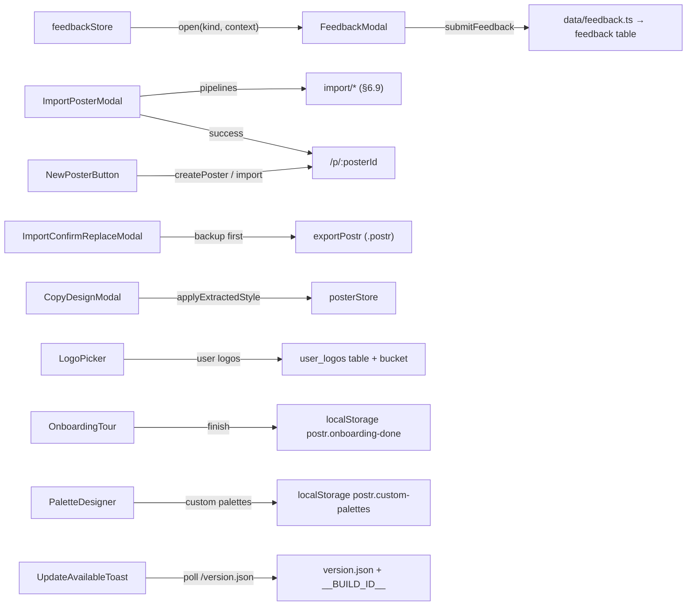

#### `components/AutosaveStatusPill.tsx` — non-interactive save-state pill (top-right overlay)

**Elements** — none (`pointerEvents: 'none'`; informational `role="status"` only)

**Copy**
- [ ] "Saving…" — status label — `AutosaveStatusPill.tsx:44`
- [ ] "Save failed — check your connection" — status label — `AutosaveStatusPill.tsx:48`
- [ ] "Unknown error" — tooltip title fallback — `AutosaveStatusPill.tsx:50`
- [ ] "Saved · {formatRelative(lastSavedAt)}" — status label template — `AutosaveStatusPill.tsx:55`
- [ ] "just now" — relative time — `AutosaveStatusPill.tsx:23`
- [ ] "{seconds}s ago" — relative time template — `AutosaveStatusPill.tsx:24`
- [ ] "{minutes}m ago" — relative time template — `AutosaveStatusPill.tsx:26`
- [ ] "{hours}h ago" — relative time template — `AutosaveStatusPill.tsx:28`
- [ ] "Saved" — idle label — `AutosaveStatusPill.tsx:61`

**Graphics**
- [ ] yellow pulsing dot — css-dot — `AutosaveStatusPill.tsx:91` — saving state
- [ ] red dot — css-dot — `AutosaveStatusPill.tsx:103` — error state
- [ ] green dot — css-dot — `AutosaveStatusPill.tsx:114` — saved/idle state

#### `components/BusyIndicator.tsx` — labelled indeterminate loading indicator (block + inline variants)

**Elements** — none interactive

**Copy**
- [ ] "{label}" — prop-driven status text (callers supply, e.g. "Reading your spreadsheet…") — `BusyIndicator.tsx:86,101`
- [ ] "{hint}" — prop-driven second line — `BusyIndicator.tsx:102`

**Graphics**
- [ ] `postr-busy-dot` pulsing dot — css-dot — `BusyIndicator.tsx:85` — inline variant
- [ ] `postr-busy-track`/`postr-busy-shuttle` sweeping bar — css-bar — `BusyIndicator.tsx:98-100` — block variant

#### `components/ConfirmModal.tsx` — dark confirmation dialog w/ optional typed confirmation

**Elements**
- [ ] backdrop click — overlay — `ConfirmModal.tsx:66` — calls `onCancel`
- [ ] `Escape` — keyboard shortcut — `ConfirmModal.tsx:47` — calls `onCancel`
- [ ] typed-confirmation input — text input — `ConfirmModal.tsx:117` — placeholder = the required phrase; gates confirm button
- [ ] `{cancelLabel}` (default "Cancel") — button — `ConfirmModal.tsx:139` — calls `onCancel`
- [ ] `{confirmLabel}` (default "Confirm") — button — `ConfirmModal.tsx:154` — calls `onConfirm`; disabled until typed phrase matches; red when `danger`

**Copy**
- [ ] "{title}" — prop heading — `ConfirmModal.tsx:99`
- [ ] "{message}" — prop body — `ConfirmModal.tsx:109`
- [ ] "Type **{typedConfirmation}** to confirm:" — instruction — `ConfirmModal.tsx:114-116`

**Graphics** — none

#### `components/CopyDesignModal.tsx` — "Copy a design": drop poster → extract style → before/after preview → apply palette/font

**Elements**
- [ ] backdrop click — overlay — `CopyDesignModal.tsx:184` — `onClose`
- [ ] `Escape` — keyboard shortcut — `CopyDesignModal.tsx:84` — `onClose`
- [ ] `×` (`aria-label="Close"`) — button — `CopyDesignModal.tsx:351` — `onClose`
- [ ] drop zone (click/drag-drop) — dropzone — `CopyDesignModal.tsx:385` — click opens file picker; drop → `handleFile` → `extractStyleFromFile` (`@/import/styleImport`)
- [ ] hidden file input — file input — `CopyDesignModal.tsx:295` — accept `.pdf,.png,.jpg,.jpeg,application/pdf,image/*` (constant `:43`)
- [ ] `Send feedback` — button — `CopyDesignModal.tsx:235` — `useFeedbackStore.open('bug', …)` with title "Copy a design failed", captured log + source file (`:142-149`)
- [ ] `Colours` — checkbox toggle — `CopyDesignModal.tsx:268` — toggles palette adoption
- [ ] `Font — {extracted.fontFamily}` / `Font` — checkbox toggle — `CopyDesignModal.tsx:273` — toggles font adoption; disabled when no font matched
- [ ] `Cancel` — button — `CopyDesignModal.tsx:309` — `onClose`
- [ ] `Apply — undo with ⌘Z` — button — `CopyDesignModal.tsx:313` — `posterStore.applyExtractedStyle({palette, fontFamily})` then `onClose`

**Copy**
- [ ] "Copy a design" — dialog heading + `aria-label` — `CopyDesignModal.tsx:343,193`
- [ ] "Upload a poster you admire — we lift its colours and type and apply them to *your* poster. Copies the look, not the content." — subheading — `CopyDesignModal.tsx:345-349`
- [ ] "Something went wrong." — generic failure notice — `CopyDesignModal.tsx:128`
- [ ] "{StyleImportError.userMessage}" — dynamic notice — `CopyDesignModal.tsx:125,199`
- [ ] "Something went wrong reading the full design." — colours-only alert heading — `CopyDesignModal.tsx:229-231`
- [ ] "You can still apply the colours we found on the page." — colours-only alert body — `CopyDesignModal.tsx:232-234`
- [ ] "We weren't sure about this one — starting with colours only. Toggle fonts on if the match looks right." — low-confidence notice — `CopyDesignModal.tsx:246-249`
- [ ] "◐ Heads up: under {cb.worstPair.type}, “{a}” and “{b}” in the copied palette may look alike. You can still apply it." — colorblind warning template — `CopyDesignModal.tsx:286-290`
- [ ] "Reading the file" / "Reading the colours" / "Matching the design" — extraction stage labels (constant `STAGE_LABELS :45-49`; rendered `:219` with trailing "…")
- [ ] "Reading a PDF or a large image can take a few seconds." — busy hint — `CopyDesignModal.tsx:220`
- [ ] "Drop a poster here or click to browse" — dropzone primary — `CopyDesignModal.tsx:410-412`
- [ ] "PDF · PNG / JPG — a photo of the whole poster works" — dropzone secondary — `CopyDesignModal.tsx:413-415`
- [ ] "Now" / "With copied style" — StyleMiniPreview card labels — `CopyDesignModal.tsx:257,263`

**Graphics**
- [ ] 🎨 — emoji — `CopyDesignModal.tsx:409` — drop zone
- [ ] × — glyph — `CopyDesignModal.tsx:367` — close button
- [ ] ◐ — glyph — `CopyDesignModal.tsx:287` — colorblind warning

#### `components/EditorErrorBoundary.tsx` — editor crash fallback (class error boundary)

**Elements**
- [ ] `Try again` — button — `EditorErrorBoundary.tsx:142` — resets boundary state (`this.reset`)
- [ ] `Back to dashboard` — Link — `EditorErrorBoundary.tsx:158` — navigates to `/dashboard`

**Copy**
- [ ] "Something broke while rendering your poster" — heading — `EditorErrorBoundary.tsx:103`
- [ ] "Your work is safe — Postr auto-saves every few seconds, so nothing you typed before the error has been lost. The error details below help us track down what went wrong." — reassurance — `EditorErrorBoundary.tsx:113-116`
- [ ] "{error.message}" (fallback "Unknown error" `:67`) — error `<pre>` — `EditorErrorBoundary.tsx:132`

**Graphics**
- [ ] ⚠️ — emoji — `EditorErrorBoundary.tsx:93` — above heading

#### `components/FeedbackModal.tsx` — global bug/feature/other feedback form (mounted in App.tsx:14)

**Elements**
- [ ] backdrop click — overlay — `FeedbackModal.tsx:87` — `close()`
- [ ] `Escape` — keyboard shortcut — `FeedbackModal.tsx:52` — `close()`
- [ ] `Bug` — kind-select button — `FeedbackModal.tsx:157` (constant `KINDS :12-16`, render `:154-187`) — `setKind('bug')`
- [ ] `Feature` — kind-select button — same — `setKind('feature')`
- [ ] `Other` — kind-select button — same — `setKind('other')`
- [ ] title input — text input — `FeedbackModal.tsx:206` — maxLength 120
- [ ] details textarea — textarea — `FeedbackModal.tsx:245` — maxLength 4000, 6 rows
- [ ] `Attach {filename}` — checkbox — `FeedbackModal.tsx:312` — toggles attachment inclusion
- [ ] `Include console log` — checkbox — `FeedbackModal.tsx:346` — toggles log inclusion
- [ ] `Cancel` — button — `FeedbackModal.tsx:382` — `close()`
- [ ] `Send` / `Sending…` — submit button — `FeedbackModal.tsx:398` — `submitFeedback(...)` (`@/data/feedback`); disabled while submitting or title/body blank
- [ ] `Close` — button (success view) — `FeedbackModal.tsx:459` — `close()`

**Copy**
- [ ] "Send feedback" — heading — `FeedbackModal.tsx:125`
- [ ] "Bug reports and feature requests go straight to the developer. We read everything — thank you for taking the time." — intro — `FeedbackModal.tsx:135-137`
- [ ] "Type" — field label — `FeedbackModal.tsx:151`
- [ ] "Something broken or unexpected" — Bug hint (constant `:13`) — `FeedbackModal.tsx:183`
- [ ] "An idea or missing capability" — Feature hint (constant `:14`) — `:183`
- [ ] "Questions, praise, anything else" — Other hint (constant `:15`) — `:183`
- [ ] "Title" — field label — `FeedbackModal.tsx:204`
- [ ] "Short summary of the issue" / "A one-line headline" — title placeholders (bug/other) — `FeedbackModal.tsx:211-213`
- [ ] "Details" — field label — `FeedbackModal.tsx:243`
- [ ] "What did you expect to happen? What actually happened? Steps to reproduce if you remember." — bug body placeholder — `FeedbackModal.tsx:250-251`
- [ ] "Describe what you would like to see. The more context the better." — non-bug body placeholder — `FeedbackModal.tsx:252`
- [ ] "{body.length} / 4000" — char counter — `FeedbackModal.tsx:273`
- [ ] "Diagnostic context" — section label — `FeedbackModal.tsx:299`
- [ ] "({formatBytes(size)})" — attachment size — `FeedbackModal.tsx:331` (helper `:427-431`)
- [ ] "({n} chars)" — log size — `FeedbackModal.tsx:354`
- [ ] "Helps us reproduce the bug. Nothing is sent until you click Send." — privacy note — `FeedbackModal.tsx:359`
- [ ] "Unknown error. Please try again." — submit error fallback — `FeedbackModal.tsx:78` (rendered `:377`)
- [ ] "Thanks — got it." — success heading — `FeedbackModal.tsx:453`
- [ ] "Your feedback is in the queue. If you left contact info in your profile, we may reach out with follow-up questions." — success body — `FeedbackModal.tsx:456-458`

**Graphics**
- [ ] ✓ in purple circle — glyph/css — `FeedbackModal.tsx:436-451` — success view

#### `components/ImportConfirmReplaceModal.tsx` — "replace non-empty poster?" guard w/ .postr backup shortcut

**Elements**
- [ ] backdrop click — overlay — `ImportConfirmReplaceModal.tsx:72` — `onCancel`
- [ ] `Escape` — keyboard shortcut — `ImportConfirmReplaceModal.tsx:39` — `onCancel`
- [ ] `Download .postr` / `Saving…` / `✓ Saved` — button — `ImportConfirmReplaceModal.tsx:96` — `exportPostr(doc)` → triggers browser download of `{title}.postr`
- [ ] `Cancel` — button — `ImportConfirmReplaceModal.tsx:116` — `onCancel`
- [ ] `Replace poster` — danger button — `ImportConfirmReplaceModal.tsx:119` — `onConfirm`

**Copy**
- [ ] "Replace this poster?" — heading — `ImportConfirmReplaceModal.tsx:75`
- [ ] "The current poster's blocks will be removed and replaced with the imported content. **This cannot be undone.**" — warning — `ImportConfirmReplaceModal.tsx:77-80`
- [ ] "Save current as .postr first?" — backup callout — `ImportConfirmReplaceModal.tsx:93`
- [ ] "A losslessly-restorable backup of the current poster." — backup callout — `ImportConfirmReplaceModal.tsx:93-94`

**Graphics**
- [ ] 💾 — emoji — `ImportConfirmReplaceModal.tsx:93` — backup callout

#### `components/ImportPosterModal.tsx` — PDF/PPTX/image/.postr import wizard (pick → extracting → preview → committing)

**Elements**
- [ ] backdrop click — overlay — `ImportPosterModal.tsx:321` — `onClose` (inert while committing)
- [ ] `Escape` — keyboard shortcut — `ImportPosterModal.tsx:112` — `onClose` (blocked while committing)
- [ ] `×` (`aria-label="Close"`) — button — `ImportPosterModal.tsx:449` — `onClose`
- [ ] drop zone (click/drag-drop) — dropzone — `ImportPosterModal.tsx:483` — click opens picker; drop → `handleFile` (routes to `importPostr` / `extractFromPptx` / `extractFromPdf` / `extractFromImage` by extension)
- [ ] hidden file input — file input — `ImportPosterModal.tsx:397` — accept `.pdf,.postr,.pptx,.png,.jpg,.jpeg,…` (constant `ACCEPT :50-52`)
- [ ] `Send feedback` — button — `ImportPosterModal.tsx:338` — opens FeedbackModal with title "Import failed{: filename}", stack + captured log + source file
- [ ] `Dismiss` — button — `ImportPosterModal.tsx:354` — clears failure banner
- [ ] `Cancel` — button — `ImportPosterModal.tsx:901` — `onClose`
- [ ] `Create poster from import` (new) / `Replace current poster` (replace) — confirm button — `ImportPosterModal.tsx:916` (labels `:415-417`) — `upsertPoster` → `posterStore.setPoster` → sets `sessionStorage['postr.autoArrangeOnLoad']` → navigates to `/p/{id}` (new mode only, `:309`)

**Copy**
- [ ] "Import poster" — heading — `ImportPosterModal.tsx:441`
- [ ] "Drop a PDF, PowerPoint, image, or .postr file. We extract the content into editable blocks at their original positions." — sub (new mode) — `ImportPosterModal.tsx:445`
- [ ] "Replace the current poster with content from a PDF, PowerPoint, image, or .postr file." — sub (replace mode) — `ImportPosterModal.tsx:446`
- [ ] "Something went wrong." — failure banner heading — `ImportPosterModal.tsx:330`
- [ ] "We couldn't finish importing this file. The error details and the file you uploaded are ready to share with our team — click below to review and send." — failure body — `ImportPosterModal.tsx:332-336`
- [ ] "Sign-in expired. Please refresh and try again." — error — `ImportPosterModal.tsx:173`
- [ ] "Unsupported file type. Drop a .pdf, .pptx, image, or .postr file." — error — `ImportPosterModal.tsx:233-235`
- [ ] "{PdfImportError.message}" — verbatim user-actionable error — `ImportPosterModal.tsx:258`
- [ ] "{commit error}" (fallback "Save failed." `:312`) — commit error — `:313`
- [ ] "Drop file here or click to browse" — dropzone primary — `ImportPosterModal.tsx:507-509`
- [ ] "PDF · PowerPoint · PNG / JPG · .postr bundle" — dropzone secondary — `ImportPosterModal.tsx:510-512`
- [ ] "**What comes across.** PowerPoint files bring their text, images, and tables. PDF and image imports are text-only — we capture titles, headings, authors, body text, captions, and references at their original positions, but figures, charts, and logos must be re-added from the Insert tab. Image-based imports take ~30–90s." — expectations callout — `ImportPosterModal.tsx:526-531`
- [ ] "Reading file" / "Detecting text blocks" / "Processing page" / "Calling vision model" / "Building preview" / "Ready" / "Error" — stage labels (constant `STAGE_LABELS :537-549`; rendered `:683,768`)
- [ ] "Reading the page layout…" / "Locating the title and authors…" / "Detecting section headings…" / "Mapping the reading order…" / "Capturing body text…" / "Cross-checking column boundaries…" / "Inspecting captions and footnotes…" / "Aligning text to its original position…" / "Tidying up the block structure…" / "Almost there — finalising blocks…" — rotating typewriter phrases (constant `LLM_WORKING_PHRASES :574-585`; rendered `:743`)
- [ ] "This is taking a little longer than usual ({elapsedSec}s) — hang tight, your work won't be lost." — long-wait hint (≥30s) — `ImportPosterModal.tsx:759-762`
- [ ] "{stage} — still working, this is taking longer than usual" — sr-only live-region template — `ImportPosterModal.tsx:767-770`
- [ ] "{textBlocks} text block{s} (incl. {n} heading{s}) · {n} image{s} · {w}″ × {h}″" — preview stats template — `ImportPosterModal.tsx:839-843`
- [ ] "preview" — thumbnail fallback text — `ImportPosterModal.tsx:832`
- [ ] "Source preview" — thumbnail img alt — `ImportPosterModal.tsx:828`
- [ ] "Bundle hash check failed — the file may have been edited outside Postr." — .postr warning — `ImportPosterModal.tsx:199-200`
- [ ] "Saving poster…" — committing state — `ImportPosterModal.tsx:871`
- [ ] "This usually takes a second or two." — committing sub — `ImportPosterModal.tsx:872`

**Graphics**
- [ ] 📥 — emoji — `ImportPosterModal.tsx:506` — drop zone
- [ ] ✓ / ● / ○ — glyphs — `ImportPosterModal.tsx:664` — stage list bullets
- [ ] ▍ blinking caret — glyph/css — `ImportPosterModal.tsx:744-756` — typewriter line
- [ ] × — glyph — `ImportPosterModal.tsx:465` — close button
- [ ] source thumbnail — img (pdfjs canvas render) — `ImportPosterModal.tsx:826-830` — preview panel

#### `components/InputModal.tsx` — dark prompt dialog (window.prompt replacement)

**Elements**
- [ ] backdrop click — overlay — `InputModal.tsx:55` — `onCancel`
- [ ] `Escape` — keyboard shortcut — `InputModal.tsx:42` — `onCancel`
- [ ] `Enter` — keyboard shortcut — `InputModal.tsx:43` — `onConfirm(value)` when non-empty
- [ ] text input — input — `InputModal.tsx:86` — placeholder from prop
- [ ] `Cancel` — button — `InputModal.tsx:107` — `onCancel`
- [ ] `{confirmLabel}` (default "Save") — button — `InputModal.tsx:122` — `onConfirm(value)`; disabled when blank

**Copy**
- [ ] "{title}" — prop heading — `InputModal.tsx:81`
- [ ] "{message}" — prop body — `InputModal.tsx:84`

**Graphics** — none

#### `components/LogoPicker.tsx` — 3-tab institution-logo picker (Presets / My Logos / Upload), portaled to body

**Elements**
- [ ] backdrop click — overlay — `LogoPicker.tsx:227` — `onClose`
- [ ] `Escape` — keyboard shortcut — `LogoPicker.tsx:93` — `onClose`
- [ ] `×` (`aria-label="Close"`) — button — `LogoPicker.tsx:282` — `onClose`
- [ ] `Presets` — tab button — `LogoPicker.tsx:315` (tab list `:310-313`) — switches tab
- [ ] `My Logos` — tab button — same — switches tab; triggers `listUserLogos()` (`:81`)
- [ ] `Upload` — tab button — same — switches tab
- [ ] search input — search input — `LogoPicker.tsx:411` — filters preset catalog
- [ ] `All` — region filter button — `LogoPicker.tsx:421` (regions constant `:400-407`) — filters presets
- [ ] `US Northeast` — region button — same (label from `REGION_LABELS`, `poster/logoPresets.ts:167`)
- [ ] `US South` — region button — same (`logoPresets.ts:168`)
- [ ] `US Midwest` — region button — same (`logoPresets.ts:169`)
- [ ] `US West` — region button — same (`logoPresets.ts:170`)
- [ ] `Canada` — region button — same (`logoPresets.ts:171`)
- [ ] preset card (`{p.name}` / `Loading…` + `{p.location}`) — button (repeater over `LOGO_PRESETS`) — `LogoPicker.tsx:471` — `resolvePresetLogo(preset)` → `onPick(url)` → `onClose`
- [ ] `+ Upload a logo` — empty-state button — `LogoPicker.tsx:592` — switches to Upload tab
- [ ] my-logo card button (`{logo.name}` + "Click to insert") — button — `LogoPicker.tsx:649` — `onPick(logo.signedUrl)` → `onClose`
- [ ] `×` (`title="Delete logo"`, `aria-label="Delete {logo.name}"`) — button — `LogoPicker.tsx:678` — native `window.confirm("Delete "{name}" from your logo library?")` (`:201`) → `deleteUserLogo`
- [ ] upload dropzone label — label/file trigger — `LogoPicker.tsx:720` — opens file picker
- [ ] hidden file input — file input — `LogoPicker.tsx:749` — accept `image/*`; pick → base64 → `onPick(dataUrl)` → `onClose` + background `uploadUserLogo` (`:153-198`)

**Copy**
- [ ] "Pick a logo" — heading — `LogoPicker.tsx:275`
- [ ] "Search a preset university, reuse one from your library, or upload a new file." — subheading — `LogoPicker.tsx:277-280`
- [ ] "Search 80+ North American universities…" — search placeholder — `LogoPicker.tsx:415`
- [ ] "**Heads up:** preset previews pull 256 × 256 favicons from Google's public service. Some schools return a letter mark instead of their crest, and none are print quality. For your final export, switch to the **Upload** tab and use your institution's official logo." — quality warning — `LogoPicker.tsx:452-456`
- [ ] "{filtered.length} / {LOGO_PRESETS.length} presets" — count line — `LogoPicker.tsx:459`
- [ ] "Loading…" — preset button loading text — `LogoPicker.tsx:536`
- [ ] "{p.name} logo" — preset img alt template — `LogoPicker.tsx:500`
- [ ] "Loading your logos…" — My Logos loading — `LogoPicker.tsx:570`
- [ ] "Your logo library is empty. Upload a logo once and it'll be available here across every poster on your account." — empty state — `LogoPicker.tsx:588-591`
- [ ] "Click to insert" — logo card hint — `LogoPicker.tsx:675`
- [ ] "Upload a PNG, JPEG, SVG, or WebP file. It'll be saved to your logo library so you can reuse it on future posters — up to 25 logos per account, 10 MB each." — upload explainer — `LogoPicker.tsx:715-719`
- [ ] "Uploading…" — upload busy text — `LogoPicker.tsx:736`
- [ ] "Click to pick an image file" — dropzone primary — `LogoPicker.tsx:742`
- [ ] "It'll be inserted straight into the logo block." — dropzone secondary — `LogoPicker.tsx:744`
- [ ] ""{name}" isn't an image. Upload PNG, JPEG, SVG, or WebP." — validation error template — `LogoPicker.tsx:160`
- [ ] ""{name}" is {x} MB — logos must be under 10 MB." — validation error template — `LogoPicker.tsx:164-166`
- [ ] "Could not read the picked file." / "Upload failed." / "Delete failed." / "Failed to load logos." / "Failed to load logo." — error fallbacks — `LogoPicker.tsx:176,194,206,84,120`
- [ ] "Delete "{logo.name}" from your logo library?" — native confirm text — `LogoPicker.tsx:201`

**Graphics**
- [ ] ⚠️ — emoji — `LogoPicker.tsx:350` — error banner
- [ ] 🖼 — emoji — `LogoPicker.tsx:586` — My Logos empty state
- [ ] 📁 — emoji — `LogoPicker.tsx:739` — upload dropzone
- [ ] × — glyph — `LogoPicker.tsx:295` — header close
- [ ] preset favicon — img (Google s2 256px) — `LogoPicker.tsx:498` — preset cards
- [ ] user logo thumb — img (signed URL) — `LogoPicker.tsx:633` — My Logos cards

#### `components/NewPosterButton.tsx` — dashboard "+ New poster" + "Import…" pair w/ chevron menu

**Elements**
- [ ] `+ New poster` / `Creating…` — button — `NewPosterButton.tsx:60` — `createPoster()` → navigate `/p/{id}`
- [ ] `Import…` (`aria-label="Import an existing poster"`, `data-postr-import-cta`) — button — `NewPosterButton.tsx:68` — opens ImportPosterModal (mode "new")
- [ ] `▾` (`aria-label="More poster options"`, `aria-haspopup="menu"`) — button — `NewPosterButton.tsx:79` — toggles menu
- [ ] `＋ New blank poster` — menuitem — `NewPosterButton.tsx:102` — same as primary
- [ ] `📥 Import PDF / image / .postr…` — menuitem — `NewPosterButton.tsx:110` — opens ImportPosterModal

**Copy**
- [ ] "Text-only for image inputs · figures stay manual" — menu sublabel — `NewPosterButton.tsx:119-121`
- [ ] "{error}" (fallback "Failed to create poster" `:46`) — error line — `NewPosterButton.tsx:126`

**Graphics**
- [ ] 📥 — emoji — `NewPosterButton.tsx:76,117` — import button + menu item
- [ ] ▾ — glyph — `NewPosterButton.tsx:88` — chevron trigger
- [ ] ＋ — glyph — `NewPosterButton.tsx:108` — menu item

#### `components/OnboardingTour.tsx` — 8-step click-through editor tour (spotlight + tooltip)

**Elements**
- [ ] `Skip tour` — button — `OnboardingTour.tsx:303` — `finish()` → sets `localStorage['postr.onboarding-done']`
- [ ] `Back` — button — `OnboardingTour.tsx:308` — previous step (hidden on step 1)
- [ ] `Next →` / `Done` — button — `OnboardingTour.tsx:310` — advance / finish

**Copy** (all in `STEPS` constant `:38-95`; rendered `:292-300`)
- [ ] "Your poster canvas" — step 1 title — `:41`
- [ ] "Click any block to select it, drag to move, and resize from the corner handle." — step 1 body — `:42`
- [ ] "Already have a poster? Import it" — step 2 title — `:48`
- [ ] "Drop a PDF, image, or .postr bundle. Text-layer PDFs land every paragraph AND embedded figure as editable blocks. Image-based files (flattened PDFs, JPG/PNG scans) bring in the text only — figures and tables need to be re-added with the Insert tab…" (full string 380 chars, trimmed) — step 2 body — `:49`
- [ ] "Author list & institutions" — step 3 title — `:55`
- [ ] "Define institutions once, then assign each author to one or more — the byline auto-formats with superscript footnotes (¹University A · ²University B). No other poster tool gets this right." — step 3 body — `:56`
- [ ] "References with citation styles" — step 4 title — `:62`
- [ ] "Import .bib / .ris / .enw, add citations manually, or paste pre-formatted references straight from your manuscript. APA, Vancouver, IEEE, and Harvard styles render automatically." — step 4 body — `:63`
- [ ] "Plot code readability check" — step 5 title — `:69`
- [ ] "Paste your R or Python plotting code to verify figure text will be legible at print size. Drag the gray rectangle on the canvas, or select an image block to lock to its exact dimensions." — step 5 body — `:70`
- [ ] "Pre-flight issues" — step 6 title — `:76`
- [ ] "Automated lint scans for blocks off-canvas, empty figures, missing authors, leftover placeholder text, and more. The red badge counts pending problems — click any issue to jump to the offending block." — step 6 body — `:77`
- [ ] "Export, print, or save .postr" — step 7 title — `:83`
- [ ] "Save as PDF, email to any Staples kiosk, publish to the gallery — or download a lossless .postr bundle (poster JSON + every figure) you can re-import later from any browser." — step 7 body (flag-ON variant) — `:85`
- [ ] "Save as PDF, email to any Staples kiosk — or download a lossless .postr bundle (poster JSON + every figure) you can re-import later from any browser." — step 7 body (**active**, `GALLERY_PUBLIC_ENABLED=false`) — `:86`
- [ ] "Conference guidelines" — step 8 title — `:91`
- [ ] "Quick reference for poster sizes and font minimums from APA, SfN, APS, ECNP, and more. Close it to give the canvas more room." — step 8 body — `:92`
- [ ] "{step + 1}/8" — step counter — `OnboardingTour.tsx:296`

**Graphics**
- [ ] pulsing purple highlight border — css-animation (`postr-tour-pulse`, injected `:134-139`) — `:272-287` — around target element
- [ ] 4 dark overlay rects — css — `:258-269` — spotlight cutout

#### `components/PaletteDesigner.tsx` — custom-palette builder modal (Manual / Random / From text / From image)

**Elements**
- [ ] backdrop click — overlay — `PaletteDesigner.tsx:272` — `onCancel`
- [ ] `Escape` — keyboard shortcut — `PaletteDesigner.tsx:186` — `onCancel`
- [ ] `🎨 Manual` — tab button — `PaletteDesigner.tsx:328` (constant `TABS :62-67`) — switches panel
- [ ] `🎲 Random` — tab button — same
- [ ] `📝 From text` — tab button — same
- [ ] `🖼️ From image` — tab button — same
- [ ] Background color input — color input — `PaletteDesigner.tsx:587` (roles from `ROLE_LABELS :69-77`, render `:570-621`) — `updateRole('bg', hex)`
- [ ] Background hex input — text input — `PaletteDesigner.tsx:601` — same
- [ ] Primary text color + hex inputs — same pair — `updateRole('primary', …)`
- [ ] Accent color + hex inputs — same pair — `updateRole('accent', …)`
- [ ] Accent 2 color + hex inputs — same pair — `updateRole('accent2', …)`
- [ ] Muted color + hex inputs — same pair — `updateRole('muted', …)`
- [ ] Header BG color + hex inputs — same pair — `updateRole('headerBg', …)` (auto-flips headerFg for contrast, `:213-215`)
- [ ] Header text color + hex inputs — same pair — `updateRole('headerFg', …)`
- [ ] strategy select — select — `PaletteDesigner.tsx:644` — options from `STRATEGY_LABELS` (`poster/paletteTools.ts:234-240`): `Monochromatic`, `Analogous`, `Complementary`, `Triadic`, `Split complementary`
- [ ] `Colorblind-friendly only` — checkbox — `PaletteDesigner.tsx:688` — persists `localStorage['postr.cb-random-pref']`
- [ ] `🎲 Shuffle palette` — button — `PaletteDesigner.tsx:701` — `generateRandomPalette`/`generateRandomCBSafePalette`
- [ ] hex-paste textarea — textarea — `PaletteDesigner.tsx:771` — feeds `parsePaletteText`
- [ ] `Apply` — button — `PaletteDesigner.tsx:802` — `hexListToPalette` → jumps to Manual tab
- [ ] image dropzone (click/drag-drop) — dropzone — `PaletteDesigner.tsx:839` — `extractPaletteFromImage(file)`
- [ ] hidden image file input — file input — `PaletteDesigner.tsx:873` — accept `image/*`
- [ ] `×` (`aria-label="Dismiss warning"`) — button — `PaletteDesigner.tsx:416` — dismisses CB collision warning
- [ ] palette-name input — text input — `PaletteDesigner.tsx:497` — placeholder "Palette name (e.g. Lab Green)", maxLength 60
- [ ] `Save palette and apply` — button — `PaletteDesigner.tsx:520` — `onSave({name, ...palette})`
- [ ] `Cancel` — button — `PaletteDesigner.tsx:527` — `onCancel`

**Copy**
- [ ] "🎨 Edit "{initialName}"" / "🎨 Create custom palette" — heading template — `PaletteDesigner.tsx:309`
- [ ] "Build a 7-role palette by hand, generate one from color theory, paste hex codes from Coolors / Adobe, or extract dominant colors from any image." — subheading — `PaletteDesigner.tsx:311-315`
- [ ] "Background" / "Primary text" / "Accent" / "Accent 2" / "Muted" / "Header BG" / "Header text" — role labels (constant `ROLE_LABELS :69-77`, render `:580`)
- [ ] "Poster canvas color" / "Body + title color" / "Main accent / links" / "Secondary accent" / "Borders, captions" / "Heading fill color" / "Heading text color" — role help (same constant, render `:583`)
- [ ] ""{a}" and "{b}" look nearly identical under {type}. Shift one toward blue or yellow to keep them distinguishable." — CB warning template — `PaletteDesigner.tsx:412-415`
- [ ] "Introduction" — preview header chip — `PaletteDesigner.tsx:457`
- [ ] "Sample poster heading" — preview heading — `PaletteDesigner.tsx:467`
- [ ] "Body text looks like this — muted text like this — with accent and accent 2 highlights." — preview body — `PaletteDesigner.tsx:475-483`
- [ ] "Color theory strategy" — section label — `PaletteDesigner.tsx:643`
- [ ] "Single hue, varied saturation and lightness. Calm and focused." — monochromatic help — `PaletteDesigner.tsx:745`
- [ ] "Adjacent hues on the wheel (±30°). Natural and harmonious." — analogous help — `:747`
- [ ] "Opposite hues (180°). High contrast, grabs attention." — complementary help — `:749`
- [ ] "Three evenly spaced hues (120°). Balanced and vibrant." — triadic help — `:751`
- [ ] "Base + two adjacent to its complement. Less harsh than pure complementary." — split-complementary help — `:753`
- [ ] "— filters out palettes whose accents collapse under red-green or blue-yellow deficiency" — CB checkbox hint — `PaletteDesigner.tsx:695-698`
- [ ] "{key}: {hex}" — swatch tooltip template — `PaletteDesigner.tsx:716`
- [ ] "Keep rolling until it feels right — then tweak individual roles in the Manual tab before saving." — random-tab footnote — `PaletteDesigner.tsx:734-736`
- [ ] "Paste hex codes or a palette URL" — text-tab label — `PaletteDesigner.tsx:770`
- [ ] "e.g.\n#264653, #2A9D8F, #E9C46A, #F4A261, #E76F51\n\nor https://coolors.co/palette/264653-2a9d8f-e9c46a-f4a261-e76f51" — textarea placeholder — `PaletteDesigner.tsx:774`
- [ ] "Works with Coolors.co URLs, Adobe swatch exports, JSON arrays, or any text containing hex codes. Colors are assigned to roles by luminance — lightest becomes background, darkest becomes primary." — text-tab help — `PaletteDesigner.tsx:797-801`
- [ ] "No hex codes detected. Paste something like #264653, #2A9D8F, #E9C46A… or a Coolors.co URL." — text error — `PaletteDesigner.tsx:232-234`
- [ ] "Upload an image to extract its palette" — image-tab label — `PaletteDesigner.tsx:838`
- [ ] "Analyzing image…" / "Click to upload or drag an image here" — dropzone states — `PaletteDesigner.tsx:866-868`
- [ ] "PNG, JPG, or WebP — a photo, a screenshot, anything" — dropzone sub — `PaletteDesigner.tsx:871`
- [ ] "The image never leaves your browser — pixels are sampled on-device and the file is discarded after extraction." — privacy note — `PaletteDesigner.tsx:892-895`
- [ ] "Could not read that image." — image error fallback — `PaletteDesigner.tsx:253`
- [ ] "Please name your palette." — name validation — `PaletteDesigner.tsx:263`
- [ ] "Palette name (e.g. Lab Green)" — name placeholder — `PaletteDesigner.tsx:503`

**Graphics**
- [ ] 🎨 — emoji — `PaletteDesigner.tsx:309,63` — header + Manual tab
- [ ] 🎲 — emoji — `PaletteDesigner.tsx:64,702` — Random tab + shuffle button
- [ ] 📝 — emoji — `PaletteDesigner.tsx:65` — From text tab
- [ ] 🖼️ — emoji — `PaletteDesigner.tsx:66,864` — From image tab + dropzone
- [ ] ⚠ — glyph — `PaletteDesigner.tsx:410` — CB warning
- [ ] 7-swatch strip — css swatches — `PaletteDesigner.tsx:713-725` — Random tab
- [ ] live preview card — css — `PaletteDesigner.tsx:434-484` — always-visible sample poster

#### `components/PasswordStrength.tsx` — inline password strength bar + rule checklist

**Elements** — none interactive

**Copy**
- [ ] "Weak" / "Fair" / "Good" / "Strong" / "Excellent" — strength labels — `PasswordStrength.tsx:38-42` (render `:51`)
- [ ] "At least 8 characters" — rule (constant `RULES :14`, render `:61`)
- [ ] "Uppercase letter (A-Z)" — rule — `:15`
- [ ] "Lowercase letter (a-z)" — rule — `:16`
- [ ] "Number (0-9)" — rule — `:17`
- [ ] "Symbol (!@#$...)" — rule — `:18`

**Graphics**
- [ ] color-coded strength bar — css-bar — `PasswordStrength.tsx:48-49` — above checklist
- [ ] ✓ / ○ — glyphs — `PasswordStrength.tsx:60` — per-rule pass/pending

#### `components/PosterCard.tsx` — dashboard poster tile (thumbnail/mini-render + hover actions)

**Elements**
- [ ] card link (`aria-label={title}`) — Link — `PosterCard.tsx:243` — navigates to `/p/{row.id}`
- [ ] `Duplicate` (`aria-label="Duplicate {title}"`) — hover button — `PosterCard.tsx:273` — `onDuplicate(row)`
- [ ] `Delete` (`aria-label="Delete {title}"`) — hover button — `PosterCard.tsx:284` — `onDelete(row)`

**Copy**
- [ ] "Untitled Poster" — title fallback — `PosterCard.tsx:238`
- [ ] "just now" / "{m}m ago" / "{h}h ago" / "{d}d ago" — last-edited templates — `PosterCard.tsx:29-35`
- [ ] "Untitled" — mini-preview title fallback — `PosterCard.tsx:142`
- [ ] "References" — mini-preview references block texture — `PosterCard.tsx:222`
- [ ] "P" — letter-initial fallback when no title — `PosterCard.tsx:75`
- [ ] "{row.title || 'Poster preview'}" — thumbnail img alt — `PosterCard.tsx:63`

**Graphics**
- [ ] stored thumbnail — img — `PosterCard.tsx:61` — card top (falls back on error)
- [ ] synthetic mini-preview — css block-render (title/authors/heading/text/image/table/references rects) — `PosterCard.tsx:88-230` — card top
- [ ] block image — img — `PosterCard.tsx:186` — inside mini-preview

- [ ] *Dead/removed UI: the per-card "Publish" hover action was deleted when the gallery froze — see comment `PosterCard.tsx:262-271` and `config/features.ts:15-19`.*

#### `components/PresetEditModal.tsx` — manage/edit saved style presets from Profile (localStorage `postr.style-presets`)

**Elements**
- [ ] backdrop click — overlay — `PresetEditModal.tsx:225` — `onClose`
- [ ] `Escape` — keyboard shortcut — `PresetEditModal.tsx:118` — `cancelEdit()` (edit view) or `onClose()` (list)
- [ ] `Edit` (`title="Edit preset"`) — per-row button — `PresetEditModal.tsx:349` — `startEdit(i)`
- [ ] `Delete` (`title="Delete preset"`) — per-row button — `PresetEditModal.tsx:357` — `deleteAt(i)` → persists
- [ ] name input — text input — `PresetEditModal.tsx:374` — maxLength 80
- [ ] font-family select — select — `PresetEditModal.tsx:387` — options = `FONTS` keys (`poster/constants`)
- [ ] palette select — select — `PresetEditModal.tsx:402` — optgroups "Curated" (`PALETTES`) + "Your palettes" (custom)
- [ ] size (pt) number input — number input — `PresetEditModal.tsx:518` — min 8 / max 300, per level (levels constant `STYLE_LEVELS :67-72`)
- [ ] weight select — select — `PresetEditModal.tsx:535` — options = `FONT_WEIGHTS` (`poster/constants`)
- [ ] `Slanted` — italic checkbox — `PresetEditModal.tsx:563`
- [ ] border select — select — `PresetEditModal.tsx:591` — options (constant `BORDER_OPTIONS :74-80`): `None`, `Underline`, `Left bar`, `Boxed`, `Thick underline`
- [ ] alignment select — select — `PresetEditModal.tsx:608` — options `Left`, `Center`
- [ ] `Filled background` — checkbox — `PresetEditModal.tsx:632`
- [ ] `Cancel` — edit-view button — `PresetEditModal.tsx:673` — `cancelEdit()`
- [ ] `Save changes` — edit-view button — `PresetEditModal.tsx:676` — validates + persists to localStorage
- [ ] `Close` — list-view button — `PresetEditModal.tsx:681` — `onClose`

**Copy**
- [ ] "🎨 Manage style presets" / "✏️ Editing "{name}"" — heading templates — `PresetEditModal.tsx:263-265`
- [ ] "Presets snapshot the font, palette, type styles, and heading look you saved from the editor. Edit them here or delete what you no longer need." — list sub — `PresetEditModal.tsx:269`
- [ ] "Changes apply the next time you load this preset in the editor." — edit sub — `PresetEditModal.tsx:270`
- [ ] "No saved presets yet. In the editor, adjust a poster's style, then click **Save as style preset** in the Style tab." — empty state — `PresetEditModal.tsx:297-300`
- [ ] "{p.fontFamily} · {p.paletteName}" — row meta template — `PresetEditModal.tsx:345`
- [ ] "Name" / "Font family" / "Palette" — field labels — `PresetEditModal.tsx:373,386,401`
- [ ] "To create a new custom palette, open a poster in the editor — the Style tab has a full palette designer (manual / random / from text / from image)." — palette help — `PresetEditModal.tsx:463-467`
- [ ] "Type styles" — section label — `PresetEditModal.tsx:472`
- [ ] "Title" / "Headings" / "Body" / "Authors" — level labels (constant `STYLE_LEVELS :67-72`, render `:503`)
- [ ] "{currentPt}pt" — size readout template — `PresetEditModal.tsx:506`
- [ ] "Size (pt)" / "Weight" / "Italic" / "Border" / "Alignment" — mini-field labels — `PresetEditModal.tsx:517,534,551,590,607`
- [ ] "Heading decoration" — section label — `PresetEditModal.tsx:582`
- [ ] "Name cannot be empty." — validation — `PresetEditModal.tsx:160`
- [ ] "Another preset already has that name." — validation — `PresetEditModal.tsx:168`
- [ ] "{hex}" — swatch tooltip — `PresetEditModal.tsx:443`

**Graphics**
- [ ] 🎨 / ✏️ — emoji — `PresetEditModal.tsx:264-265` — headings
- [ ] 5 palette swatches — css swatches — `PresetEditModal.tsx:439-453` — under palette select

#### `components/PublicFooter.tsx` — shared 4-column sitemap footer

**Elements**
- [ ] logo + "Postr" — Link — `PublicFooter.tsx:25` — `/`
- [ ] `Home` — Link — `PublicFooter.tsx:43` — `/`
- [ ] `Pricing` — Link — `PublicFooter.tsx:44` — `/pricing`
- [ ] `Paper to poster` — Link — `PublicFooter.tsx:45` — `/paper-to-poster`
- [ ] `Plot picker` — Link — `PublicFooter.tsx:46` — `/chart-chooser`
- [ ] `About` — Link — `PublicFooter.tsx:50` — `/about`
- [ ] `Why poster sessions` — Link — `PublicFooter.tsx:51` — `/why-posters`
- [ ] `Send feedback` — button — `PublicFooter.tsx:52` — `useFeedbackStore.open('other')`
- [ ] `Sign in` — Link — `PublicFooter.tsx:58` — `/auth`
- [ ] `Profile` — Link — `PublicFooter.tsx:59` — `/profile`
- [ ] `Privacy Policy` — Link — `PublicFooter.tsx:63` — `/privacy`
- [ ] `Cookies Policy` — Link — `PublicFooter.tsx:64` — `/cookies`
- [ ] `Terms of Service` — Link — `PublicFooter.tsx:65` — `/terms`

**Copy**
- [ ] "Built by researchers. Built for researchers." — brand tagline — `PublicFooter.tsx:34-36`
- [ ] "Product" / "Learn" / "Account" / "Legal" — column headings — `PublicFooter.tsx:42,49,57,62`
- [ ] "© {CURRENT_YEAR} Resila Technologies Inc." — copyright — `PublicFooter.tsx:70`

**Graphics**
- [ ] Postr logo (rounded purple square, crossing white curves, center dot) — inline-svg — `PublicFooter.tsx:26-31` — brand column

#### `components/PublicHeader.tsx` — shared public-page header (auth-aware) + mobile overflow nav

**Elements**
- [ ] logo + "Postr" — Link — `PublicHeader.tsx:114` — `/`
- [ ] `Paper to poster` — nav Link — `PublicHeader.tsx:141` (constant `NAV_LINKS :65-70`) — `/paper-to-poster` (desktop flat row + mobile menu `:310`)
- [ ] `Plot picker` — nav Link — same — `/chart-chooser` (both rows)
- [ ] `Pricing` — nav Link — same — `/pricing` (both rows)
- [ ] `Why posters` — nav Link — same — `/why-posters` (both rows)
- [ ] `About` — nav Link — same — `/about` (both rows)
- [ ] `Menu` (`aria-label="Menu"`, hamburger/X) — button — `PublicHeader.tsx:245` — toggles mobile panel
- [ ] `Send feedback` — mobile menu button (signed-in only) — `PublicHeader.tsx:346` — closes menu + `openFeedback('feature')`
- [ ] `Feedback` (`title="Send feedback"`) — desktop button (signed-in only) — `PublicHeader.tsx:150` — `openFeedback('feature')`
- [ ] profile icon (`title="Profile & Settings"`) — Link (signed-in only) — `PublicHeader.tsx:161` — `/profile`
- [ ] `Sign in` — Link (signed-out only) — `PublicHeader.tsx:173` — `/auth`
- [ ] `Escape` — keyboard shortcut — `PublicHeader.tsx:228` — closes mobile menu, refocuses trigger

**Copy**
- [ ] "Postr" — wordmark — `PublicHeader.tsx:121-123`
- [ ] "Turn a manuscript into a poster draft" — mobile blurb for Paper to poster (constant `TOOL_LINKS :44`) — `PublicHeader.tsx:319`
- [ ] "Find the figure that fits your data" — mobile blurb for Plot picker (constant `:49`) — `:319`

**Graphics**
- [ ] Postr logo — inline-svg — `PublicHeader.tsx:115-120` — brand link
- [ ] speech-bubble icon — inline-svg — `PublicHeader.tsx:156-158` — Feedback button
- [ ] person icon — inline-svg — `PublicHeader.tsx:166-169` — profile link
- [ ] hamburger / X icon — inline-svg (state-swapped) — `PublicHeader.tsx:256-278` — mobile trigger

#### `components/PublishConsentModal.tsx` — checkbox-gated legal consent before publishing/sharing (DEAD — flag off; `share` mode has no caller)

**Elements**
- [ ] backdrop click — overlay — `PublishConsentModal.tsx:166` — `onCancel`
- [ ] `Escape` — keyboard shortcut — `PublishConsentModal.tsx:145` — `onCancel`
- [ ] clause checkbox ×4 (publish: owner/coauthors/confidential/retract) — checkboxes — `PublishConsentModal.tsx:245` (clauses `PUBLISH_CLAUSES :32-72`) — all required to enable confirm
- [ ] clause checkbox ×3 (share: owner/link/revoke) — checkboxes — same (clauses `SHARE_CLAUSES :74-104`) — **dead** (no share-mode caller)
- [ ] `Terms of Service` — Link — `PublishConsentModal.tsx:266` — `/terms` in new tab
- [ ] `Cancel` — button — `PublishConsentModal.tsx:278` — `onCancel`
- [ ] `Publish` / `Create link` — confirm button — `PublishConsentModal.tsx:293` (labels `COPY :111,117`) — `onConfirm`; disabled until all clauses ticked

**Copy**
- [ ] "Publish to the public gallery?" — title (publish) — `PublishConsentModal.tsx:108`
- [ ] "Create a shareable link?" — title (share) — `:113`
- [ ] "Anything you publish to the gallery is visible to everyone on the internet, including people who do not have a Postr account. It may be indexed by search engines. Read each statement below carefully." — publish intro — `:109-110`
- [ ] "Share links are read-only URLs that anyone with the link can open. Use them for advisors and co-authors, but treat the link itself like a password." — share intro — `:114-115`
- [ ] "“{posterTitle}”" — poster name line — `PublishConsentModal.tsx:206`
- [ ] "I am the **rightful owner** of every element of this poster — text, figures, photos, logos, data — or I have written permission from every rights-holder to display them publicly." — publish clause 1 — `:36-40`
- [ ] "All **co-authors** named on the poster have agreed to its public display." — publish clause 2 — `:46-49`
- [ ] "The poster contains **no confidential, embargoed, or export-controlled** material." — publish clause 3 — `:55-58`
- [ ] "I understand Postr is a sharing platform, not a publisher. Third parties may cache, download, or index the poster while it is public. I will **retract the poster promptly** if my ownership or permission changes." — publish clause 4 — `:64-69`
- [ ] "I am the **rightful owner** of everything on this poster, or I have permission to share it with the people I intend to show it to." — share clause 1 — `:78-82`
- [ ] "I understand that anyone with the share link can open the poster — Postr does **not password-protect** share links, and recipients may forward the URL or take screenshots." — share clause 2 — `:88-92`
- [ ] "I can revoke the share link at any time from my dashboard, but existing copies made while it was active cannot be recalled." — share clause 3 — `:98-101`
- [ ] "By continuing you confirm the above and acknowledge the Terms of Service, including your content warranties and indemnity in Section 5." — footer — `PublishConsentModal.tsx:264-275`

**Graphics** — none

#### `components/PublishFlow.tsx` — orchestrator mounting PublishConsentModal + PublishGalleryModal at app root

No UI of its own — wiring only (renders the two modals per `usePublishFlowStore.step`; success navigates to `/gallery/{entryId}`, `PublishFlow.tsx:42`). Mounted `App.tsx:15`; unreachable while `GALLERY_PUBLIC_ENABLED=false`.

#### `components/PublishGalleryModal.tsx` — gallery publish form (auto-capture/upload + metadata) (DEAD — flag off)

**Elements**
- [ ] backdrop click — overlay — `PublishGalleryModal.tsx:184` — `onCancel` (inert while submitting)
- [ ] `Escape` — keyboard shortcut — `PublishGalleryModal.tsx:109` — `onCancel` (blocked while submitting)
- [ ] `Choose file` — button — `PublishGalleryModal.tsx:462` — opens file picker
- [ ] `Retry auto-capture` — button — `PublishGalleryModal.tsx:478` — re-runs html-to-image capture of `#poster-canvas`
- [ ] `Upload image instead` — button — `PublishGalleryModal.tsx:481` — opens file picker
- [ ] `Replace` — link-style button — `PublishGalleryModal.tsx:516` — opens file picker
- [ ] hidden file input — file input — `PublishGalleryModal.tsx:247` — accept `image/png,image/jpeg,image/webp`
- [ ] title input — text input — `PublishGalleryModal.tsx:258` — maxLength 200
- [ ] field select — select — `PublishGalleryModal.tsx:270` — options from `FIELD_OPTIONS` (`data/gallery.ts:35-47`): `Neuroscience`, `Psychology`, `Medicine`, `Biology`, `Computer Science`, `Physics`, `Chemistry`, `Engineering`, `Social Sciences`, `Humanities`, `Other`
- [ ] year input — number input — `PublishGalleryModal.tsx:284` — min 1900 / max 2100
- [ ] conference input — text input — `PublishGalleryModal.tsx:297` — maxLength 200
- [ ] notes textarea — textarea — `PublishGalleryModal.tsx:308` — maxLength 2000
- [ ] `↻ Retry` / `Retrying…` — error-box button — `PublishGalleryModal.tsx:345` — re-submits
- [ ] `Copy error` — error-box button — `PublishGalleryModal.tsx:366` — `navigator.clipboard.writeText(submitError)`
- [ ] `Cancel` — button — `PublishGalleryModal.tsx:390` — `onCancel`
- [ ] `Publish to gallery` / `Publishing…` — submit button — `PublishGalleryModal.tsx:406` — `createGalleryEntry(...)` → `onSuccess(entryId)` → navigate `/gallery/{id}`

**Copy**
- [ ] "Publish to the gallery" — heading — `PublishGalleryModal.tsx:213`
- [ ] "Add the details that help other researchers find your poster, then hit publish." — sub — `PublishGalleryModal.tsx:215-218`
- [ ] "Upload an image of the poster you want to publish. PNG, JPG, or WebP, max 15 MB." — idle capture area — `PublishGalleryModal.tsx:457-460`
- [ ] "Capturing poster…" — capturing state — `PublishGalleryModal.tsx:469`
- [ ] "Please upload a PNG, JPG, or WebP image." — upload validation — `PublishGalleryModal.tsx:128`
- [ ] "Image is too large (max 15 MB)." — upload validation — `PublishGalleryModal.tsx:134`
- [ ] "No poster to capture. Upload a screenshot instead." — retry failure — `PublishGalleryModal.tsx:228`
- [ ] "Capture failed" / "Capture too large at ratio {r} ({x} MB)" / "Capture failed at every resolution." / "Capture returned no data." — capture errors — `PublishGalleryModal.tsx:90,619-621,628,655`
- [ ] "Auto-captured from editor · {x} MB" / "Uploaded image" — preview caption templates — `PublishGalleryModal.tsx:512-515`
- [ ] "Preview" — preview img alt — `PublishGalleryModal.tsx:491`
- [ ] "Title" / "Field" / "Year" / "Conference (optional)" / "Notes (optional)" — field labels — `PublishGalleryModal.tsx:257,269,283,296,307`
- [ ] "e.g. Neural correlates of decision-making in rodents" — title placeholder — `PublishGalleryModal.tsx:261`
- [ ] "e.g. Society for Neuroscience 2026" — conference placeholder — `PublishGalleryModal.tsx:300`
- [ ] "Context, takeaways, what worked. Plain text, 2000 characters max." — notes placeholder — `PublishGalleryModal.tsx:311`
- [ ] "Please capture or upload an image first." — submit validation — `PublishGalleryModal.tsx:145`
- [ ] "Year must be between 1900 and 2100." — submit validation — `PublishGalleryModal.tsx:150`
- [ ] "Publish failed." — submit error fallback — `PublishGalleryModal.tsx:170`
- [ ] "**Publish failed.** {error} Your poster is still safe — you can try again or copy the error above to share with support." — error box template — `PublishGalleryModal.tsx:339-342`

**Graphics**
- [ ] ⚠️ — emoji — `PublishGalleryModal.tsx:337` — error box
- [ ] captured/uploaded preview — img (blob URL) — `PublishGalleryModal.tsx:489-500` — preview area

#### `components/RotatingWord.tsx` — typewriter line cycling phrases (landing hero)

**Elements** — none interactive

**Copy** — phrases arrive via prop (caller `Landing.tsx:147`, §6.2); component renders `{typed}` (`:143`) + sr-only full phrase (`:151`)

**Graphics**
- [ ] blinking caret (`.postr-typed-line__caret`) — css — `RotatingWord.tsx:145` — after typed text

#### `components/StaplesPrintModal.tsx` — 4-step Staples Print & Go walkthrough

**Elements**
- [ ] backdrop click — overlay — `StaplesPrintModal.tsx:90` — `onClose`
- [ ] `Escape` — keyboard shortcut — `StaplesPrintModal.tsx:41` — `onClose`
- [ ] `⎙ Open Save as PDF dialog` — button — `StaplesPrintModal.tsx:158` — `onSavePdf()` (prop)
- [ ] `📧 Gmail` — external link — `StaplesPrintModal.tsx:190` — `https://mail.google.com/mail/?view=cm&fs=1&to=staplesmobile@printme.com&su={subject}` (new tab)
- [ ] `📨 Outlook` — external link — `StaplesPrintModal.tsx:204` — `https://outlook.live.com/mail/0/deeplink/compose?to=…&subject=…` (new tab)
- [ ] `📬 Yahoo` — external link — `StaplesPrintModal.tsx:218` — `https://compose.mail.yahoo.com/?to=…&subject=…` (new tab)
- [ ] `📋 Copy email address` / `✓ Copied` — button — `StaplesPrintModal.tsx:233` — copies `staplesmobile@printme.com`; fallback `window.prompt('Copy this email address:', …)` (`:83`)
- [ ] `Close` — button — `StaplesPrintModal.tsx:327` — `onClose`

**Copy**
- [ ] "🏪 Print at Staples" — heading — `StaplesPrintModal.tsx:127`
- [ ] "Staples' Print & Go flow — email your PDF, get a release code, print at any kiosk. No USB drive, no Staples account, no upload portal." — intro — `StaplesPrintModal.tsx:129-133`
- [ ] "Save your poster as PDF" — step 1 title — `StaplesPrintModal.tsx:147`
- [ ] "Use your browser's Save as PDF dialog. Set layout to **Landscape**, margins to **None**, and enable **Background graphics** so fills don't print white." — step 1 body — `:149-155`
- [ ] "Email the PDF to Staples" — step 2 title — `:169`
- [ ] "Attach the PDF you just saved and send it to `staplesmobile@printme.com`. Pick whichever mail client you actually use — subject and body are optional. Staples only needs the attachment." — step 2 body — `:171-186`
- [ ] "**⚠️ Don't forget to attach the PDF.** The email body can be left blank — Staples only reads the attachment." — warning callout — `:258-259`
- [ ] "Using ProtonMail, Fastmail, iCloud, or a university webmail? Tap "Copy email address" and paste it into a new message in your own mail client." — webmail note — `:269-271`
- [ ] "Wait for the 8-digit release code" — step 3 title — `:277`
- [ ] "Staples will reply within a few minutes with an email containing an 8-digit code. This code unlocks your print job at any Staples location." — step 3 body — `:279-283`
- [ ] "Print at any Staples kiosk" — step 4 title — `:289`
- [ ] "Walk up to a self-serve print kiosk → select **"Mobile Device"** (sometimes "Print from Mobile" or "Email") → enter the 8-digit code → pick paper size and pay. Your poster prints right away." — step 4 body — `:291-296`
- [ ] "💡 **Tip:** Some campus Staples stores require 24–48h lead time for large-format poster printing. Ask the associate about in-stock paper sizes (A0, A1, 36×48") before committing the print job." — tip callout — `:314-317`
- [ ] "Poster: {posterTitle}" / "Poster for printing" — composed email subject (visible in user's mail client, not in-app) — `StaplesPrintModal.tsx:65-67`

**Graphics**
- [ ] 🏪 — emoji — `StaplesPrintModal.tsx:127` — heading
- [ ] 📧 / 📨 / 📬 — emoji (with aria-labels "Gmail"/"Outlook"/"Yahoo") — `:202,216,230` — mail links
- [ ] 📋 — emoji — `:244` — copy button
- [ ] ⎙ — glyph — `:163` — save-PDF button
- [ ] ⚠️ — emoji — `:258` — attach warning
- [ ] 💡 — emoji — `:314` — tip
- [ ] numbered step circles (1–4) — css — `:358-374` — step list

#### `components/StyleMiniPreview.tsx` — schematic mini-render of user's poster under a candidate palette/font (CopyDesignModal before/after)

**Elements** — none interactive

**Copy**
- [ ] "{label}" — card label prop (callers pass "Now" / "With copied style") — `StyleMiniPreview.tsx:55`; block text content rendered as unreadable texture via `stripHtml` (`:162`)

**Graphics**
- [ ] image/logo placeholder rect — css — `StyleMiniPreview.tsx:108-119` — mini canvas
- [ ] table placeholder rect — css — `StyleMiniPreview.tsx:122-133` — mini canvas
- [ ] text/heading/title/authors blocks — css text — `StyleMiniPreview.tsx:147-163` — mini canvas

#### `components/UpdateAvailableToast.tsx` — version-poll hook + two sidebar banners (update available / just refreshed)

**Elements**
- [ ] `Refresh now` — button (UpdateAvailableBanner) — `UpdateAvailableToast.tsx:197` — sets sessionStorage flags + `window.location.reload()`
- [ ] `Later` — button — `UpdateAvailableToast.tsx:229` — `dismiss()` (session-scoped, remembers buildId)
- [ ] `Dismiss` — button (JustRefreshedBanner) — `UpdateAvailableToast.tsx:325` — clears `postr-just-refreshed` flag

**Copy**
- [ ] "✨ New version available" — banner heading — `UpdateAvailableToast.tsx:190`
- [ ] "Refresh to load the latest fixes. Your work is already saved — autosave has written it to your account." — banner body — `UpdateAvailableToast.tsx:192-195`
- [ ] "✓ You're on the latest version" — banner heading — `UpdateAvailableToast.tsx:318`
- [ ] "Thanks for refreshing — enjoy the fresh fixes. Your work picked up right where you left off." — banner body — `UpdateAvailableToast.tsx:320-323`

**Graphics**
- [ ] ✨ — emoji — `UpdateAvailableToast.tsx:190` — purple banner
- [ ] ✓ — glyph — `UpdateAvailableToast.tsx:318` — green banner

#### `motion/` — animation module (no UI anywhere in the module — logic only)

- [ ] `motion/canAnimate.ts` — rAF-safety gate (skip entrance animation in hidden tabs)
- [ ] `motion/eases.ts` — shared GSAP ease constants (HOUSE_OUT/IN_OUT/BACK mirror CSS tokens)
- [ ] `motion/index.ts` — motion module public surface + reduced-motion gsap defaults gate
- [ ] `motion/presets.ts` — duration/stagger constants (DURATION, CSS_DURATION, REVEAL_STAGGER)
- [ ] `motion/useGsapContext.ts` — Strict-Mode-safe `gsap.context()` React hook
- [ ] `motion/timelines/aboutRoadtrip.ts` — About-page milestone scroll reveals (desktop slide + mobile rise); animates `[data-postr-milestone]` rows owned by pages/About
- [ ] `motion/timelines/blockSelection.ts` — selection-ring pop tween on block select
- [ ] `motion/timelines/editorEntrance.ts` — editor mount tween (sidebar slide + canvas frame fade/scale)
- [ ] `motion/timelines/landingEntrance.ts` — landing hero entrance + scroll-batched card reveals; animates `[data-postr-hero-item]` / `[data-postr-reveal]` owned by pages/Landing

---

### 6.14 Stores, Hooks & Storage Keys

The zustand stores, React hooks, `lib/` infrastructure, and the feature-flag config. Almost entirely logic — zero interactive elements and zero graphics in these files; user-facing strings (error messages, duration text, storage keys) are enumerated per file. `hooks/usePlan.ts` is in §6.3 (billing). The full storage-key sweep list is §8.

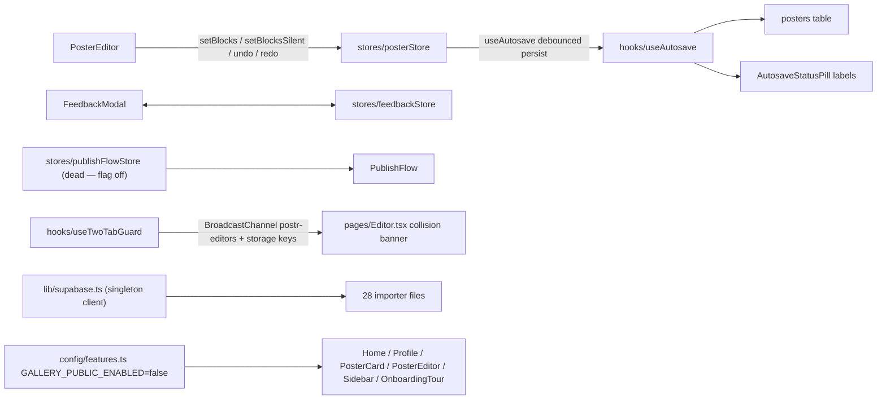

#### `stores/feedbackStore.ts` — global Feedback-modal state (open from anywhere, optional diagnostic context)

- [ ] State fields: `isOpen: boolean` (`:32`), `initialKind: FeedbackKind` (`:33`, default `'feature'` `:41`), `context: FeedbackContext | null` (`:34`; `title?`/`body?`/`attachment?`/`log?` `:17-29`).
- [ ] `open(kind = 'feature', context?)` — opens modal with kind + optional prefill context (`:43`). Callers: `components/PublicFooter.tsx:52` ('other'); `pages/About.tsx:181,187,193` ('bug'/'feature'/'other'); `components/PublicHeader.tsx:146,152` ('feature'); `pages/ChartChooser.tsx:185` ('bug'); `components/ImportPosterModal.tsx:145` ('bug' + captured log); `pages/Profile.tsx:639,642,645`; `pages/Home.tsx:179` ('feature'); `charts/ChartBlock.tsx:93` ('bug', title "Chart failed to render"); `components/CopyDesignModal.tsx:142` ('bug' + log)
- [ ] `close()` — closes modal, clears context (`:45`). Caller: `components/FeedbackModal.tsx:22`
- [ ] Readers: `components/FeedbackModal.tsx:19-21` (isOpen/initialKind/context); `isOpen` also read by `components/OnboardingTour.tsx:111` and `pages/Profile.tsx:63` (to suppress other UI)

**Elements** — none (store; modal UI in `components/FeedbackModal.tsx`). **Copy** — none. **Graphics** — none.

#### `stores/posterStore.ts` — central editor store: current PosterDoc + undo/redo (50-entry stacks) + locked-block invariant

- [ ] State fields: `posterId: string | null` (`:31`), `posterTitle: string` (`:32`), `doc: PosterDoc | null` (`:33`), `canUndo: boolean` (`:36`), `canRedo: boolean` (`:37`). Module-level (non-reactive): `undoStack`/`redoStack` (`:70-71`), `lockedBaseline` (`:87`).
- [ ] `setPoster(posterId, doc, title?, options?)` — loads a poster; resets undo history + locked baseline; opt-in ack seeding (`seedAcknowledgement`) for editing entries only (`:131`). Callers: `pages/Editor.tsx:132` (editing), `pages/Share.tsx:32` (read-only view), `components/ImportPosterModal.tsx:291` (post-import), `poster/PosterEditor.tsx:591` (also used as doc-patch helper `:1641`)
- [ ] `setPosterTitle(title)` — sets display title, no undo (`:163`). Caller: `poster/PosterEditor.tsx:610`
- [ ] `addBlock(block)` — append block with undo (`:165`). **No production callers** (tests only) — PosterEditor's local `addBlock` (`PosterEditor.tsx:1775`) routes through `setBlocks`
- [ ] `updateBlock(id, patch)` — patch one block with undo (`:173`). **No production callers** — local wrapper `PosterEditor.tsx:1644` uses `setBlocks`
- [ ] `removeBlock(id)` — delete with undo; locked blocks refused silently, no undo entry (`:188`). **No production callers** — UI delete path is `filterDeletable` + `setBlocks` (`PosterEditor.tsx:1654-1658`)
- [ ] `setStyle(level, patch)` — patch a TypeStyle level with undo (`:199`). Caller: `poster/PosterEditor.tsx:1334`
- [ ] `setPalette(palette)` — replace palette with undo (`:210`). **No production callers** (tests only)
- [ ] `setFont(fontFamily)` — replace font with undo (`:213`). **No production callers** (tests only)
- [ ] `applyExtractedStyle({palette?, fontFamily?})` — applies copied design as ONE undo step; empty patch = no-op (`:216`). Caller: `components/CopyDesignModal.tsx:54`
- [ ] `setBlocks(blocks)` — whole-list replace with undo; re-inserts missing locked blocks (`guardLocked`) — the chokepoint for all UI delete/move/layout paths (`:237`). Caller: `poster/PosterEditor.tsx:1332`
- [ ] `setBlocksSilent(blocks)` — same but no undo push; for drag intermediates (`:246`). Callers: `poster/PosterEditor.tsx:1333`, `pages/Editor.tsx:119`
- [ ] `undo()` — restores previous doc, re-applies locked guard (`:264`). Caller: `poster/PosterEditor.tsx:855`
- [ ] `redo()` — restores next doc, re-applies locked guard (`:285`). Caller: `poster/PosterEditor.tsx:856`
- [ ] Field readers: `doc` — `PosterEditor.tsx:590`, `sidebar/ImportSection.tsx:20`, `sidebar/PostrExportButton.tsx:13`, `sidebar/EditableExportButtons.tsx:88`, `components/CopyDesignModal.tsx:52`; `posterId` — `PosterEditor.tsx:592,1305`, `ImportSection.tsx:18`, `CopyDesignModal.tsx:53`; `posterTitle` — `PosterEditor.tsx:609,1306`, `ImportSection.tsx:19`, `PostrExportButton.tsx:14`, `EditableExportButtons.tsx:89`, `Share.tsx:33`, `Editor.tsx:133`

**Elements** — none. **Copy** — none. **Graphics** — none.

#### `stores/publishFlowStore.ts` — two-step publish modal state machine (consent → metadata)

- [ ] **Feature-flagged dead flow**: entry points are hidden while `GALLERY_PUBLIC_ENABLED = false` (`config/features.ts:21`), so `step` never leaves `'closed'` in production.
- [ ] State fields: `step: 'closed' | 'consent' | 'metadata'` (`:13`), `posterId: string | null` (`:14`), `posterTitle: string | null` (`:15`).
- [ ] `openForPoster(posterId, posterTitle)` — opens at consent step for an existing poster (`:35`). Caller: `poster/PosterEditor.tsx:1307` (flag-gated)
- [ ] `openForUpload()` — opens at consent step for external PDF/image (`:37`). Caller: `pages/Profile.tsx:65` (flag-gated)
- [ ] `advanceToMetadata()` — consent accepted → metadata step (`:39`). Caller: `components/PublishFlow.tsx:24`
- [ ] `close()` — resets to closed + clears ids (`:40`). Caller: `components/PublishFlow.tsx:25`
- [ ] Readers: `step` — `PublishFlow.tsx:21`, `pages/Profile.tsx:66`, `components/OnboardingTour.tsx:110`; `posterId`/`posterTitle` — `PublishFlow.tsx:22-23`

**Elements** — none. **Copy** — none. **Graphics** — none.

#### `hooks/useAutosave.ts` — debounced (800 ms) poster persistence + thumbnail capture scheduling

No rendered UI itself; drives `components/AutosaveStatusPill.tsx` (pill labels "Saving…" / "Saved · {rel}" / "Saved" live there, `AutosaveStatusPill.tsx:44,55,61` — §6.13) via the `AutosaveStatus` union `'idle' | 'saving' | 'saved' | 'error'` (`useAutosave.ts:26`). Callers: `poster/PosterEditor.tsx`, `components/AutosaveStatusPill.tsx`; `flushNow` used by the Sidebar "Save" button (comment `useAutosave.ts:143-144`, impl `poster/Sidebar.tsx`).

**Elements**
- [ ] Browser-native "leave site?" confirmation dialog — beforeunload handler — `useAutosave.ts:279-300` — fires `flush()` then `e.preventDefault()` + `e.returnValue = ''` when un-flushed edits exist; **custom text is ignored by all modern browsers** (they show their own localized string, comment `:289-292`)

**Copy** — no app-owned strings (status enum only; pill text in `AutosaveStatusPill.tsx`, §6.13).
**Graphics** — none.
Behavior notes for refactor: auto-fills `posters.title` from the title block when no display title (`:165-174`); thumbnail capture throttled to 3 s cooldown + `requestIdleCallback` (`:123-140`); unmount forces a final thumbnail (`:234-263`).

#### `hooks/useComments.ts` — comment-thread cache + mutators, 15 s polling; guest-name persistence

Consumers: `poster/CommentsPanel.tsx`, `poster/PosterEditor.tsx`. Storage: localStorage key `postr.comment-name` (`:153`; read `:157`, write `:165`).
**Elements** — none (hook).
**Copy**
- [ ] "No poster to comment on." — thrown error message (surfaces in comment UI) — `useComments.ts:84`
**Graphics** — none.

#### `hooks/useIsSmallScreen.ts` — `matchMedia('(max-width: 639px)')` breakpoint hook

No UI — logic only. Exported constant `SMALL_SCREEN_QUERY` (`:17`). Consumer: `poster/PosterEditor.tsx` (phone-only layout branches). Returns `false` under SSR/jsdom.
**Elements** — none. **Copy** — none. **Graphics** — none.

#### `hooks/useModalTransition.ts` — keeps modals mounted 140 ms for exit animation (`data-state='closing'`)

No UI itself; drives `[data-postr-modal-backdrop]/[data-postr-modal-content]` CSS in `index.css`. Consumers (14): `components/ImportPosterModal.tsx`, `components/CopyDesignModal.tsx`, `components/PublishConsentModal.tsx`, `components/StaplesPrintModal.tsx`, `components/SessionExpiredModal.tsx`, `components/PublishGalleryModal.tsx`, `components/PresetEditModal.tsx`, `components/LogoPicker.tsx`, `components/InputModal.tsx`, `components/ImportConfirmReplaceModal.tsx`, `components/FeedbackModal.tsx`, `components/ConfirmModal.tsx` (+ `index.css`).
**Elements** — none. **Copy** — none. **Graphics** — none.

#### `hooks/useStorageUrl.ts` — resolves `storage://` image srcs to Supabase signed URLs (50 min TTL cache)

No UI — logic only. Consumer: `poster/blocks.tsx` (image block rendering).
**Elements** — none. **Copy** — none. **Graphics** — none.

#### `hooks/useTwoTabGuard.ts` — BroadcastChannel + storage-event detection of same poster open in two tabs

No UI itself; returns `{ collision, tabId, dismiss }` — the warning banner is rendered by consumer `pages/Editor.tsx` (§6.7). Channel name `postr-editors` (`:36`).
**Elements** — none (hook; the dismiss action `dismiss()` `:155` is wired to the banner's button in `pages/Editor.tsx`).
**Copy** — none in file (banner text lives in `pages/Editor.tsx`).
**Graphics** — none.
Storage: sessionStorage `postr.tab-id` (`:43-48`); localStorage `postr.active-editor.{posterId}` (`:37,96-116`, heartbeat `:121-126`; 2-min staleness `:106`).

#### `lib/apiClient.ts` — typed POST wrapper for the Render Express API + `ApiError` + `formatRetryAfter`

Consumers of `postJson`/`ApiError`: `data/billing.ts`, `manuscript/condenseClient.ts`, `import/styleImport.ts`, `import/imageImport.ts`, `import/pdfImport.ts`, `poster/Sidebar.tsx`, `poster/ReadabilityPanel.tsx`. `formatRetryAfter` outputs are composed into user-visible import error toasts via the template `` ` Try again in ${formatRetryAfter(err.retryAfterSec)}.` `` at `import/styleImport.ts:129`, `import/pdfImport.ts:87`, `import/imageImport.ts:269`.
**Elements** — none.
**Copy**
- [ ] "a moment" — duration text (fallback, <1 s) — `apiClient.ts:32`
- [ ] "{s} second{s}" — duration text template (`1 second` / `37 seconds`) — `apiClient.ts:34`
- [ ] "{m} minute{m}" — duration text template — `apiClient.ts:36`
- [ ] "{h} hour{h}" — duration text template — `apiClient.ts:38`
- [ ] "tomorrow" — duration text (≥24 h) — `apiClient.ts:39`
- [ ] "API base URL not configured (VITE_API_BASE_URL is empty)." — thrown `ApiError` message (misconfig) — `apiClient.ts:56`
- [ ] "Request failed ({status})" — `ApiError` fallback message when server sends no `error`/`message` — `apiClient.ts:101`
**Graphics** — none.

#### `lib/consoleCapture.ts` — 200-entry in-memory console ring buffer for the Send-Feedback payload

`installConsoleCapture()` called once at boot, `main.tsx:9`. `getCapturedLog()` callers: `components/ImportPosterModal.tsx:140`, `components/CopyDesignModal.tsx:148` (both attach to feedback context). **`getCapturedCount()` (`:89`) has NO callers — dead export** (doc claims "used by the modal preview" but nothing imports it — §10).
**Elements** — none.
**Copy**
- [ ] "[{ISO-ts}] [{LEVEL}] {message}" — captured-log line format (previewed in FeedbackModal before send) — `consoleCapture.ts:83`
**Graphics** — none.

#### `lib/supabase.ts` — singleton Supabase browser client (persistSession, autoRefreshToken, detectSessionInUrl)

Imported by 28 files (all `data/*`, auth components, import modules, pages, `hooks/usePlan.ts`, `hooks/useAutosave.ts`). `persistSession: true` (`:22`) means supabase-js owns `sb-*` localStorage keys.
**Elements** — none.
**Copy**
- [ ] "Missing Supabase env vars: VITE_SUPABASE_URL and VITE_SUPABASE_PUBLISHABLE_KEY must be set in apps/web/.env" — module-load throw — `supabase.ts:15-17`
**Graphics** — none.

#### `config/features.ts` — product feature switches (single flag)

No UI — logic only. `GALLERY_PUBLIC_ENABLED = false` (`features.ts:21`) — **the public gallery is OFF**; flag hides all publish/browse entry points. Importers: `pages/Profile.tsx`, `pages/Home.tsx`, `components/PosterCard.tsx`, `poster/PosterEditor.tsx`, `poster/Sidebar.tsx`, `components/OnboardingTour.tsx`. Reactivation checklist (routes.tsx redirects, vercel.json noindex, sitemap, deleted api/shell files, PosterCard "Publish" action deleted-not-gated) documented in the header comment `features.ts:4-19`.
**Elements** — none. **Copy** — none. **Graphics** — none.

#### `globals.d.ts` — declares `__BUILD_ID__` (git SHA baked by vite `define`)

Type-only declaration, no runtime UI. Consumed by the update-banner flow (`components/UpdateAvailableToast.tsx` compares it against `/version.json`).
**Elements** — none. **Copy** — none. **Graphics** — none.

---

### 6.15 SEO & Analytics

Per-route metadata (`seo/routes.json` → `seo/siteMeta.ts` → `seo/useDocumentMeta.ts` → `document.head`) and the Vercel Web Analytics beacon with URL redaction. No DOM UI in any of these files — but all values are user-visible (tab titles, search snippets, prerendered crawler copy).

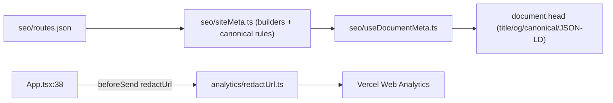

#### `seo/routes.json` — per-route metadata data source (consumed by siteMeta.ts + prerender script)

No UI directly; all values below are user-visible (tab titles, search snippets, prerendered crawler copy).

**Copy**
- [ ] Globals: "https://www.postr.sh", "Postr", "en_US", "#0a0a12", "/og-card.png" — `routes.json:2-6`
- [ ] "/" — title "Academic Poster Maker for Researchers | Postr", description, h1 "Academic posters, without the hassle.", 4 crawler copy lines — `routes.json:8-19`
- [ ] "/about" — title "How Postr Works: Features for Academic Posters", description, h1 "About Postr", 4 copy lines — `:20-31` (note: h1 "About Postr" does NOT match the live About h1 "Everything you need to ship a great poster." — parity drift, §10)
- [ ] "/why-posters" — title "Why Poster Sessions Matter: Skills That Outlast Them", description, h1 "Why poster sessions matter", 5 copy lines — `:32-44` (h1 matches eyebrow, not live h1)
- [ ] "/pricing" — title "Postr Pricing: Free Poster Maker, Paid Export", description (CA$18.99 term / CA$9.99 pack), h1 "Free to build. Pay only to take it further.", 4 copy lines — `:45-56`
- [ ] "/chart-chooser" — title "Chart Chooser: Which Chart Fits Your Data? | Postr", description, h1 "Which chart fits your data?", 4 copy lines — `:57-68`
- [ ] "/privacy" — title "Privacy Policy | Postr", description, h1 "Privacy Policy", 1 copy line — `:69-77`
- [ ] "/cookies" — title "Cookie Policy | Postr", description, h1 "Cookies Policy", 1 copy line — `:78-86`
- [ ] "/terms" — title "Terms of Service | Postr", description, h1 "Terms of Service", 1 copy line — `:87-95`
- [ ] "/paper-to-poster" — title "Paper to Poster: Turn a Manuscript into One | Postr", description, h1 "From paper to poster", 4 copy lines — `:96-107`
- [ ] app routes (all noindex,nofollow): "/auth" "Sign in | Postr" · "/dashboard" "My posters | Postr" · "/profile" "Profile and settings | Postr" · "/presentation-checker" "Presentation Checker — Poster & Talk Review | Postr" (D12 — registered, unlinked; §6.17) · "/debug" "Debug | Postr" · "/admin/gallery" "Gallery moderation | Postr" · "/p" "Poster editor | Postr" — `:173-235`
- [ ] "/404" — title "Page not found | Postr", description "That page does not exist.", h1 "Page not found", 1 copy line — `:140-148`
- [ ] Note: no entries for `/gallery`, `/why-posters` app, `/billing/*`, `/s`, or any `/fr` legal route — FR pages reuse the EN route meta (`TermsFr.tsx:23`, `PrivacyFr.tsx:18`, `CookiesFr.tsx:19`), so FR pages carry EN titles/descriptions and the EN canonical — SEO-relevant drift to flag (§10).

#### `seo/siteMeta.ts` — metadata builders + canonical rules (types around routes.json)

No UI — logic only. User-visible head strings built here:
- [ ] ogImageAlt fallback "{SiteName}: free conference poster maker" — `siteMeta.ts:117`
- [ ] NOT_FOUND fallback "Page not found | {SiteName}" / "That page does not exist." — `siteMeta.ts:151-152`
- [ ] Gallery entry title template "{title…45} — {fieldLabel} Poster | {SiteName}" + description template "{title} ({venue}) a {field} conference poster in the {SiteName} gallery." + ogImageAlt "Conference poster: {title}" — `siteMeta.ts:213-219`
- [ ] Share title template "{title} · Shared on {SiteName}" + description "A research poster shared for review on {SiteName}. Comment on it, or make your own conference poster free." + ogImageAlt "Research poster: {title}" + fallback "Untitled poster" — `siteMeta.ts:240-248`
- [ ] Robots constants "index,follow", "noindex,nofollow", preview directives "max-image-preview:large,max-snippet:-1,max-video-preview:-1" — `siteMeta.ts:37-47`

#### `seo/useDocumentMeta.ts` — hook applying PageMeta to document.head

No UI — logic only (upserts title, description, robots, canonical, og:*, twitter:*, JSON-LD; removes tags when value is null).

#### `analytics/redactUrl.ts` — redacts identifier-bearing routes before Vercel Web Analytics beacons

No UI — logic only. Consumed by `App.tsx:38` (`<Analytics beforeSend={(event) => ({ ...event, url: redactUrl(event.url) })} />`); behavior described in policy text at `pages/Cookies.tsx` (§6.4).
**Elements** — none.
**Copy** (analytics payloads, not user-visible, listed for refactor sweep):
- [ ] `/s/[redacted]` — redaction shape for share-link slugs — `redactUrl.ts:40`
- [ ] `/p/[redacted]` — redaction shape for poster ids — `redactUrl.ts:41`
- [ ] `/admin/[redacted]` — redaction shape for the whole `/admin` subtree — `redactUrl.ts:45,91`
- [ ] `https://www.postr.sh/[unparseable]` — fallback for unparseable URLs — `redactUrl.ts:48,78`
**Graphics** — none.

---

## 7. Cross-reference index

### Feature → files → shared imports

| Feature | Files (relative to `apps/web/src/`) | Shared imports it depends on |
|---|---|---|
| App Shell & Routing & Consent | `App.tsx`, `main.tsx`, `routes.tsx`, `components/ConsentNotice.tsx`, `pages/Debug.tsx`, `pages/NotFound.tsx` | `lib/consoleCapture`, `analytics/redactUrl`, all global modals |
| Landing & Marketing | `pages/Landing.tsx`, `pages/About.tsx`, `pages/WhyPosters.tsx` | `components/PublicHeader/PublicFooter/RotatingWord`, `motion/timelines/landingEntrance.ts`, `motion/timelines/aboutRoadtrip.ts`, `stores/feedbackStore` |
| Pricing & Billing | `pages/Pricing.tsx`, `pages/BillingResult.tsx`, `components/PricingSection.tsx`, `hooks/usePlan.ts`, `data/billing.ts`, `data/checkoutIntent.ts`, `data/talkWaitlist.ts` | `lib/apiClient`, `lib/supabase`, `components/PublicHeader/PublicFooter`; server: `apps/api/src/billing.ts` |
| Legal EN/FR | `pages/Privacy.tsx`, `PrivacyFr.tsx`, `Cookies.tsx`, `CookiesFr.tsx`, `Terms.tsx`, `TermsFr.tsx` | `seo/siteMeta.ts` (FR reuses EN meta) |
| Auth & Session | `pages/Auth.tsx`, `components/AuthGuard.tsx`, `components/AuthBootstrap.tsx` (dead), `components/SessionExpiredModal.tsx`, `lib/auth.ts` | `lib/supabase`, `components/PasswordStrength`, `data/consent`, `data/checkoutIntent` |
| Dashboard & Profile | `pages/Home.tsx`, `pages/Profile.tsx`, `pages/Gallery.tsx` (dead), `pages/GalleryEntry.tsx` (dead), `pages/AdminGallery.tsx` | `components/NewPosterButton/PosterCard/ConfirmModal/PresetEditModal/PasswordStrength`, `data/posters/gallery/feedback`, `stores/feedbackStore`, `stores/publishFlowStore` (dead), `config/features` |
| Poster Editor Core | `pages/Editor.tsx`, `pages/Share.tsx`, `poster/blocks.tsx`, `boundsCheck.ts`, `CropOverlay.tsx`, `FloatingFormatToolbar.tsx`, `GroupFrame.tsx`, `GuidelinesPanel.tsx`, `PosterEditor.tsx`, `resizeHandles.tsx`, `RichTextEditor.tsx`, `SelectionRect.tsx`, `symbols.ts`, `templates.ts`, `constants.ts`, `UndoToast.tsx` | `stores/posterStore`, `hooks/*` (all), `components/{Sidebar→§6.8, PaletteDesigner, StaplesPrintModal, ConfirmModal, AutosaveStatusPill, OnboardingTour, InputModal, LogoPicker}`, `charts/ChartBlock`, `export/*` (print, attribution, blockLock), `data/posters/posterVersions/posterImages`, `motion/timelines/{editorEntrance,blockSelection}` |
| Poster Sidebar (11 tabs) | `poster/Sidebar.tsx`, `poster/{CommentsPanel,VersionPanel,ReadabilityPanel}.tsx`, `poster/sidebar/{EditableExportButtons,FigureTab,ImportSection,ImportTile,PostrExportButton}.tsx` | `poster/constants/templates`, `components/{CopyDesignModal, ImportPosterModal, ImportConfirmReplaceModal, BusyIndicator, UpdateAvailableToast}`, `charts/ladder/ChartChooser`, `hooks/usePlan`, `data/billing`, `lib/apiClient`, `config/features` |
| Import & Data | `import/*` (14 files), `data/*` (13 files) | `lib/apiClient`, `lib/supabase`, `hooks/useComments` (comments consumers), rendered by `components/ImportPosterModal` + `poster/Sidebar` |
| Charts | `pages/ChartChooser.tsx`, `charts/*` (21 files) | `poster/constants` (PALETTES), `components/BusyIndicator`, `stores/feedbackStore`, `poster/PosterEditor` (poster tables) |
| Export & Attribution | `export/*` (20 files) | `export/attribution.ts` (single ack source), `import/postrFile.ts` (.postr), `hooks/usePlan` (paidPlan seam) |
| Manuscript → Poster | `pages/PaperToPoster.tsx`, `manuscript/*` (20 files) | `charts/ladder/ChartChooser`, `components/BusyIndicator`, `lib/apiClient`, `lib/auth`, `manuscript/figureCheck.ts` |
| Shared Components & Motion | `components/*` (30 files), `motion/*` (9 files) | `hooks/useModalTransition`, `stores/feedbackStore`, `stores/publishFlowStore`, `data/*`, `import/*`, `poster/logoPresets`, `poster/paletteTools` |
| Stores, Hooks & Storage Keys | `stores/*` (3), `hooks/*` (7), `lib/*` (4), `config/features.ts`, `globals.d.ts` | — (base layer) |
| SEO & Analytics | `seo/routes.json`, `seo/siteMeta.ts`, `seo/useDocumentMeta.ts`, `analytics/redactUrl.ts` | consumed by every page via `useDocumentMeta`; `App.tsx:38` |

### Shared-component reverse lookup (component → every feature that renders/imports it)

| Component / module | Rendered or imported by |
|---|---|
| `PublicHeader` | About (:110), Pricing (:26); `NAV_LINKS` labels reused by Home (:164-168) and AdminGallery (:151-155) |
| `PublicFooter` | About (:203), Pricing (:46) |
| `PricingSection` | Pricing (:44) |
| `FeedbackModal` | App.tsx:14 (global); opened via `feedbackStore.open` from PublicFooter, About ×3, PublicHeader ×2, ChartChooser page, ImportPosterModal, Profile ×3, Home, ChartBlock, CopyDesignModal |
| `PublishFlow` (+ Consent/Gallery modals) | App.tsx:15 — DEAD (`GALLERY_PUBLIC_ENABLED=false`) |
| `SessionExpiredModal` | App.tsx:16 |
| `ConsentNotice` | App.tsx:24 |
| `ConfirmModal` | Home (Delete poster :277-285, Duplicated :287-299), Profile (:729-738), PosterEditor (Duplicated :2459-2471) |
| `NewPosterButton` | Home (:212, :258) |
| `PosterCard` | Home (:266-271) |
| `PasswordStrength` | Auth (:483, signup), Profile (:1252, guest email signup) |
| `PresetEditModal` | Profile (:723-727) |
| `BusyIndicator` | EditableExportButtons, PaperToPoster (:410-414), ChartPreview (:81), DataStep (:149,:168) |
| `ChartChooser` (`charts/ladder`) | pages/ChartChooser, sidebar/FigureTab (:96-117), manuscript/ChartPanel (:140-146) |
| `ChatPane` | PaperToPoster (:293-301) |
| `ChartPanel` | PaperToPoster (:309-314) |
| `OutlineCard` | PaperToPoster (:334-338) |
| `PosterStatic` | PaperToPoster (:398) |
| `PosterEditor` | pages/Editor (:305), pages/Share (:108, readOnly) |
| `RotatingWord` | Landing (:147) |
| `AuthGuard` | routes.tsx (:152-167) ×4 routes |
| `EditorErrorBoundary` | routes.tsx (/p/:posterId) |
| `LogoPicker` | blocks.tsx (:215-219 filled, :253-257 empty) |
| `ImportPosterModal` | NewPosterButton (mode new), sidebar/ImportSection (mode replace) |
| `ImportConfirmReplaceModal` | sidebar/ImportSection (:38-47) |
| `CopyDesignModal` | Sidebar Style tab (:2393-2396) |
| `StaplesPrintModal` | PosterEditor (:2446-2454) |
| `PaletteDesigner` | PosterEditor (:2424-2443) |
| `OnboardingTour` | PosterEditor (:3358, edit mode) |
| `AutosaveStatusPill` | PosterEditor (:3271-3275) |
| `InputModal` | GuidelinesPanel (:779-787, save template) |
| `UpdateAvailableBanner` / `JustRefreshedBanner` | Sidebar (:581-582) |
| `StyleMiniPreview` | CopyDesignModal (:257,:263) |
| `Sidebar` | PosterEditor (:2332-2420) |
| `GuidelinesPanel` | PosterEditor (:3305) |
| `FloatingFormatToolbar` | blocks.tsx (:2537); docked variant in Sidebar Edit tab (:3865,:3890) |
| `RichTextEditor` | Sidebar Edit tab TextBlockEditor (:3881-3888); block text editors in blocks.tsx |
| `UndoToast` | PosterEditor (:3224-3228) |
| `ChartBlock` | poster canvas (chart blocks render site) |
| `hooks/useModalTransition` | 12 modals: ImportPosterModal, CopyDesignModal, PublishConsentModal, StaplesPrintModal, SessionExpiredModal, PublishGalleryModal, PresetEditModal, LogoPicker, InputModal, ImportConfirmReplaceModal, FeedbackModal, ConfirmModal (+ index.css) |
| `hooks/usePlan` | EditableExportButtons, Profile, BillingResult |
| `hooks/useAutosave` | PosterEditor, AutosaveStatusPill; `flushNow` from Sidebar Save |
| `hooks/useComments` | CommentsPanel, PosterEditor |
| `hooks/useTwoTabGuard` | pages/Editor |
| `hooks/useStorageUrl` | blocks.tsx |
| `hooks/useIsSmallScreen` | PosterEditor |
| `lib/apiClient` (`postJson`) | data/billing, manuscript/condenseClient, import/styleImport, import/imageImport, import/pdfImport, Sidebar (parse-authors/references), ReadabilityPanel |
| `lib/auth` (`ensureSession`) | AuthBootstrap (dead), data/posters, manuscript/condenseClient, pages/Share |
| `lib/supabase` | 28 files (all data/*, auth components, import modules, pages, usePlan, useAutosave) |
| `lib/consoleCapture` | main.tsx (install); `getCapturedLog` from ImportPosterModal, CopyDesignModal |
| `config/features` (`GALLERY_PUBLIC_ENABLED`) | Profile, Home, PosterCard, PosterEditor, Sidebar, OnboardingTour |
| `stores/feedbackStore` | 10 open-callers (see §6.14) + FeedbackModal + OnboardingTour/Profile readers |
| `stores/posterStore` | Editor, Share, ImportPosterModal, PosterEditor (all field readers listed §6.14), CopyDesignModal, sidebar/{ImportSection, PostrExportButton, EditableExportButtons} |
| `stores/publishFlowStore` | PosterEditor (:1307, flag-gated), Profile (:65-66, flag-gated), PublishFlow, OnboardingTour — all dead while flag off |

---

## 8. Storage-key sweep list

Every localStorage / sessionStorage key the app reads or writes, with file:line (from the stores/hooks slice sweep, 2026-07-28). The "delete my data" sweep point is `pages/Profile.tsx:290-295` — any NEW key added anywhere must be added there too.

**localStorage**
- [ ] `postr.custom-palettes` — const `poster/customPalettes.ts:9`; read `:13`, write `:30`
- [ ] `postr.checklist-templates` — const `poster/GuidelinesPanel.tsx:390`; read `:457`, write `:465`
- [ ] `postr.scratch-pad` — const `poster/GuidelinesPanel.tsx:389`; read `:478`, write `:486`; removed `pages/Profile.tsx:291`
- [ ] `postr.scratch-note` — inline `poster/GuidelinesPanel.tsx:502` (read), `:526` (write); removed `pages/Profile.tsx:292`
- [ ] `postr.style-presets` — inline `poster/PosterEditor.tsx:661` (read), `:669` (write); const `components/PresetEditModal.tsx:40` (read `:44`, write `:53`); read `pages/Profile.tsx:73`; removed `pages/Profile.tsx:162,290`
- [ ] `postr.profile` — const `pages/Profile.tsx:1266`; read `:1278`, write `:1299`; removed `:294`
- [ ] `postr.onboarding-done` — const `components/OnboardingTour.tsx:97`; read `:115`, write `:125,197`, remove `:321`; removed `pages/Profile.tsx:295`
- [ ] `postr.cb-random-pref` — const `components/PaletteDesigner.tsx:34`; read `:38`, write `:46`
- [ ] `postr.welcome-seeded:{userId}` — prefix const `data/seedWelcomePoster.ts:36`; read `:40`, write `:50`
- [ ] `postr.comment-name` — const `hooks/useComments.ts:153`; read `:157`, write `:165`
- [ ] `postr.active-editor.{posterId}` — prefix const `hooks/useTwoTabGuard.ts:37`; read `:97`, write `:113,122` (30 s heartbeat)
- [ ] `sb-*` (Supabase auth token keys, owned by supabase-js) — enabled by `lib/supabase.ts:22` (`persistSession: true`); wiped via `signOut({scope:'local'})` `lib/auth.ts:54`; enumerated `pages/Debug.tsx:61`; bulk-cleared `pages/Debug.tsx:136`

**sessionStorage**
- [ ] `postr.tab-id` — inline `hooks/useTwoTabGuard.ts:43`; read `:44`, write `:47`
- [ ] `postr.autoArrangeOnLoad` — inline write `components/ImportPosterModal.tsx:298-301`; read `poster/PosterEditor.tsx:1981`, remove `:1988`
- [ ] `postr-just-refreshed` — const `components/UpdateAvailableToast.tsx:18`; read `:143,259`, write `:201`, remove `:268`
- [ ] `postr-acknowledged-build` — const `components/UpdateAvailableToast.tsx:27`; read `:91`, write `:126,208`
- [ ] `postr.checkoutIntent` — const `data/checkoutIntent.ts:23`; write `:40`, read `:49`, remove `:58`
- [ ] `postr.signupConsent` — const `data/consent.ts:34`; write `:44`, read `:54`, remove `:69`

**BroadcastChannel** (not storage, same sweep family)
- [ ] `postr-editors` — `hooks/useTwoTabGuard.ts:36,73`

---

## 9. External services map

### Supabase (Postgres + Auth + Storage + Edge Functions)

**Tables** (migrations under `supabase/migrations/`)

| Table | Used by (web) | Notes |
|---|---|---|
| `public.users` | auth/session everywhere; `hooks/usePlan` reads plan/credits; Profile consent switches (`writeConsent`) | plan/credits columns are SERVER-OWNED — DB trigger rejects non-service_role writes (`20260728120000_billing_plan.sql`); research/marketing consent columns (`20260728000000_research_consent.sql`, `20260728180000_marketing_consent.sql`) |
| `public.posters` | `data/posters.ts` (CRUD, duplicate, share-link mint), `hooks/useAutosave` | share links: `/s/:slug` read path |
| `public.gallery_entries` | `data/gallery.ts` (list, entry, submissions, publish, retract, admin list/retract/unretract) | gallery frozen — UI flag-gated (§10) |
| `public.feedback` | `data/feedback.ts` (`submitFeedback`) | daily rate limit enforced client-side |
| `public.poster_comments` | `data/comments.ts`, `hooks/useComments` | 15 s polling |
| `public.poster_versions` | `data/posterVersions.ts` (⌘S saveVersionNow; Versions tab) | MAX_VERSIONS_PER_POSTER = 20 |
| `public.user_logos` | `data/userLogos.ts`, LogoPicker "My Logos" | max 25/account, 10 MB each |
| `public.talk_waitlist` | `data/talkWaitlist.ts` ← PricingSection "Join the waitlist" | shipped 2026-07-28 (`20260728160000_talk_waitlist.sql`) |
| `public.poster_reviews` | `review/reviewApi.ts` (`listMyReviews` — past-reviews list, §6.17) | owner-SELECT-only RLS (D3) — ALL writes are API service_role after a successful critique (success-only, D16); stage machine initial → followup → closed; `20260729120000_poster_reviews.sql` |
| `public.users` review columns (`review_credits`, `review_addon`, `review_addon_subscription_id`) | `hooks/usePlan` (`reviewCredits` / `canReview`, §6.17) | SERVER-OWNED like plan/credits — folded into `guard_billing_columns()` (10 guarded columns); `20260729120000_poster_reviews.sql` |
| billing fulfillment rows | written ONLY by the Stripe webhook (service_role) | `20260728130000_billing_fulfilled_sessions.sql`, `20260728140000_consume_export_credit.sql`, `20260728150000_grant_export_credits.sql`, `20260728170000_billing_subscription.sql`, `20260728190000_billing_refunds.sql` |
| `public.presets` | — | **UNUSED** (`20260408000200_presets.sql`; app presets live in localStorage `postr.style-presets`) — §10 |
| `public.authors_lib` / `public.institutions_lib` / `public.references_lib` | — | **UNUSED** (`20260408000300_library.sql` — PRD §21 library never wired to UI) — §10 |

**RPCs / DB functions called from the web app**
- [ ] `delete_own_account` — Profile Delete account (`Profile.tsx:712-717`)
- [ ] `export_my_data` — Profile Download my data (`Profile.tsx:682-689`) → `postr-export-{ts}.json`
- [ ] `is_gallery_admin` — Home Admin link gate, AdminGallery gate
- [ ] admin retract/unretract — `data/gallery.ts` (`adminRetractEntry`, `adminUnretractEntry`) ← AdminGallery
- [ ] `consume_export_credit` / `grant_export_credits` — server-side only (billing webhook + `/billing/consume-credit`)
- [ ] `consume_review_credit(uuid)` / `grant_review_credits(uuid, integer)` — server-side only (§6.17: critique consume AFTER success + `review_pack` webhook grant; mirror the export-credit RPCs — security definer, pinned search_path, atomic conditional UPDATE, service_role only; `20260729120000_poster_reviews.sql`)

**Storage buckets**
- [ ] `poster-assets` — PRIVATE, signed URLs (`storage://` refs resolved by `hooks/useStorageUrl`); poster images (`data/posterImages.ts`), thumbnails (`data/thumbnails.ts`), import/vision upload staging
- [ ] `user-logos` — user logo library (`data/userLogos.ts`)
- [ ] `gallery` — gallery entry images/PDFs (`data/gallery.ts`)

**Edge functions** (`supabase/functions/`)
- [ ] `delete-account` — the only deployed edge function; used by account deletion flow
- [ ] (none else — no storage GC function exists, §10)

### apps/api (Express on Render) — endpoints called from the web app

| Endpoint | Called from | Purpose |
|---|---|---|
| `POST /api/import/extract` | `import/pdfImport.ts` (vision fallback), `import/imageImport.ts`, `import/styleImport.ts` | Vision-model poster extraction + copy-a-design style extraction (Claude, below); 429 daily/burst limits |
| `POST /api/import/parse-authors` | `poster/Sidebar.tsx:1365` (Authors tab "Parse with AI") | LLM byline parser (regex fallback offline) |
| `POST /api/import/parse-references` | `poster/Sidebar.tsx:1416` (Refs tab "Parse with AI") | LLM reference parser (line-splitter fallback) |
| `POST /api/narrative/condense` | `manuscript/condenseClient.ts:40` ← PaperToPoster | The one manuscript LLM call (OpenAI, below); 429 daily drafting limit |
| `POST /api/narrative/extract-findings` | `manuscript/deck/extractFindings.ts:63` ← PaperToSlides (§6.16) | Phase-1 LLM star-finding extraction for the slide deck (OpenAI); same middleware as `/condense` |
| `POST /api/narrative/style-deck` | `manuscript/deck/styleClient.ts:59` ← PaperToSlides (§6.16) | Phase-2 Arm P — styles each slide into structured editable layout (OpenAI); same middleware as `/condense` |
| `POST /api/narrative/theme` | `manuscript/deck/themeClient.ts:79` ← PaperToSlides (§6.16) | Phase-2 Arm T — field theme + 4 palette variations (OpenAI); same middleware as `/condense`; re-run alone on a vibe change |
| `POST /billing/create-checkout` | `data/billing.ts:17` ← EditableExportButtons (term/pack), Auth (`startCheckoutForPlan`) | Creates Stripe Checkout Session → redirect URL |
| `POST /billing/consume-credit` | `data/billing.ts:33` ← EditableExportButtons post-export | Consumes 1 export credit |
| `POST /billing/mark-export` | `data/billing.ts:46` ← EditableExportButtons (term users) | Marks a paid export taken (refund-right forfeiture) |
| `POST /billing/refund` | `data/billing.ts:59` ← Profile (`requestRefund('term'|'pack')`) | Term 14-day / pack unused-credit refunds |
| `POST /billing/portal` | `data/billing.ts` ← Profile "Manage subscription ↗" | Stripe customer portal URL |
| `POST /billing/webhook` | **Stripe → server only** (`apps/api/src/billing.ts:69`, raw body, signature-verified) | Fulfills checkouts: `checkout.session.completed` + `checkout.session.async_payment_succeeded`; the ONLY writer of plan/credits |
| `POST /api/review/critique` | `review/reviewApi.ts` (`requestCritique`) ← PresentationChecker + ReviewTab (§6.17) | Presentation Checker critique — initial + included follow-up (Claude, below); 24-page hard cap (typed `too_many_pages`); 402 `no_credit` / `weekly_quota_exceeded`; credit consume AFTER success (D6, compensated on persistence failure); burst 2×quota + 20/day |
| `POST /api/review/render-pptx` | `review/ingest/fromPptx.ts` ← PresentationChecker (§6.17) | PPTX → page JPEGs via LibreOffice + poppler (`review/pptx.ts`); SSRF-guarded re-fetch, 413 `pptx_too_large` (50 MB), 2 burst / 10 day; ingest utility — NO credit consumed (the critique charges) |
| `POST /cron/cleanup-anonymous-users` | scheduled caller (auth-gated cron) | Guest-account GC |

- [ ] **PPTX toolchain (D10)** — `apps/api/src/review/pptx.ts` shells `soffice --convert-to pdf` + `pdftoppm -jpeg -r 150` in a per-request temp dir (always removed in `finally`). Render's native Node image has neither binary — deploy the API as a Docker-based service with `libreoffice-impress` + `poppler-utils` (or swap a hosted-convert `PptxRenderer` behind the same interface). PPTX ships last — it must never block the other three input kinds.

### Stripe (billing provider)

- [ ] Managed Payments (Stripe = merchant of record, files/remits tax); API version `2026-02-25.preview` (`apps/api/src/billing.ts:36`)
- [ ] Products: **Term** CA$18.99 recurring every 4 months (Stripe recurring price, `interval_count=4 months`); **Export pack** CA$9.99 one-time for 3 credits (`PACK_EXPORT_CREDITS = 3`, `PACK_PRICE_CENTS = 999`, `TERM_REFUND_WINDOW_DAYS = 14` — `apps/api/src/billing.ts:42-46`)
- [ ] Checkout success/cancel URLs → `/billing/success`, `/billing/cancel` (`pages/BillingResult.tsx`)
- [ ] Currently wired to the Stripe SANDBOX; production flip is env-vars only (`STRIPE_SECRET_KEY`, `STRIPE_WEBHOOK_SECRET`, price ids) — `apps/api/src/billing.ts:20-22`
- [ ] Client fallback: `LINK_MANAGE_URL = "https://link.com"` (`data/billing.ts:67`)
- [ ] Review SKUs (§6.17, pre-launch): `review_pack` — one-time `payment` mode → webhook `grant_review_credits` (+`REVIEW_PACK_CREDITS = 3`, `apps/api/src/billing.ts:54,594-609`); `review_addon` — `subscription` mode riding the term → `users.review_addon = true` + `review_addon_subscription_id` (`billing.ts:550-588`). Price ids from `STRIPE_PRICE_REVIEW_PACK` / `STRIPE_PRICE_REVIEW_ADDON` (`billing.ts:1284-1285`); sku union `'term' | 'pack' | 'review_pack' | 'review_addon'` (`billing.ts:48`). Review-SKU refunds stay manual via the Stripe dashboard (D8 — deferred, no code).

### Vercel Web Analytics

- [ ] Beacon mounted `App.tsx:38` — `<Analytics beforeSend={…redactUrl}>`; cookieless page-view + bounce counting
- [ ] URL redaction `analytics/redactUrl.ts` (`/s/[redacted]`, `/p/[redacted]`, `/admin/[redacted]`, unparseable fallback)
- [ ] Disclosed in Cookies §3/§4/§6 and the ConsentNotice body (§6.4, §6.1)

### Anthropic (Claude)

- [ ] Model `claude-sonnet-4-5-20250929` — `apps/api/src/import.ts:914,975,1016,1058,1099,1152,1208` (vision extraction, small-region verification, logo splitting, author/reference parsing) and `apps/api/src/extractStyle.ts:220` (copy-a-design). Reached only via `/api/import/*` endpoints above; web copy: "Calling Claude Vision…" (`import/imageImport.ts:257`)
- [ ] Same model `claude-sonnet-4-5-20250929` as `REVIEW_MODEL` (`apps/api/src/review/config.ts:13`) — the Presentation Checker two-stage rubric critique via `POST /api/review/critique` (§6.17); `REVIEW_MAX_TOKENS = 8192`, `REVIEW_TIMEOUT_MS = 60_000` with `maxRetries: 0`; every completed critique logs token usage with the `[review.critique]` tag so the pack price and weekly quota are set from real numbers (`apps/api/src/review.ts:31-33`).

### OpenAI

- [ ] Model `gpt-5.6-terra` — pricing comment at `apps/api/src/narrative/config.ts:20-22`. Four model constants, all `gpt-5.6-terra`, one per narrative endpoint:
  - `CONDENSER_MODEL` (`config.ts:29`) — manuscript condensation for `/paper-to-poster`, via `POST /api/narrative/condense`
  - `EXTRACTION_MODEL` (`config.ts:55`) — Phase-1 star-finding extraction for `/paper-to-slides`, via `POST /api/narrative/extract-findings` (§6.16)
  - `STYLE_MODEL` (`config.ts:78`) — Phase-2 Arm P deck styling, via `POST /api/narrative/style-deck` (§6.16)
  - `THEME_MODEL` (`config.ts:103`) — Phase-2 Arm T theming, via `POST /api/narrative/theme` (§6.16)
- [ ] All four use forced tool-use and **require `reasoning_effort: 'none'`** on the `/chat/completions` call — omitting it returns HTTP 400 for `gpt-5.6-terra` with a forced tool (a real prod bug fixed in `/condense`). Each endpoint zod-validates the tool output and maps upstream failures to generic client errors (mirrors `/condense`).

---

## 10. Orphan / dead-UI watchlist

Things that exist in code but are unreachable, unused, stale, or drifted — check here before and after any feature removal.

### Deactivated / dead features

- [ ] **Public gallery (`GALLERY_PUBLIC_ENABLED = false`, `config/features.ts:21`)** — full surface: routes `/gallery`, `/gallery/:entryId` redirect to `/` (`routes.tsx:116-117`); `pages/Gallery.tsx` + `pages/GalleryEntry.tsx` unreachable but kept for reactivation; flag gates Home Gallery link (`Home.tsx:148`), Profile upload button + entry links (`Profile.tsx:571-595,814`), Sidebar "Share to gallery" (`Sidebar.tsx:1183-1202`), `?publish=1` auto-open (`PosterEditor.tsx:1314-1329`), OnboardingTour step-7 flag-ON body (`OnboardingTour.tsx:85`); dead flow: `PublishFlow` (mounted `App.tsx:15`), `PublishConsentModal`, `PublishGalleryModal`, `stores/publishFlowStore.ts`, `data/gallery.ts` publish path; `PublishConsentModal` `mode="share"` has NO caller anywhere; PosterCard "Publish" hover action was DELETED not gated (comment `PosterCard.tsx:262-271`); gallery siteMeta templates (`siteMeta.ts:213-219`) unused; reactivation checklist in `features.ts:4-19` header comment. `/admin/gallery` + `data/gallery.ts` read paths remain live.
- [ ] **Dead `AuthBootstrap`** — `components/AuthBootstrap.tsx` defined but never mounted in `src/`; referenced only by a comment in `pages/Share.tsx:4` and the consumer list in `lib/auth.ts`.
- [ ] **Unused `SORT_MODE_LABELS`** — `poster/citations.ts:111-115` ("Manual order" / "Alphabetical (first author)" / "Year (newest first)" / "Year (oldest first)"); `sortMode` is hardcoded `'alpha'` with "no user-facing toggle" (`PosterEditor.tsx:653-655`) — labels have no live render site.
- [ ] **Unused DB tables** — `public.presets` (`20260408000200_presets.sql`), `public.authors_lib` / `public.institutions_lib` / `public.references_lib` (`20260408000300_library.sql`, PRD §21) — nothing in `apps/web/src` reads or writes them (style presets live in localStorage `postr.style-presets`).
- [ ] **Missing GC edge function** — `supabase/functions/` contains only `delete-account`; no storage garbage-collection function exists (AdminGallery copy even says image files "stay in storage until the owner hard-deletes", `AdminGallery.tsx:168-172`); the only GC is `POST /cron/cleanup-anonymous-users` for guest accounts.
- [ ] **Unpublish promised but missing** — `pages/Share.tsx:93-95` tells visitors "the owner may have unpublished it", and `PublishConsentModal` share clause 3 (`PublishConsentModal.tsx:98-101`) promises "I can revoke the share link at any time from my dashboard" — no unpublish/revoke UI exists anywhere (no dashboard share-link manager).
- [ ] **`.enw` accept-listed but no parser** — Refs tab file input accepts `.bib,.bibtex,.ris,.enw` (`Sidebar.tsx:2038`, button label `Sidebar.tsx:2017-2037`) and OnboardingTour step 4 advertises ".enw" (`OnboardingTour.tsx:63`), but only `parseBibtex`/`parseRis` exist — dropping an `.enw` file parses as garbage.
- [ ] **Dead export/UI remnants** — `HIGHLIGHT_PRESETS` imported but unused (`Sidebar.tsx:29`; block highlight UI removed, comment `Sidebar.tsx:4036-4044`); `getCapturedCount()` dead export (`lib/consoleCapture.ts:89`); posterStore actions `addBlock`/`updateBlock`/`removeBlock`/`setPalette`/`setFont` have zero production callers (tests only); `ATTRIBUTION_TEXT` + 7 back-compat aliases (`attribution.ts:49,345-351`); PricingSection "Coming soon" badge + clock-icon variant unreachable (`PricingSection.tsx:182,223-227`); `SampleDataset.label` ×10 dead copy (`charts/sampleData.ts`); `UndoToast` misnamed (renders ALL editor toasts).

### Stale comments / docs

- [ ] **`apps/api/src/billing.ts:4`** — header says "Two paid products, both ONE-TIME (never subscriptions)" but the Term is a Stripe recurring price (see the correction comment at `billing.ts:50-52`).
- [ ] **Stale comment cluster** — `pages/Share.tsx:4` (references dead AuthBootstrap); `lib/auth.ts` consumer list includes AuthBootstrap; `lib/apiClient.ts:5` docblock mentions "future `/api/scan`"; `poster/Sidebar.tsx:1-4` header says "5-tab control panel" (there are 11 tabs); `export/attribution.ts` "no paid tier today" comment stale vs live paywall; `GuidelinesPanel.tsx:949` cheatsheet promises table context-menu "border preset, clear range" items that don't exist; `lib/consoleCapture.ts` doc claims `getCapturedCount` has a modal-preview consumer.
- [ ] **Dangling doc reference** — `apps/api/src/narrative/prompt.ts:113` points to `docs/plans/experiments/founding-cohort-cost-model.mjs` (business-model experiments were archived to `docs/archive/` — link is dead).

### Content drift (EN/FR + SEO + policy)

- [ ] **FR legal pages reuse EN meta** — `TermsFr.tsx:23`, `PrivacyFr.tsx:18`, `CookiesFr.tsx:19` → FR pages carry EN titles/descriptions and the EN canonical; no `/fr` entries in `seo/routes.json` (also no entries for `/billing/*`, `/s`, `/gallery`).
- [ ] **FR Cookies lags EN** — no "Aggregate usage measurement" table row (`CookiesFr.tsx:92-120`), stale §6 "ni analytique" claim (`CookiesFr.tsx:199-208`), missing both July-27/28 changelog entries (`CookiesFr.tsx:221-229`); `LAST_UPDATED` '27 juillet 2026' vs EN 'July 28, 2026'.
- [ ] **Privacy §8 stale vs Vercel Analytics** — "We currently do not run third-party analytics" (`Privacy.tsx:297-301`, FR mirror `PrivacyFr.tsx:311-316`) contradicts Cookies §4/§8 and the ConsentNotice.
- [ ] **routes.json h1 parity** — `/about` h1 "About Postr" and `/why-posters` h1 "Why poster sessions matter" don't match their live h1s (the parity rule ChartChooser/PaperToPoster explicitly honor).
- [ ] **Cookies policy table key names are approximations** — the EN/FR cookies tables list "postr-onboarding-*" and "postr-templates", but the real keys are `postr.onboarding-done` and `postr.checklist-templates` (§8).

---

## 11. Maintenance note

- This doc reflects the code as of **2026-07-28 ~16:00 local** (post-billing, post-`/pricing`, post-FR-legal, post-ConsentNotice); §6.16 reflects main as of 2026-07-29 and §6.17 (Presentation Checker) reflects the `feat/presentation-checker` branch as of 2026-07-29 — pre-launch, route noindex + unlinked per D12.
- **Regenerate or update this doc whenever**: a route is added/removed/redirected in `routes.tsx` (+ `seo/routes.json` + `vercel.json` aliases), a store gains/losses a field or action, a feature folder under `poster/`, `components/`, `import/`, `export/`, `manuscript/`, `charts/`, `data/` changes shape, a feature flag flips (`config/features.ts`), or a storage key is added (update §8 AND the `pages/Profile.tsx:290-295` sweep).
- When you check off a feature's boxes during a removal, also strike its rows in §7, its keys in §8, and its externals in §9 — then add any newly-orphaned leftovers to §10.
