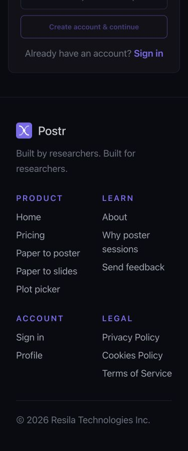
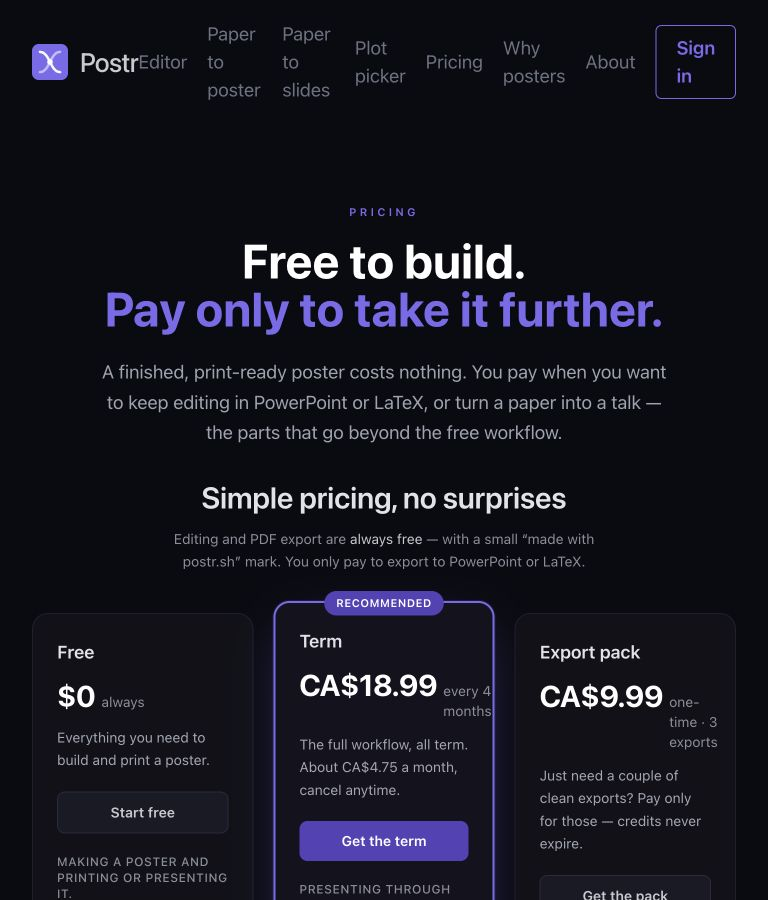
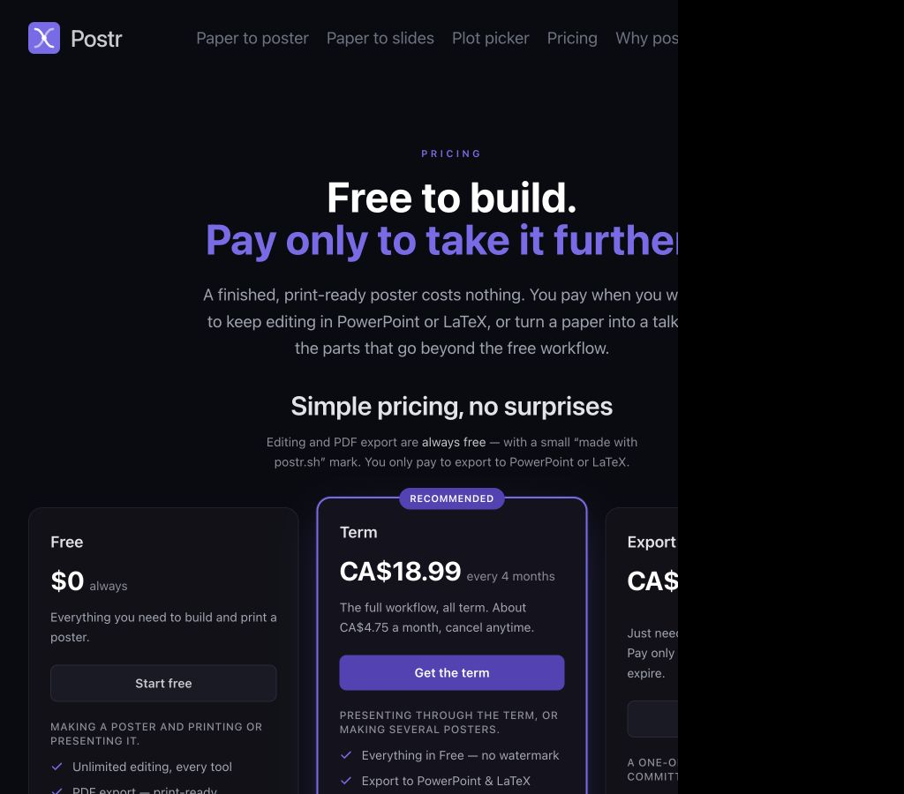
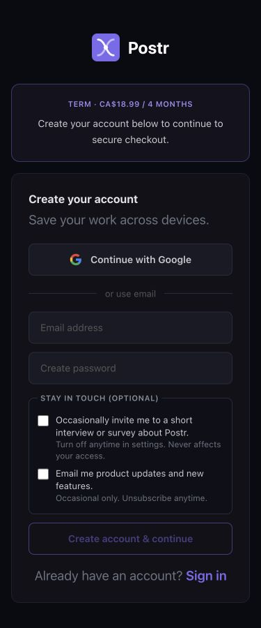

# Initial UI audit — UIMax + browser perception pass

Audit date: 2026-07-29 (America/Toronto)  
Plan followed: [`docs/manual-test-flows.md`](../../manual-test-flows.md)  
Environment: local Vite development server with the existing local Supabase stack  
UIMax: local `uimax-mcp@0.8.0`

## Outcome

The first pass found one high-impact navigation bug, one repeated serious accessibility issue, and two medium-impact signup/responsive problems:

1. A pricing CTA can open paid signup near the footer because forward client navigation retains the old page's scroll position.
2. Low-contrast gray and violet tokens fail WCAG AA across auth and public navigation.
3. The 768px layout activates both the full desktop navigation and the three-column pricing grid before their content fits.
4. Paid signup shows the selected plan but offers no in-page way to go back or change it.

Billing success and cancel states were clean in this pass: both returned zero axe violations and zero runtime errors. The reviewed routes also produced no runtime errors once the app was started with its expected local environment.

## Resolution pass — all high and medium findings closed

Resolution date: 2026-07-29 (America/Toronto)

The implementation pass resolved every confirmed high- and medium-severity finding:

- Forward navigation now opens at `scrollY = 0`; browser Back still restores the prior pricing position.
- The clean UIMax crawl audited 10/10 pages with zero accessibility violations and zero page errors.
- Pricing uses one, two, and three columns at 375px, 768px, and 1024px+ respectively.
- The compact header remains active through 1024px; flat navigation returns at 1440px.
- Paid signup now has a task-level H1, a Change plan link, progressive disclosure, and a legal-only footer.
- Landing presents four core feature messages, each with a description of 15 words or fewer.
- Each pricing tier exposes four supporting messages; mobile feature details start collapsed.
- About, chart chooser, landing, profile, and the shared footer now have valid heading structure.

The follow-up SEO pass used OpenSEO against all 10 indexable production pages, then ran a full UIMax report for 25 local production routes and states:

- OpenSEO found the production raw HTML exposed 0 words, no H1, and no internal links on all 10 pages.
- The prerender now emits crawlable primary copy and navigation outside `<noscript>`, then removes it before React mounts.
- App states now have self-canonicals and share cards while retaining `noindex,nofollow`.
- Billing success and cancel now set their own private-page metadata.
- A second all-page UIMax pass found zero runtime accessibility violations and zero route-level High/Medium SEO findings.
- The 2026-07-30 SEO regression covered the same 25 routes/states: 13 public pages scored 100/100, and every private/error state had only intentional Low `noindex`.
- Legal-page timestamp contrast was raised from 4.07:1 after the expanded pass caught it.
- The poster editor now exposes an H1 in loading, ready, error, and not-found states.

Measured browser results:

| Viewport or flow | Resolved result |
| --- | --- |
| Pricing 375×900 | One column, collapsed details, no horizontal overflow, 2,613px body height |
| Pricing 768×900 | Two columns, compact menu, no horizontal overflow |
| Pricing 1024×900 | Three columns, compact menu, no horizontal overflow |
| Pricing 1440×900 | Three columns, flat navigation, compact menu hidden |
| Pricing → paid signup | Opens at `scrollY = 0` |
| Browser Back | Restores a non-zero pricing position after the CTA scrolls into view |
| Paid signup 375×900 | Full task, optional disclosure, and legal links fit within the 900px body |

Verification:

- Vitest after the SEO pass: 139 files passed, 2,097 tests passed.
- Production build: TypeScript, Vite build, 15-page prerender, and 13-URL sitemap generation passed.
- UIMax clean crawl: 10 pages, zero accessibility violations, zero page errors, 122ms average local load time.
- UIMax pricing review: Accessibility 100, Best Practices 100, SEO 100.
- UIMax paid-signup review: Accessibility 100, Best Practices 100.
- UIMax full route pass: 25 reports, zero runtime accessibility violations, zero route-level High/Medium SEO findings.
- UIMax standalone exports: 25/25 full HTML reports, covering accessibility, performance, SEO, best practices, screenshots, and code analysis.
- Post-merge UIMax regression: landing, pricing, and the anonymous-first editor retained zero runtime accessibility violations and zero route-level High/Medium SEO findings.
- OpenSEO production baseline: 10 pages and 39 shared prerender warnings; local raw-HTML resolution verified pending deployment.

Full standalone evidence: [`evidence/resolved/full-reports-2026-07-30/README.md`](evidence/resolved/full-reports-2026-07-30/README.md)

## Coverage

### Direct route review

- `/auth`
- `/auth?plan=term`
- `/auth?plan=pack`
- `/auth?guest=1`
- `/pricing`
- `/profile`
- `/billing/success`
- `/billing/cancel`

Responsive evidence was checked at 375×900, 768×900, 1024×900, and 1440×900 where applicable.

### UIMax crawl

The crawl started at `/pricing` and reviewed 10 pages: pricing, landing, dashboard/guest landing context, paper-to-poster, paper-to-slides, chart chooser, why-posters, about, profile, and the guest auth entry.

- Pages with runtime errors: 0
- Accessibility violations: 15 total
- Average local load time: 120 ms
- Repeated pattern: serious color-contrast failures
- Additional pattern: moderate heading-order failures on four content/tool routes

Profile and dashboard results are limited to their unauthenticated or guest-visible states. Signed-in account, payment-method, subscription, and destructive account states remain pending.

### Methods

- UIMax: full review, responsive screenshots, axe accessibility, console/error checks, crawl, dark-mode comparison, and HTML export
- Browser perception pass: real navigation, viewport-specific visual review, DOM measurements, and interaction reproduction
- Source reconciliation: route shell, auth page, public header/footer, and pricing components

## Prioritized findings

| ID | Severity | Finding | Status |
| --- | --- | --- | --- |
| UX-01 | High | Forward navigation carries pricing scroll into paid signup | Resolved and regression-tested |
| A11Y-01 | High | Repeated WCAG AA contrast failures on auth and public navigation | Resolved; clean 10-page crawl |
| RWD-01 | Medium | 768px header and pricing cards activate before the content fits | Resolved at four target widths |
| UX-02 | Medium | Paid signup has no Back or Change plan affordance | Resolved |
| A11Y-02 | Medium | Auth signup has no level-one heading | Resolved |
| A11Y-03 | Medium | Heading levels skip on four crawled content/tool routes | Resolved, including crawl-only gaps |
| UX-03 | Medium | Mobile pricing and signup are unusually copy-dense | Resolved with hierarchy and disclosure |
| FORM-01 | Low | Password input does not declare an autocomplete purpose | Not included in this pass |
| PERF-01 | Watch | UIMax/Lighthouse performance score is 55 on auth and pricing | Development-only; production deployment check remains |

## Detailed findings

### UX-01 — Paid signup opens at the bottom after a pricing CTA

At 375×900:

1. Open `/pricing`.
2. Scroll to `scrollY = 900`.
3. Click **Get the term**.
4. `/auth?plan=term` opens at `scrollY = 718.5` on a 1,618px page.

The visible result is the bottom of the form and most of the footer. The selected-plan banner and account fields are above the viewport.

Source evidence:

- [`App.tsx`](../../../apps/web/src/App.tsx#L11) mounts `BrowserRouter` without a scroll-restoration or route-change scroll reset.
- [`routes.tsx`](../../../apps/web/src/routes.tsx#L121) defines pricing and auth as sibling client routes.

Recommended acceptance criteria:

- New forward route navigation starts at the top.
- Browser Back still restores the prior pricing position.
- Hash links and editor canvases are not unintentionally reset.

### A11Y-01 — Contrast failures repeat across the funnel

Representative axe measurements:

| Surface | Foreground / background | Ratio | Requirement |
| --- | --- | ---: | ---: |
| Guest CTA | white / `#7c6aed` | 4.08:1 | 4.5:1 |
| Auth helper copy | `#6b7280` / `#111118` | 3.88:1 | 4.5:1 |
| “or use email” divider | `#555` / `#111118` | 2.52:1 | 4.5:1 |
| Public navigation | `#6b7280` / `#0a0a12` | 4.07:1 | 4.5:1 |

The same serious contrast rule appeared on pricing, landing, dashboard/guest context, both paper tools, chart chooser, why-posters, about, profile, and the guest entry.

Source examples:

- Guest CTA and helper text: [`Auth.tsx`](../../../apps/web/src/pages/Auth.tsx#L388)
- Auth supporting copy and divider: [`Auth.tsx`](../../../apps/web/src/pages/Auth.tsx#L412)
- Consent helper copy: [`Auth.tsx`](../../../apps/web/src/pages/Auth.tsx#L522)
- Public nav token: [`PublicHeader.tsx`](../../../apps/web/src/components/PublicHeader.tsx#L77)

Recommendation: replace the failing values at the shared token/component level, then rerun axe across the crawl rather than patching individual pages.

### RWD-01 — The exact 768px breakpoint is overcommitted

At 768px:

- Full navigation labels wrap to two or three lines.
- The wordmark and `Editor` link visually run together.
- The Sign in button wraps.
- The pricing grid switches to three columns.
- The term price row overflows its own flex row (`192px` content in a `169px` row).
- The export-pack price row also overflows (`178px` content in a `171px` row).

At 1024px the same content is stable:

Source evidence:

- Public links become visible at `sm` (640px): [`PublicHeader.tsx`](../../../apps/web/src/components/PublicHeader.tsx#L77)
- The header renders the entire flat nav set: [`PublicHeader.tsx`](../../../apps/web/src/components/PublicHeader.tsx#L168)
- Pricing becomes three columns at `md` (768px): [`PricingSection.tsx`](../../../apps/web/src/components/PricingSection.tsx#L138)
- Price and cadence are forced into one flex row: [`PricingSection.tsx`](../../../apps/web/src/components/PricingSection.tsx#L187)

Recommendation: keep the overflow menu longer, and delay or reshape the three-card layout until the price/cadence strings fit without wrapping into narrow fragments.

### UX-02 — Paid signup cannot change the selected plan in-page

Both `/auth?plan=term` and `/auth?plan=pack` show the plan banner and account form, but expose no **Back to pricing** or **Change plan** link. The logo goes to the home page, which is not an equivalent recovery path.

The plan banner is rendered in [`Auth.tsx`](../../../apps/web/src/pages/Auth.tsx#L373); the following form begins immediately, with no plan-recovery control.

Recommendation: place a compact Change plan link in or directly under the banner. It should return to pricing without losing an intentional browser history path.

### A11Y-02 — Auth signup lacks an H1

The paid signup view exposes **Create your account** as an `h2` and has no `h1`. Axe reports `page-has-heading-one`.

Source: [`Auth.tsx`](../../../apps/web/src/pages/Auth.tsx#L405)

Recommendation: make the route's primary task a level-one heading while preserving visual size.

### A11Y-03 — Heading order skips on four crawled routes

UIMax reported `heading-order` on:

- `/paper-to-poster`
- `/paper-to-slides`
- `/chart-chooser`
- `/about`

This initial pass records the pattern; the specific heading jumps still need component-level source triage.

### UX-03 — Mobile funnel pages carry a high reading burden

- Pricing is 3,413px tall at 375px and combines hero copy, three detailed plans, a chooser explanation, a waitlist pitch, and the full sitemap footer.
- Paid signup is 1,618px tall at 375px and combines plan context, two auth methods, two optional consent choices with helper text, account-switching copy, and the full sitemap footer.

This is not a mechanical accessibility failure, but it matches the plan's reported “too wordy / too many fine prints” concern. A product-content pass should prioritize task completion copy and move secondary explanations behind progressive disclosure where legally and operationally safe.

### FORM-01 — Password autocomplete purpose is absent

Chrome logged an autocomplete warning, and the password input declares neither `current-password` nor `new-password`.

Source: [`Auth.tsx`](../../../apps/web/src/pages/Auth.tsx#L474)

Recommendation: set the value from the current sign-in/sign-up mode; also declare `email` on the email field.

### PERF-01 — Development performance baseline

UIMax/Lighthouse scored both auth and pricing at 55 for performance. The pricing crawl itself was fast locally (118–140ms reported load time), so the score should be treated as a diagnostic signal rather than a release verdict.

Run the same audit against a production build or deployed preview before assigning a performance defect.

## Clean observations

- No runtime errors on the directly reviewed routes after correct local environment setup.
- Billing success: zero axe violations.
- Billing cancel: zero axe violations.
- Pricing is visually stable at 1024px and 1440px.
- Mobile layouts do not produce page-level horizontal overflow.
- Browser Back restored the pricing scroll position close to its prior value; the defect is specifically forward-route carry-over.

## Tool caveats

- UIMax's full code scan reported 1,546 findings across 200 source files. That broad scanner output is preserved but is not promoted into this report without route relevance and source verification.
- Auth appeared visually fixed-dark in the mode comparison, while pricing showed a mode delta. This is recorded as a theme-consistency question, not a confirmed defect.
- Keyboard Tab focus could not be verified reliably through the current in-app browser control path, so no keyboard-focus conclusion is included.

## Remaining lower-priority work

1. Add explicit email/password autocomplete purposes (FORM-01).
2. Run performance against a deployed production build before assigning a performance defect.
3. Continue payment/subscription, editor paywall, and destructive account-state coverage.

## Evidence

- [Self-contained UIMax pricing report](evidence/uimax-pricing-report.html)
- [Raw UIMax review history](evidence/uimax-reviews-raw.json)
- [Pricing at 768px](evidence/pricing-768-viewport.jpg)
- [Pricing at 1024px](evidence/pricing-1024-viewport.jpg)
- [Pricing before the term click](evidence/pricing-mobile-before-term-click.jpg)
- [Retained-scroll result](evidence/auth-term-scroll-retained.jpg)
- [Paid signup at the top](evidence/auth-term-mobile-top.jpg)
- [Full mobile paid signup](evidence/auth-term-mobile-full.jpg)
- [Full mobile pricing](evidence/pricing-mobile-full.jpg)
- [Resolved pricing at 375px](evidence/resolved/pricing-375.png)
- [Resolved pricing at 768px](evidence/resolved/pricing-768.png)
- [Resolved pricing at 1024px](evidence/resolved/pricing-1024.png)
- [Resolved pricing at 1440px](evidence/resolved/pricing-1440.png)
- [Resolved paid signup at 375px](evidence/resolved/auth-term-375.png)
- [Resolved UIMax crawl](evidence/resolved/uimax-accessibility-crawl-resolved.md)
- [Resolved UIMax pricing HTML report](evidence/resolved/uimax-pricing-resolved.html)
- [Resolved UIMax review history](evidence/resolved/uimax-reviews-resolved.json)
- [Full 25-page UIMax resolution pass](evidence/resolved/all-pages/README.md)
- [UIMax 25-state SEO regression](evidence/resolved/all-pages/SEO-REGRESSION-2026-07-30.md)
- [OpenSEO site-wide SEO pass](evidence/resolved/openseo-seo-pass.md)
